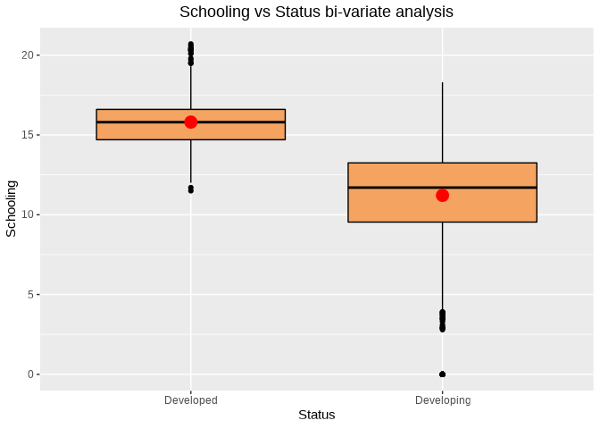
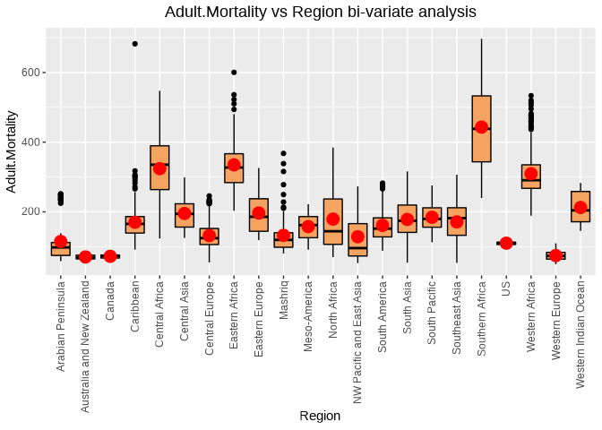
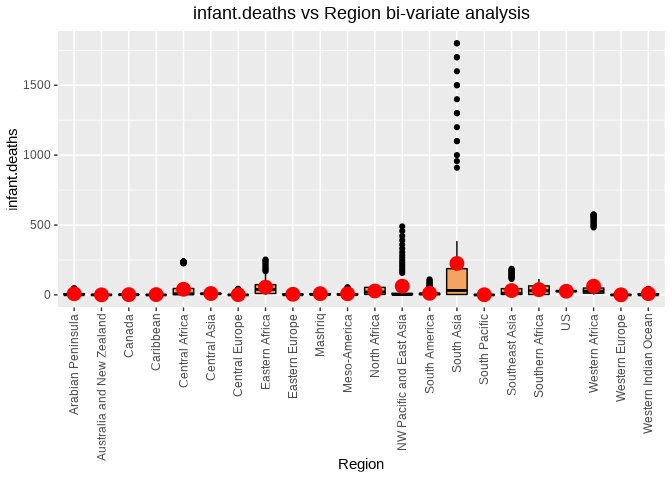
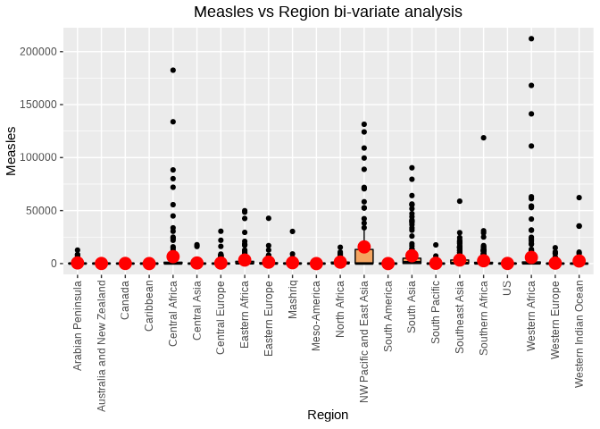
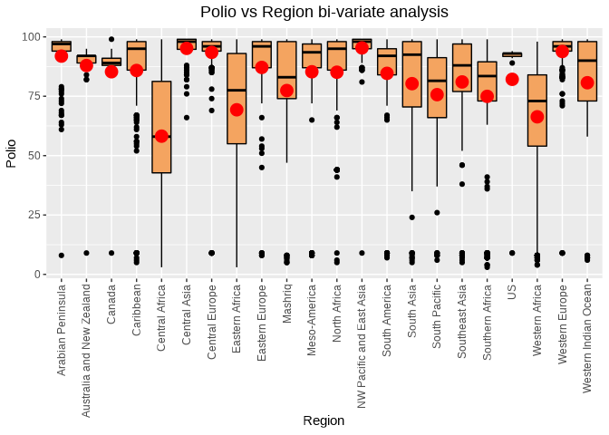
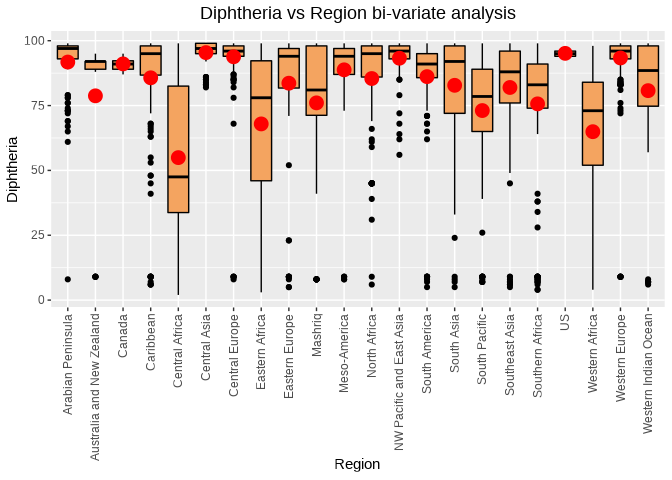
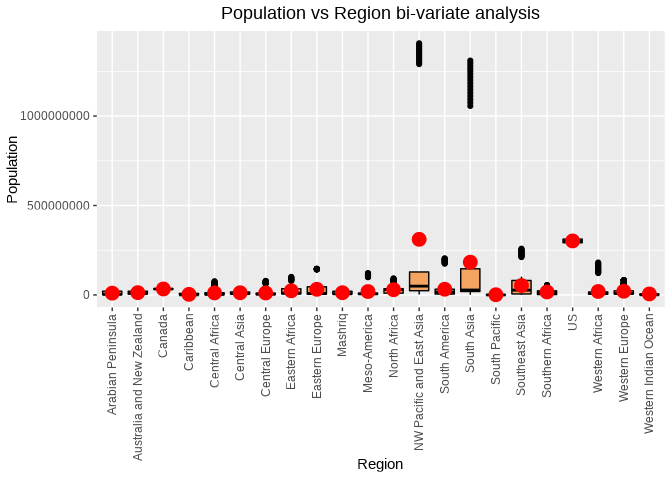
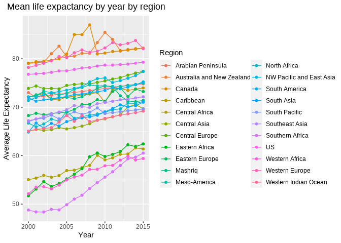
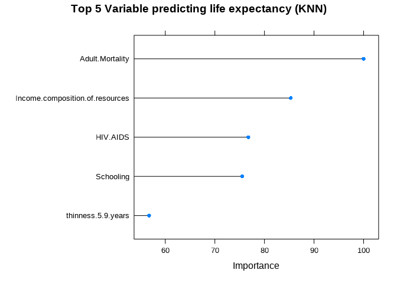

Tamas_Toth_MSDS_6372_Project1
================
Tamas Toth
2022-05-27

#### Loading the necessary R libraries for the analysis

``` r
# Load the necessary libraries
library(knitr)
library(rmarkdown)
library(ggpubr)
library(dplyr)
library(tidyr)
library(plyr)
library(ggplot2)
library(tidyverse)
library(ggthemes)
library(e1071)
library(class)
library(caret)
library(stringr)
library(sjPlot)
library(data.table)
library(reshape2)
library(corrplot)
library(naivebayes)
library(car)
library(egg)
library(rworldmap)
library(Hmisc)
library(DataExplorer)
library(selectiveInference)
library(dlookr)
```

``` r
# Turn off scientific notation
options(scipen = 100, digits = 4)
```

#### Read the data

``` r
#Read the data
#setwd('/Users/ttoth76/Downloads/SMU/Semester_2/DS 6372 Applied Statistics_Inference & Modeling/FLS/Project1_Summer2022/GitContent/LifeExpectancy')
LifeExp = read.csv(file = 'Life_Expectancy_Data.csv',header = TRUE, sep = ",")
# take a sample of 15 from the dataframe
LifeExp_sample = sample_n(LifeExp, 5)
knitr::kable(LifeExp_sample, "html")
```

<table>
<thead>
<tr>
<th style="text-align:left;">
Country
</th>
<th style="text-align:right;">
Year
</th>
<th style="text-align:left;">
Status
</th>
<th style="text-align:right;">
Life.expectancy
</th>
<th style="text-align:right;">
Adult.Mortality
</th>
<th style="text-align:right;">
infant.deaths
</th>
<th style="text-align:right;">
Alcohol
</th>
<th style="text-align:right;">
percentage.expenditure
</th>
<th style="text-align:right;">
Hepatitis.B
</th>
<th style="text-align:right;">
Measles
</th>
<th style="text-align:right;">
BMI
</th>
<th style="text-align:right;">
under.five.deaths
</th>
<th style="text-align:right;">
Polio
</th>
<th style="text-align:right;">
Total.expenditure
</th>
<th style="text-align:right;">
Diphtheria
</th>
<th style="text-align:right;">
HIV.AIDS
</th>
<th style="text-align:right;">
GDP
</th>
<th style="text-align:right;">
Population
</th>
<th style="text-align:right;">
thinness..1.19.years
</th>
<th style="text-align:right;">
thinness.5.9.years
</th>
<th style="text-align:right;">
Income.composition.of.resources
</th>
<th style="text-align:right;">
Schooling
</th>
</tr>
</thead>
<tbody>
<tr>
<td style="text-align:left;">
Australia
</td>
<td style="text-align:right;">
2014
</td>
<td style="text-align:left;">
Developed
</td>
<td style="text-align:right;">
82.7
</td>
<td style="text-align:right;">
6
</td>
<td style="text-align:right;">
1
</td>
<td style="text-align:right;">
9.71
</td>
<td style="text-align:right;">
10769.4
</td>
<td style="text-align:right;">
91
</td>
<td style="text-align:right;">
340
</td>
<td style="text-align:right;">
66.1
</td>
<td style="text-align:right;">
1
</td>
<td style="text-align:right;">
92
</td>
<td style="text-align:right;">
9.42
</td>
<td style="text-align:right;">
92
</td>
<td style="text-align:right;">
0.1
</td>
<td style="text-align:right;">
62215
</td>
<td style="text-align:right;">
2346694
</td>
<td style="text-align:right;">
0.6
</td>
<td style="text-align:right;">
0.6
</td>
<td style="text-align:right;">
0.936
</td>
<td style="text-align:right;">
20.4
</td>
</tr>
<tr>
<td style="text-align:left;">
Saint Vincent and the Grenadines
</td>
<td style="text-align:right;">
2015
</td>
<td style="text-align:left;">
Developing
</td>
<td style="text-align:right;">
73.2
</td>
<td style="text-align:right;">
156
</td>
<td style="text-align:right;">
0
</td>
<td style="text-align:right;">
NA
</td>
<td style="text-align:right;">
0.0
</td>
<td style="text-align:right;">
98
</td>
<td style="text-align:right;">
0
</td>
<td style="text-align:right;">
54.1
</td>
<td style="text-align:right;">
0
</td>
<td style="text-align:right;">
97
</td>
<td style="text-align:right;">
NA
</td>
<td style="text-align:right;">
98
</td>
<td style="text-align:right;">
0.1
</td>
<td style="text-align:right;">
NA
</td>
<td style="text-align:right;">
NA
</td>
<td style="text-align:right;">
3.5
</td>
<td style="text-align:right;">
3.4
</td>
<td style="text-align:right;">
0.720
</td>
<td style="text-align:right;">
13.3
</td>
</tr>
<tr>
<td style="text-align:left;">
Lithuania
</td>
<td style="text-align:right;">
2000
</td>
<td style="text-align:left;">
Developed
</td>
<td style="text-align:right;">
71.6
</td>
<td style="text-align:right;">
2
</td>
<td style="text-align:right;">
0
</td>
<td style="text-align:right;">
9.87
</td>
<td style="text-align:right;">
373.3
</td>
<td style="text-align:right;">
98
</td>
<td style="text-align:right;">
19
</td>
<td style="text-align:right;">
56.9
</td>
<td style="text-align:right;">
0
</td>
<td style="text-align:right;">
92
</td>
<td style="text-align:right;">
6.46
</td>
<td style="text-align:right;">
94
</td>
<td style="text-align:right;">
0.1
</td>
<td style="text-align:right;">
3297
</td>
<td style="text-align:right;">
3499536
</td>
<td style="text-align:right;">
3.4
</td>
<td style="text-align:right;">
3.4
</td>
<td style="text-align:right;">
0.745
</td>
<td style="text-align:right;">
14.0
</td>
</tr>
<tr>
<td style="text-align:left;">
Singapore
</td>
<td style="text-align:right;">
2011
</td>
<td style="text-align:left;">
Developed
</td>
<td style="text-align:right;">
82.2
</td>
<td style="text-align:right;">
6
</td>
<td style="text-align:right;">
0
</td>
<td style="text-align:right;">
1.80
</td>
<td style="text-align:right;">
638.0
</td>
<td style="text-align:right;">
96
</td>
<td style="text-align:right;">
148
</td>
<td style="text-align:right;">
32.1
</td>
<td style="text-align:right;">
0
</td>
<td style="text-align:right;">
96
</td>
<td style="text-align:right;">
3.93
</td>
<td style="text-align:right;">
96
</td>
<td style="text-align:right;">
0.1
</td>
<td style="text-align:right;">
53167
</td>
<td style="text-align:right;">
NA
</td>
<td style="text-align:right;">
2.1
</td>
<td style="text-align:right;">
2.1
</td>
<td style="text-align:right;">
0.911
</td>
<td style="text-align:right;">
15.2
</td>
</tr>
<tr>
<td style="text-align:left;">
South Sudan
</td>
<td style="text-align:right;">
2010
</td>
<td style="text-align:left;">
Developing
</td>
<td style="text-align:right;">
55.0
</td>
<td style="text-align:right;">
359
</td>
<td style="text-align:right;">
27
</td>
<td style="text-align:right;">
NA
</td>
<td style="text-align:right;">
0.0
</td>
<td style="text-align:right;">
NA
</td>
<td style="text-align:right;">
0
</td>
<td style="text-align:right;">
NA
</td>
<td style="text-align:right;">
41
</td>
<td style="text-align:right;">
NA
</td>
<td style="text-align:right;">
NA
</td>
<td style="text-align:right;">
NA
</td>
<td style="text-align:right;">
4.0
</td>
<td style="text-align:right;">
1562
</td>
<td style="text-align:right;">
167192
</td>
<td style="text-align:right;">
NA
</td>
<td style="text-align:right;">
NA
</td>
<td style="text-align:right;">
0.000
</td>
<td style="text-align:right;">
0.0
</td>
</tr>
</tbody>
</table>

#### Address the missing values in each column (NA as well as empty strings).

``` r
# Address the missing values in each column (NA as well as empty strings).
missing_df = as.data.frame(sapply(LifeExp, function(x) sum(is.na(x))))
colnames(missing_df) = c("variable missing")
knitr::kable(missing_df, "html")
```

<table>
<thead>
<tr>
<th style="text-align:left;">
</th>
<th style="text-align:right;">
variable missing
</th>
</tr>
</thead>
<tbody>
<tr>
<td style="text-align:left;">
Country
</td>
<td style="text-align:right;">
0
</td>
</tr>
<tr>
<td style="text-align:left;">
Year
</td>
<td style="text-align:right;">
0
</td>
</tr>
<tr>
<td style="text-align:left;">
Status
</td>
<td style="text-align:right;">
0
</td>
</tr>
<tr>
<td style="text-align:left;">
Life.expectancy
</td>
<td style="text-align:right;">
10
</td>
</tr>
<tr>
<td style="text-align:left;">
Adult.Mortality
</td>
<td style="text-align:right;">
10
</td>
</tr>
<tr>
<td style="text-align:left;">
infant.deaths
</td>
<td style="text-align:right;">
0
</td>
</tr>
<tr>
<td style="text-align:left;">
Alcohol
</td>
<td style="text-align:right;">
194
</td>
</tr>
<tr>
<td style="text-align:left;">
percentage.expenditure
</td>
<td style="text-align:right;">
0
</td>
</tr>
<tr>
<td style="text-align:left;">
Hepatitis.B
</td>
<td style="text-align:right;">
553
</td>
</tr>
<tr>
<td style="text-align:left;">
Measles
</td>
<td style="text-align:right;">
0
</td>
</tr>
<tr>
<td style="text-align:left;">
BMI
</td>
<td style="text-align:right;">
34
</td>
</tr>
<tr>
<td style="text-align:left;">
under.five.deaths
</td>
<td style="text-align:right;">
0
</td>
</tr>
<tr>
<td style="text-align:left;">
Polio
</td>
<td style="text-align:right;">
19
</td>
</tr>
<tr>
<td style="text-align:left;">
Total.expenditure
</td>
<td style="text-align:right;">
226
</td>
</tr>
<tr>
<td style="text-align:left;">
Diphtheria
</td>
<td style="text-align:right;">
19
</td>
</tr>
<tr>
<td style="text-align:left;">
HIV.AIDS
</td>
<td style="text-align:right;">
0
</td>
</tr>
<tr>
<td style="text-align:left;">
GDP
</td>
<td style="text-align:right;">
448
</td>
</tr>
<tr>
<td style="text-align:left;">
Population
</td>
<td style="text-align:right;">
652
</td>
</tr>
<tr>
<td style="text-align:left;">
thinness..1.19.years
</td>
<td style="text-align:right;">
34
</td>
</tr>
<tr>
<td style="text-align:left;">
thinness.5.9.years
</td>
<td style="text-align:right;">
34
</td>
</tr>
<tr>
<td style="text-align:left;">
Income.composition.of.resources
</td>
<td style="text-align:right;">
167
</td>
</tr>
<tr>
<td style="text-align:left;">
Schooling
</td>
<td style="text-align:right;">
163
</td>
</tr>
</tbody>
</table>

``` r
empty_string_df = as.data.frame(sapply(LifeExp, function(x) sum(x == "")))
colnames(empty_string_df) = c("variable empty")
knitr::kable(empty_string_df, "html")
```

<table>
<thead>
<tr>
<th style="text-align:left;">
</th>
<th style="text-align:right;">
variable empty
</th>
</tr>
</thead>
<tbody>
<tr>
<td style="text-align:left;">
Country
</td>
<td style="text-align:right;">
0
</td>
</tr>
<tr>
<td style="text-align:left;">
Year
</td>
<td style="text-align:right;">
0
</td>
</tr>
<tr>
<td style="text-align:left;">
Status
</td>
<td style="text-align:right;">
0
</td>
</tr>
<tr>
<td style="text-align:left;">
Life.expectancy
</td>
<td style="text-align:right;">
NA
</td>
</tr>
<tr>
<td style="text-align:left;">
Adult.Mortality
</td>
<td style="text-align:right;">
NA
</td>
</tr>
<tr>
<td style="text-align:left;">
infant.deaths
</td>
<td style="text-align:right;">
0
</td>
</tr>
<tr>
<td style="text-align:left;">
Alcohol
</td>
<td style="text-align:right;">
NA
</td>
</tr>
<tr>
<td style="text-align:left;">
percentage.expenditure
</td>
<td style="text-align:right;">
0
</td>
</tr>
<tr>
<td style="text-align:left;">
Hepatitis.B
</td>
<td style="text-align:right;">
NA
</td>
</tr>
<tr>
<td style="text-align:left;">
Measles
</td>
<td style="text-align:right;">
0
</td>
</tr>
<tr>
<td style="text-align:left;">
BMI
</td>
<td style="text-align:right;">
NA
</td>
</tr>
<tr>
<td style="text-align:left;">
under.five.deaths
</td>
<td style="text-align:right;">
0
</td>
</tr>
<tr>
<td style="text-align:left;">
Polio
</td>
<td style="text-align:right;">
NA
</td>
</tr>
<tr>
<td style="text-align:left;">
Total.expenditure
</td>
<td style="text-align:right;">
NA
</td>
</tr>
<tr>
<td style="text-align:left;">
Diphtheria
</td>
<td style="text-align:right;">
NA
</td>
</tr>
<tr>
<td style="text-align:left;">
HIV.AIDS
</td>
<td style="text-align:right;">
0
</td>
</tr>
<tr>
<td style="text-align:left;">
GDP
</td>
<td style="text-align:right;">
NA
</td>
</tr>
<tr>
<td style="text-align:left;">
Population
</td>
<td style="text-align:right;">
NA
</td>
</tr>
<tr>
<td style="text-align:left;">
thinness..1.19.years
</td>
<td style="text-align:right;">
NA
</td>
</tr>
<tr>
<td style="text-align:left;">
thinness.5.9.years
</td>
<td style="text-align:right;">
NA
</td>
</tr>
<tr>
<td style="text-align:left;">
Income.composition.of.resources
</td>
<td style="text-align:right;">
NA
</td>
</tr>
<tr>
<td style="text-align:left;">
Schooling
</td>
<td style="text-align:right;">
NA
</td>
</tr>
</tbody>
</table>

``` r
#set random seed
set.seed(329)
```

``` r
# Function to Identify different characteristics of the data frame 
# Getting a concise summary of the dataframe: str()
# Listing the column labels of the dataframe: colnames()
# Size of the dataset: dim()
# # Verify if there is any negative values in the dataset
dfinfo = function(df_name)
  {
  df_structure = str(df_name)
  df_colnames = colnames(df_name)
  df_dimensions = dim(df_name)
  df_neg = print(paste("Negative values in the Data Frame:", 
                       sapply(df_name, function(x) sum(x < 0))))
  outparam = list(df_structure, df_colnames, df_dimensions, df_neg)
  return (outparam)
}
```

``` r
dfinfo(LifeExp)
```

    ## 'data.frame':    2938 obs. of  22 variables:
    ##  $ Country                        : chr  "Afghanistan" "Afghanistan" "Afghanistan" "Afghanistan" ...
    ##  $ Year                           : int  2015 2014 2013 2012 2011 2010 2009 2008 2007 2006 ...
    ##  $ Status                         : chr  "Developing" "Developing" "Developing" "Developing" ...
    ##  $ Life.expectancy                : num  65 59.9 59.9 59.5 59.2 58.8 58.6 58.1 57.5 57.3 ...
    ##  $ Adult.Mortality                : int  263 271 268 272 275 279 281 287 295 295 ...
    ##  $ infant.deaths                  : int  62 64 66 69 71 74 77 80 82 84 ...
    ##  $ Alcohol                        : num  0.01 0.01 0.01 0.01 0.01 0.01 0.01 0.03 0.02 0.03 ...
    ##  $ percentage.expenditure         : num  71.3 73.5 73.2 78.2 7.1 ...
    ##  $ Hepatitis.B                    : int  65 62 64 67 68 66 63 64 63 64 ...
    ##  $ Measles                        : int  1154 492 430 2787 3013 1989 2861 1599 1141 1990 ...
    ##  $ BMI                            : num  19.1 18.6 18.1 17.6 17.2 16.7 16.2 15.7 15.2 14.7 ...
    ##  $ under.five.deaths              : int  83 86 89 93 97 102 106 110 113 116 ...
    ##  $ Polio                          : int  6 58 62 67 68 66 63 64 63 58 ...
    ##  $ Total.expenditure              : num  8.16 8.18 8.13 8.52 7.87 9.2 9.42 8.33 6.73 7.43 ...
    ##  $ Diphtheria                     : int  65 62 64 67 68 66 63 64 63 58 ...
    ##  $ HIV.AIDS                       : num  0.1 0.1 0.1 0.1 0.1 0.1 0.1 0.1 0.1 0.1 ...
    ##  $ GDP                            : num  584.3 612.7 631.7 670 63.5 ...
    ##  $ Population                     : num  33736494 327582 31731688 3696958 2978599 ...
    ##  $ thinness..1.19.years           : num  17.2 17.5 17.7 17.9 18.2 18.4 18.6 18.8 19 19.2 ...
    ##  $ thinness.5.9.years             : num  17.3 17.5 17.7 18 18.2 18.4 18.7 18.9 19.1 19.3 ...
    ##  $ Income.composition.of.resources: num  0.479 0.476 0.47 0.463 0.454 0.448 0.434 0.433 0.415 0.405 ...
    ##  $ Schooling                      : num  10.1 10 9.9 9.8 9.5 9.2 8.9 8.7 8.4 8.1 ...
    ##  [1] "Negative values in the Data Frame: 0" 
    ##  [2] "Negative values in the Data Frame: 0" 
    ##  [3] "Negative values in the Data Frame: 0" 
    ##  [4] "Negative values in the Data Frame: NA"
    ##  [5] "Negative values in the Data Frame: NA"
    ##  [6] "Negative values in the Data Frame: 0" 
    ##  [7] "Negative values in the Data Frame: NA"
    ##  [8] "Negative values in the Data Frame: 0" 
    ##  [9] "Negative values in the Data Frame: NA"
    ## [10] "Negative values in the Data Frame: 0" 
    ## [11] "Negative values in the Data Frame: NA"
    ## [12] "Negative values in the Data Frame: 0" 
    ## [13] "Negative values in the Data Frame: NA"
    ## [14] "Negative values in the Data Frame: NA"
    ## [15] "Negative values in the Data Frame: NA"
    ## [16] "Negative values in the Data Frame: 0" 
    ## [17] "Negative values in the Data Frame: NA"
    ## [18] "Negative values in the Data Frame: NA"
    ## [19] "Negative values in the Data Frame: NA"
    ## [20] "Negative values in the Data Frame: NA"
    ## [21] "Negative values in the Data Frame: NA"
    ## [22] "Negative values in the Data Frame: NA"

    ## [[1]]
    ## NULL
    ## 
    ## [[2]]
    ##  [1] "Country"                         "Year"                           
    ##  [3] "Status"                          "Life.expectancy"                
    ##  [5] "Adult.Mortality"                 "infant.deaths"                  
    ##  [7] "Alcohol"                         "percentage.expenditure"         
    ##  [9] "Hepatitis.B"                     "Measles"                        
    ## [11] "BMI"                             "under.five.deaths"              
    ## [13] "Polio"                           "Total.expenditure"              
    ## [15] "Diphtheria"                      "HIV.AIDS"                       
    ## [17] "GDP"                             "Population"                     
    ## [19] "thinness..1.19.years"            "thinness.5.9.years"             
    ## [21] "Income.composition.of.resources" "Schooling"                      
    ## 
    ## [[3]]
    ## [1] 2938   22
    ## 
    ## [[4]]
    ##  [1] "Negative values in the Data Frame: 0" 
    ##  [2] "Negative values in the Data Frame: 0" 
    ##  [3] "Negative values in the Data Frame: 0" 
    ##  [4] "Negative values in the Data Frame: NA"
    ##  [5] "Negative values in the Data Frame: NA"
    ##  [6] "Negative values in the Data Frame: 0" 
    ##  [7] "Negative values in the Data Frame: NA"
    ##  [8] "Negative values in the Data Frame: 0" 
    ##  [9] "Negative values in the Data Frame: NA"
    ## [10] "Negative values in the Data Frame: 0" 
    ## [11] "Negative values in the Data Frame: NA"
    ## [12] "Negative values in the Data Frame: 0" 
    ## [13] "Negative values in the Data Frame: NA"
    ## [14] "Negative values in the Data Frame: NA"
    ## [15] "Negative values in the Data Frame: NA"
    ## [16] "Negative values in the Data Frame: 0" 
    ## [17] "Negative values in the Data Frame: NA"
    ## [18] "Negative values in the Data Frame: NA"
    ## [19] "Negative values in the Data Frame: NA"
    ## [20] "Negative values in the Data Frame: NA"
    ## [21] "Negative values in the Data Frame: NA"
    ## [22] "Negative values in the Data Frame: NA"

#### Generate summary statistics

``` r
# Generate summary statistics
summary(LifeExp)
```

    ##    Country               Year         Status          Life.expectancy
    ##  Length:2938        Min.   :2000   Length:2938        Min.   :36.3   
    ##  Class :character   1st Qu.:2004   Class :character   1st Qu.:63.1   
    ##  Mode  :character   Median :2008   Mode  :character   Median :72.1   
    ##                     Mean   :2008                      Mean   :69.2   
    ##                     3rd Qu.:2012                      3rd Qu.:75.7   
    ##                     Max.   :2015                      Max.   :89.0   
    ##                                                       NA's   :10     
    ##  Adult.Mortality infant.deaths       Alcohol      percentage.expenditure
    ##  Min.   :  1     Min.   :   0.0   Min.   : 0.01   Min.   :    0         
    ##  1st Qu.: 74     1st Qu.:   0.0   1st Qu.: 0.88   1st Qu.:    5         
    ##  Median :144     Median :   3.0   Median : 3.76   Median :   65         
    ##  Mean   :165     Mean   :  30.3   Mean   : 4.60   Mean   :  738         
    ##  3rd Qu.:228     3rd Qu.:  22.0   3rd Qu.: 7.70   3rd Qu.:  442         
    ##  Max.   :723     Max.   :1800.0   Max.   :17.87   Max.   :19480         
    ##  NA's   :10                       NA's   :194                           
    ##   Hepatitis.B      Measles            BMI       under.five.deaths
    ##  Min.   : 1.0   Min.   :     0   Min.   : 1.0   Min.   :   0     
    ##  1st Qu.:77.0   1st Qu.:     0   1st Qu.:19.3   1st Qu.:   0     
    ##  Median :92.0   Median :    17   Median :43.5   Median :   4     
    ##  Mean   :80.9   Mean   :  2420   Mean   :38.3   Mean   :  42     
    ##  3rd Qu.:97.0   3rd Qu.:   360   3rd Qu.:56.2   3rd Qu.:  28     
    ##  Max.   :99.0   Max.   :212183   Max.   :87.3   Max.   :2500     
    ##  NA's   :553                     NA's   :34                      
    ##      Polio      Total.expenditure   Diphtheria      HIV.AIDS    
    ##  Min.   : 3.0   Min.   : 0.37     Min.   : 2.0   Min.   : 0.10  
    ##  1st Qu.:78.0   1st Qu.: 4.26     1st Qu.:78.0   1st Qu.: 0.10  
    ##  Median :93.0   Median : 5.76     Median :93.0   Median : 0.10  
    ##  Mean   :82.5   Mean   : 5.94     Mean   :82.3   Mean   : 1.74  
    ##  3rd Qu.:97.0   3rd Qu.: 7.49     3rd Qu.:97.0   3rd Qu.: 0.80  
    ##  Max.   :99.0   Max.   :17.60     Max.   :99.0   Max.   :50.60  
    ##  NA's   :19     NA's   :226       NA's   :19                    
    ##       GDP           Population         thinness..1.19.years thinness.5.9.years
    ##  Min.   :     2   Min.   :        34   Min.   : 0.10        Min.   : 0.10     
    ##  1st Qu.:   464   1st Qu.:    195793   1st Qu.: 1.60        1st Qu.: 1.50     
    ##  Median :  1767   Median :   1386542   Median : 3.30        Median : 3.30     
    ##  Mean   :  7483   Mean   :  12753375   Mean   : 4.84        Mean   : 4.87     
    ##  3rd Qu.:  5911   3rd Qu.:   7420359   3rd Qu.: 7.20        3rd Qu.: 7.20     
    ##  Max.   :119173   Max.   :1293859294   Max.   :27.70        Max.   :28.60     
    ##  NA's   :448      NA's   :652          NA's   :34           NA's   :34        
    ##  Income.composition.of.resources   Schooling   
    ##  Min.   :0.00                    Min.   : 0.0  
    ##  1st Qu.:0.49                    1st Qu.:10.1  
    ##  Median :0.68                    Median :12.3  
    ##  Mean   :0.63                    Mean   :12.0  
    ##  3rd Qu.:0.78                    3rd Qu.:14.3  
    ##  Max.   :0.95                    Max.   :20.7  
    ##  NA's   :167                     NA's   :163

### Observations:

-   The dataset is comprised of 2938 observations and 22 variables
-   There are numerical and categorical variables (Country and Status)
    in the dataset
-   Column names have spaces and special characters that has been
    replaced by R with “.”
-   There are missing values or empty strings in the dataset
-   ????? duplicated records????????
-   ‘Life.expectancy’ is the dependent variable - There are 10 missing
    observations in the dependent variable
-   We need to predict Salary however there is no salary variable in the
    dataset but MonthlyIncome variable seems to be sufficient for this
    purpose.

### Scatterplots

``` r
#####################################################################################
#                        Scatter plots for checking linearity                       #
#####################################################################################

################### Linear - Linear ###################
LifeExp$Status = as.factor(LifeExp$Status)
#num_cols = LifeExp %>% select(where(is.numeric)) %>% colnames()
#MLR_num_LE = LifeExp[, num_cols]
pairs(Life.expectancy~Year+Adult.Mortality+infant.deaths+Alcohol, data=LifeExp, col=ifelse(LifeExp$Status=="Developed", "green", "red"))
```

<!-- -->

``` r
pairs(Life.expectancy~log(percentage.expenditure)+Hepatitis.B+Measles+BMI, data=LifeExp, col=ifelse(LifeExp$Status=="Developed", "green", "red"))
```

<!-- -->

``` r
pairs(Life.expectancy~under.five.deaths+Polio+Total.expenditure+Diphtheria, data=LifeExp, col=ifelse(LifeExp$Status=="Developed", "green", "red"))
```

<!-- -->

``` r
pairs(Life.expectancy~HIV.AIDS+GDP+Population+thinness..1.19.years, data=LifeExp, col=ifelse(LifeExp$Status=="Developed", "green", "red"))
```

<!-- -->

``` r
pairs(Life.expectancy~thinness.5.9.years+Income.composition.of.resources+Schooling, data=LifeExp, col=ifelse(LifeExp$Status=="Developed", "green", "red"))
```

<!-- -->

``` r
################### Linear - Log transformation ###################
LifeExp$Status = as.factor(LifeExp$Status)
#num_cols = LifeExp %>% select(where(is.numeric)) %>% colnames()
#MLR_num_LE = LifeExp[, num_cols]
pairs(Life.expectancy~Year+Adult.Mortality+infant.deaths+Alcohol, data=LifeExp, col=ifelse(LifeExp$Status=="Developed", "green", "red"))
```

<!-- -->

``` r
pairs(Life.expectancy~log(percentage.expenditure)+Hepatitis.B+Measles+BMI, data=LifeExp, col=ifelse(LifeExp$Status=="Developed", "green", "red"))
```

<!-- -->

``` r
pairs(Life.expectancy~under.five.deaths+Polio+Total.expenditure+Diphtheria, data=LifeExp, col=ifelse(LifeExp$Status=="Developed", "green", "red"))
```

<!-- -->

``` r
pairs(Life.expectancy~log(HIV.AIDS)+log(GDP)+Population+thinness..1.19.years, data=LifeExp, col=ifelse(LifeExp$Status=="Developed", "green", "red"))
```

<!-- -->

``` r
pairs(Life.expectancy~thinness.5.9.years+Income.composition.of.resources+Schooling, data=LifeExp, col=ifelse(LifeExp$Status=="Developed", "green", "red"))
```

<!-- -->

``` r
################### Log - Log transformation ###################
LifeExp$Status = as.factor(LifeExp$Status)
#num_cols = LifeExp %>% select(where(is.numeric)) %>% colnames()
#MLR_num_LE = LifeExp[, num_cols]
pairs(log(Life.expectancy)~Year+Adult.Mortality+infant.deaths+Alcohol, data=LifeExp, col=ifelse(LifeExp$Status=="Developed", "green", "red"))
```

<!-- -->

``` r
pairs(log(Life.expectancy)~log(percentage.expenditure)+Hepatitis.B+Measles+BMI, data=LifeExp, col=ifelse(LifeExp$Status=="Developed", "green", "red"))
```

<!-- -->

``` r
pairs(log(Life.expectancy)~under.five.deaths+Polio+Total.expenditure+Diphtheria, data=LifeExp, col=ifelse(LifeExp$Status=="Developed", "green", "red"))
```

<!-- -->

``` r
pairs(log(Life.expectancy)~log(HIV.AIDS)+log(GDP)+Population+thinness..1.19.years, data=LifeExp, col=ifelse(LifeExp$Status=="Developed", "green", "red"))
```

<!-- -->

``` r
pairs(log(Life.expectancy)~thinness.5.9.years+Income.composition.of.resources+Schooling, data=LifeExp, col=ifelse(LifeExp$Status=="Developed", "green", "red"))
```

<!-- -->
\### Observations We can observe linear relationship between Life
Expectancy and the following variables

-   Income composition of resources
-   Schooling
-   Log(HIV.AIDS)
-   Log(GDP)
-   Log(percentage.expenditure)
-   BMI
-   Year
-   Adult.Mortality

\#adding region column to do regional imputation

``` r
###rename ivory coast and remove parenthesis from country names
LifeExp$Country <- replace(LifeExp$Country,LifeExp$Country == "Côte d'Ivoire","Ivory Coast")
LifeExp$Country <-  str_replace(LifeExp$Country,"\\(.*\\)","")
LifeExp$Country <- trimws(LifeExp$Country,"right")

### add region using rworldmap package
regions <- rworldmap::countryRegions
regions <- regions[,c(2,6)]
colnames(regions) <- c("Country","Region")
regions$Country <- replace(regions$Country, regions$Country == "The Bahamas", "Bahamas")
regions$Country <- replace(regions$Country, regions$Country == "Brunei", "Brunei Darussalam")
regions$Country <- replace(regions$Country, regions$Country == "Cape Verde", "Cabo Verde")
regions$Country <- replace(regions$Country, regions$Country == "Republic of the Congo", "Congo")
regions$Country <- replace(regions$Country, regions$Country == "Czech Republic", "Czechia")
regions$Country <- replace(regions$Country, regions$Country == "North Korea", "Democratic People's Republic of Korea")
regions$Country <- replace(regions$Country, regions$Country == "Guinea Bissau", "Guinea-Bissau")
regions$Country <- replace(regions$Country, regions$Country == "Laos","Lao People's Democratic Republic")
regions$Country <- replace(regions$Country, regions$Country == "Federated States of Micronesia", "Micronesia")
regions$Country <- replace(regions$Country, regions$Country == "South Korea", "Republic of Korea")
regions$Country <- replace(regions$Country, regions$Country == "Moldova", "Republic of Moldova")
regions$Country <- replace(regions$Country, regions$Country == "Russia", "Russian Federation")
regions$Country <- replace(regions$Country, regions$Country == "Republic of Serbia", "Serbia")
regions$Country <- replace(regions$Country, regions$Country == "Syria", "Syrian Arab Republic")
regions$Country <- replace(regions$Country, regions$Country == "Macedonia", "The former Yugoslav republic of Macedonia")
regions$Country <- replace(regions$Country, regions$Country == "East Timor", "Timor-Leste")
regions$Country <- replace(regions$Country, regions$Country == "United Kingdom", "United Kingdom of Great Britain and Northern Ireland")
regions$Country <- replace(regions$Country, regions$Country == "Vietnam", "Viet Nam")


LifeExp <-  join(LifeExp,regions,by = "Country", type = 'left')
LifeExp$Country <- replace(LifeExp$Country, LifeExp$Country == "Micronesia", "Micronesia (Federated States of)")
LifeExp$Region <- as.factor(LifeExp$Region)
```

## Fixing the missing values by replacing with median

``` r
# Drop missing values from the dependent variable
LifeExp = LifeExp[!(is.na(LifeExp$Life.expectancy)),]

na_list = colnames(LifeExp)[apply(LifeExp, 2, anyNA)]
# LifeExp_db = apply(LifeExp[,colnames(LifeExp) %in% na_list],2,median,na.rm =  TRUE)
LifeExp = LifeExp %>% group_by(Country) %>% dplyr::mutate(Alcohol = replace(Alcohol,is.na(Alcohol), median(Alcohol, na.rm = TRUE)))
LifeExp = LifeExp %>% group_by(Country) %>% dplyr::mutate(Hepatitis.B = replace(Hepatitis.B,is.na(Hepatitis.B), median(Hepatitis.B, na.rm = TRUE)))
LifeExp = LifeExp %>% group_by(Country) %>% dplyr::mutate(BMI = replace(BMI,is.na(BMI), median(BMI, na.rm = TRUE)))
LifeExp = LifeExp %>% group_by(Country) %>% dplyr::mutate(Polio = replace(Polio,is.na(Polio), median(Polio, na.rm = TRUE)))
LifeExp = LifeExp %>% group_by(Country) %>% dplyr::mutate(Total.expenditure = replace(Total.expenditure,is.na(Total.expenditure), median(Total.expenditure, na.rm = TRUE)))
LifeExp = LifeExp %>% group_by(Country) %>% dplyr::mutate(Diphtheria = replace(Diphtheria,is.na(Diphtheria), median(Diphtheria, na.rm = TRUE)))
LifeExp = LifeExp %>% group_by(Country) %>% dplyr::mutate(GDP = replace(GDP,is.na(GDP), median(GDP, na.rm = TRUE)))
LifeExp = LifeExp %>% group_by(Country) %>% dplyr::mutate(Population = replace(Population,is.na(Population), median(Population, na.rm = TRUE)))
LifeExp = LifeExp %>% group_by(Country) %>% dplyr::mutate(thinness..1.19.years = replace(thinness..1.19.years,is.na(thinness..1.19.years), median(thinness..1.19.years, na.rm = TRUE)))
LifeExp = LifeExp %>% group_by(Country) %>% dplyr::mutate(thinness.5.9.years = replace(thinness.5.9.years,is.na(thinness.5.9.years), median(thinness.5.9.years, na.rm = TRUE)))
LifeExp = LifeExp %>% group_by(Country) %>% dplyr::mutate(Income.composition.of.resources = replace(Income.composition.of.resources,is.na(Income.composition.of.resources), median(Income.composition.of.resources, na.rm = TRUE)))
LifeExp = LifeExp %>% group_by(Country) %>% dplyr::mutate(Schooling = replace(Schooling,is.na(Schooling), median(Schooling, na.rm = TRUE)))

#repeat grouping by Region for countries which have only NAs
LifeExp = LifeExp %>% group_by(Region) %>% dplyr::mutate(Alcohol = replace(Alcohol,is.na(Alcohol), median(Alcohol, na.rm = TRUE)))
LifeExp = LifeExp %>% group_by(Region) %>% dplyr::mutate(Hepatitis.B = replace(Hepatitis.B,is.na(Hepatitis.B), median(Hepatitis.B, na.rm = TRUE)))
LifeExp = LifeExp %>% group_by(Region) %>% dplyr::mutate(BMI = replace(BMI,is.na(BMI), median(BMI, na.rm = TRUE)))
LifeExp = LifeExp %>% group_by(Region) %>% dplyr::mutate(Polio = replace(Polio,is.na(Polio), median(Polio, na.rm = TRUE)))
LifeExp = LifeExp %>% group_by(Region) %>% dplyr::mutate(Total.expenditure = replace(Total.expenditure,is.na(Total.expenditure), median(Total.expenditure, na.rm = TRUE)))
LifeExp = LifeExp %>% group_by(Region) %>% dplyr::mutate(Diphtheria = replace(Diphtheria,is.na(Diphtheria), median(Diphtheria, na.rm = TRUE)))
LifeExp = LifeExp %>% group_by(Region) %>% dplyr::mutate(GDP = replace(GDP,is.na(GDP), median(GDP, na.rm = TRUE)))
LifeExp = LifeExp %>% group_by(Region) %>% dplyr::mutate(Population = replace(Population,is.na(Population), median(Population, na.rm = TRUE)))
LifeExp = LifeExp %>% group_by(Region) %>% dplyr::mutate(thinness..1.19.years = replace(thinness..1.19.years,is.na(thinness..1.19.years), median(thinness..1.19.years, na.rm = TRUE)))
LifeExp = LifeExp %>% group_by(Region) %>% dplyr::mutate(thinness.5.9.years = replace(thinness.5.9.years,is.na(thinness.5.9.years), median(thinness.5.9.years, na.rm = TRUE)))
LifeExp = LifeExp %>% group_by(Region) %>% dplyr::mutate(Income.composition.of.resources = replace(Income.composition.of.resources,is.na(Income.composition.of.resources), median(Income.composition.of.resources, na.rm = TRUE)))
LifeExp = LifeExp %>% group_by(Region) %>% dplyr::mutate(Schooling = replace(Schooling,is.na(Schooling), median(Schooling, na.rm = TRUE)))
# convert the tibble to data frame
LifeExp = as.data.frame(LifeExp)

#impute USA values
#USA GDP
US_GDP <- read.csv('API_NY.GDP.PCAP.CD_DS2_en_csv_v2_4150786.csv',header = FALSE)
colnames(US_GDP) <- US_GDP[3,]
US_GDP <- rename(US_GDP,c("Country Name"="Country"))
US_GDP <- US_GDP[US_GDP$Country == "United States",c(1,45:60)]
US_GDP <- US_GDP %>% pivot_longer(!Country,names_to = "Year",values_to = "GDP2")
US_GDP$Country <- replace(US_GDP$Country, US_GDP$Country == "United States", "United States of America")
US_GDP$Year <- as.integer(US_GDP$Year)

LifeExp <- left_join(LifeExp,US_GDP, by=c("Country","Year"))
LifeExp <- LifeExp %>% dplyr::mutate(GDP = ifelse(LifeExp$Country == "United States of America", LifeExp$GDP2, LifeExp$GDP))

#US Schooling
US_Scho <- read.csv("Expected years of schooling (years).csv",skip = 6,header = FALSE)
colnames(US_Scho) <- US_Scho[1,]
US_Scho$Country <- trimws(US_Scho$Country, which = "both")
US_Scho <- US_Scho[US_Scho$Country == "United States", colSums(is.na(US_Scho)) !=nrow(US_Scho)]
US_Scho <- US_Scho[,c(2,13:28)]
US_Scho <- US_Scho %>% pivot_longer(!Country,names_to = "Year",values_to = "Schooling2")
US_Scho$Year <- as.integer(US_Scho$Year)
US_Scho$Schooling2 <- as.numeric(US_Scho$Schooling2)
US_Scho$Country <- replace(US_Scho$Country, US_Scho$Country == "United States", "United States of America")


LifeExp <- left_join(LifeExp,US_Scho,by=c("Country","Year"))
LifeExp <- LifeExp %>% dplyr::mutate(Schooling =ifelse(LifeExp$Country == "United States of America",LifeExp$Schooling2,LifeExp$Schooling))

#US income composition
US_Inc <- read.csv('Income index.csv',skip = 5, header = FALSE)
colnames(US_Inc) <- US_Inc[1,]
US_Inc$Country <- trimws(US_Inc$Country,which = "both")
US_Inc <- US_Inc[US_Inc$Country == "United States",colSums(is.na(US_Inc)) !=nrow(US_Inc)]
US_Inc <- US_Inc[,c(2,13:28)]
US_Inc <- US_Inc %>%  pivot_longer(!Country,names_to = "Year", values_to = "comp2")
US_Inc$Year <- as.integer(US_Inc$Year)
US_Inc$comp2 <- as.numeric(US_Inc$comp2)
US_Inc$Country <- replace(US_Inc$Country,US_Inc$Country == "United States", "United States of America")

LifeExp <- left_join(LifeExp,US_Inc,by=c("Country","Year"))
LifeExp <- LifeExp %>% dplyr::mutate("Income.composition.of.resources" = ifelse(LifeExp$Country == "United States of America", LifeExp$comp2,LifeExp$Income.composition.of.resources))

#Add population from external source
#data from UN in thousands 
pop_all <- read.csv('WPP2019_TotalPopulationBySex.csv')
pop_all <- pop_all %>% dplyr::select(Country = Location, Year = Time, Population2 = PopTotal) %>% mutate(Population2 = Population2*1000) %>% filter(Year %in% c(2000:2015))

#clean country names to match before merge
pop_all$Country <- replace(pop_all$Country, pop_all$Country == "Bolivia (Plurinational State of)", "Bolivia")
pop_all$Country <- replace(pop_all$Country,pop_all$Country == "Côte d'Ivoire", "Ivory Coast")
pop_all$Country <- replace(pop_all$Country,pop_all$Country == "Dem. People's Republic of Korea","Democratic People's Republic of Korea")
pop_all$Country <- replace(pop_all$Country, pop_all$Country == "Iran (Islamic Republic of)", "Iran")
pop_all$Country <- replace(pop_all$Country, pop_all$Country == "Micronesia (Fed. States of)", "Micronesia (Federated States of)")
pop_all$Country <- replace(pop_all$Country, pop_all$Country == "Eswatini", "Swaziland")
pop_all$Country <- replace(pop_all$Country, pop_all$Country == "North Macedonia", "The former Yugoslav republic of Macedonia")
pop_all$Country <- replace(pop_all$Country, pop_all$Country == "United Kingdom", "United Kingdom of Great Britain and Northern Ireland")
pop_all$Country <- replace(pop_all$Country, pop_all$Country == "Venezuela (Bolivarian Republic of)", "Venezuela")
LifeExp<- left_join(LifeExp,pop_all,by=c("Country","Year")) %>% mutate(Population = Population2)

#replace adult.mortality since there are clear mistakes with the data that could
#not be resolved with transformation of the variable
adlt_mort <- read.csv('Adult_mort.csv',header = TRUE)
adlt_mort <- adlt_mort %>% dplyr::select("Country" = Location,"Year" = Period,"Adult.Mort2" = Value)
adlt_mort$Country <- replace(adlt_mort$Country,adlt_mort$Country == "Côte d’Ivoire","Ivory Coast")
adlt_mort$Country <- replace(adlt_mort$Country,adlt_mort$Country == "Bolivia (Plurinational State of)","Bolivia")
adlt_mort$Country <- replace(adlt_mort$Country,adlt_mort$Country == "Venezuela (Bolivarian Republic of)","Venezuela")
adlt_mort$Country <- replace(adlt_mort$Country,adlt_mort$Country == "Iran (Islamic Republic of)", "Iran")
adlt_mort$Country <- replace(adlt_mort$Country,adlt_mort$Country == "Eswatini", "Swaziland")
adlt_mort$Country <- replace(adlt_mort$Country,adlt_mort$Country == "The former Yugoslav Republic of Macedonia", "The former Yugoslav republic of Macedonia")

LifeExp <- left_join(LifeExp,adlt_mort, by=c("Country","Year"))
LifeExp <- LifeExp %>% 
  dplyr::mutate("Adult.Mortality" = Adult.Mort2)
#drop new variables
drop = c("GDP2","Schooling2","comp2", "Population2","Adult.Mort2")
LifeExp <- LifeExp[,!colnames(LifeExp) %in% drop]
LifeExpKNN = LifeExp
```

### Full Correlation Matrix for Linear Regression (Life.expectancy)

``` r
#####################################################################################
#      Full Correlation Matrix for Linear Regression (Life.expectancy)              #
#####################################################################################
# Filter for data to be included
num_cols = LifeExp %>% dplyr::select(where(is.numeric)) %>% colnames()
LifeExpcorr = LifeExp[,num_cols]
corrplot(cor(LifeExpcorr), method = 'square', order = 'AOE', addCoef.col = 'black', 
         cl.pos = 'n', col = COL2('BrBG'))
```


``` r
plot_correlate(LifeExp)
```

    ## Warning: 'plot_correlate' is deprecated.
    ## Use 'plot.correlate' instead.
    ## See help("Deprecated")


### Observations

-   Under five death and infant death are perfectly correlated. They are
    describing the same thing. One of the variable is redundant.
-   GDP and percentage expenditure are perfectly correlated. They are
    describing the same thing. One of the variable is redundant.
-   Schooling and Income Composition of Resources have a strong positive
    correlation
-   Life Expectancy and Adult Mortality are highly negatively correlated
-   Life Expectancy and HIV.AIDS are moderately correlated
-   Life Expectancy and BMI are moderately correlated
-   Life Expectancy and Schooling are highly correlated
-   Life Expectancy and Income Composition of Resources are highly
    correlated

## Uni-variate analysis

``` r
#####################################################################################
#                               Uni-variate analysis                                #
#####################################################################################
# Let's plot the summary statistics
# Univariate analysis
num_cols = LifeExp %>% dplyr::select(where(is.numeric)) %>% colnames()
num_cols_exclude = c('Year')
num_cols_plots = noquote(unlist(num_cols[!( num_cols %in% num_cols_exclude)]))
nrows = length(num_cols_plots)
for (i in num_cols_plots)
{
box_p = LifeExp %>%
  ggplot(aes(x="", y = .data[[i]])) +
  geom_boxplot(fill = "sandybrown", color = "black") + 
  coord_flip() + theme_classic() + xlab("") +
  theme(axis.text.y=element_blank(),
        axis.ticks.y=element_blank()) +
  ylab(i)
hist_p = LifeExp %>%
  ggplot() +
  geom_histogram(aes(x = .data[[i]], y = (..count..)/sum(..count..)),
                 position = "identity", bins = 30, 
                 fill = "sandybrown", color = "black") +
  ylab("Relative Frequency") +
  theme_classic() + xlab(i) + ggtitle(paste(i, "- Univariate Analysis")) + 
  theme(plot.title = element_text(hjust = 0.5))
egg::ggarrange(hist_p, box_p, heights = 2:1) 
}
```


### Categorical data plots

``` r
#####################################################################################
#                               Categorical data plots                              #
#####################################################################################
num_var = LifeExp %>% dplyr::select(where(is.numeric)) %>% colnames()
cat_cols = LifeExp %>% dplyr::select(where(is.factor)) %>% colnames()
num_ex = c('Year')
num_var_plots = noquote(unlist(num_var[!( num_var %in% num_ex)]))
# Plot all categorical variables
for (c in cat_cols)
{
  cat_plot = LifeExp %>% ggplot(aes(x= .data[[c]], group = 1)) + 
    geom_bar(aes(y = ..prop.., fill = factor(..x..)), stat="count") +
    geom_text(aes( label = scales::percent(..prop..),
                   y= ..prop.. ), stat= "count", vjust = -.5) +
    labs(y = "Percent") +
    scale_y_continuous(labels = scales::percent) + theme(legend.position = "none") +
    ggtitle(paste(c, "Categorical Analysis")) + 
    theme(plot.title = element_text(hjust = 0.5)) + 
    theme(axis.text.x = element_text(angle = 90, vjust = 0.5, hjust=1)) # +
    #scale_fill_brewer(palette="Oranges")
    egg::ggarrange(cat_plot, ncol=2) 
}
```


## Bi-variate analysis with Status variable

``` r
#####################################################################################
#                     Bi-variate analysis with Status variable                      #
#####################################################################################
for (i in num_var_plots)
{
multibox = LifeExp %>%
  ggplot(aes(x=Status, y = .data[[i]])) +
  geom_boxplot(fill = "sandybrown", color = "black") + 
  xlab("Status") +
  ylab(i) + stat_summary(fun=mean, geom="point", shape=20, size=7, color="red", fill="red") +
  ggtitle(paste(i, "vs Status bi-variate analysis")) +
  theme(plot.title = element_text(hjust = 0.5)) +
  scale_fill_brewer(palette = "Oranges")  
egg::ggarrange(multibox, ncol=2)
}
```


## Bi-variate analysis with Region variable

``` r
#####################################################################################
#                     Bi-variate analysis with Region variable                   #
#####################################################################################
for (i in num_var_plots)
{
multibox = LifeExp %>%
  ggplot(aes(x=Region, y = .data[[i]])) +
  geom_boxplot(fill = "sandybrown", color = "black") + 
  xlab("Region") +
  ylab(i) + stat_summary(fun=mean, geom="point", shape=20, size=7, color="red", fill="red") +
  ggtitle(paste(i, "vs Region bi-variate analysis")) +
  theme(plot.title = element_text(hjust = 0.5)) +
  theme(axis.text.x = element_text(angle = 90, vjust = 0.5, hjust=1))+
    scale_fill_brewer(palette = "Oranges")  
egg::ggarrange(multibox, ncol=2)
}
```


\## Overall life expectancy over time

``` r
#####################################################################################
#                          Overall life expectancy over time                        #
#####################################################################################

mean_LifeExp = LifeExp %>% group_by(Year) %>% summarise_at(vars(Life.expectancy), list(meanle = mean))
mean_LifeExp_reg = LifeExp %>% group_by(Year, Region) %>% summarise_at(vars(Life.expectancy), list(meanle = mean))

#Overall life expectancy
ggplot(data=mean_LifeExp, aes(x=Year, y=meanle)) +
  geom_line()+
  geom_point() +
   ggtitle("Mean life expactancy by year") +
  theme(plot.title = element_text(hjust = 0.5))+
   xlab("Year") + ylab("Average Life Expectancy")
```


``` r
#Overall life expectancy by Region
ggplot(data=mean_LifeExp_reg, aes(x=Year, y=meanle, group = Region)) +
  geom_line(aes(color=Region))+
  geom_point(aes(color=Region)) +
  ggtitle("Mean life expactancy by year by region") +
theme(plot.title = element_text(hjust = 0.5)) +
  xlab("Year") + ylab("Average Life Expectancy")
```


### Categorical data plots

``` r
#####################################################################################
#                               Categorical data plots                              #
#####################################################################################
num_var = LifeExp %>% dplyr::select(where(is.numeric)) %>% colnames()
cat_cols = LifeExp %>% dplyr::select(where(is.factor)) %>% colnames()
num_ex = c('Year')
num_var_plots = noquote(unlist(num_var[!( num_var %in% num_ex)]))
# Plot all categorical variables
for (c in cat_cols)
{
  cat_plot = LifeExp %>% ggplot(aes(x= .data[[c]], group = 1)) + 
    geom_bar(aes(y = ..prop.., fill = factor(..x..)), stat="count") +
    geom_text(aes( label = scales::percent(..prop..),
                   y= ..prop.. ), stat= "count", vjust = -.5) +
    labs(y = "Percent") +
    scale_y_continuous(labels = scales::percent) + theme(legend.position = "none") +
    ggtitle(paste(c, "Categorical Analysis")) + 
    theme(plot.title = element_text(hjust = 0.5)) + 
    theme(axis.text.x = element_text(angle = 90, vjust = 0.5, hjust=1)) # +
    #scale_fill_brewer(palette="Oranges")
    egg::ggarrange(cat_plot, ncol=2) 
}
```


## Bi-variate analysis with Status variable

``` r
#####################################################################################
#                     Bi-variate analysis with Status variable                      #
#####################################################################################
for (i in num_var_plots)
{
multibox = LifeExp %>%
  ggplot(aes(x=Status, y = .data[[i]])) +
  geom_boxplot(fill = "sandybrown", color = "black") + 
  xlab("Status") +
  ylab(i) + stat_summary(fun=mean, geom="point", shape=20, size=7, color="red", fill="red") +
  ggtitle(paste(i, "vs Status bi-variate analysis")) +
  theme(plot.title = element_text(hjust = 0.5)) +
  scale_fill_brewer(palette = "Oranges")  
egg::ggarrange(multibox, ncol=2)
}
```



## Bi-variate analysis with Region variable

``` r
#####################################################################################
#                     Bi-variate analysis with Region variable                   #
#####################################################################################
for (i in num_var_plots)
{
multibox = LifeExp %>%
  ggplot(aes(x=Region, y = .data[[i]])) +
  geom_boxplot(fill = "sandybrown", color = "black") + 
  xlab("Region") +
  ylab(i) + stat_summary(fun=mean, geom="point", shape=20, size=7, color="red", fill="red") +
  ggtitle(paste(i, "vs Region bi-variate analysis")) +
  theme(plot.title = element_text(hjust = 0.5)) +
  theme(axis.text.x = element_text(angle = 90, vjust = 0.5, hjust=1))+
    scale_fill_brewer(palette = "Oranges")  
egg::ggarrange(multibox, ncol=2)
}
```


\## Overall life expectancy over time

``` r
#####################################################################################
#                          Overall life expectancy over time                        #
#####################################################################################

mean_LifeExp = LifeExp %>% group_by(Year) %>% summarise_at(vars(Life.expectancy), list(meanle = mean))
mean_LifeExp_reg = LifeExp %>% group_by(Year, Region) %>% summarise_at(vars(Life.expectancy), list(meanle = mean))

#Overall life expectancy
ggplot(data=mean_LifeExp, aes(x=Year, y=meanle)) +
  geom_line()+
  geom_point() +
   ggtitle("Mean life expactancy by year") +
  theme(plot.title = element_text(hjust = 0.5))+
   xlab("Year") + ylab("Average Life Expectancy")
```


``` r
#Overall life expectancy by Region
ggplot(data=mean_LifeExp_reg, aes(x=Year, y=meanle, group = Region)) +
  geom_line(aes(color=Region))+
  geom_point(aes(color=Region)) +
  ggtitle("Mean life expactancy by year by region") +
theme(plot.title = element_text(hjust = 0.5)) +
  xlab("Year") + ylab("Average Life Expectancy")
```



``` r
#####################################################################################
#                                     Data Preparation                              #
#####################################################################################

### Transform variables
LifeExp = mutate(LifeExp, log.HIV.AIDS = ifelse(HIV.AIDS==0, log(HIV.AIDS+1), log(HIV.AIDS)))
LifeExp = mutate(LifeExp, log.GDP = ifelse(GDP==0, log(GDP+1), log(GDP)))
LifeExp = mutate(LifeExp, log.percentage.expenditure = ifelse(percentage.expenditure==0, log(percentage.expenditure+1), log(percentage.expenditure)))


### Transform countries to continents
#library(countrycode)
#LifeExp$Continent = countrycode(sourcevar = LifeExp[, "Country"], origin = "country.name", destination = "continent")
#LifeExp$Continent = as.factor(LifeExp$Continent)
#LifeExp$Status = as.factor(LifeExp$Status)


drop = c('HIV.AIDS', 'percentage.expenditure', 'GDP')#keeping country in
LifeExp = LifeExp[, !(colnames(LifeExp) %in% drop)]
```

``` r
#####################################################################################
#                    Split the Data to Train and Test sets (85%-15%)               #
#####################################################################################
index<-sample(1:dim(LifeExp)[1],round(dim(LifeExp)[1]*0.85),replace=F)
train = LifeExp[index,]
test = LifeExp[-index,]
```

``` r
#####################################################################################
#                             EDA on Train sets                                    #
#####################################################################################

describe(train)
```

    ## # A tibble: 20 × 26
    ##    described_variables     n    na      mean        sd  se_mean     IQR skewness
    ##    <chr>               <int> <int>     <dbl>     <dbl>    <dbl>   <dbl>    <dbl>
    ##  1 Year                 2489     0   2.01e+3   4.59e+0  9.20e-2 7   e+0 -0.00819
    ##  2 Life.expectancy      2489     0   6.91e+1   9.61e+0  1.93e-1 1.27e+1 -0.629  
    ##  3 Adult.Mortality      2489     0   1.96e+2   1.16e+2  2.33e+0 1.46e+2  1.33   
    ##  4 infant.deaths        2489     0   3.18e+1   1.22e+2  2.44e+0 2.3 e+1  9.33   
    ##  5 Alcohol              2489     0   4.56e+0   4.04e+0  8.09e-2 6.71e+0  0.621  
    ##  6 Hepatitis.B          2489     0   8.02e+1   2.45e+1  4.91e-1 2.1 e+1 -1.82   
    ##  7 Measles              2489     0   2.54e+3   1.18e+4  2.37e+2 4.1 e+2  9.27   
    ##  8 BMI                  2489     0   3.80e+1   2.00e+1  4.01e-1 3.67e+1 -0.227  
    ##  9 under.five.deaths    2489     0   4.41e+1   1.66e+2  3.33e+0 3   e+1  9.09   
    ## 10 Polio                2489     0   8.23e+1   2.35e+1  4.71e-1 2   e+1 -2.06   
    ## 11 Total.expenditure    2489     0   5.91e+0   2.46e+0  4.93e-2 3.18e+0  0.595  
    ## 12 Diphtheria           2489     0   8.22e+1   2.36e+1  4.74e-1 1.9 e+1 -2.06   
    ## 13 Population           2489     0   3.83e+7   1.43e+8  2.87e+6 2.30e+7  7.98   
    ## 14 thinness..1.19.yea…  2489     0   4.92e+0   4.45e+0  8.92e-2 5.6 e+0  1.70   
    ## 15 thinness.5.9.years   2489     0   4.93e+0   4.53e+0  9.08e-2 5.6 e+0  1.78   
    ## 16 Income.composition…  2489     0   6.28e-1   2.09e-1  4.19e-3 2.88e-1 -1.08   
    ## 17 Schooling            2489     0   1.20e+1   3.35e+0  6.71e-2 4.3 e+0 -0.570  
    ## 18 log.HIV.AIDS         2489     0  -1.21e+0   1.62e+0  3.26e-2 2.08e+0  1.27   
    ## 19 log.GDP              2489     0   7.47e+0   1.79e+0  3.60e-2 2.29e+0 -0.196  
    ## 20 log.percentage.exp…  2489     0   3.92e+0   2.75e+0  5.52e-2 4.59e+0 -0.0746 
    ## # … with 18 more variables: kurtosis <dbl>, p00 <dbl>, p01 <dbl>, p05 <dbl>,
    ## #   p10 <dbl>, p20 <dbl>, p25 <dbl>, p30 <dbl>, p40 <dbl>, p50 <dbl>,
    ## #   p60 <dbl>, p70 <dbl>, p75 <dbl>, p80 <dbl>, p90 <dbl>, p95 <dbl>,
    ## #   p99 <dbl>, p100 <dbl>

## Observations

\*\* A High degree of skewness can be identified in Infant Deaths \*\* A
High degree of skewness can be identified in Measles \*\* A High degree
of skewness can be identified in under.five.deaths \*\* A High degree of
skewness can be identified in Population

``` r
normality(train) 
```

    ## # A tibble: 20 × 4
    ##    vars                            statistic  p_value sample
    ##    <chr>                               <dbl>    <dbl>  <dbl>
    ##  1 Year                                0.948 7.20e-29   2489
    ##  2 Life.expectancy                     0.956 9.84e-27   2489
    ##  3 Adult.Mortality                     0.890 7.28e-39   2489
    ##  4 infant.deaths                       0.239 2.12e-72   2489
    ##  5 Alcohol                             0.908 2.33e-36   2489
    ##  6 Hepatitis.B                         0.723 1.44e-53   2489
    ##  7 Measles                             0.212 4.17e-73   2489
    ##  8 BMI                                 0.926 2.73e-33   2489
    ##  9 under.five.deaths                   0.247 3.40e-72   2489
    ## 10 Polio                               0.692 2.12e-55   2489
    ## 11 Total.expenditure                   0.978 3.71e-19   2489
    ## 12 Diphtheria                          0.690 1.58e-55   2489
    ## 13 Population                          0.226 9.42e-73   2489
    ## 14 thinness..1.19.years                0.841 1.64e-44   2489
    ## 15 thinness.5.9.years                  0.836 5.27e-45   2489
    ## 16 Income.composition.of.resources     0.916 4.14e-35   2489
    ## 17 Schooling                           0.980 5.30e-18   2489
    ## 18 log.HIV.AIDS                        0.712 3.11e-54   2489
    ## 19 log.GDP                             0.992 1.21e-10   2489
    ## 20 log.percentage.expenditure          0.940 1.09e-30   2489

``` r
#Runs a Shapario-Wilk Tests, if the p-value is >= .05 then the data is normally distrusted, if <0.05 the data is not normally distrusted.

#Find Features that are not normally distributed 

train %>%
  normality() %>%
  filter(p_value < 0.05) %>%
  arrange(abs(p_value))
```

    ## # A tibble: 20 × 4
    ##    vars                            statistic  p_value sample
    ##    <chr>                               <dbl>    <dbl>  <dbl>
    ##  1 Measles                             0.212 4.17e-73   2489
    ##  2 Population                          0.226 9.42e-73   2489
    ##  3 infant.deaths                       0.239 2.12e-72   2489
    ##  4 under.five.deaths                   0.247 3.40e-72   2489
    ##  5 Diphtheria                          0.690 1.58e-55   2489
    ##  6 Polio                               0.692 2.12e-55   2489
    ##  7 log.HIV.AIDS                        0.712 3.11e-54   2489
    ##  8 Hepatitis.B                         0.723 1.44e-53   2489
    ##  9 thinness.5.9.years                  0.836 5.27e-45   2489
    ## 10 thinness..1.19.years                0.841 1.64e-44   2489
    ## 11 Adult.Mortality                     0.890 7.28e-39   2489
    ## 12 Alcohol                             0.908 2.33e-36   2489
    ## 13 Income.composition.of.resources     0.916 4.14e-35   2489
    ## 14 BMI                                 0.926 2.73e-33   2489
    ## 15 log.percentage.expenditure          0.940 1.09e-30   2489
    ## 16 Year                                0.948 7.20e-29   2489
    ## 17 Life.expectancy                     0.956 9.84e-27   2489
    ## 18 Total.expenditure                   0.978 3.71e-19   2489
    ## 19 Schooling                           0.980 5.30e-18   2489
    ## 20 log.GDP                             0.992 1.21e-10   2489

``` r
# Verify non normality and transformation options of the variability 
plot_normality(train)
```

<!-- --><!-- --><!-- --><!-- --><!-- --><!-- --><!-- --><!-- --><!-- --><!-- --><!-- --><!-- --><!-- --><!-- --><!-- --><!-- --><!-- --><!-- --><!-- --><!-- -->

## Observations

\*\* The p-value of the Population is less than 0.0001 signifying it is
non normally and should be transformed if utilized in the following
models.  
\*\* The p-value of the Measles is less than 0.0001 signifying it is non
normally and should be transformed if utilized in the following models.
\*\* The p-value of the infant.deaths is less than 0.0001 signifying it
is non normally and should be transformed if utilized in the following
models. \*\* The p-value of the under.five.deaths is less than 0.0001
signifying it is non normally and should be transformed if utilized in
the following models. \*\* The p-value of the Hepatitis.B is less than
0.0001 signifying it is non normally and should be transformed if
utilized in the following models. \*\* The p-value of the Diphtheria is
less than 0.0001 signifying it is non normally and should be transformed
if utilized in the following models. \*\* The p-value of the Polio is
less than 0.0001 signifying it is non normally and should be transformed
if utilized in the following models. \*\* The p-value of the
log.HIV.AIDS is less than 0.0001 signifying it is non normally and
should be transformed if utilized in the following models. \*\* The
p-value of the thinness.5.9.years is less than 0.0001 signifying it is
non normally and should be transformed if utilized in the following
models. \*\* The p-value of the thinness..1.19.years is less than 0.0001
signifying it is non normally and should be transformed if utilized in
the following models.

##################################################################################### 

# Modeling

##################################################################################### 

``` r
#Prediction function
predict.regsubsets =function (object , newdata ,id ,...){
  form=as.formula (object$call [[2]])
  mat=model.matrix(form ,newdata )
  coefi=coef(object ,id=id)
  xvars=names(coefi)
  mat[,xvars]%*%coefi
}

#####################################################################################
#                                       Lasso                                       #
#####################################################################################
library(glmnet)
x=model.matrix(Life.expectancy~.,dplyr::select(train, -c(Country)))[,-1]
y=train$Life.expectancy
xtest = model.matrix(Life.expectancy~.,dplyr::select(test, -c(Country)))[,-1]
ytest = test$Life.expectancy

grid=10^seq(10,-2, length =100)
lasso.mod=glmnet(x,y,alpha=1, lambda =grid)
cv.out=cv.glmnet(x,y,alpha=1)
plot(cv.out)
```

<!-- -->

``` r
bestlambda = cv.out$lambda.min  #Optimal penalty parameter.  You can make this call visually.
lasso.pred=predict(lasso.mod ,s=bestlambda ,newx=xtest)

testMSE_LASSO<-mean((ytest-lasso.pred)^2)
testMSE_LASSO
```

    ## [1] 5.785

``` r
coef(lasso.mod,s=bestlambda)
```

    ## 42 x 1 sparse Matrix of class "dgCMatrix"
    ##                                              s1
    ## (Intercept)                     -3.401951953113
    ## Year                             0.037485856200
    ## StatusDeveloping                -0.522039409402
    ## Adult.Mortality                 -0.054995178028
    ## infant.deaths                    .             
    ## Alcohol                          0.080086273795
    ## Hepatitis.B                     -0.003115687533
    ## Measles                         -0.000013760424
    ## BMI                              0.008097390283
    ## under.five.deaths               -0.001713115240
    ## Polio                            0.012506630609
    ## Total.expenditure                .             
    ## Diphtheria                       0.015004548822
    ## Population                       0.000000001205
    ## thinness..1.19.years             .             
    ## thinness.5.9.years              -0.026353939908
    ## Income.composition.of.resources  1.546160287654
    ## Schooling                        0.363479334512
    ## RegionAustralia and New Zealand  1.333643265534
    ## RegionCanada                     2.517041603860
    ## RegionCaribbean                  1.694647987773
    ## RegionCentral Africa            -1.487862215079
    ## RegionCentral Asia              -1.951575427993
    ## RegionCentral Europe             0.549681721992
    ## RegionEastern Africa            -0.506402776816
    ## RegionEastern Europe             0.826832241108
    ## RegionMashriq                    0.149783824029
    ## RegionMeso-America               2.352279570552
    ## RegionNorth Africa              -0.343461677283
    ## RegionNW Pacific and East Asia   0.583843997706
    ## RegionSouth America              1.060102946791
    ## RegionSouth Asia                 0.009680848053
    ## RegionSouth Pacific             -0.367620696267
    ## RegionSoutheast Asia             0.326752076442
    ## RegionSouthern Africa           -0.597508312634
    ## RegionUS                         0.594495423058
    ## RegionWestern Africa            -3.408660818045
    ## RegionWestern Europe             2.049993700242
    ## RegionWestern Indian Ocean       .             
    ## log.HIV.AIDS                     .             
    ## log.GDP                          0.056693232392
    ## log.percentage.expenditure       0.033068883749

``` r
lasso_residuals = (ytest - lasso.pred)
hist(lasso_residuals, main = "Histogram of Residuals")
```

<!-- -->

``` r
plot(lasso_residuals, main = "Residuals plot") 
abline(h=0, col="blue")
```

<!-- -->

``` r
# Metrics RMSE; R-squared; MAE
postResample(pred = lasso.pred, obs = ytest)
```

    ##     RMSE Rsquared      MAE 
    ##   2.4051   0.9293   1.6097

``` r
##### Fit Linear Model based on LASSO regularization without factors to measure VIF####
fit.lasso.lm = lm(Life.expectancy ~ Year + Adult.Mortality + Alcohol + log.percentage.expenditure + Hepatitis.B + Measles + BMI + under.five.deaths + Polio + Total.expenditure + Diphtheria + log.HIV.AIDS + thinness.5.9.years + Income.composition.of.resources + Schooling + log.GDP + Population, data = train)
summary(fit.lasso.lm)
```

    ## 
    ## Call:
    ## lm(formula = Life.expectancy ~ Year + Adult.Mortality + Alcohol + 
    ##     log.percentage.expenditure + Hepatitis.B + Measles + BMI + 
    ##     under.five.deaths + Polio + Total.expenditure + Diphtheria + 
    ##     log.HIV.AIDS + thinness.5.9.years + Income.composition.of.resources + 
    ##     Schooling + log.GDP + Population, data = train)
    ## 
    ## Residuals:
    ##    Min     1Q Median     3Q    Max 
    ## -13.27  -1.60  -0.32   1.32  11.26 
    ## 
    ## Coefficients:
    ##                                        Estimate      Std. Error t value
    ## (Intercept)                     68.422595689040 24.532517269246    2.79
    ## Year                             0.000553126549  0.012250646708    0.05
    ## Adult.Mortality                 -0.057622493171  0.001017733807  -56.62
    ## Alcohol                          0.169800518212  0.017162154499    9.89
    ## log.percentage.expenditure       0.058697255908  0.023600423318    2.49
    ## Hepatitis.B                     -0.006796749701  0.002656148911   -2.56
    ## Measles                         -0.000022290343  0.000005369275   -4.15
    ## BMI                              0.013735831853  0.003411399966    4.03
    ## under.five.deaths               -0.002162879653  0.000496443247   -4.36
    ## Polio                            0.011550014066  0.003101699007    3.72
    ## Total.expenditure                0.035533999683  0.022874815088    1.55
    ## Diphtheria                       0.017552642765  0.003342848682    5.25
    ## log.HIV.AIDS                    -0.103410897551  0.066878314747   -1.55
    ## thinness.5.9.years              -0.041544541369  0.016154888508   -2.57
    ## Income.composition.of.resources  2.371116747278  0.451755265105    5.25
    ## Schooling                        0.411291020655  0.031061799686   13.24
    ## log.GDP                          0.143103868672  0.042636380275    3.36
    ## Population                       0.000000002284  0.000000000541    4.22
    ##                                             Pr(>|t|)    
    ## (Intercept)                                   0.0053 ** 
    ## Year                                          0.9640    
    ## Adult.Mortality                 < 0.0000000000000002 ***
    ## Alcohol                         < 0.0000000000000002 ***
    ## log.percentage.expenditure                    0.0129 *  
    ## Hepatitis.B                                   0.0106 *  
    ## Measles                                   0.00003416 ***
    ## BMI                                       0.00005833 ***
    ## under.five.deaths                         0.00001374 ***
    ## Polio                                         0.0002 ***
    ## Total.expenditure                             0.1205    
    ## Diphtheria                                0.00000016 ***
    ## log.HIV.AIDS                                  0.1222    
    ## thinness.5.9.years                            0.0102 *  
    ## Income.composition.of.resources           0.00000017 ***
    ## Schooling                       < 0.0000000000000002 ***
    ## log.GDP                                       0.0008 ***
    ## Population                                0.00002507 ***
    ## ---
    ## Signif. codes:  0 '***' 0.001 '**' 0.01 '*' 0.05 '.' 0.1 ' ' 1
    ## 
    ## Residual standard error: 2.58 on 2471 degrees of freedom
    ## Multiple R-squared:  0.928,  Adjusted R-squared:  0.928 
    ## F-statistic: 1.88e+03 on 17 and 2471 DF,  p-value: <0.0000000000000002

``` r
### Visualize VIF
fit.lasso.lm_VIF = vif(fit.lasso.lm)
barplot(fit.lasso.lm_VIF, main = 'VIF Values', horiz = TRUE, col="blue", xlim = c(0,12))
abline(v=10, col="red")
```

<!-- -->

``` r
######################################################################################################
#Tamas I believe that with the new data set there is no colinearity based on VIF unless we go with 4 #
# I'm commenting out the next section of code for now                                                #
######################################################################################################


# We can see that LASSO did not remove infant.deaths or under.five.deaths as those are perfectly correlated. Let's remove the one with the smallest coefficient (infant.death).

##### Fit Linear Model based on LASSO regularization without factors to measure VIF####
#fit.lasso.lm2 = lm(Life.expectancy ~ Year + Adult.Mortality + Alcohol + Hepatitis.B + Measles + BMI + under.five.deaths + Polio + Total.expenditure + Diphtheria + thinness.5.9.years + Income.composition.of.resources + Schooling + log.HIV.AIDS + log.GDP + log.percentage.expenditure, data = train)
#summary(fit.lasso.lm2)

### re-run Visualize VIF
#fit.lasso.lm_VIF2 = vif(fit.lasso.lm2)
#barplot(fit.lasso.lm_VIF2, main = 'VIF Values', horiz = TRUE, col="blue", xlim = c(0,12))
#abline(v=10, col="red")

##### Fit Linear Model based on LASSO regularization and removed multicollinearity####

##### Continent and Region are correlated, dropped Continent for now, because the lasso coef was closer to 0###

fit.lasso.lm3 = lm(Life.expectancy ~ Year + Status + Adult.Mortality + Alcohol + log.percentage.expenditure + Hepatitis.B + Measles + BMI + under.five.deaths + Polio + Total.expenditure + Diphtheria + log.HIV.AIDS + thinness.5.9.years + Income.composition.of.resources + Schooling + Region + log.GDP+Population, data = train)

#### Hypothesis testing ####
summary(fit.lasso.lm3)
```

    ## 
    ## Call:
    ## lm(formula = Life.expectancy ~ Year + Status + Adult.Mortality + 
    ##     Alcohol + log.percentage.expenditure + Hepatitis.B + Measles + 
    ##     BMI + under.five.deaths + Polio + Total.expenditure + Diphtheria + 
    ##     log.HIV.AIDS + thinness.5.9.years + Income.composition.of.resources + 
    ##     Schooling + Region + log.GDP + Population, data = train)
    ## 
    ## Residuals:
    ##     Min      1Q  Median      3Q     Max 
    ## -13.104  -1.296  -0.268   1.032   9.430 
    ## 
    ## Coefficients:
    ##                                         Estimate       Std. Error t value
    ## (Intercept)                     -10.408635504422  23.409406213752   -0.44
    ## Year                              0.040840547666   0.011730641421    3.48
    ## StatusDeveloping                 -0.503704431631   0.227872062273   -2.21
    ## Adult.Mortality                  -0.055096169594   0.001048800655  -52.53
    ## Alcohol                           0.071267849120   0.020541436985    3.47
    ## log.percentage.expenditure        0.034648411258   0.022760591545    1.52
    ## Hepatitis.B                      -0.003784339576   0.002522119851   -1.50
    ## Measles                          -0.000014514661   0.000004948570   -2.93
    ## BMI                               0.008600247697   0.003581847425    2.40
    ## under.five.deaths                -0.001906315028   0.000477691611   -3.99
    ## Polio                             0.013050327456   0.002845558159    4.59
    ## Total.expenditure                -0.013314635178   0.023601576067   -0.56
    ## Diphtheria                        0.015526906898   0.003098873569    5.01
    ## log.HIV.AIDS                      0.061831314508   0.083344864946    0.74
    ## thinness.5.9.years               -0.021003018709   0.020549969595   -1.02
    ## Income.composition.of.resources   1.535449812048   0.430095417387    3.57
    ## Schooling                         0.358345975794   0.030486866000   11.75
    ## RegionAustralia and New Zealand   2.014548819515   0.659267468344    3.06
    ## RegionCanada                      3.109464661493   0.738829262820    4.21
    ## RegionCaribbean                   2.144115100185   0.377363230481    5.68
    ## RegionCentral Africa             -1.282628019408   0.428670548492   -2.99
    ## RegionCentral Asia               -1.589966403203   0.421306484774   -3.77
    ## RegionCentral Europe              1.092180867245   0.377369417957    2.89
    ## RegionEastern Africa             -0.283677769569   0.448092631596   -0.63
    ## RegionEastern Europe              1.357070803980   0.420485064509    3.23
    ## RegionMashriq                     0.608476744021   0.399289997429    1.52
    ## RegionMeso-America                2.818275058158   0.393636784622    7.16
    ## RegionNorth Africa               -0.047612827386   0.369317398709   -0.13
    ## RegionNW Pacific and East Asia    1.085034484763   0.454969929266    2.38
    ## RegionSouth America               1.549694986698   0.375600479812    4.13
    ## RegionSouth Asia                  0.435886766858   0.403832526938    1.08
    ## RegionSouth Pacific               0.005503228775   0.393669897481    0.01
    ## RegionSoutheast Asia              0.722119639965   0.351835314814    2.05
    ## RegionSouthern Africa            -0.449122829782   0.490529908915   -0.92
    ## RegionUS                          1.332805767662   0.819734953162    1.63
    ## RegionWestern Africa             -3.166267411431   0.405709175308   -7.80
    ## RegionWestern Europe              2.604189473518   0.403202006221    6.46
    ## RegionWestern Indian Ocean        0.348694884175   0.448714751480    0.78
    ## log.GDP                           0.065534995518   0.042387028373    1.55
    ## Population                        0.000000001341   0.000000000555    2.42
    ##                                             Pr(>|t|)    
    ## (Intercept)                                  0.65662    
    ## Year                                         0.00051 ***
    ## StatusDeveloping                             0.02716 *  
    ## Adult.Mortality                 < 0.0000000000000002 ***
    ## Alcohol                                      0.00053 ***
    ## log.percentage.expenditure                   0.12806    
    ## Hepatitis.B                                  0.13362    
    ## Measles                                      0.00339 ** 
    ## BMI                                          0.01642 *  
    ## under.five.deaths                 0.0000678191154477 ***
    ## Polio                             0.0000047408282172 ***
    ## Total.expenditure                            0.57271    
    ## Diphtheria                        0.0000005816254876 ***
    ## log.HIV.AIDS                                 0.45824    
    ## thinness.5.9.years                           0.30686    
    ## Income.composition.of.resources              0.00036 ***
    ## Schooling                       < 0.0000000000000002 ***
    ## RegionAustralia and New Zealand              0.00227 ** 
    ## RegionCanada                      0.0000266174560567 ***
    ## RegionCaribbean                   0.0000000149040874 ***
    ## RegionCentral Africa                         0.00280 ** 
    ## RegionCentral Asia                           0.00016 ***
    ## RegionCentral Europe                         0.00383 ** 
    ## RegionEastern Africa                         0.52674    
    ## RegionEastern Europe                         0.00127 ** 
    ## RegionMashriq                                0.12766    
    ## RegionMeso-America                0.0000000000010652 ***
    ## RegionNorth Africa                           0.89743    
    ## RegionNW Pacific and East Asia               0.01716 *  
    ## RegionSouth America               0.0000381594777841 ***
    ## RegionSouth Asia                             0.28053    
    ## RegionSouth Pacific                          0.98885    
    ## RegionSoutheast Asia                         0.04023 *  
    ## RegionSouthern Africa                        0.35997    
    ## RegionUS                                     0.10410    
    ## RegionWestern Africa              0.0000000000000088 ***
    ## RegionWestern Europe              0.0000000001268822 ***
    ## RegionWestern Indian Ocean                   0.43718    
    ## log.GDP                                      0.12221    
    ## Population                                   0.01569 *  
    ## ---
    ## Signif. codes:  0 '***' 0.001 '**' 0.01 '*' 0.05 '.' 0.1 ' ' 1
    ## 
    ## Residual standard error: 2.34 on 2449 degrees of freedom
    ## Multiple R-squared:  0.941,  Adjusted R-squared:  0.941 
    ## F-statistic: 1.01e+03 on 39 and 2449 DF,  p-value: <0.0000000000000002

``` r
# At alpha = 0.05 the following variables are not significant therefore don't contribute to the model performance:
# Alcohol, Measles, BMI, Total.expenditure.

# Predicting
train_pred = predict(fit.lasso.lm3, train)
test_pred = predict(fit.lasso.lm3, test)

# Scoring the final model on Training and Test set
residuals = resid(fit.lasso.lm3)
postResample(pred = train_pred, obs = train$Life.expectancy)
```

    ##     RMSE Rsquared      MAE 
    ##   2.3240   0.9415   1.6428

``` r
postResample(pred = test_pred, obs = test$Life.expectancy)
```

    ##     RMSE Rsquared      MAE 
    ##   2.4010   0.9296   1.6144

``` r
sm = summary(fit.lasso.lm3)
mse = mean(sm$residuals^2)

### Checking Multiple Liner Regression model assumptions
confint(fit.lasso.lm3)
```

    ##                                             2.5 %          97.5 %
    ## (Intercept)                     -56.3129155777194 35.495644568875
    ## Year                              0.0178375443290  0.063843551003
    ## StatusDeveloping                 -0.9505463067282 -0.056862556533
    ## Adult.Mortality                  -0.0571527975401 -0.053039541648
    ## Alcohol                           0.0309874649088  0.111548233332
    ## log.percentage.expenditure       -0.0099835866401  0.079280409157
    ## Hepatitis.B                      -0.0087300479360  0.001161368784
    ## Measles                          -0.0000242184763 -0.000004810847
    ## BMI                               0.0015764844328  0.015624010961
    ## under.five.deaths                -0.0028430363306 -0.000969593725
    ## Polio                             0.0074703782046  0.018630276707
    ## Total.expenditure                -0.0595957474823  0.032966477126
    ## Diphtheria                        0.0094502230675  0.021603590729
    ## log.HIV.AIDS                     -0.1016023919345  0.225265020951
    ## thinness.5.9.years               -0.0613001347986  0.019294097380
    ## Income.composition.of.resources   0.6920614613264  2.378838162770
    ## Schooling                         0.2985632703863  0.418128681202
    ## RegionAustralia and New Zealand   0.7217694028243  3.307328236205
    ## RegionCanada                      1.6606698865576  4.558259436428
    ## RegionCaribbean                   1.4041310415033  2.884099158867
    ## RegionCentral Africa             -2.1232222975148 -0.442033741301
    ## RegionCentral Asia               -2.4161202448334 -0.763812561573
    ## RegionCentral Europe              0.3521846753378  1.832177059152
    ## RegionEastern Africa             -1.1623574537845  0.595001914647
    ## RegionEastern Europe              0.5325277125578  2.181613895402
    ## RegionMashriq                    -0.1745042382850  1.391457726327
    ## RegionMeso-America                2.0463796481064  3.590170468210
    ## RegionNorth Africa               -0.7718195480302  0.676593893258
    ## RegionNW Pacific and East Asia    0.1928688797387  1.977200089788
    ## RegionSouth America               0.8131675641939  2.286222409202
    ## RegionSouth Asia                 -0.3560018120325  1.227775345748
    ## RegionSouth Pacific              -0.7664571133800  0.777463570930
    ## RegionSoutheast Asia              0.0321941167196  1.412045163211
    ## RegionSouthern Africa            -1.4110191768134  0.512773517249
    ## RegionUS                         -0.2746396554399  2.940251190763
    ## RegionWestern Africa             -3.9618359722736 -2.370698850589
    ## RegionWestern Europe              1.8135373035885  3.394841643448
    ## RegionWestern Indian Ocean       -0.5312047355290  1.228594503879
    ## log.GDP                          -0.0175831324744  0.148653123510
    ## Population                        0.0000000002535  0.000000002429

``` r
hist(residuals, main = "Histogram of Residuals")
```

<!-- -->

``` r
plot(residuals, main = "Residuals plot") 
abline(h=0, col="blue")
```

<!-- -->

``` r
plot(fit.lasso.lm3, which = 2)
```

<!-- -->

``` r
plot(fit.lasso.lm3, which = 4)
```

<!-- -->

``` r
##### Visualize prediction vs actual
x_lasso = 1:dim(xtest)[1]
plot(x_lasso, ytest, col = "red", type = "l", lwd=2,
     main = "Life Expectancy prediction (LASSO)", ylab="Life expectancy")
lines(x_lasso, test_pred, col = "blue", lwd=2)
legend("topright",  legend = c("original observation", "predicted life expectancy"), 
       fill = c("red", "blue"), col = 2:3,  adj = c(0, 0.6))
grid()
```

<!-- -->

``` r
#####################################################################################
#                                  Forward Selection                                #
#####################################################################################
library(leaps)
mlr.fwd=regsubsets(Life.expectancy~.,data=dplyr::select(train, -c(Country)),method="forward",nvmax=41)
testASE<-c()
for (i in 1:41){
  predictions = predict.regsubsets(object=mlr.fwd,newdata=test,id=i) 
  testASE[i] = mean((test$Life.expectancy-predictions)^2)
}
par(mfrow=c(1,1))
plot(1:41,testASE,type="l",xlab="# of predictors",ylab="test vs train ASE")
index<-which(testASE==min(testASE))
points(index,testASE[index],col="red",pch=10)
rss<-summary(mlr.fwd)$rss
lines(1:41,rss/dim(train)[1],lty=3,col="blue")  
```

<!-- -->

``` r
mlr.fwd.final=regsubsets(Life.expectancy~.,data=LifeExp,method="forward",nvmax=41)
```

    ## Warning in leaps.setup(x, y, wt = wt, nbest = nbest, nvmax = nvmax, force.in =
    ## force.in, : 22 linear dependencies found

    ## Reordering variables and trying again:

``` r
coef(mlr.fwd.final,37)
```

    ##                                  (Intercept) 
    ##                              53.212470313501 
    ##                                CountryAngola 
    ##                              -7.738138000690 
    ##                              CountryBarbados 
    ##                               0.061805712659 
    ##                                CountryBelize 
    ##                              -0.755858303466 
    ##                                CountryBhutan 
    ##                               3.200214877074 
    ##                               CountryBurundi 
    ##                              -3.147119009700 
    ##                              CountryCameroon 
    ##                              -2.470840084176 
    ##                                  CountryChad 
    ##                              -3.741089999057 
    ## CountryDemocratic People's Republic of Korea 
    ##                              -5.067570009495 
    ##      CountryDemocratic Republic of the Congo 
    ##                              -4.431838504577 
    ##                     CountryEquatorial Guinea 
    ##                              -2.116347377659 
    ##                               CountryEritrea 
    ##                               1.812432220093 
    ##                                 CountryHaiti 
    ##                               0.476038888071 
    ##                                 CountryJapan 
    ##                               3.638418381871 
    ##                              CountryKiribati 
    ##                              -4.914607260790 
    ##                                CountryKuwait 
    ##                              -1.360936626895 
    ##      CountryLao People's Democratic Republic 
    ##                              -4.038595026844 
    ##                                CountryMalawi 
    ##                              -2.847760931069 
    ##                      CountryPapua New Guinea 
    ##                               0.323496236536 
    ##                     CountryRepublic of Korea 
    ##                               6.089504513053 
    ##                             CountrySingapore 
    ##                               5.011601511203 
    ##                               CountrySomalia 
    ##                              -9.564647433683 
    ##                            CountryTajikistan 
    ##                              -1.788587078085 
    ##           CountryUnited Republic of Tanzania 
    ##                              -0.301034927657 
    ##                            CountryUzbekistan 
    ##                              -2.242694449088 
    ##                              CountryViet Nam 
    ##                               4.607730922861 
    ##                              CountryZimbabwe 
    ##                              -1.411233106242 
    ##                                infant.deaths 
    ##                              -0.005631551060 
    ##                                  Hepatitis.B 
    ##                               0.001941699412 
    ##                                   Population 
    ##                               0.000000003285 
    ##              Income.composition.of.resources 
    ##                               8.538178327620 
    ##                                    Schooling 
    ##                               0.716026005398 
    ##                                 log.HIV.AIDS 
    ##                              -2.992032972166 
    ##                             StatusDeveloping 
    ##                              -1.662377254837 
    ##                         RegionEastern Africa 
    ##                               1.637970514734 
    ##                             RegionSouth Asia 
    ##                              -1.205747235078 
    ##                         RegionSoutheast Asia 
    ##                              -1.252685609292 
    ##                        RegionSouthern Africa 
    ##                              -1.638965199476

``` r
summary(mlr.fwd.final)
```

    ## Subset selection object
    ## Call: regsubsets.formula(Life.expectancy ~ ., data = LifeExp, method = "forward", 
    ##     nvmax = 41)
    ## 223 Variables  (and intercept)
    ##                                                             Forced in
    ## CountryAlbania                                                  FALSE
    ## CountryAlgeria                                                  FALSE
    ## CountryAngola                                                   FALSE
    ## CountryAntigua and Barbuda                                      FALSE
    ## CountryArgentina                                                FALSE
    ## CountryArmenia                                                  FALSE
    ## CountryAustralia                                                FALSE
    ## CountryAustria                                                  FALSE
    ## CountryAzerbaijan                                               FALSE
    ## CountryBahamas                                                  FALSE
    ## CountryBahrain                                                  FALSE
    ## CountryBangladesh                                               FALSE
    ## CountryBarbados                                                 FALSE
    ## CountryBelarus                                                  FALSE
    ## CountryBelgium                                                  FALSE
    ## CountryBelize                                                   FALSE
    ## CountryBenin                                                    FALSE
    ## CountryBhutan                                                   FALSE
    ## CountryBolivia                                                  FALSE
    ## CountryBosnia and Herzegovina                                   FALSE
    ## CountryBotswana                                                 FALSE
    ## CountryBrazil                                                   FALSE
    ## CountryBrunei Darussalam                                        FALSE
    ## CountryBulgaria                                                 FALSE
    ## CountryBurkina Faso                                             FALSE
    ## CountryBurundi                                                  FALSE
    ## CountryCabo Verde                                               FALSE
    ## CountryCambodia                                                 FALSE
    ## CountryCameroon                                                 FALSE
    ## CountryCanada                                                   FALSE
    ## CountryCentral African Republic                                 FALSE
    ## CountryChad                                                     FALSE
    ## CountryChile                                                    FALSE
    ## CountryChina                                                    FALSE
    ## CountryColombia                                                 FALSE
    ## CountryComoros                                                  FALSE
    ## CountryCongo                                                    FALSE
    ## CountryCosta Rica                                               FALSE
    ## CountryCroatia                                                  FALSE
    ## CountryCuba                                                     FALSE
    ## CountryCyprus                                                   FALSE
    ## CountryCzechia                                                  FALSE
    ## CountryDemocratic People's Republic of Korea                    FALSE
    ## CountryDemocratic Republic of the Congo                         FALSE
    ## CountryDenmark                                                  FALSE
    ## CountryDjibouti                                                 FALSE
    ## CountryDominican Republic                                       FALSE
    ## CountryEcuador                                                  FALSE
    ## CountryEgypt                                                    FALSE
    ## CountryEl Salvador                                              FALSE
    ## CountryEquatorial Guinea                                        FALSE
    ## CountryEritrea                                                  FALSE
    ## CountryEstonia                                                  FALSE
    ## CountryEthiopia                                                 FALSE
    ## CountryFiji                                                     FALSE
    ## CountryFinland                                                  FALSE
    ## CountryFrance                                                   FALSE
    ## CountryGabon                                                    FALSE
    ## CountryGambia                                                   FALSE
    ## CountryGeorgia                                                  FALSE
    ## CountryGermany                                                  FALSE
    ## CountryGhana                                                    FALSE
    ## CountryGreece                                                   FALSE
    ## CountryGrenada                                                  FALSE
    ## CountryGuatemala                                                FALSE
    ## CountryGuinea                                                   FALSE
    ## CountryGuinea-Bissau                                            FALSE
    ## CountryGuyana                                                   FALSE
    ## CountryHaiti                                                    FALSE
    ## CountryHonduras                                                 FALSE
    ## CountryHungary                                                  FALSE
    ## CountryIceland                                                  FALSE
    ## CountryIndia                                                    FALSE
    ## CountryIndonesia                                                FALSE
    ## CountryIran                                                     FALSE
    ## CountryIraq                                                     FALSE
    ## CountryIreland                                                  FALSE
    ## CountryIsrael                                                   FALSE
    ## CountryItaly                                                    FALSE
    ## CountryIvory Coast                                              FALSE
    ## CountryJamaica                                                  FALSE
    ## CountryJapan                                                    FALSE
    ## CountryJordan                                                   FALSE
    ## CountryKazakhstan                                               FALSE
    ## CountryKenya                                                    FALSE
    ## CountryKiribati                                                 FALSE
    ## CountryKuwait                                                   FALSE
    ## CountryKyrgyzstan                                               FALSE
    ## CountryLao People's Democratic Republic                         FALSE
    ## CountryLatvia                                                   FALSE
    ## CountryLebanon                                                  FALSE
    ## CountryLesotho                                                  FALSE
    ## CountryLiberia                                                  FALSE
    ## CountryLibya                                                    FALSE
    ## CountryLithuania                                                FALSE
    ## CountryLuxembourg                                               FALSE
    ## CountryMadagascar                                               FALSE
    ## CountryMalawi                                                   FALSE
    ## CountryMalaysia                                                 FALSE
    ## CountryMaldives                                                 FALSE
    ## CountryMali                                                     FALSE
    ## CountryMalta                                                    FALSE
    ## CountryMauritania                                               FALSE
    ## CountryMauritius                                                FALSE
    ## CountryMexico                                                   FALSE
    ## CountryMicronesia (Federated States of)                         FALSE
    ## CountryMongolia                                                 FALSE
    ## CountryMontenegro                                               FALSE
    ## CountryMorocco                                                  FALSE
    ## CountryMozambique                                               FALSE
    ## CountryMyanmar                                                  FALSE
    ## CountryNamibia                                                  FALSE
    ## CountryNepal                                                    FALSE
    ## CountryNetherlands                                              FALSE
    ## CountryNew Zealand                                              FALSE
    ## CountryNicaragua                                                FALSE
    ## CountryNiger                                                    FALSE
    ## CountryNigeria                                                  FALSE
    ## CountryNorway                                                   FALSE
    ## CountryOman                                                     FALSE
    ## CountryPakistan                                                 FALSE
    ## CountryPanama                                                   FALSE
    ## CountryPapua New Guinea                                         FALSE
    ## CountryParaguay                                                 FALSE
    ## CountryPeru                                                     FALSE
    ## CountryPhilippines                                              FALSE
    ## CountryPoland                                                   FALSE
    ## CountryPortugal                                                 FALSE
    ## CountryQatar                                                    FALSE
    ## CountryRepublic of Korea                                        FALSE
    ## CountryRepublic of Moldova                                      FALSE
    ## CountryRomania                                                  FALSE
    ## CountryRussian Federation                                       FALSE
    ## CountryRwanda                                                   FALSE
    ## CountrySaint Lucia                                              FALSE
    ## CountrySaint Vincent and the Grenadines                         FALSE
    ## CountrySamoa                                                    FALSE
    ## CountrySao Tome and Principe                                    FALSE
    ## CountrySaudi Arabia                                             FALSE
    ## CountrySenegal                                                  FALSE
    ## CountrySerbia                                                   FALSE
    ## CountrySeychelles                                               FALSE
    ## CountrySierra Leone                                             FALSE
    ## CountrySingapore                                                FALSE
    ## CountrySlovakia                                                 FALSE
    ## CountrySlovenia                                                 FALSE
    ## CountrySolomon Islands                                          FALSE
    ## CountrySomalia                                                  FALSE
    ## CountrySouth Africa                                             FALSE
    ## CountrySouth Sudan                                              FALSE
    ## CountrySpain                                                    FALSE
    ## CountrySri Lanka                                                FALSE
    ## CountrySudan                                                    FALSE
    ## CountrySuriname                                                 FALSE
    ## CountrySwaziland                                                FALSE
    ## CountrySweden                                                   FALSE
    ## CountrySwitzerland                                              FALSE
    ## CountrySyrian Arab Republic                                     FALSE
    ## CountryTajikistan                                               FALSE
    ## CountryThailand                                                 FALSE
    ## CountryThe former Yugoslav republic of Macedonia                FALSE
    ## CountryTimor-Leste                                              FALSE
    ## CountryTogo                                                     FALSE
    ## CountryTonga                                                    FALSE
    ## CountryTrinidad and Tobago                                      FALSE
    ## CountryTunisia                                                  FALSE
    ## CountryTurkey                                                   FALSE
    ## CountryTurkmenistan                                             FALSE
    ## CountryUganda                                                   FALSE
    ## CountryUkraine                                                  FALSE
    ## CountryUnited Arab Emirates                                     FALSE
    ## CountryUnited Kingdom of Great Britain and Northern Ireland     FALSE
    ## CountryUnited Republic of Tanzania                              FALSE
    ## CountryUnited States of America                                 FALSE
    ## CountryUruguay                                                  FALSE
    ## CountryUzbekistan                                               FALSE
    ## CountryVanuatu                                                  FALSE
    ## CountryVenezuela                                                FALSE
    ## CountryViet Nam                                                 FALSE
    ## CountryYemen                                                    FALSE
    ## CountryZambia                                                   FALSE
    ## CountryZimbabwe                                                 FALSE
    ## Year                                                            FALSE
    ## Adult.Mortality                                                 FALSE
    ## infant.deaths                                                   FALSE
    ## Alcohol                                                         FALSE
    ## Hepatitis.B                                                     FALSE
    ## Measles                                                         FALSE
    ## BMI                                                             FALSE
    ## under.five.deaths                                               FALSE
    ## Polio                                                           FALSE
    ## Total.expenditure                                               FALSE
    ## Diphtheria                                                      FALSE
    ## Population                                                      FALSE
    ## thinness..1.19.years                                            FALSE
    ## thinness.5.9.years                                              FALSE
    ## Income.composition.of.resources                                 FALSE
    ## Schooling                                                       FALSE
    ## log.HIV.AIDS                                                    FALSE
    ## log.GDP                                                         FALSE
    ## log.percentage.expenditure                                      FALSE
    ## StatusDeveloping                                                FALSE
    ## RegionAustralia and New Zealand                                 FALSE
    ## RegionCanada                                                    FALSE
    ## RegionCaribbean                                                 FALSE
    ## RegionCentral Africa                                            FALSE
    ## RegionCentral Asia                                              FALSE
    ## RegionCentral Europe                                            FALSE
    ## RegionEastern Africa                                            FALSE
    ## RegionEastern Europe                                            FALSE
    ## RegionMashriq                                                   FALSE
    ## RegionMeso-America                                              FALSE
    ## RegionNorth Africa                                              FALSE
    ## RegionNW Pacific and East Asia                                  FALSE
    ## RegionSouth America                                             FALSE
    ## RegionSouth Asia                                                FALSE
    ## RegionSouth Pacific                                             FALSE
    ## RegionSoutheast Asia                                            FALSE
    ## RegionSouthern Africa                                           FALSE
    ## RegionUS                                                        FALSE
    ## RegionWestern Africa                                            FALSE
    ## RegionWestern Europe                                            FALSE
    ## RegionWestern Indian Ocean                                      FALSE
    ##                                                             Forced out
    ## CountryAlbania                                                   FALSE
    ## CountryAlgeria                                                   FALSE
    ## CountryAngola                                                    FALSE
    ## CountryAntigua and Barbuda                                       FALSE
    ## CountryArgentina                                                 FALSE
    ## CountryArmenia                                                   FALSE
    ## CountryAustralia                                                 FALSE
    ## CountryAustria                                                   FALSE
    ## CountryAzerbaijan                                                FALSE
    ## CountryBahamas                                                   FALSE
    ## CountryBahrain                                                   FALSE
    ## CountryBangladesh                                                FALSE
    ## CountryBarbados                                                  FALSE
    ## CountryBelarus                                                   FALSE
    ## CountryBelgium                                                   FALSE
    ## CountryBelize                                                    FALSE
    ## CountryBenin                                                     FALSE
    ## CountryBhutan                                                    FALSE
    ## CountryBolivia                                                   FALSE
    ## CountryBosnia and Herzegovina                                    FALSE
    ## CountryBotswana                                                  FALSE
    ## CountryBrazil                                                    FALSE
    ## CountryBrunei Darussalam                                         FALSE
    ## CountryBulgaria                                                  FALSE
    ## CountryBurkina Faso                                              FALSE
    ## CountryBurundi                                                   FALSE
    ## CountryCabo Verde                                                FALSE
    ## CountryCambodia                                                  FALSE
    ## CountryCameroon                                                  FALSE
    ## CountryCanada                                                    FALSE
    ## CountryCentral African Republic                                  FALSE
    ## CountryChad                                                      FALSE
    ## CountryChile                                                     FALSE
    ## CountryChina                                                     FALSE
    ## CountryColombia                                                  FALSE
    ## CountryComoros                                                   FALSE
    ## CountryCongo                                                     FALSE
    ## CountryCosta Rica                                                FALSE
    ## CountryCroatia                                                   FALSE
    ## CountryCuba                                                      FALSE
    ## CountryCyprus                                                    FALSE
    ## CountryCzechia                                                   FALSE
    ## CountryDemocratic People's Republic of Korea                     FALSE
    ## CountryDemocratic Republic of the Congo                          FALSE
    ## CountryDenmark                                                   FALSE
    ## CountryDjibouti                                                  FALSE
    ## CountryDominican Republic                                        FALSE
    ## CountryEcuador                                                   FALSE
    ## CountryEgypt                                                     FALSE
    ## CountryEl Salvador                                               FALSE
    ## CountryEquatorial Guinea                                         FALSE
    ## CountryEritrea                                                   FALSE
    ## CountryEstonia                                                   FALSE
    ## CountryEthiopia                                                  FALSE
    ## CountryFiji                                                      FALSE
    ## CountryFinland                                                   FALSE
    ## CountryFrance                                                    FALSE
    ## CountryGabon                                                     FALSE
    ## CountryGambia                                                    FALSE
    ## CountryGeorgia                                                   FALSE
    ## CountryGermany                                                   FALSE
    ## CountryGhana                                                     FALSE
    ## CountryGreece                                                    FALSE
    ## CountryGrenada                                                   FALSE
    ## CountryGuatemala                                                 FALSE
    ## CountryGuinea                                                    FALSE
    ## CountryGuinea-Bissau                                             FALSE
    ## CountryGuyana                                                    FALSE
    ## CountryHaiti                                                     FALSE
    ## CountryHonduras                                                  FALSE
    ## CountryHungary                                                   FALSE
    ## CountryIceland                                                   FALSE
    ## CountryIndia                                                     FALSE
    ## CountryIndonesia                                                 FALSE
    ## CountryIran                                                      FALSE
    ## CountryIraq                                                      FALSE
    ## CountryIreland                                                   FALSE
    ## CountryIsrael                                                    FALSE
    ## CountryItaly                                                     FALSE
    ## CountryIvory Coast                                               FALSE
    ## CountryJamaica                                                   FALSE
    ## CountryJapan                                                     FALSE
    ## CountryJordan                                                    FALSE
    ## CountryKazakhstan                                                FALSE
    ## CountryKenya                                                     FALSE
    ## CountryKiribati                                                  FALSE
    ## CountryKuwait                                                    FALSE
    ## CountryKyrgyzstan                                                FALSE
    ## CountryLao People's Democratic Republic                          FALSE
    ## CountryLatvia                                                    FALSE
    ## CountryLebanon                                                   FALSE
    ## CountryLesotho                                                   FALSE
    ## CountryLiberia                                                   FALSE
    ## CountryLibya                                                     FALSE
    ## CountryLithuania                                                 FALSE
    ## CountryLuxembourg                                                FALSE
    ## CountryMadagascar                                                FALSE
    ## CountryMalawi                                                    FALSE
    ## CountryMalaysia                                                  FALSE
    ## CountryMaldives                                                  FALSE
    ## CountryMali                                                      FALSE
    ## CountryMalta                                                     FALSE
    ## CountryMauritania                                                FALSE
    ## CountryMauritius                                                 FALSE
    ## CountryMexico                                                    FALSE
    ## CountryMicronesia (Federated States of)                          FALSE
    ## CountryMongolia                                                  FALSE
    ## CountryMontenegro                                                FALSE
    ## CountryMorocco                                                   FALSE
    ## CountryMozambique                                                FALSE
    ## CountryMyanmar                                                   FALSE
    ## CountryNamibia                                                   FALSE
    ## CountryNepal                                                     FALSE
    ## CountryNetherlands                                               FALSE
    ## CountryNew Zealand                                               FALSE
    ## CountryNicaragua                                                 FALSE
    ## CountryNiger                                                     FALSE
    ## CountryNigeria                                                   FALSE
    ## CountryNorway                                                    FALSE
    ## CountryOman                                                      FALSE
    ## CountryPakistan                                                  FALSE
    ## CountryPanama                                                    FALSE
    ## CountryPapua New Guinea                                          FALSE
    ## CountryParaguay                                                  FALSE
    ## CountryPeru                                                      FALSE
    ## CountryPhilippines                                               FALSE
    ## CountryPoland                                                    FALSE
    ## CountryPortugal                                                  FALSE
    ## CountryQatar                                                     FALSE
    ## CountryRepublic of Korea                                         FALSE
    ## CountryRepublic of Moldova                                       FALSE
    ## CountryRomania                                                   FALSE
    ## CountryRussian Federation                                        FALSE
    ## CountryRwanda                                                    FALSE
    ## CountrySaint Lucia                                               FALSE
    ## CountrySaint Vincent and the Grenadines                          FALSE
    ## CountrySamoa                                                     FALSE
    ## CountrySao Tome and Principe                                     FALSE
    ## CountrySaudi Arabia                                              FALSE
    ## CountrySenegal                                                   FALSE
    ## CountrySerbia                                                    FALSE
    ## CountrySeychelles                                                FALSE
    ## CountrySierra Leone                                              FALSE
    ## CountrySingapore                                                 FALSE
    ## CountrySlovakia                                                  FALSE
    ## CountrySlovenia                                                  FALSE
    ## CountrySolomon Islands                                           FALSE
    ## CountrySomalia                                                   FALSE
    ## CountrySouth Africa                                              FALSE
    ## CountrySouth Sudan                                               FALSE
    ## CountrySpain                                                     FALSE
    ## CountrySri Lanka                                                 FALSE
    ## CountrySudan                                                     FALSE
    ## CountrySuriname                                                  FALSE
    ## CountrySwaziland                                                 FALSE
    ## CountrySweden                                                    FALSE
    ## CountrySwitzerland                                               FALSE
    ## CountrySyrian Arab Republic                                      FALSE
    ## CountryTajikistan                                                FALSE
    ## CountryThailand                                                  FALSE
    ## CountryThe former Yugoslav republic of Macedonia                 FALSE
    ## CountryTimor-Leste                                               FALSE
    ## CountryTogo                                                      FALSE
    ## CountryTonga                                                     FALSE
    ## CountryTrinidad and Tobago                                       FALSE
    ## CountryTunisia                                                   FALSE
    ## CountryTurkey                                                    FALSE
    ## CountryTurkmenistan                                              FALSE
    ## CountryUganda                                                    FALSE
    ## CountryUkraine                                                   FALSE
    ## CountryUnited Arab Emirates                                      FALSE
    ## CountryUnited Kingdom of Great Britain and Northern Ireland      FALSE
    ## CountryUnited Republic of Tanzania                               FALSE
    ## CountryUnited States of America                                  FALSE
    ## CountryUruguay                                                   FALSE
    ## CountryUzbekistan                                                FALSE
    ## CountryVanuatu                                                   FALSE
    ## CountryVenezuela                                                 FALSE
    ## CountryViet Nam                                                  FALSE
    ## CountryYemen                                                     FALSE
    ## CountryZambia                                                    FALSE
    ## CountryZimbabwe                                                  FALSE
    ## Year                                                             FALSE
    ## Adult.Mortality                                                  FALSE
    ## infant.deaths                                                    FALSE
    ## Alcohol                                                          FALSE
    ## Hepatitis.B                                                      FALSE
    ## Measles                                                          FALSE
    ## BMI                                                              FALSE
    ## under.five.deaths                                                FALSE
    ## Polio                                                            FALSE
    ## Total.expenditure                                                FALSE
    ## Diphtheria                                                       FALSE
    ## Population                                                       FALSE
    ## thinness..1.19.years                                             FALSE
    ## thinness.5.9.years                                               FALSE
    ## Income.composition.of.resources                                  FALSE
    ## Schooling                                                        FALSE
    ## log.HIV.AIDS                                                     FALSE
    ## log.GDP                                                          FALSE
    ## log.percentage.expenditure                                       FALSE
    ## StatusDeveloping                                                 FALSE
    ## RegionAustralia and New Zealand                                  FALSE
    ## RegionCanada                                                     FALSE
    ## RegionCaribbean                                                  FALSE
    ## RegionCentral Africa                                             FALSE
    ## RegionCentral Asia                                               FALSE
    ## RegionCentral Europe                                             FALSE
    ## RegionEastern Africa                                             FALSE
    ## RegionEastern Europe                                             FALSE
    ## RegionMashriq                                                    FALSE
    ## RegionMeso-America                                               FALSE
    ## RegionNorth Africa                                               FALSE
    ## RegionNW Pacific and East Asia                                   FALSE
    ## RegionSouth America                                              FALSE
    ## RegionSouth Asia                                                 FALSE
    ## RegionSouth Pacific                                              FALSE
    ## RegionSoutheast Asia                                             FALSE
    ## RegionSouthern Africa                                            FALSE
    ## RegionUS                                                         FALSE
    ## RegionWestern Africa                                             FALSE
    ## RegionWestern Europe                                             FALSE
    ## RegionWestern Indian Ocean                                       FALSE
    ## 1 subsets of each size up to 42
    ## Selection Algorithm: forward
    ##           CountryAlbania CountryAlgeria CountryAngola
    ## 1  ( 1 )  " "            " "            " "          
    ## 2  ( 1 )  " "            " "            " "          
    ## 3  ( 1 )  " "            " "            " "          
    ## 4  ( 1 )  " "            " "            "*"          
    ## 5  ( 1 )  " "            " "            "*"          
    ## 6  ( 1 )  " "            " "            "*"          
    ## 7  ( 1 )  " "            " "            "*"          
    ## 8  ( 1 )  " "            " "            "*"          
    ## 9  ( 1 )  " "            " "            "*"          
    ## 10  ( 1 ) " "            " "            "*"          
    ## 11  ( 1 ) " "            " "            "*"          
    ## 12  ( 1 ) " "            " "            "*"          
    ## 13  ( 1 ) " "            " "            "*"          
    ## 14  ( 1 ) " "            " "            "*"          
    ## 15  ( 1 ) " "            " "            "*"          
    ## 16  ( 1 ) " "            " "            "*"          
    ## 17  ( 1 ) " "            " "            "*"          
    ## 18  ( 1 ) " "            " "            "*"          
    ## 19  ( 1 ) " "            " "            "*"          
    ## 20  ( 1 ) " "            " "            "*"          
    ## 21  ( 1 ) " "            " "            "*"          
    ## 22  ( 1 ) " "            " "            "*"          
    ## 23  ( 1 ) " "            " "            "*"          
    ## 24  ( 1 ) " "            " "            "*"          
    ## 25  ( 1 ) " "            " "            "*"          
    ## 26  ( 1 ) " "            " "            "*"          
    ## 27  ( 1 ) " "            " "            "*"          
    ## 28  ( 1 ) " "            " "            "*"          
    ## 29  ( 1 ) " "            " "            "*"          
    ## 30  ( 1 ) " "            " "            "*"          
    ## 31  ( 1 ) " "            " "            "*"          
    ## 32  ( 1 ) " "            " "            "*"          
    ## 33  ( 1 ) " "            " "            "*"          
    ## 34  ( 1 ) " "            " "            "*"          
    ## 35  ( 1 ) " "            " "            "*"          
    ## 36  ( 1 ) " "            " "            "*"          
    ## 37  ( 1 ) " "            " "            "*"          
    ## 38  ( 1 ) " "            " "            "*"          
    ## 39  ( 1 ) " "            " "            "*"          
    ## 40  ( 1 ) " "            " "            "*"          
    ## 41  ( 1 ) " "            " "            "*"          
    ## 42  ( 1 ) " "            " "            "*"          
    ##           CountryAntigua and Barbuda CountryArgentina CountryArmenia
    ## 1  ( 1 )  " "                        " "              " "           
    ## 2  ( 1 )  " "                        " "              " "           
    ## 3  ( 1 )  " "                        " "              " "           
    ## 4  ( 1 )  " "                        " "              " "           
    ## 5  ( 1 )  " "                        " "              " "           
    ## 6  ( 1 )  " "                        " "              " "           
    ## 7  ( 1 )  " "                        " "              " "           
    ## 8  ( 1 )  " "                        " "              " "           
    ## 9  ( 1 )  " "                        " "              " "           
    ## 10  ( 1 ) " "                        " "              " "           
    ## 11  ( 1 ) " "                        " "              " "           
    ## 12  ( 1 ) " "                        " "              " "           
    ## 13  ( 1 ) " "                        " "              " "           
    ## 14  ( 1 ) " "                        " "              " "           
    ## 15  ( 1 ) " "                        " "              " "           
    ## 16  ( 1 ) " "                        " "              " "           
    ## 17  ( 1 ) " "                        " "              " "           
    ## 18  ( 1 ) " "                        " "              " "           
    ## 19  ( 1 ) " "                        " "              " "           
    ## 20  ( 1 ) " "                        " "              " "           
    ## 21  ( 1 ) " "                        " "              " "           
    ## 22  ( 1 ) " "                        " "              " "           
    ## 23  ( 1 ) " "                        " "              " "           
    ## 24  ( 1 ) " "                        " "              " "           
    ## 25  ( 1 ) " "                        " "              " "           
    ## 26  ( 1 ) " "                        " "              " "           
    ## 27  ( 1 ) " "                        " "              " "           
    ## 28  ( 1 ) " "                        " "              " "           
    ## 29  ( 1 ) " "                        " "              " "           
    ## 30  ( 1 ) " "                        " "              " "           
    ## 31  ( 1 ) " "                        " "              " "           
    ## 32  ( 1 ) " "                        " "              " "           
    ## 33  ( 1 ) " "                        " "              " "           
    ## 34  ( 1 ) " "                        " "              " "           
    ## 35  ( 1 ) " "                        " "              " "           
    ## 36  ( 1 ) " "                        " "              " "           
    ## 37  ( 1 ) " "                        " "              " "           
    ## 38  ( 1 ) " "                        " "              " "           
    ## 39  ( 1 ) " "                        " "              " "           
    ## 40  ( 1 ) " "                        " "              " "           
    ## 41  ( 1 ) " "                        " "              " "           
    ## 42  ( 1 ) " "                        " "              " "           
    ##           CountryAustralia CountryAustria CountryAzerbaijan CountryBahamas
    ## 1  ( 1 )  " "              " "            " "               " "           
    ## 2  ( 1 )  " "              " "            " "               " "           
    ## 3  ( 1 )  " "              " "            " "               " "           
    ## 4  ( 1 )  " "              " "            " "               " "           
    ## 5  ( 1 )  " "              " "            " "               " "           
    ## 6  ( 1 )  " "              " "            " "               " "           
    ## 7  ( 1 )  " "              " "            " "               " "           
    ## 8  ( 1 )  " "              " "            " "               " "           
    ## 9  ( 1 )  " "              " "            " "               " "           
    ## 10  ( 1 ) " "              " "            " "               " "           
    ## 11  ( 1 ) " "              " "            " "               " "           
    ## 12  ( 1 ) " "              " "            " "               " "           
    ## 13  ( 1 ) " "              " "            " "               " "           
    ## 14  ( 1 ) " "              " "            " "               " "           
    ## 15  ( 1 ) " "              " "            " "               " "           
    ## 16  ( 1 ) " "              " "            " "               " "           
    ## 17  ( 1 ) " "              " "            " "               " "           
    ## 18  ( 1 ) " "              " "            " "               " "           
    ## 19  ( 1 ) " "              " "            " "               " "           
    ## 20  ( 1 ) " "              " "            " "               " "           
    ## 21  ( 1 ) " "              " "            " "               " "           
    ## 22  ( 1 ) " "              " "            " "               " "           
    ## 23  ( 1 ) " "              " "            " "               " "           
    ## 24  ( 1 ) " "              " "            " "               " "           
    ## 25  ( 1 ) " "              " "            " "               " "           
    ## 26  ( 1 ) " "              " "            " "               " "           
    ## 27  ( 1 ) " "              " "            " "               " "           
    ## 28  ( 1 ) " "              " "            " "               " "           
    ## 29  ( 1 ) " "              " "            " "               " "           
    ## 30  ( 1 ) " "              " "            " "               " "           
    ## 31  ( 1 ) " "              " "            " "               " "           
    ## 32  ( 1 ) " "              " "            " "               " "           
    ## 33  ( 1 ) " "              " "            " "               " "           
    ## 34  ( 1 ) " "              " "            " "               " "           
    ## 35  ( 1 ) " "              " "            " "               " "           
    ## 36  ( 1 ) " "              " "            " "               " "           
    ## 37  ( 1 ) " "              " "            " "               " "           
    ## 38  ( 1 ) " "              " "            " "               " "           
    ## 39  ( 1 ) " "              " "            " "               " "           
    ## 40  ( 1 ) " "              " "            " "               " "           
    ## 41  ( 1 ) " "              " "            " "               " "           
    ## 42  ( 1 ) " "              " "            " "               " "           
    ##           CountryBahrain CountryBangladesh CountryBarbados CountryBelarus
    ## 1  ( 1 )  " "            " "               " "             " "           
    ## 2  ( 1 )  " "            " "               " "             " "           
    ## 3  ( 1 )  " "            " "               " "             " "           
    ## 4  ( 1 )  " "            " "               " "             " "           
    ## 5  ( 1 )  " "            " "               " "             " "           
    ## 6  ( 1 )  " "            " "               " "             " "           
    ## 7  ( 1 )  " "            " "               " "             " "           
    ## 8  ( 1 )  " "            " "               " "             " "           
    ## 9  ( 1 )  " "            " "               " "             " "           
    ## 10  ( 1 ) " "            " "               " "             " "           
    ## 11  ( 1 ) " "            " "               " "             " "           
    ## 12  ( 1 ) " "            " "               " "             " "           
    ## 13  ( 1 ) " "            " "               " "             " "           
    ## 14  ( 1 ) " "            " "               " "             " "           
    ## 15  ( 1 ) " "            " "               " "             " "           
    ## 16  ( 1 ) " "            " "               " "             " "           
    ## 17  ( 1 ) " "            " "               " "             " "           
    ## 18  ( 1 ) " "            " "               " "             " "           
    ## 19  ( 1 ) " "            " "               "*"             " "           
    ## 20  ( 1 ) " "            " "               "*"             " "           
    ## 21  ( 1 ) " "            " "               "*"             " "           
    ## 22  ( 1 ) " "            " "               "*"             " "           
    ## 23  ( 1 ) " "            " "               "*"             " "           
    ## 24  ( 1 ) " "            " "               "*"             " "           
    ## 25  ( 1 ) " "            " "               "*"             " "           
    ## 26  ( 1 ) " "            " "               "*"             " "           
    ## 27  ( 1 ) " "            " "               "*"             " "           
    ## 28  ( 1 ) " "            " "               "*"             " "           
    ## 29  ( 1 ) " "            " "               "*"             " "           
    ## 30  ( 1 ) " "            " "               "*"             " "           
    ## 31  ( 1 ) " "            " "               "*"             " "           
    ## 32  ( 1 ) " "            " "               "*"             " "           
    ## 33  ( 1 ) " "            " "               "*"             " "           
    ## 34  ( 1 ) " "            " "               "*"             " "           
    ## 35  ( 1 ) " "            " "               "*"             " "           
    ## 36  ( 1 ) " "            " "               "*"             " "           
    ## 37  ( 1 ) " "            " "               "*"             " "           
    ## 38  ( 1 ) " "            " "               "*"             " "           
    ## 39  ( 1 ) " "            " "               "*"             " "           
    ## 40  ( 1 ) " "            " "               "*"             " "           
    ## 41  ( 1 ) " "            " "               "*"             " "           
    ## 42  ( 1 ) " "            " "               "*"             " "           
    ##           CountryBelgium CountryBelize CountryBenin CountryBhutan
    ## 1  ( 1 )  " "            " "           " "          " "          
    ## 2  ( 1 )  " "            " "           " "          " "          
    ## 3  ( 1 )  " "            " "           " "          " "          
    ## 4  ( 1 )  " "            " "           " "          " "          
    ## 5  ( 1 )  " "            " "           " "          " "          
    ## 6  ( 1 )  " "            " "           " "          " "          
    ## 7  ( 1 )  " "            " "           " "          " "          
    ## 8  ( 1 )  " "            " "           " "          " "          
    ## 9  ( 1 )  " "            " "           " "          " "          
    ## 10  ( 1 ) " "            " "           " "          " "          
    ## 11  ( 1 ) " "            " "           " "          " "          
    ## 12  ( 1 ) " "            " "           " "          " "          
    ## 13  ( 1 ) " "            " "           " "          " "          
    ## 14  ( 1 ) " "            " "           " "          " "          
    ## 15  ( 1 ) " "            " "           " "          " "          
    ## 16  ( 1 ) " "            " "           " "          " "          
    ## 17  ( 1 ) " "            " "           " "          " "          
    ## 18  ( 1 ) " "            " "           " "          "*"          
    ## 19  ( 1 ) " "            " "           " "          "*"          
    ## 20  ( 1 ) " "            "*"           " "          "*"          
    ## 21  ( 1 ) " "            "*"           " "          "*"          
    ## 22  ( 1 ) " "            "*"           " "          "*"          
    ## 23  ( 1 ) " "            "*"           " "          "*"          
    ## 24  ( 1 ) " "            "*"           " "          "*"          
    ## 25  ( 1 ) " "            "*"           " "          "*"          
    ## 26  ( 1 ) " "            "*"           " "          "*"          
    ## 27  ( 1 ) " "            "*"           " "          "*"          
    ## 28  ( 1 ) " "            "*"           " "          "*"          
    ## 29  ( 1 ) " "            "*"           " "          "*"          
    ## 30  ( 1 ) " "            "*"           " "          "*"          
    ## 31  ( 1 ) " "            "*"           " "          "*"          
    ## 32  ( 1 ) " "            "*"           " "          "*"          
    ## 33  ( 1 ) " "            "*"           " "          "*"          
    ## 34  ( 1 ) " "            "*"           " "          "*"          
    ## 35  ( 1 ) " "            "*"           " "          "*"          
    ## 36  ( 1 ) " "            "*"           " "          "*"          
    ## 37  ( 1 ) " "            "*"           " "          "*"          
    ## 38  ( 1 ) " "            "*"           " "          "*"          
    ## 39  ( 1 ) " "            "*"           " "          "*"          
    ## 40  ( 1 ) " "            "*"           " "          "*"          
    ## 41  ( 1 ) " "            "*"           " "          "*"          
    ## 42  ( 1 ) " "            "*"           " "          "*"          
    ##           CountryBolivia CountryBosnia and Herzegovina CountryBotswana
    ## 1  ( 1 )  " "            " "                           " "            
    ## 2  ( 1 )  " "            " "                           " "            
    ## 3  ( 1 )  " "            " "                           " "            
    ## 4  ( 1 )  " "            " "                           " "            
    ## 5  ( 1 )  " "            " "                           " "            
    ## 6  ( 1 )  " "            " "                           " "            
    ## 7  ( 1 )  " "            " "                           " "            
    ## 8  ( 1 )  " "            " "                           " "            
    ## 9  ( 1 )  " "            " "                           " "            
    ## 10  ( 1 ) " "            " "                           " "            
    ## 11  ( 1 ) " "            " "                           " "            
    ## 12  ( 1 ) " "            " "                           " "            
    ## 13  ( 1 ) " "            " "                           " "            
    ## 14  ( 1 ) " "            " "                           " "            
    ## 15  ( 1 ) " "            " "                           " "            
    ## 16  ( 1 ) " "            " "                           " "            
    ## 17  ( 1 ) " "            " "                           " "            
    ## 18  ( 1 ) " "            " "                           " "            
    ## 19  ( 1 ) " "            " "                           " "            
    ## 20  ( 1 ) " "            " "                           " "            
    ## 21  ( 1 ) " "            " "                           " "            
    ## 22  ( 1 ) " "            " "                           " "            
    ## 23  ( 1 ) " "            " "                           " "            
    ## 24  ( 1 ) " "            " "                           " "            
    ## 25  ( 1 ) " "            " "                           " "            
    ## 26  ( 1 ) " "            " "                           " "            
    ## 27  ( 1 ) " "            " "                           " "            
    ## 28  ( 1 ) " "            " "                           " "            
    ## 29  ( 1 ) " "            " "                           " "            
    ## 30  ( 1 ) " "            " "                           " "            
    ## 31  ( 1 ) " "            " "                           " "            
    ## 32  ( 1 ) " "            " "                           " "            
    ## 33  ( 1 ) " "            " "                           " "            
    ## 34  ( 1 ) " "            " "                           " "            
    ## 35  ( 1 ) " "            " "                           " "            
    ## 36  ( 1 ) " "            " "                           " "            
    ## 37  ( 1 ) " "            " "                           " "            
    ## 38  ( 1 ) " "            " "                           " "            
    ## 39  ( 1 ) " "            " "                           " "            
    ## 40  ( 1 ) " "            " "                           " "            
    ## 41  ( 1 ) " "            " "                           " "            
    ## 42  ( 1 ) " "            " "                           " "            
    ##           CountryBrazil CountryBrunei Darussalam CountryBulgaria
    ## 1  ( 1 )  " "           " "                      " "            
    ## 2  ( 1 )  " "           " "                      " "            
    ## 3  ( 1 )  " "           " "                      " "            
    ## 4  ( 1 )  " "           " "                      " "            
    ## 5  ( 1 )  " "           " "                      " "            
    ## 6  ( 1 )  " "           " "                      " "            
    ## 7  ( 1 )  " "           " "                      " "            
    ## 8  ( 1 )  " "           " "                      " "            
    ## 9  ( 1 )  " "           " "                      " "            
    ## 10  ( 1 ) " "           " "                      " "            
    ## 11  ( 1 ) " "           " "                      " "            
    ## 12  ( 1 ) " "           " "                      " "            
    ## 13  ( 1 ) " "           " "                      " "            
    ## 14  ( 1 ) " "           " "                      " "            
    ## 15  ( 1 ) " "           " "                      " "            
    ## 16  ( 1 ) " "           " "                      " "            
    ## 17  ( 1 ) " "           " "                      " "            
    ## 18  ( 1 ) " "           " "                      " "            
    ## 19  ( 1 ) " "           " "                      " "            
    ## 20  ( 1 ) " "           " "                      " "            
    ## 21  ( 1 ) " "           " "                      " "            
    ## 22  ( 1 ) " "           " "                      " "            
    ## 23  ( 1 ) " "           " "                      " "            
    ## 24  ( 1 ) " "           " "                      " "            
    ## 25  ( 1 ) " "           " "                      " "            
    ## 26  ( 1 ) " "           " "                      " "            
    ## 27  ( 1 ) " "           " "                      " "            
    ## 28  ( 1 ) " "           " "                      " "            
    ## 29  ( 1 ) " "           " "                      " "            
    ## 30  ( 1 ) " "           " "                      " "            
    ## 31  ( 1 ) " "           " "                      " "            
    ## 32  ( 1 ) " "           " "                      " "            
    ## 33  ( 1 ) " "           " "                      " "            
    ## 34  ( 1 ) " "           " "                      " "            
    ## 35  ( 1 ) " "           " "                      " "            
    ## 36  ( 1 ) " "           " "                      " "            
    ## 37  ( 1 ) " "           " "                      " "            
    ## 38  ( 1 ) " "           " "                      " "            
    ## 39  ( 1 ) " "           " "                      " "            
    ## 40  ( 1 ) " "           " "                      " "            
    ## 41  ( 1 ) " "           " "                      " "            
    ## 42  ( 1 ) " "           " "                      " "            
    ##           CountryBurkina Faso CountryBurundi CountryCabo Verde CountryCambodia
    ## 1  ( 1 )  " "                 " "            " "               " "            
    ## 2  ( 1 )  " "                 " "            " "               " "            
    ## 3  ( 1 )  " "                 " "            " "               " "            
    ## 4  ( 1 )  " "                 " "            " "               " "            
    ## 5  ( 1 )  " "                 " "            " "               " "            
    ## 6  ( 1 )  " "                 " "            " "               " "            
    ## 7  ( 1 )  " "                 " "            " "               " "            
    ## 8  ( 1 )  " "                 " "            " "               " "            
    ## 9  ( 1 )  " "                 " "            " "               " "            
    ## 10  ( 1 ) " "                 " "            " "               " "            
    ## 11  ( 1 ) " "                 " "            " "               " "            
    ## 12  ( 1 ) " "                 " "            " "               " "            
    ## 13  ( 1 ) " "                 " "            " "               " "            
    ## 14  ( 1 ) " "                 " "            " "               " "            
    ## 15  ( 1 ) " "                 " "            " "               " "            
    ## 16  ( 1 ) " "                 " "            " "               " "            
    ## 17  ( 1 ) " "                 " "            " "               " "            
    ## 18  ( 1 ) " "                 " "            " "               " "            
    ## 19  ( 1 ) " "                 " "            " "               " "            
    ## 20  ( 1 ) " "                 " "            " "               " "            
    ## 21  ( 1 ) " "                 " "            " "               " "            
    ## 22  ( 1 ) " "                 " "            " "               " "            
    ## 23  ( 1 ) " "                 " "            " "               " "            
    ## 24  ( 1 ) " "                 " "            " "               " "            
    ## 25  ( 1 ) " "                 " "            " "               " "            
    ## 26  ( 1 ) " "                 " "            " "               " "            
    ## 27  ( 1 ) " "                 " "            " "               " "            
    ## 28  ( 1 ) " "                 " "            " "               " "            
    ## 29  ( 1 ) " "                 " "            " "               " "            
    ## 30  ( 1 ) " "                 " "            " "               " "            
    ## 31  ( 1 ) " "                 " "            " "               " "            
    ## 32  ( 1 ) " "                 " "            " "               " "            
    ## 33  ( 1 ) " "                 " "            " "               " "            
    ## 34  ( 1 ) " "                 " "            " "               " "            
    ## 35  ( 1 ) " "                 " "            " "               " "            
    ## 36  ( 1 ) " "                 "*"            " "               " "            
    ## 37  ( 1 ) " "                 "*"            " "               " "            
    ## 38  ( 1 ) " "                 "*"            " "               " "            
    ## 39  ( 1 ) " "                 "*"            " "               " "            
    ## 40  ( 1 ) " "                 "*"            " "               " "            
    ## 41  ( 1 ) " "                 "*"            " "               " "            
    ## 42  ( 1 ) " "                 "*"            " "               " "            
    ##           CountryCameroon CountryCanada CountryCentral African Republic
    ## 1  ( 1 )  " "             " "           " "                            
    ## 2  ( 1 )  " "             " "           " "                            
    ## 3  ( 1 )  " "             " "           " "                            
    ## 4  ( 1 )  " "             " "           " "                            
    ## 5  ( 1 )  " "             " "           " "                            
    ## 6  ( 1 )  " "             " "           " "                            
    ## 7  ( 1 )  " "             " "           " "                            
    ## 8  ( 1 )  " "             " "           " "                            
    ## 9  ( 1 )  " "             " "           " "                            
    ## 10  ( 1 ) " "             " "           " "                            
    ## 11  ( 1 ) " "             " "           " "                            
    ## 12  ( 1 ) " "             " "           " "                            
    ## 13  ( 1 ) " "             " "           " "                            
    ## 14  ( 1 ) " "             " "           " "                            
    ## 15  ( 1 ) " "             " "           " "                            
    ## 16  ( 1 ) " "             " "           " "                            
    ## 17  ( 1 ) " "             " "           " "                            
    ## 18  ( 1 ) " "             " "           " "                            
    ## 19  ( 1 ) " "             " "           " "                            
    ## 20  ( 1 ) " "             " "           " "                            
    ## 21  ( 1 ) " "             " "           " "                            
    ## 22  ( 1 ) " "             " "           " "                            
    ## 23  ( 1 ) " "             " "           " "                            
    ## 24  ( 1 ) " "             " "           " "                            
    ## 25  ( 1 ) " "             " "           " "                            
    ## 26  ( 1 ) " "             " "           " "                            
    ## 27  ( 1 ) " "             " "           " "                            
    ## 28  ( 1 ) " "             " "           " "                            
    ## 29  ( 1 ) " "             " "           " "                            
    ## 30  ( 1 ) " "             " "           " "                            
    ## 31  ( 1 ) " "             " "           " "                            
    ## 32  ( 1 ) " "             " "           " "                            
    ## 33  ( 1 ) " "             " "           " "                            
    ## 34  ( 1 ) " "             " "           " "                            
    ## 35  ( 1 ) "*"             " "           " "                            
    ## 36  ( 1 ) "*"             " "           " "                            
    ## 37  ( 1 ) "*"             " "           " "                            
    ## 38  ( 1 ) "*"             " "           " "                            
    ## 39  ( 1 ) "*"             " "           " "                            
    ## 40  ( 1 ) "*"             " "           " "                            
    ## 41  ( 1 ) "*"             " "           " "                            
    ## 42  ( 1 ) "*"             " "           " "                            
    ##           CountryChad CountryChile CountryChina CountryColombia CountryComoros
    ## 1  ( 1 )  " "         " "          " "          " "             " "           
    ## 2  ( 1 )  " "         " "          " "          " "             " "           
    ## 3  ( 1 )  " "         " "          " "          " "             " "           
    ## 4  ( 1 )  " "         " "          " "          " "             " "           
    ## 5  ( 1 )  " "         " "          " "          " "             " "           
    ## 6  ( 1 )  " "         " "          " "          " "             " "           
    ## 7  ( 1 )  " "         " "          " "          " "             " "           
    ## 8  ( 1 )  " "         " "          " "          " "             " "           
    ## 9  ( 1 )  " "         " "          " "          " "             " "           
    ## 10  ( 1 ) " "         " "          " "          " "             " "           
    ## 11  ( 1 ) " "         " "          " "          " "             " "           
    ## 12  ( 1 ) " "         " "          " "          " "             " "           
    ## 13  ( 1 ) " "         " "          " "          " "             " "           
    ## 14  ( 1 ) " "         " "          " "          " "             " "           
    ## 15  ( 1 ) " "         " "          " "          " "             " "           
    ## 16  ( 1 ) " "         " "          " "          " "             " "           
    ## 17  ( 1 ) " "         " "          " "          " "             " "           
    ## 18  ( 1 ) " "         " "          " "          " "             " "           
    ## 19  ( 1 ) " "         " "          " "          " "             " "           
    ## 20  ( 1 ) " "         " "          " "          " "             " "           
    ## 21  ( 1 ) " "         " "          " "          " "             " "           
    ## 22  ( 1 ) " "         " "          " "          " "             " "           
    ## 23  ( 1 ) " "         " "          " "          " "             " "           
    ## 24  ( 1 ) " "         " "          " "          " "             " "           
    ## 25  ( 1 ) " "         " "          " "          " "             " "           
    ## 26  ( 1 ) " "         " "          " "          " "             " "           
    ## 27  ( 1 ) " "         " "          " "          " "             " "           
    ## 28  ( 1 ) " "         " "          " "          " "             " "           
    ## 29  ( 1 ) " "         " "          " "          " "             " "           
    ## 30  ( 1 ) "*"         " "          " "          " "             " "           
    ## 31  ( 1 ) "*"         " "          " "          " "             " "           
    ## 32  ( 1 ) "*"         " "          " "          " "             " "           
    ## 33  ( 1 ) "*"         " "          " "          " "             " "           
    ## 34  ( 1 ) "*"         " "          " "          " "             " "           
    ## 35  ( 1 ) "*"         " "          " "          " "             " "           
    ## 36  ( 1 ) "*"         " "          " "          " "             " "           
    ## 37  ( 1 ) "*"         " "          " "          " "             " "           
    ## 38  ( 1 ) "*"         " "          " "          " "             " "           
    ## 39  ( 1 ) "*"         " "          " "          " "             " "           
    ## 40  ( 1 ) "*"         " "          " "          " "             " "           
    ## 41  ( 1 ) "*"         " "          " "          " "             " "           
    ## 42  ( 1 ) "*"         " "          " "          " "             " "           
    ##           CountryCongo CountryCosta Rica CountryCroatia CountryCuba
    ## 1  ( 1 )  " "          " "               " "            " "        
    ## 2  ( 1 )  " "          " "               " "            " "        
    ## 3  ( 1 )  " "          " "               " "            " "        
    ## 4  ( 1 )  " "          " "               " "            " "        
    ## 5  ( 1 )  " "          " "               " "            " "        
    ## 6  ( 1 )  " "          " "               " "            " "        
    ## 7  ( 1 )  " "          " "               " "            " "        
    ## 8  ( 1 )  " "          " "               " "            " "        
    ## 9  ( 1 )  " "          " "               " "            " "        
    ## 10  ( 1 ) " "          " "               " "            " "        
    ## 11  ( 1 ) " "          " "               " "            " "        
    ## 12  ( 1 ) " "          " "               " "            " "        
    ## 13  ( 1 ) " "          " "               " "            " "        
    ## 14  ( 1 ) " "          " "               " "            " "        
    ## 15  ( 1 ) " "          " "               " "            " "        
    ## 16  ( 1 ) " "          " "               " "            " "        
    ## 17  ( 1 ) " "          " "               " "            " "        
    ## 18  ( 1 ) " "          " "               " "            " "        
    ## 19  ( 1 ) " "          " "               " "            " "        
    ## 20  ( 1 ) " "          " "               " "            " "        
    ## 21  ( 1 ) " "          " "               " "            " "        
    ## 22  ( 1 ) " "          " "               " "            " "        
    ## 23  ( 1 ) " "          " "               " "            " "        
    ## 24  ( 1 ) " "          " "               " "            " "        
    ## 25  ( 1 ) " "          " "               " "            " "        
    ## 26  ( 1 ) " "          " "               " "            " "        
    ## 27  ( 1 ) " "          " "               " "            " "        
    ## 28  ( 1 ) " "          " "               " "            " "        
    ## 29  ( 1 ) " "          " "               " "            " "        
    ## 30  ( 1 ) " "          " "               " "            " "        
    ## 31  ( 1 ) " "          " "               " "            " "        
    ## 32  ( 1 ) " "          " "               " "            " "        
    ## 33  ( 1 ) " "          " "               " "            " "        
    ## 34  ( 1 ) " "          " "               " "            " "        
    ## 35  ( 1 ) " "          " "               " "            " "        
    ## 36  ( 1 ) " "          " "               " "            " "        
    ## 37  ( 1 ) " "          " "               " "            " "        
    ## 38  ( 1 ) " "          " "               " "            " "        
    ## 39  ( 1 ) " "          " "               " "            " "        
    ## 40  ( 1 ) " "          " "               " "            " "        
    ## 41  ( 1 ) " "          " "               " "            " "        
    ## 42  ( 1 ) " "          " "               " "            " "        
    ##           CountryCyprus CountryCzechia
    ## 1  ( 1 )  " "           " "           
    ## 2  ( 1 )  " "           " "           
    ## 3  ( 1 )  " "           " "           
    ## 4  ( 1 )  " "           " "           
    ## 5  ( 1 )  " "           " "           
    ## 6  ( 1 )  " "           " "           
    ## 7  ( 1 )  " "           " "           
    ## 8  ( 1 )  " "           " "           
    ## 9  ( 1 )  " "           " "           
    ## 10  ( 1 ) " "           " "           
    ## 11  ( 1 ) " "           " "           
    ## 12  ( 1 ) " "           " "           
    ## 13  ( 1 ) " "           " "           
    ## 14  ( 1 ) " "           " "           
    ## 15  ( 1 ) " "           " "           
    ## 16  ( 1 ) " "           " "           
    ## 17  ( 1 ) " "           " "           
    ## 18  ( 1 ) " "           " "           
    ## 19  ( 1 ) " "           " "           
    ## 20  ( 1 ) " "           " "           
    ## 21  ( 1 ) " "           " "           
    ## 22  ( 1 ) " "           " "           
    ## 23  ( 1 ) " "           " "           
    ## 24  ( 1 ) " "           " "           
    ## 25  ( 1 ) " "           " "           
    ## 26  ( 1 ) " "           " "           
    ## 27  ( 1 ) " "           " "           
    ## 28  ( 1 ) " "           " "           
    ## 29  ( 1 ) " "           " "           
    ## 30  ( 1 ) " "           " "           
    ## 31  ( 1 ) " "           " "           
    ## 32  ( 1 ) " "           " "           
    ## 33  ( 1 ) " "           " "           
    ## 34  ( 1 ) " "           " "           
    ## 35  ( 1 ) " "           " "           
    ## 36  ( 1 ) " "           " "           
    ## 37  ( 1 ) " "           " "           
    ## 38  ( 1 ) " "           " "           
    ## 39  ( 1 ) " "           " "           
    ## 40  ( 1 ) " "           " "           
    ## 41  ( 1 ) " "           " "           
    ## 42  ( 1 ) " "           " "           
    ##           CountryDemocratic People's Republic of Korea
    ## 1  ( 1 )  " "                                         
    ## 2  ( 1 )  " "                                         
    ## 3  ( 1 )  " "                                         
    ## 4  ( 1 )  " "                                         
    ## 5  ( 1 )  " "                                         
    ## 6  ( 1 )  " "                                         
    ## 7  ( 1 )  " "                                         
    ## 8  ( 1 )  " "                                         
    ## 9  ( 1 )  " "                                         
    ## 10  ( 1 ) " "                                         
    ## 11  ( 1 ) " "                                         
    ## 12  ( 1 ) " "                                         
    ## 13  ( 1 ) " "                                         
    ## 14  ( 1 ) " "                                         
    ## 15  ( 1 ) " "                                         
    ## 16  ( 1 ) " "                                         
    ## 17  ( 1 ) " "                                         
    ## 18  ( 1 ) " "                                         
    ## 19  ( 1 ) " "                                         
    ## 20  ( 1 ) " "                                         
    ## 21  ( 1 ) " "                                         
    ## 22  ( 1 ) " "                                         
    ## 23  ( 1 ) " "                                         
    ## 24  ( 1 ) " "                                         
    ## 25  ( 1 ) " "                                         
    ## 26  ( 1 ) " "                                         
    ## 27  ( 1 ) " "                                         
    ## 28  ( 1 ) " "                                         
    ## 29  ( 1 ) " "                                         
    ## 30  ( 1 ) " "                                         
    ## 31  ( 1 ) " "                                         
    ## 32  ( 1 ) "*"                                         
    ## 33  ( 1 ) "*"                                         
    ## 34  ( 1 ) "*"                                         
    ## 35  ( 1 ) "*"                                         
    ## 36  ( 1 ) "*"                                         
    ## 37  ( 1 ) "*"                                         
    ## 38  ( 1 ) "*"                                         
    ## 39  ( 1 ) "*"                                         
    ## 40  ( 1 ) "*"                                         
    ## 41  ( 1 ) "*"                                         
    ## 42  ( 1 ) "*"                                         
    ##           CountryDemocratic Republic of the Congo CountryDenmark
    ## 1  ( 1 )  " "                                     " "           
    ## 2  ( 1 )  " "                                     " "           
    ## 3  ( 1 )  " "                                     " "           
    ## 4  ( 1 )  " "                                     " "           
    ## 5  ( 1 )  " "                                     " "           
    ## 6  ( 1 )  " "                                     " "           
    ## 7  ( 1 )  " "                                     " "           
    ## 8  ( 1 )  "*"                                     " "           
    ## 9  ( 1 )  "*"                                     " "           
    ## 10  ( 1 ) "*"                                     " "           
    ## 11  ( 1 ) "*"                                     " "           
    ## 12  ( 1 ) "*"                                     " "           
    ## 13  ( 1 ) "*"                                     " "           
    ## 14  ( 1 ) "*"                                     " "           
    ## 15  ( 1 ) "*"                                     " "           
    ## 16  ( 1 ) "*"                                     " "           
    ## 17  ( 1 ) "*"                                     " "           
    ## 18  ( 1 ) "*"                                     " "           
    ## 19  ( 1 ) "*"                                     " "           
    ## 20  ( 1 ) "*"                                     " "           
    ## 21  ( 1 ) "*"                                     " "           
    ## 22  ( 1 ) "*"                                     " "           
    ## 23  ( 1 ) "*"                                     " "           
    ## 24  ( 1 ) "*"                                     " "           
    ## 25  ( 1 ) "*"                                     " "           
    ## 26  ( 1 ) "*"                                     " "           
    ## 27  ( 1 ) "*"                                     " "           
    ## 28  ( 1 ) "*"                                     " "           
    ## 29  ( 1 ) "*"                                     " "           
    ## 30  ( 1 ) "*"                                     " "           
    ## 31  ( 1 ) "*"                                     " "           
    ## 32  ( 1 ) "*"                                     " "           
    ## 33  ( 1 ) "*"                                     " "           
    ## 34  ( 1 ) "*"                                     " "           
    ## 35  ( 1 ) "*"                                     " "           
    ## 36  ( 1 ) "*"                                     " "           
    ## 37  ( 1 ) "*"                                     " "           
    ## 38  ( 1 ) "*"                                     " "           
    ## 39  ( 1 ) "*"                                     " "           
    ## 40  ( 1 ) "*"                                     " "           
    ## 41  ( 1 ) "*"                                     " "           
    ## 42  ( 1 ) "*"                                     " "           
    ##           CountryDjibouti CountryDominican Republic CountryEcuador CountryEgypt
    ## 1  ( 1 )  " "             " "                       " "            " "         
    ## 2  ( 1 )  " "             " "                       " "            " "         
    ## 3  ( 1 )  " "             " "                       " "            " "         
    ## 4  ( 1 )  " "             " "                       " "            " "         
    ## 5  ( 1 )  " "             " "                       " "            " "         
    ## 6  ( 1 )  " "             " "                       " "            " "         
    ## 7  ( 1 )  " "             " "                       " "            " "         
    ## 8  ( 1 )  " "             " "                       " "            " "         
    ## 9  ( 1 )  " "             " "                       " "            " "         
    ## 10  ( 1 ) " "             " "                       " "            " "         
    ## 11  ( 1 ) " "             " "                       " "            " "         
    ## 12  ( 1 ) " "             " "                       " "            " "         
    ## 13  ( 1 ) " "             " "                       " "            " "         
    ## 14  ( 1 ) " "             " "                       " "            " "         
    ## 15  ( 1 ) " "             " "                       " "            " "         
    ## 16  ( 1 ) " "             " "                       " "            " "         
    ## 17  ( 1 ) " "             " "                       " "            " "         
    ## 18  ( 1 ) " "             " "                       " "            " "         
    ## 19  ( 1 ) " "             " "                       " "            " "         
    ## 20  ( 1 ) " "             " "                       " "            " "         
    ## 21  ( 1 ) " "             " "                       " "            " "         
    ## 22  ( 1 ) " "             " "                       " "            " "         
    ## 23  ( 1 ) " "             " "                       " "            " "         
    ## 24  ( 1 ) " "             " "                       " "            " "         
    ## 25  ( 1 ) " "             " "                       " "            " "         
    ## 26  ( 1 ) " "             " "                       " "            " "         
    ## 27  ( 1 ) " "             " "                       " "            " "         
    ## 28  ( 1 ) " "             " "                       " "            " "         
    ## 29  ( 1 ) " "             " "                       " "            " "         
    ## 30  ( 1 ) " "             " "                       " "            " "         
    ## 31  ( 1 ) " "             " "                       " "            " "         
    ## 32  ( 1 ) " "             " "                       " "            " "         
    ## 33  ( 1 ) " "             " "                       " "            " "         
    ## 34  ( 1 ) " "             " "                       " "            " "         
    ## 35  ( 1 ) " "             " "                       " "            " "         
    ## 36  ( 1 ) " "             " "                       " "            " "         
    ## 37  ( 1 ) " "             " "                       " "            " "         
    ## 38  ( 1 ) " "             " "                       " "            " "         
    ## 39  ( 1 ) " "             " "                       " "            " "         
    ## 40  ( 1 ) " "             " "                       " "            " "         
    ## 41  ( 1 ) " "             " "                       " "            " "         
    ## 42  ( 1 ) " "             " "                       " "            " "         
    ##           CountryEl Salvador CountryEquatorial Guinea CountryEritrea
    ## 1  ( 1 )  " "                " "                      " "           
    ## 2  ( 1 )  " "                " "                      " "           
    ## 3  ( 1 )  " "                " "                      " "           
    ## 4  ( 1 )  " "                " "                      " "           
    ## 5  ( 1 )  " "                " "                      " "           
    ## 6  ( 1 )  " "                " "                      " "           
    ## 7  ( 1 )  " "                " "                      " "           
    ## 8  ( 1 )  " "                " "                      " "           
    ## 9  ( 1 )  " "                " "                      " "           
    ## 10  ( 1 ) " "                " "                      " "           
    ## 11  ( 1 ) " "                " "                      " "           
    ## 12  ( 1 ) " "                " "                      " "           
    ## 13  ( 1 ) " "                " "                      " "           
    ## 14  ( 1 ) " "                " "                      " "           
    ## 15  ( 1 ) " "                " "                      " "           
    ## 16  ( 1 ) " "                " "                      "*"           
    ## 17  ( 1 ) " "                " "                      "*"           
    ## 18  ( 1 ) " "                " "                      "*"           
    ## 19  ( 1 ) " "                " "                      "*"           
    ## 20  ( 1 ) " "                " "                      "*"           
    ## 21  ( 1 ) " "                " "                      "*"           
    ## 22  ( 1 ) " "                " "                      "*"           
    ## 23  ( 1 ) " "                " "                      "*"           
    ## 24  ( 1 ) " "                " "                      "*"           
    ## 25  ( 1 ) " "                "*"                      "*"           
    ## 26  ( 1 ) " "                "*"                      "*"           
    ## 27  ( 1 ) " "                "*"                      "*"           
    ## 28  ( 1 ) " "                "*"                      "*"           
    ## 29  ( 1 ) " "                "*"                      "*"           
    ## 30  ( 1 ) " "                "*"                      "*"           
    ## 31  ( 1 ) " "                "*"                      "*"           
    ## 32  ( 1 ) " "                "*"                      "*"           
    ## 33  ( 1 ) " "                "*"                      "*"           
    ## 34  ( 1 ) " "                "*"                      "*"           
    ## 35  ( 1 ) " "                "*"                      "*"           
    ## 36  ( 1 ) " "                "*"                      "*"           
    ## 37  ( 1 ) " "                "*"                      "*"           
    ## 38  ( 1 ) " "                "*"                      "*"           
    ## 39  ( 1 ) " "                "*"                      "*"           
    ## 40  ( 1 ) " "                "*"                      "*"           
    ## 41  ( 1 ) " "                "*"                      "*"           
    ## 42  ( 1 ) " "                "*"                      "*"           
    ##           CountryEstonia CountryEthiopia CountryFiji CountryFinland
    ## 1  ( 1 )  " "            " "             " "         " "           
    ## 2  ( 1 )  " "            " "             " "         " "           
    ## 3  ( 1 )  " "            " "             " "         " "           
    ## 4  ( 1 )  " "            " "             " "         " "           
    ## 5  ( 1 )  " "            " "             " "         " "           
    ## 6  ( 1 )  " "            " "             " "         " "           
    ## 7  ( 1 )  " "            " "             " "         " "           
    ## 8  ( 1 )  " "            " "             " "         " "           
    ## 9  ( 1 )  " "            " "             " "         " "           
    ## 10  ( 1 ) " "            " "             " "         " "           
    ## 11  ( 1 ) " "            " "             " "         " "           
    ## 12  ( 1 ) " "            " "             " "         " "           
    ## 13  ( 1 ) " "            " "             " "         " "           
    ## 14  ( 1 ) " "            " "             " "         " "           
    ## 15  ( 1 ) " "            " "             " "         " "           
    ## 16  ( 1 ) " "            " "             " "         " "           
    ## 17  ( 1 ) " "            " "             " "         " "           
    ## 18  ( 1 ) " "            " "             " "         " "           
    ## 19  ( 1 ) " "            " "             " "         " "           
    ## 20  ( 1 ) " "            " "             " "         " "           
    ## 21  ( 1 ) " "            " "             " "         " "           
    ## 22  ( 1 ) " "            " "             " "         " "           
    ## 23  ( 1 ) " "            " "             " "         " "           
    ## 24  ( 1 ) " "            " "             " "         " "           
    ## 25  ( 1 ) " "            " "             " "         " "           
    ## 26  ( 1 ) " "            " "             " "         " "           
    ## 27  ( 1 ) " "            " "             " "         " "           
    ## 28  ( 1 ) " "            " "             " "         " "           
    ## 29  ( 1 ) " "            " "             " "         " "           
    ## 30  ( 1 ) " "            " "             " "         " "           
    ## 31  ( 1 ) " "            " "             " "         " "           
    ## 32  ( 1 ) " "            " "             " "         " "           
    ## 33  ( 1 ) " "            " "             " "         " "           
    ## 34  ( 1 ) " "            " "             " "         " "           
    ## 35  ( 1 ) " "            " "             " "         " "           
    ## 36  ( 1 ) " "            " "             " "         " "           
    ## 37  ( 1 ) " "            " "             " "         " "           
    ## 38  ( 1 ) " "            " "             " "         " "           
    ## 39  ( 1 ) " "            " "             " "         " "           
    ## 40  ( 1 ) " "            " "             " "         " "           
    ## 41  ( 1 ) " "            " "             " "         " "           
    ## 42  ( 1 ) " "            " "             " "         " "           
    ##           CountryFrance CountryGabon CountryGambia CountryGeorgia
    ## 1  ( 1 )  " "           " "          " "           " "           
    ## 2  ( 1 )  " "           " "          " "           " "           
    ## 3  ( 1 )  " "           " "          " "           " "           
    ## 4  ( 1 )  " "           " "          " "           " "           
    ## 5  ( 1 )  " "           " "          " "           " "           
    ## 6  ( 1 )  " "           " "          " "           " "           
    ## 7  ( 1 )  " "           " "          " "           " "           
    ## 8  ( 1 )  " "           " "          " "           " "           
    ## 9  ( 1 )  " "           " "          " "           " "           
    ## 10  ( 1 ) " "           " "          " "           " "           
    ## 11  ( 1 ) " "           " "          " "           " "           
    ## 12  ( 1 ) " "           " "          " "           " "           
    ## 13  ( 1 ) " "           " "          " "           " "           
    ## 14  ( 1 ) " "           " "          " "           " "           
    ## 15  ( 1 ) " "           " "          " "           " "           
    ## 16  ( 1 ) " "           " "          " "           " "           
    ## 17  ( 1 ) " "           " "          " "           " "           
    ## 18  ( 1 ) " "           " "          " "           " "           
    ## 19  ( 1 ) " "           " "          " "           " "           
    ## 20  ( 1 ) " "           " "          " "           " "           
    ## 21  ( 1 ) " "           " "          " "           " "           
    ## 22  ( 1 ) " "           " "          " "           " "           
    ## 23  ( 1 ) " "           " "          " "           " "           
    ## 24  ( 1 ) " "           " "          " "           " "           
    ## 25  ( 1 ) " "           " "          " "           " "           
    ## 26  ( 1 ) " "           " "          " "           " "           
    ## 27  ( 1 ) " "           " "          " "           " "           
    ## 28  ( 1 ) " "           " "          " "           " "           
    ## 29  ( 1 ) " "           " "          " "           " "           
    ## 30  ( 1 ) " "           " "          " "           " "           
    ## 31  ( 1 ) " "           " "          " "           " "           
    ## 32  ( 1 ) " "           " "          " "           " "           
    ## 33  ( 1 ) " "           " "          " "           " "           
    ## 34  ( 1 ) " "           " "          " "           " "           
    ## 35  ( 1 ) " "           " "          " "           " "           
    ## 36  ( 1 ) " "           " "          " "           " "           
    ## 37  ( 1 ) " "           " "          " "           " "           
    ## 38  ( 1 ) " "           " "          " "           " "           
    ## 39  ( 1 ) " "           " "          " "           " "           
    ## 40  ( 1 ) " "           " "          " "           " "           
    ## 41  ( 1 ) " "           " "          " "           " "           
    ## 42  ( 1 ) " "           " "          " "           " "           
    ##           CountryGermany CountryGhana CountryGreece CountryGrenada
    ## 1  ( 1 )  " "            " "          " "           " "           
    ## 2  ( 1 )  " "            " "          " "           " "           
    ## 3  ( 1 )  " "            " "          " "           " "           
    ## 4  ( 1 )  " "            " "          " "           " "           
    ## 5  ( 1 )  " "            " "          " "           " "           
    ## 6  ( 1 )  " "            " "          " "           " "           
    ## 7  ( 1 )  " "            " "          " "           " "           
    ## 8  ( 1 )  " "            " "          " "           " "           
    ## 9  ( 1 )  " "            " "          " "           " "           
    ## 10  ( 1 ) " "            " "          " "           " "           
    ## 11  ( 1 ) " "            " "          " "           " "           
    ## 12  ( 1 ) " "            " "          " "           " "           
    ## 13  ( 1 ) " "            " "          " "           " "           
    ## 14  ( 1 ) " "            " "          " "           " "           
    ## 15  ( 1 ) " "            " "          " "           " "           
    ## 16  ( 1 ) " "            " "          " "           " "           
    ## 17  ( 1 ) " "            " "          " "           " "           
    ## 18  ( 1 ) " "            " "          " "           " "           
    ## 19  ( 1 ) " "            " "          " "           " "           
    ## 20  ( 1 ) " "            " "          " "           " "           
    ## 21  ( 1 ) " "            " "          " "           " "           
    ## 22  ( 1 ) " "            " "          " "           " "           
    ## 23  ( 1 ) " "            " "          " "           " "           
    ## 24  ( 1 ) " "            " "          " "           " "           
    ## 25  ( 1 ) " "            " "          " "           " "           
    ## 26  ( 1 ) " "            " "          " "           " "           
    ## 27  ( 1 ) " "            " "          " "           " "           
    ## 28  ( 1 ) " "            " "          " "           " "           
    ## 29  ( 1 ) " "            " "          " "           " "           
    ## 30  ( 1 ) " "            " "          " "           " "           
    ## 31  ( 1 ) " "            " "          " "           " "           
    ## 32  ( 1 ) " "            " "          " "           " "           
    ## 33  ( 1 ) " "            " "          " "           " "           
    ## 34  ( 1 ) " "            " "          " "           " "           
    ## 35  ( 1 ) " "            " "          " "           " "           
    ## 36  ( 1 ) " "            " "          " "           " "           
    ## 37  ( 1 ) " "            " "          " "           " "           
    ## 38  ( 1 ) " "            " "          " "           " "           
    ## 39  ( 1 ) " "            " "          " "           " "           
    ## 40  ( 1 ) " "            " "          " "           " "           
    ## 41  ( 1 ) " "            "*"          " "           " "           
    ## 42  ( 1 ) " "            "*"          " "           " "           
    ##           CountryGuatemala CountryGuinea CountryGuinea-Bissau CountryGuyana
    ## 1  ( 1 )  " "              " "           " "                  " "          
    ## 2  ( 1 )  " "              " "           " "                  " "          
    ## 3  ( 1 )  " "              " "           " "                  " "          
    ## 4  ( 1 )  " "              " "           " "                  " "          
    ## 5  ( 1 )  " "              " "           " "                  " "          
    ## 6  ( 1 )  " "              " "           " "                  " "          
    ## 7  ( 1 )  " "              " "           " "                  " "          
    ## 8  ( 1 )  " "              " "           " "                  " "          
    ## 9  ( 1 )  " "              " "           " "                  " "          
    ## 10  ( 1 ) " "              " "           " "                  " "          
    ## 11  ( 1 ) " "              " "           " "                  " "          
    ## 12  ( 1 ) " "              " "           " "                  " "          
    ## 13  ( 1 ) " "              " "           " "                  " "          
    ## 14  ( 1 ) " "              " "           " "                  " "          
    ## 15  ( 1 ) " "              " "           " "                  " "          
    ## 16  ( 1 ) " "              " "           " "                  " "          
    ## 17  ( 1 ) " "              " "           " "                  " "          
    ## 18  ( 1 ) " "              " "           " "                  " "          
    ## 19  ( 1 ) " "              " "           " "                  " "          
    ## 20  ( 1 ) " "              " "           " "                  " "          
    ## 21  ( 1 ) " "              " "           " "                  " "          
    ## 22  ( 1 ) " "              " "           " "                  " "          
    ## 23  ( 1 ) " "              " "           " "                  " "          
    ## 24  ( 1 ) " "              " "           " "                  " "          
    ## 25  ( 1 ) " "              " "           " "                  " "          
    ## 26  ( 1 ) " "              " "           " "                  " "          
    ## 27  ( 1 ) " "              " "           " "                  " "          
    ## 28  ( 1 ) " "              " "           " "                  " "          
    ## 29  ( 1 ) " "              " "           " "                  " "          
    ## 30  ( 1 ) " "              " "           " "                  " "          
    ## 31  ( 1 ) " "              " "           " "                  " "          
    ## 32  ( 1 ) " "              " "           " "                  " "          
    ## 33  ( 1 ) " "              " "           " "                  " "          
    ## 34  ( 1 ) " "              " "           " "                  " "          
    ## 35  ( 1 ) " "              " "           " "                  " "          
    ## 36  ( 1 ) " "              " "           " "                  " "          
    ## 37  ( 1 ) " "              " "           " "                  " "          
    ## 38  ( 1 ) " "              " "           " "                  " "          
    ## 39  ( 1 ) " "              " "           " "                  " "          
    ## 40  ( 1 ) " "              " "           " "                  " "          
    ## 41  ( 1 ) " "              " "           " "                  " "          
    ## 42  ( 1 ) " "              " "           " "                  " "          
    ##           CountryHaiti CountryHonduras CountryHungary CountryIceland
    ## 1  ( 1 )  " "          " "             " "            " "           
    ## 2  ( 1 )  " "          " "             " "            " "           
    ## 3  ( 1 )  " "          " "             " "            " "           
    ## 4  ( 1 )  " "          " "             " "            " "           
    ## 5  ( 1 )  " "          " "             " "            " "           
    ## 6  ( 1 )  " "          " "             " "            " "           
    ## 7  ( 1 )  " "          " "             " "            " "           
    ## 8  ( 1 )  " "          " "             " "            " "           
    ## 9  ( 1 )  " "          " "             " "            " "           
    ## 10  ( 1 ) " "          " "             " "            " "           
    ## 11  ( 1 ) " "          " "             " "            " "           
    ## 12  ( 1 ) " "          " "             " "            " "           
    ## 13  ( 1 ) " "          " "             " "            " "           
    ## 14  ( 1 ) " "          " "             " "            " "           
    ## 15  ( 1 ) " "          " "             " "            " "           
    ## 16  ( 1 ) " "          " "             " "            " "           
    ## 17  ( 1 ) " "          " "             " "            " "           
    ## 18  ( 1 ) " "          " "             " "            " "           
    ## 19  ( 1 ) " "          " "             " "            " "           
    ## 20  ( 1 ) " "          " "             " "            " "           
    ## 21  ( 1 ) " "          " "             " "            " "           
    ## 22  ( 1 ) " "          " "             " "            " "           
    ## 23  ( 1 ) " "          " "             " "            " "           
    ## 24  ( 1 ) " "          " "             " "            " "           
    ## 25  ( 1 ) " "          " "             " "            " "           
    ## 26  ( 1 ) " "          " "             " "            " "           
    ## 27  ( 1 ) "*"          " "             " "            " "           
    ## 28  ( 1 ) "*"          " "             " "            " "           
    ## 29  ( 1 ) "*"          " "             " "            " "           
    ## 30  ( 1 ) "*"          " "             " "            " "           
    ## 31  ( 1 ) "*"          " "             " "            " "           
    ## 32  ( 1 ) "*"          " "             " "            " "           
    ## 33  ( 1 ) "*"          " "             " "            " "           
    ## 34  ( 1 ) "*"          " "             " "            " "           
    ## 35  ( 1 ) "*"          " "             " "            " "           
    ## 36  ( 1 ) "*"          " "             " "            " "           
    ## 37  ( 1 ) "*"          " "             " "            " "           
    ## 38  ( 1 ) "*"          " "             " "            " "           
    ## 39  ( 1 ) "*"          " "             " "            " "           
    ## 40  ( 1 ) "*"          " "             " "            " "           
    ## 41  ( 1 ) "*"          " "             " "            " "           
    ## 42  ( 1 ) "*"          " "             " "            " "           
    ##           CountryIndia CountryIndonesia CountryIran CountryIraq CountryIreland
    ## 1  ( 1 )  " "          " "              " "         " "         " "           
    ## 2  ( 1 )  " "          " "              " "         " "         " "           
    ## 3  ( 1 )  " "          " "              " "         " "         " "           
    ## 4  ( 1 )  " "          " "              " "         " "         " "           
    ## 5  ( 1 )  " "          " "              " "         " "         " "           
    ## 6  ( 1 )  " "          " "              " "         " "         " "           
    ## 7  ( 1 )  " "          " "              " "         " "         " "           
    ## 8  ( 1 )  " "          " "              " "         " "         " "           
    ## 9  ( 1 )  " "          " "              " "         " "         " "           
    ## 10  ( 1 ) " "          " "              " "         " "         " "           
    ## 11  ( 1 ) " "          " "              " "         " "         " "           
    ## 12  ( 1 ) " "          " "              " "         " "         " "           
    ## 13  ( 1 ) " "          " "              " "         " "         " "           
    ## 14  ( 1 ) " "          " "              " "         " "         " "           
    ## 15  ( 1 ) " "          " "              " "         " "         " "           
    ## 16  ( 1 ) " "          " "              " "         " "         " "           
    ## 17  ( 1 ) " "          " "              " "         " "         " "           
    ## 18  ( 1 ) " "          " "              " "         " "         " "           
    ## 19  ( 1 ) " "          " "              " "         " "         " "           
    ## 20  ( 1 ) " "          " "              " "         " "         " "           
    ## 21  ( 1 ) " "          " "              " "         " "         " "           
    ## 22  ( 1 ) " "          " "              " "         " "         " "           
    ## 23  ( 1 ) " "          " "              " "         " "         " "           
    ## 24  ( 1 ) " "          " "              " "         " "         " "           
    ## 25  ( 1 ) " "          " "              " "         " "         " "           
    ## 26  ( 1 ) " "          " "              " "         " "         " "           
    ## 27  ( 1 ) " "          " "              " "         " "         " "           
    ## 28  ( 1 ) " "          " "              " "         " "         " "           
    ## 29  ( 1 ) " "          " "              " "         " "         " "           
    ## 30  ( 1 ) " "          " "              " "         " "         " "           
    ## 31  ( 1 ) " "          " "              " "         " "         " "           
    ## 32  ( 1 ) " "          " "              " "         " "         " "           
    ## 33  ( 1 ) " "          " "              " "         " "         " "           
    ## 34  ( 1 ) " "          " "              " "         " "         " "           
    ## 35  ( 1 ) " "          " "              " "         " "         " "           
    ## 36  ( 1 ) " "          " "              " "         " "         " "           
    ## 37  ( 1 ) " "          " "              " "         " "         " "           
    ## 38  ( 1 ) " "          " "              " "         " "         " "           
    ## 39  ( 1 ) " "          " "              " "         " "         " "           
    ## 40  ( 1 ) " "          " "              " "         " "         " "           
    ## 41  ( 1 ) " "          " "              " "         " "         " "           
    ## 42  ( 1 ) " "          " "              " "         " "         " "           
    ##           CountryIsrael CountryItaly CountryIvory Coast CountryJamaica
    ## 1  ( 1 )  " "           " "          " "                " "           
    ## 2  ( 1 )  " "           " "          " "                " "           
    ## 3  ( 1 )  " "           " "          " "                " "           
    ## 4  ( 1 )  " "           " "          " "                " "           
    ## 5  ( 1 )  " "           " "          " "                " "           
    ## 6  ( 1 )  " "           " "          " "                " "           
    ## 7  ( 1 )  " "           " "          " "                " "           
    ## 8  ( 1 )  " "           " "          " "                " "           
    ## 9  ( 1 )  " "           " "          " "                " "           
    ## 10  ( 1 ) " "           " "          " "                " "           
    ## 11  ( 1 ) " "           " "          " "                " "           
    ## 12  ( 1 ) " "           " "          " "                " "           
    ## 13  ( 1 ) " "           " "          " "                " "           
    ## 14  ( 1 ) " "           " "          " "                " "           
    ## 15  ( 1 ) " "           " "          " "                " "           
    ## 16  ( 1 ) " "           " "          " "                " "           
    ## 17  ( 1 ) " "           " "          " "                " "           
    ## 18  ( 1 ) " "           " "          " "                " "           
    ## 19  ( 1 ) " "           " "          " "                " "           
    ## 20  ( 1 ) " "           " "          " "                " "           
    ## 21  ( 1 ) " "           " "          " "                " "           
    ## 22  ( 1 ) " "           " "          " "                " "           
    ## 23  ( 1 ) " "           " "          " "                " "           
    ## 24  ( 1 ) " "           " "          " "                " "           
    ## 25  ( 1 ) " "           " "          " "                " "           
    ## 26  ( 1 ) " "           " "          " "                " "           
    ## 27  ( 1 ) " "           " "          " "                " "           
    ## 28  ( 1 ) " "           " "          " "                " "           
    ## 29  ( 1 ) " "           " "          " "                " "           
    ## 30  ( 1 ) " "           " "          " "                " "           
    ## 31  ( 1 ) " "           " "          " "                " "           
    ## 32  ( 1 ) " "           " "          " "                " "           
    ## 33  ( 1 ) " "           " "          " "                " "           
    ## 34  ( 1 ) " "           " "          " "                " "           
    ## 35  ( 1 ) " "           " "          " "                " "           
    ## 36  ( 1 ) " "           " "          " "                " "           
    ## 37  ( 1 ) " "           " "          " "                " "           
    ## 38  ( 1 ) " "           " "          " "                " "           
    ## 39  ( 1 ) " "           " "          " "                " "           
    ## 40  ( 1 ) " "           " "          " "                " "           
    ## 41  ( 1 ) " "           " "          " "                " "           
    ## 42  ( 1 ) " "           " "          " "                " "           
    ##           CountryJapan CountryJordan CountryKazakhstan CountryKenya
    ## 1  ( 1 )  " "          " "           " "               " "         
    ## 2  ( 1 )  " "          " "           " "               " "         
    ## 3  ( 1 )  " "          " "           " "               " "         
    ## 4  ( 1 )  " "          " "           " "               " "         
    ## 5  ( 1 )  " "          " "           " "               " "         
    ## 6  ( 1 )  " "          " "           " "               " "         
    ## 7  ( 1 )  " "          " "           " "               " "         
    ## 8  ( 1 )  " "          " "           " "               " "         
    ## 9  ( 1 )  " "          " "           " "               " "         
    ## 10  ( 1 ) " "          " "           " "               " "         
    ## 11  ( 1 ) " "          " "           " "               " "         
    ## 12  ( 1 ) " "          " "           " "               " "         
    ## 13  ( 1 ) " "          " "           " "               " "         
    ## 14  ( 1 ) " "          " "           " "               " "         
    ## 15  ( 1 ) " "          " "           " "               " "         
    ## 16  ( 1 ) " "          " "           " "               " "         
    ## 17  ( 1 ) " "          " "           " "               " "         
    ## 18  ( 1 ) " "          " "           " "               " "         
    ## 19  ( 1 ) " "          " "           " "               " "         
    ## 20  ( 1 ) " "          " "           " "               " "         
    ## 21  ( 1 ) " "          " "           " "               " "         
    ## 22  ( 1 ) " "          " "           " "               " "         
    ## 23  ( 1 ) " "          " "           " "               " "         
    ## 24  ( 1 ) " "          " "           " "               " "         
    ## 25  ( 1 ) " "          " "           " "               " "         
    ## 26  ( 1 ) "*"          " "           " "               " "         
    ## 27  ( 1 ) "*"          " "           " "               " "         
    ## 28  ( 1 ) "*"          " "           " "               " "         
    ## 29  ( 1 ) "*"          " "           " "               " "         
    ## 30  ( 1 ) "*"          " "           " "               " "         
    ## 31  ( 1 ) "*"          " "           " "               " "         
    ## 32  ( 1 ) "*"          " "           " "               " "         
    ## 33  ( 1 ) "*"          " "           " "               " "         
    ## 34  ( 1 ) "*"          " "           " "               " "         
    ## 35  ( 1 ) "*"          " "           " "               " "         
    ## 36  ( 1 ) "*"          " "           " "               " "         
    ## 37  ( 1 ) "*"          " "           " "               " "         
    ## 38  ( 1 ) "*"          " "           " "               " "         
    ## 39  ( 1 ) "*"          " "           " "               " "         
    ## 40  ( 1 ) "*"          " "           " "               " "         
    ## 41  ( 1 ) "*"          " "           " "               " "         
    ## 42  ( 1 ) "*"          " "           " "               " "         
    ##           CountryKiribati CountryKuwait CountryKyrgyzstan
    ## 1  ( 1 )  " "             " "           " "              
    ## 2  ( 1 )  " "             " "           " "              
    ## 3  ( 1 )  " "             " "           " "              
    ## 4  ( 1 )  " "             " "           " "              
    ## 5  ( 1 )  " "             " "           " "              
    ## 6  ( 1 )  " "             " "           " "              
    ## 7  ( 1 )  " "             " "           " "              
    ## 8  ( 1 )  " "             " "           " "              
    ## 9  ( 1 )  " "             " "           " "              
    ## 10  ( 1 ) " "             " "           " "              
    ## 11  ( 1 ) " "             " "           " "              
    ## 12  ( 1 ) " "             " "           " "              
    ## 13  ( 1 ) " "             " "           " "              
    ## 14  ( 1 ) " "             " "           " "              
    ## 15  ( 1 ) " "             " "           " "              
    ## 16  ( 1 ) " "             " "           " "              
    ## 17  ( 1 ) " "             " "           " "              
    ## 18  ( 1 ) " "             " "           " "              
    ## 19  ( 1 ) " "             " "           " "              
    ## 20  ( 1 ) " "             " "           " "              
    ## 21  ( 1 ) " "             " "           " "              
    ## 22  ( 1 ) " "             " "           " "              
    ## 23  ( 1 ) " "             " "           " "              
    ## 24  ( 1 ) " "             " "           " "              
    ## 25  ( 1 ) " "             " "           " "              
    ## 26  ( 1 ) " "             " "           " "              
    ## 27  ( 1 ) " "             " "           " "              
    ## 28  ( 1 ) " "             " "           " "              
    ## 29  ( 1 ) " "             " "           " "              
    ## 30  ( 1 ) " "             " "           " "              
    ## 31  ( 1 ) " "             "*"           " "              
    ## 32  ( 1 ) " "             "*"           " "              
    ## 33  ( 1 ) " "             "*"           " "              
    ## 34  ( 1 ) " "             "*"           " "              
    ## 35  ( 1 ) " "             "*"           " "              
    ## 36  ( 1 ) " "             "*"           " "              
    ## 37  ( 1 ) "*"             "*"           " "              
    ## 38  ( 1 ) "*"             "*"           " "              
    ## 39  ( 1 ) "*"             "*"           " "              
    ## 40  ( 1 ) "*"             "*"           " "              
    ## 41  ( 1 ) "*"             "*"           " "              
    ## 42  ( 1 ) "*"             "*"           " "              
    ##           CountryLao People's Democratic Republic CountryLatvia CountryLebanon
    ## 1  ( 1 )  " "                                     " "           " "           
    ## 2  ( 1 )  " "                                     " "           " "           
    ## 3  ( 1 )  " "                                     " "           " "           
    ## 4  ( 1 )  " "                                     " "           " "           
    ## 5  ( 1 )  " "                                     " "           " "           
    ## 6  ( 1 )  " "                                     " "           " "           
    ## 7  ( 1 )  " "                                     " "           " "           
    ## 8  ( 1 )  " "                                     " "           " "           
    ## 9  ( 1 )  " "                                     " "           " "           
    ## 10  ( 1 ) " "                                     " "           " "           
    ## 11  ( 1 ) " "                                     " "           " "           
    ## 12  ( 1 ) " "                                     " "           " "           
    ## 13  ( 1 ) " "                                     " "           " "           
    ## 14  ( 1 ) " "                                     " "           " "           
    ## 15  ( 1 ) " "                                     " "           " "           
    ## 16  ( 1 ) " "                                     " "           " "           
    ## 17  ( 1 ) " "                                     " "           " "           
    ## 18  ( 1 ) " "                                     " "           " "           
    ## 19  ( 1 ) " "                                     " "           " "           
    ## 20  ( 1 ) " "                                     " "           " "           
    ## 21  ( 1 ) " "                                     " "           " "           
    ## 22  ( 1 ) " "                                     " "           " "           
    ## 23  ( 1 ) " "                                     " "           " "           
    ## 24  ( 1 ) " "                                     " "           " "           
    ## 25  ( 1 ) " "                                     " "           " "           
    ## 26  ( 1 ) " "                                     " "           " "           
    ## 27  ( 1 ) " "                                     " "           " "           
    ## 28  ( 1 ) "*"                                     " "           " "           
    ## 29  ( 1 ) "*"                                     " "           " "           
    ## 30  ( 1 ) "*"                                     " "           " "           
    ## 31  ( 1 ) "*"                                     " "           " "           
    ## 32  ( 1 ) "*"                                     " "           " "           
    ## 33  ( 1 ) "*"                                     " "           " "           
    ## 34  ( 1 ) "*"                                     " "           " "           
    ## 35  ( 1 ) "*"                                     " "           " "           
    ## 36  ( 1 ) "*"                                     " "           " "           
    ## 37  ( 1 ) "*"                                     " "           " "           
    ## 38  ( 1 ) "*"                                     " "           " "           
    ## 39  ( 1 ) "*"                                     " "           " "           
    ## 40  ( 1 ) "*"                                     " "           " "           
    ## 41  ( 1 ) "*"                                     " "           " "           
    ## 42  ( 1 ) "*"                                     " "           " "           
    ##           CountryLesotho CountryLiberia CountryLibya CountryLithuania
    ## 1  ( 1 )  " "            " "            " "          " "             
    ## 2  ( 1 )  " "            " "            " "          " "             
    ## 3  ( 1 )  " "            " "            " "          " "             
    ## 4  ( 1 )  " "            " "            " "          " "             
    ## 5  ( 1 )  " "            " "            " "          " "             
    ## 6  ( 1 )  " "            " "            " "          " "             
    ## 7  ( 1 )  " "            " "            " "          " "             
    ## 8  ( 1 )  " "            " "            " "          " "             
    ## 9  ( 1 )  " "            " "            " "          " "             
    ## 10  ( 1 ) " "            " "            " "          " "             
    ## 11  ( 1 ) " "            " "            " "          " "             
    ## 12  ( 1 ) " "            " "            " "          " "             
    ## 13  ( 1 ) " "            " "            " "          " "             
    ## 14  ( 1 ) " "            " "            " "          " "             
    ## 15  ( 1 ) " "            " "            " "          " "             
    ## 16  ( 1 ) " "            " "            " "          " "             
    ## 17  ( 1 ) " "            " "            " "          " "             
    ## 18  ( 1 ) " "            " "            " "          " "             
    ## 19  ( 1 ) " "            " "            " "          " "             
    ## 20  ( 1 ) " "            " "            " "          " "             
    ## 21  ( 1 ) " "            " "            " "          " "             
    ## 22  ( 1 ) " "            " "            " "          " "             
    ## 23  ( 1 ) " "            " "            " "          " "             
    ## 24  ( 1 ) " "            " "            " "          " "             
    ## 25  ( 1 ) " "            " "            " "          " "             
    ## 26  ( 1 ) " "            " "            " "          " "             
    ## 27  ( 1 ) " "            " "            " "          " "             
    ## 28  ( 1 ) " "            " "            " "          " "             
    ## 29  ( 1 ) " "            " "            " "          " "             
    ## 30  ( 1 ) " "            " "            " "          " "             
    ## 31  ( 1 ) " "            " "            " "          " "             
    ## 32  ( 1 ) " "            " "            " "          " "             
    ## 33  ( 1 ) " "            " "            " "          " "             
    ## 34  ( 1 ) " "            " "            " "          " "             
    ## 35  ( 1 ) " "            " "            " "          " "             
    ## 36  ( 1 ) " "            " "            " "          " "             
    ## 37  ( 1 ) " "            " "            " "          " "             
    ## 38  ( 1 ) " "            " "            " "          " "             
    ## 39  ( 1 ) " "            " "            " "          " "             
    ## 40  ( 1 ) " "            " "            " "          " "             
    ## 41  ( 1 ) " "            " "            " "          " "             
    ## 42  ( 1 ) " "            " "            " "          " "             
    ##           CountryLuxembourg CountryMadagascar CountryMalawi CountryMalaysia
    ## 1  ( 1 )  " "               " "               " "           " "            
    ## 2  ( 1 )  " "               " "               " "           " "            
    ## 3  ( 1 )  " "               " "               " "           " "            
    ## 4  ( 1 )  " "               " "               " "           " "            
    ## 5  ( 1 )  " "               " "               " "           " "            
    ## 6  ( 1 )  " "               " "               " "           " "            
    ## 7  ( 1 )  " "               " "               " "           " "            
    ## 8  ( 1 )  " "               " "               " "           " "            
    ## 9  ( 1 )  " "               " "               "*"           " "            
    ## 10  ( 1 ) " "               " "               "*"           " "            
    ## 11  ( 1 ) " "               " "               "*"           " "            
    ## 12  ( 1 ) " "               " "               "*"           " "            
    ## 13  ( 1 ) " "               " "               "*"           " "            
    ## 14  ( 1 ) " "               " "               "*"           " "            
    ## 15  ( 1 ) " "               " "               "*"           " "            
    ## 16  ( 1 ) " "               " "               "*"           " "            
    ## 17  ( 1 ) " "               " "               "*"           " "            
    ## 18  ( 1 ) " "               " "               "*"           " "            
    ## 19  ( 1 ) " "               " "               "*"           " "            
    ## 20  ( 1 ) " "               " "               "*"           " "            
    ## 21  ( 1 ) " "               " "               "*"           " "            
    ## 22  ( 1 ) " "               " "               "*"           " "            
    ## 23  ( 1 ) " "               " "               "*"           " "            
    ## 24  ( 1 ) " "               " "               "*"           " "            
    ## 25  ( 1 ) " "               " "               "*"           " "            
    ## 26  ( 1 ) " "               " "               "*"           " "            
    ## 27  ( 1 ) " "               " "               "*"           " "            
    ## 28  ( 1 ) " "               " "               "*"           " "            
    ## 29  ( 1 ) " "               " "               "*"           " "            
    ## 30  ( 1 ) " "               " "               "*"           " "            
    ## 31  ( 1 ) " "               " "               "*"           " "            
    ## 32  ( 1 ) " "               " "               "*"           " "            
    ## 33  ( 1 ) " "               " "               "*"           " "            
    ## 34  ( 1 ) " "               " "               "*"           " "            
    ## 35  ( 1 ) " "               " "               "*"           " "            
    ## 36  ( 1 ) " "               " "               "*"           " "            
    ## 37  ( 1 ) " "               " "               "*"           " "            
    ## 38  ( 1 ) " "               " "               "*"           " "            
    ## 39  ( 1 ) " "               " "               "*"           " "            
    ## 40  ( 1 ) " "               " "               "*"           " "            
    ## 41  ( 1 ) " "               " "               "*"           " "            
    ## 42  ( 1 ) " "               " "               "*"           " "            
    ##           CountryMaldives CountryMali CountryMalta CountryMauritania
    ## 1  ( 1 )  " "             " "         " "          " "              
    ## 2  ( 1 )  " "             " "         " "          " "              
    ## 3  ( 1 )  " "             " "         " "          " "              
    ## 4  ( 1 )  " "             " "         " "          " "              
    ## 5  ( 1 )  " "             " "         " "          " "              
    ## 6  ( 1 )  " "             " "         " "          " "              
    ## 7  ( 1 )  " "             " "         " "          " "              
    ## 8  ( 1 )  " "             " "         " "          " "              
    ## 9  ( 1 )  " "             " "         " "          " "              
    ## 10  ( 1 ) " "             " "         " "          " "              
    ## 11  ( 1 ) " "             " "         " "          " "              
    ## 12  ( 1 ) " "             " "         " "          " "              
    ## 13  ( 1 ) " "             " "         " "          " "              
    ## 14  ( 1 ) " "             " "         " "          " "              
    ## 15  ( 1 ) " "             " "         " "          " "              
    ## 16  ( 1 ) " "             " "         " "          " "              
    ## 17  ( 1 ) " "             " "         " "          " "              
    ## 18  ( 1 ) " "             " "         " "          " "              
    ## 19  ( 1 ) " "             " "         " "          " "              
    ## 20  ( 1 ) " "             " "         " "          " "              
    ## 21  ( 1 ) " "             " "         " "          " "              
    ## 22  ( 1 ) " "             " "         " "          " "              
    ## 23  ( 1 ) " "             " "         " "          " "              
    ## 24  ( 1 ) " "             " "         " "          " "              
    ## 25  ( 1 ) " "             " "         " "          " "              
    ## 26  ( 1 ) " "             " "         " "          " "              
    ## 27  ( 1 ) " "             " "         " "          " "              
    ## 28  ( 1 ) " "             " "         " "          " "              
    ## 29  ( 1 ) " "             " "         " "          " "              
    ## 30  ( 1 ) " "             " "         " "          " "              
    ## 31  ( 1 ) " "             " "         " "          " "              
    ## 32  ( 1 ) " "             " "         " "          " "              
    ## 33  ( 1 ) " "             " "         " "          " "              
    ## 34  ( 1 ) " "             " "         " "          " "              
    ## 35  ( 1 ) " "             " "         " "          " "              
    ## 36  ( 1 ) " "             " "         " "          " "              
    ## 37  ( 1 ) " "             " "         " "          " "              
    ## 38  ( 1 ) " "             " "         " "          " "              
    ## 39  ( 1 ) " "             " "         " "          " "              
    ## 40  ( 1 ) " "             " "         " "          " "              
    ## 41  ( 1 ) " "             " "         " "          " "              
    ## 42  ( 1 ) " "             " "         " "          " "              
    ##           CountryMauritius CountryMexico
    ## 1  ( 1 )  " "              " "          
    ## 2  ( 1 )  " "              " "          
    ## 3  ( 1 )  " "              " "          
    ## 4  ( 1 )  " "              " "          
    ## 5  ( 1 )  " "              " "          
    ## 6  ( 1 )  " "              " "          
    ## 7  ( 1 )  " "              " "          
    ## 8  ( 1 )  " "              " "          
    ## 9  ( 1 )  " "              " "          
    ## 10  ( 1 ) " "              " "          
    ## 11  ( 1 ) " "              " "          
    ## 12  ( 1 ) " "              " "          
    ## 13  ( 1 ) " "              " "          
    ## 14  ( 1 ) " "              " "          
    ## 15  ( 1 ) " "              " "          
    ## 16  ( 1 ) " "              " "          
    ## 17  ( 1 ) " "              " "          
    ## 18  ( 1 ) " "              " "          
    ## 19  ( 1 ) " "              " "          
    ## 20  ( 1 ) " "              " "          
    ## 21  ( 1 ) " "              " "          
    ## 22  ( 1 ) " "              " "          
    ## 23  ( 1 ) " "              " "          
    ## 24  ( 1 ) " "              " "          
    ## 25  ( 1 ) " "              " "          
    ## 26  ( 1 ) " "              " "          
    ## 27  ( 1 ) " "              " "          
    ## 28  ( 1 ) " "              " "          
    ## 29  ( 1 ) " "              " "          
    ## 30  ( 1 ) " "              " "          
    ## 31  ( 1 ) " "              " "          
    ## 32  ( 1 ) " "              " "          
    ## 33  ( 1 ) " "              " "          
    ## 34  ( 1 ) " "              " "          
    ## 35  ( 1 ) " "              " "          
    ## 36  ( 1 ) " "              " "          
    ## 37  ( 1 ) " "              " "          
    ## 38  ( 1 ) " "              " "          
    ## 39  ( 1 ) " "              " "          
    ## 40  ( 1 ) " "              " "          
    ## 41  ( 1 ) " "              " "          
    ## 42  ( 1 ) " "              " "          
    ##           CountryMicronesia (Federated States of) CountryMongolia
    ## 1  ( 1 )  " "                                     " "            
    ## 2  ( 1 )  " "                                     " "            
    ## 3  ( 1 )  " "                                     " "            
    ## 4  ( 1 )  " "                                     " "            
    ## 5  ( 1 )  " "                                     " "            
    ## 6  ( 1 )  " "                                     " "            
    ## 7  ( 1 )  " "                                     " "            
    ## 8  ( 1 )  " "                                     " "            
    ## 9  ( 1 )  " "                                     " "            
    ## 10  ( 1 ) " "                                     " "            
    ## 11  ( 1 ) " "                                     " "            
    ## 12  ( 1 ) " "                                     " "            
    ## 13  ( 1 ) " "                                     " "            
    ## 14  ( 1 ) " "                                     " "            
    ## 15  ( 1 ) " "                                     " "            
    ## 16  ( 1 ) " "                                     " "            
    ## 17  ( 1 ) " "                                     " "            
    ## 18  ( 1 ) " "                                     " "            
    ## 19  ( 1 ) " "                                     " "            
    ## 20  ( 1 ) " "                                     " "            
    ## 21  ( 1 ) " "                                     " "            
    ## 22  ( 1 ) " "                                     " "            
    ## 23  ( 1 ) " "                                     " "            
    ## 24  ( 1 ) " "                                     " "            
    ## 25  ( 1 ) " "                                     " "            
    ## 26  ( 1 ) " "                                     " "            
    ## 27  ( 1 ) " "                                     " "            
    ## 28  ( 1 ) " "                                     " "            
    ## 29  ( 1 ) " "                                     " "            
    ## 30  ( 1 ) " "                                     " "            
    ## 31  ( 1 ) " "                                     " "            
    ## 32  ( 1 ) " "                                     " "            
    ## 33  ( 1 ) " "                                     " "            
    ## 34  ( 1 ) " "                                     " "            
    ## 35  ( 1 ) " "                                     " "            
    ## 36  ( 1 ) " "                                     " "            
    ## 37  ( 1 ) " "                                     " "            
    ## 38  ( 1 ) " "                                     " "            
    ## 39  ( 1 ) " "                                     " "            
    ## 40  ( 1 ) " "                                     " "            
    ## 41  ( 1 ) " "                                     " "            
    ## 42  ( 1 ) " "                                     " "            
    ##           CountryMontenegro CountryMorocco CountryMozambique CountryMyanmar
    ## 1  ( 1 )  " "               " "            " "               " "           
    ## 2  ( 1 )  " "               " "            " "               " "           
    ## 3  ( 1 )  " "               " "            " "               " "           
    ## 4  ( 1 )  " "               " "            " "               " "           
    ## 5  ( 1 )  " "               " "            " "               " "           
    ## 6  ( 1 )  " "               " "            " "               " "           
    ## 7  ( 1 )  " "               " "            " "               " "           
    ## 8  ( 1 )  " "               " "            " "               " "           
    ## 9  ( 1 )  " "               " "            " "               " "           
    ## 10  ( 1 ) " "               " "            " "               " "           
    ## 11  ( 1 ) " "               " "            " "               " "           
    ## 12  ( 1 ) " "               " "            " "               " "           
    ## 13  ( 1 ) " "               " "            " "               " "           
    ## 14  ( 1 ) " "               " "            " "               " "           
    ## 15  ( 1 ) " "               " "            " "               " "           
    ## 16  ( 1 ) " "               " "            " "               " "           
    ## 17  ( 1 ) " "               " "            " "               " "           
    ## 18  ( 1 ) " "               " "            " "               " "           
    ## 19  ( 1 ) " "               " "            " "               " "           
    ## 20  ( 1 ) " "               " "            " "               " "           
    ## 21  ( 1 ) " "               " "            " "               " "           
    ## 22  ( 1 ) " "               " "            " "               " "           
    ## 23  ( 1 ) " "               " "            " "               " "           
    ## 24  ( 1 ) " "               " "            " "               " "           
    ## 25  ( 1 ) " "               " "            " "               " "           
    ## 26  ( 1 ) " "               " "            " "               " "           
    ## 27  ( 1 ) " "               " "            " "               " "           
    ## 28  ( 1 ) " "               " "            " "               " "           
    ## 29  ( 1 ) " "               " "            " "               " "           
    ## 30  ( 1 ) " "               " "            " "               " "           
    ## 31  ( 1 ) " "               " "            " "               " "           
    ## 32  ( 1 ) " "               " "            " "               " "           
    ## 33  ( 1 ) " "               " "            " "               " "           
    ## 34  ( 1 ) " "               " "            " "               " "           
    ## 35  ( 1 ) " "               " "            " "               " "           
    ## 36  ( 1 ) " "               " "            " "               " "           
    ## 37  ( 1 ) " "               " "            " "               " "           
    ## 38  ( 1 ) " "               " "            " "               " "           
    ## 39  ( 1 ) " "               " "            " "               " "           
    ## 40  ( 1 ) " "               " "            " "               " "           
    ## 41  ( 1 ) " "               " "            " "               " "           
    ## 42  ( 1 ) " "               " "            " "               " "           
    ##           CountryNamibia CountryNepal CountryNetherlands CountryNew Zealand
    ## 1  ( 1 )  " "            " "          " "                " "               
    ## 2  ( 1 )  " "            " "          " "                " "               
    ## 3  ( 1 )  " "            " "          " "                " "               
    ## 4  ( 1 )  " "            " "          " "                " "               
    ## 5  ( 1 )  " "            " "          " "                " "               
    ## 6  ( 1 )  " "            " "          " "                " "               
    ## 7  ( 1 )  " "            " "          " "                " "               
    ## 8  ( 1 )  " "            " "          " "                " "               
    ## 9  ( 1 )  " "            " "          " "                " "               
    ## 10  ( 1 ) " "            " "          " "                " "               
    ## 11  ( 1 ) " "            " "          " "                " "               
    ## 12  ( 1 ) " "            " "          " "                " "               
    ## 13  ( 1 ) " "            " "          " "                " "               
    ## 14  ( 1 ) " "            " "          " "                " "               
    ## 15  ( 1 ) " "            " "          " "                " "               
    ## 16  ( 1 ) " "            " "          " "                " "               
    ## 17  ( 1 ) " "            " "          " "                " "               
    ## 18  ( 1 ) " "            " "          " "                " "               
    ## 19  ( 1 ) " "            " "          " "                " "               
    ## 20  ( 1 ) " "            " "          " "                " "               
    ## 21  ( 1 ) " "            " "          " "                " "               
    ## 22  ( 1 ) " "            " "          " "                " "               
    ## 23  ( 1 ) " "            " "          " "                " "               
    ## 24  ( 1 ) " "            " "          " "                " "               
    ## 25  ( 1 ) " "            " "          " "                " "               
    ## 26  ( 1 ) " "            " "          " "                " "               
    ## 27  ( 1 ) " "            " "          " "                " "               
    ## 28  ( 1 ) " "            " "          " "                " "               
    ## 29  ( 1 ) " "            " "          " "                " "               
    ## 30  ( 1 ) " "            " "          " "                " "               
    ## 31  ( 1 ) " "            " "          " "                " "               
    ## 32  ( 1 ) " "            " "          " "                " "               
    ## 33  ( 1 ) " "            " "          " "                " "               
    ## 34  ( 1 ) " "            " "          " "                " "               
    ## 35  ( 1 ) " "            " "          " "                " "               
    ## 36  ( 1 ) " "            " "          " "                " "               
    ## 37  ( 1 ) " "            " "          " "                " "               
    ## 38  ( 1 ) " "            " "          " "                " "               
    ## 39  ( 1 ) " "            " "          " "                " "               
    ## 40  ( 1 ) " "            " "          " "                " "               
    ## 41  ( 1 ) " "            " "          " "                " "               
    ## 42  ( 1 ) " "            " "          " "                " "               
    ##           CountryNicaragua CountryNiger CountryNigeria CountryNorway
    ## 1  ( 1 )  " "              " "          " "            " "          
    ## 2  ( 1 )  " "              " "          " "            " "          
    ## 3  ( 1 )  " "              " "          " "            " "          
    ## 4  ( 1 )  " "              " "          " "            " "          
    ## 5  ( 1 )  " "              " "          " "            " "          
    ## 6  ( 1 )  " "              " "          " "            " "          
    ## 7  ( 1 )  " "              " "          " "            " "          
    ## 8  ( 1 )  " "              " "          " "            " "          
    ## 9  ( 1 )  " "              " "          " "            " "          
    ## 10  ( 1 ) " "              " "          " "            " "          
    ## 11  ( 1 ) " "              " "          " "            " "          
    ## 12  ( 1 ) " "              " "          " "            " "          
    ## 13  ( 1 ) " "              " "          " "            " "          
    ## 14  ( 1 ) " "              " "          " "            " "          
    ## 15  ( 1 ) " "              " "          " "            " "          
    ## 16  ( 1 ) " "              " "          " "            " "          
    ## 17  ( 1 ) " "              " "          " "            " "          
    ## 18  ( 1 ) " "              " "          " "            " "          
    ## 19  ( 1 ) " "              " "          " "            " "          
    ## 20  ( 1 ) " "              " "          " "            " "          
    ## 21  ( 1 ) " "              " "          " "            " "          
    ## 22  ( 1 ) " "              " "          " "            " "          
    ## 23  ( 1 ) " "              " "          " "            " "          
    ## 24  ( 1 ) " "              " "          " "            " "          
    ## 25  ( 1 ) " "              " "          " "            " "          
    ## 26  ( 1 ) " "              " "          " "            " "          
    ## 27  ( 1 ) " "              " "          " "            " "          
    ## 28  ( 1 ) " "              " "          " "            " "          
    ## 29  ( 1 ) " "              " "          " "            " "          
    ## 30  ( 1 ) " "              " "          " "            " "          
    ## 31  ( 1 ) " "              " "          " "            " "          
    ## 32  ( 1 ) " "              " "          " "            " "          
    ## 33  ( 1 ) " "              " "          " "            " "          
    ## 34  ( 1 ) " "              " "          " "            " "          
    ## 35  ( 1 ) " "              " "          " "            " "          
    ## 36  ( 1 ) " "              " "          " "            " "          
    ## 37  ( 1 ) " "              " "          " "            " "          
    ## 38  ( 1 ) " "              " "          " "            " "          
    ## 39  ( 1 ) " "              " "          " "            " "          
    ## 40  ( 1 ) " "              " "          " "            " "          
    ## 41  ( 1 ) " "              " "          " "            " "          
    ## 42  ( 1 ) " "              " "          " "            " "          
    ##           CountryOman CountryPakistan CountryPanama CountryPapua New Guinea
    ## 1  ( 1 )  " "         " "             " "           " "                    
    ## 2  ( 1 )  " "         " "             " "           " "                    
    ## 3  ( 1 )  " "         " "             " "           " "                    
    ## 4  ( 1 )  " "         " "             " "           " "                    
    ## 5  ( 1 )  " "         " "             " "           " "                    
    ## 6  ( 1 )  " "         " "             " "           " "                    
    ## 7  ( 1 )  " "         " "             " "           " "                    
    ## 8  ( 1 )  " "         " "             " "           " "                    
    ## 9  ( 1 )  " "         " "             " "           " "                    
    ## 10  ( 1 ) " "         " "             " "           " "                    
    ## 11  ( 1 ) " "         " "             " "           " "                    
    ## 12  ( 1 ) " "         " "             " "           " "                    
    ## 13  ( 1 ) " "         " "             " "           " "                    
    ## 14  ( 1 ) " "         " "             " "           " "                    
    ## 15  ( 1 ) " "         " "             " "           " "                    
    ## 16  ( 1 ) " "         " "             " "           " "                    
    ## 17  ( 1 ) " "         " "             " "           " "                    
    ## 18  ( 1 ) " "         " "             " "           " "                    
    ## 19  ( 1 ) " "         " "             " "           " "                    
    ## 20  ( 1 ) " "         " "             " "           " "                    
    ## 21  ( 1 ) " "         " "             " "           " "                    
    ## 22  ( 1 ) " "         " "             " "           " "                    
    ## 23  ( 1 ) " "         " "             " "           " "                    
    ## 24  ( 1 ) " "         " "             " "           " "                    
    ## 25  ( 1 ) " "         " "             " "           " "                    
    ## 26  ( 1 ) " "         " "             " "           " "                    
    ## 27  ( 1 ) " "         " "             " "           " "                    
    ## 28  ( 1 ) " "         " "             " "           " "                    
    ## 29  ( 1 ) " "         " "             " "           " "                    
    ## 30  ( 1 ) " "         " "             " "           " "                    
    ## 31  ( 1 ) " "         " "             " "           " "                    
    ## 32  ( 1 ) " "         " "             " "           " "                    
    ## 33  ( 1 ) " "         " "             " "           " "                    
    ## 34  ( 1 ) " "         " "             " "           "*"                    
    ## 35  ( 1 ) " "         " "             " "           "*"                    
    ## 36  ( 1 ) " "         " "             " "           "*"                    
    ## 37  ( 1 ) " "         " "             " "           "*"                    
    ## 38  ( 1 ) " "         " "             " "           "*"                    
    ## 39  ( 1 ) " "         " "             " "           "*"                    
    ## 40  ( 1 ) " "         " "             " "           "*"                    
    ## 41  ( 1 ) " "         " "             " "           "*"                    
    ## 42  ( 1 ) " "         " "             " "           "*"                    
    ##           CountryParaguay CountryPeru CountryPhilippines CountryPoland
    ## 1  ( 1 )  " "             " "         " "                " "          
    ## 2  ( 1 )  " "             " "         " "                " "          
    ## 3  ( 1 )  " "             " "         " "                " "          
    ## 4  ( 1 )  " "             " "         " "                " "          
    ## 5  ( 1 )  " "             " "         " "                " "          
    ## 6  ( 1 )  " "             " "         " "                " "          
    ## 7  ( 1 )  " "             " "         " "                " "          
    ## 8  ( 1 )  " "             " "         " "                " "          
    ## 9  ( 1 )  " "             " "         " "                " "          
    ## 10  ( 1 ) " "             " "         " "                " "          
    ## 11  ( 1 ) " "             " "         " "                " "          
    ## 12  ( 1 ) " "             " "         " "                " "          
    ## 13  ( 1 ) " "             " "         " "                " "          
    ## 14  ( 1 ) " "             " "         " "                " "          
    ## 15  ( 1 ) " "             " "         " "                " "          
    ## 16  ( 1 ) " "             " "         " "                " "          
    ## 17  ( 1 ) " "             " "         " "                " "          
    ## 18  ( 1 ) " "             " "         " "                " "          
    ## 19  ( 1 ) " "             " "         " "                " "          
    ## 20  ( 1 ) " "             " "         " "                " "          
    ## 21  ( 1 ) " "             " "         " "                " "          
    ## 22  ( 1 ) " "             " "         " "                " "          
    ## 23  ( 1 ) " "             " "         " "                " "          
    ## 24  ( 1 ) " "             " "         " "                " "          
    ## 25  ( 1 ) " "             " "         " "                " "          
    ## 26  ( 1 ) " "             " "         " "                " "          
    ## 27  ( 1 ) " "             " "         " "                " "          
    ## 28  ( 1 ) " "             " "         " "                " "          
    ## 29  ( 1 ) " "             " "         " "                " "          
    ## 30  ( 1 ) " "             " "         " "                " "          
    ## 31  ( 1 ) " "             " "         " "                " "          
    ## 32  ( 1 ) " "             " "         " "                " "          
    ## 33  ( 1 ) " "             " "         " "                " "          
    ## 34  ( 1 ) " "             " "         " "                " "          
    ## 35  ( 1 ) " "             " "         " "                " "          
    ## 36  ( 1 ) " "             " "         " "                " "          
    ## 37  ( 1 ) " "             " "         " "                " "          
    ## 38  ( 1 ) " "             " "         " "                " "          
    ## 39  ( 1 ) " "             " "         " "                " "          
    ## 40  ( 1 ) " "             " "         " "                " "          
    ## 41  ( 1 ) " "             " "         " "                " "          
    ## 42  ( 1 ) " "             " "         " "                " "          
    ##           CountryPortugal CountryQatar CountryRepublic of Korea
    ## 1  ( 1 )  " "             " "          " "                     
    ## 2  ( 1 )  " "             " "          " "                     
    ## 3  ( 1 )  " "             " "          " "                     
    ## 4  ( 1 )  " "             " "          " "                     
    ## 5  ( 1 )  " "             " "          " "                     
    ## 6  ( 1 )  " "             " "          " "                     
    ## 7  ( 1 )  " "             " "          " "                     
    ## 8  ( 1 )  " "             " "          " "                     
    ## 9  ( 1 )  " "             " "          " "                     
    ## 10  ( 1 ) " "             " "          " "                     
    ## 11  ( 1 ) " "             " "          " "                     
    ## 12  ( 1 ) " "             " "          " "                     
    ## 13  ( 1 ) " "             " "          " "                     
    ## 14  ( 1 ) " "             " "          " "                     
    ## 15  ( 1 ) " "             " "          " "                     
    ## 16  ( 1 ) " "             " "          " "                     
    ## 17  ( 1 ) " "             " "          " "                     
    ## 18  ( 1 ) " "             " "          " "                     
    ## 19  ( 1 ) " "             " "          " "                     
    ## 20  ( 1 ) " "             " "          " "                     
    ## 21  ( 1 ) " "             " "          " "                     
    ## 22  ( 1 ) " "             " "          " "                     
    ## 23  ( 1 ) " "             " "          " "                     
    ## 24  ( 1 ) " "             " "          " "                     
    ## 25  ( 1 ) " "             " "          " "                     
    ## 26  ( 1 ) " "             " "          " "                     
    ## 27  ( 1 ) " "             " "          " "                     
    ## 28  ( 1 ) " "             " "          " "                     
    ## 29  ( 1 ) " "             " "          "*"                     
    ## 30  ( 1 ) " "             " "          "*"                     
    ## 31  ( 1 ) " "             " "          "*"                     
    ## 32  ( 1 ) " "             " "          "*"                     
    ## 33  ( 1 ) " "             " "          "*"                     
    ## 34  ( 1 ) " "             " "          "*"                     
    ## 35  ( 1 ) " "             " "          "*"                     
    ## 36  ( 1 ) " "             " "          "*"                     
    ## 37  ( 1 ) " "             " "          "*"                     
    ## 38  ( 1 ) " "             " "          "*"                     
    ## 39  ( 1 ) " "             " "          "*"                     
    ## 40  ( 1 ) " "             " "          "*"                     
    ## 41  ( 1 ) " "             " "          "*"                     
    ## 42  ( 1 ) " "             " "          "*"                     
    ##           CountryRepublic of Moldova CountryRomania CountryRussian Federation
    ## 1  ( 1 )  " "                        " "            " "                      
    ## 2  ( 1 )  " "                        " "            " "                      
    ## 3  ( 1 )  " "                        " "            " "                      
    ## 4  ( 1 )  " "                        " "            " "                      
    ## 5  ( 1 )  " "                        " "            " "                      
    ## 6  ( 1 )  " "                        " "            " "                      
    ## 7  ( 1 )  " "                        " "            " "                      
    ## 8  ( 1 )  " "                        " "            " "                      
    ## 9  ( 1 )  " "                        " "            " "                      
    ## 10  ( 1 ) " "                        " "            " "                      
    ## 11  ( 1 ) " "                        " "            " "                      
    ## 12  ( 1 ) " "                        " "            " "                      
    ## 13  ( 1 ) " "                        " "            " "                      
    ## 14  ( 1 ) " "                        " "            " "                      
    ## 15  ( 1 ) " "                        " "            " "                      
    ## 16  ( 1 ) " "                        " "            " "                      
    ## 17  ( 1 ) " "                        " "            " "                      
    ## 18  ( 1 ) " "                        " "            " "                      
    ## 19  ( 1 ) " "                        " "            " "                      
    ## 20  ( 1 ) " "                        " "            " "                      
    ## 21  ( 1 ) " "                        " "            " "                      
    ## 22  ( 1 ) " "                        " "            " "                      
    ## 23  ( 1 ) " "                        " "            " "                      
    ## 24  ( 1 ) " "                        " "            " "                      
    ## 25  ( 1 ) " "                        " "            " "                      
    ## 26  ( 1 ) " "                        " "            " "                      
    ## 27  ( 1 ) " "                        " "            " "                      
    ## 28  ( 1 ) " "                        " "            " "                      
    ## 29  ( 1 ) " "                        " "            " "                      
    ## 30  ( 1 ) " "                        " "            " "                      
    ## 31  ( 1 ) " "                        " "            " "                      
    ## 32  ( 1 ) " "                        " "            " "                      
    ## 33  ( 1 ) " "                        " "            " "                      
    ## 34  ( 1 ) " "                        " "            " "                      
    ## 35  ( 1 ) " "                        " "            " "                      
    ## 36  ( 1 ) " "                        " "            " "                      
    ## 37  ( 1 ) " "                        " "            " "                      
    ## 38  ( 1 ) " "                        " "            " "                      
    ## 39  ( 1 ) " "                        " "            " "                      
    ## 40  ( 1 ) " "                        " "            " "                      
    ## 41  ( 1 ) " "                        " "            " "                      
    ## 42  ( 1 ) " "                        " "            " "                      
    ##           CountryRwanda CountrySaint Lucia
    ## 1  ( 1 )  " "           " "               
    ## 2  ( 1 )  " "           " "               
    ## 3  ( 1 )  " "           " "               
    ## 4  ( 1 )  " "           " "               
    ## 5  ( 1 )  " "           " "               
    ## 6  ( 1 )  " "           " "               
    ## 7  ( 1 )  " "           " "               
    ## 8  ( 1 )  " "           " "               
    ## 9  ( 1 )  " "           " "               
    ## 10  ( 1 ) " "           " "               
    ## 11  ( 1 ) " "           " "               
    ## 12  ( 1 ) " "           " "               
    ## 13  ( 1 ) " "           " "               
    ## 14  ( 1 ) " "           " "               
    ## 15  ( 1 ) " "           " "               
    ## 16  ( 1 ) " "           " "               
    ## 17  ( 1 ) " "           " "               
    ## 18  ( 1 ) " "           " "               
    ## 19  ( 1 ) " "           " "               
    ## 20  ( 1 ) " "           " "               
    ## 21  ( 1 ) " "           " "               
    ## 22  ( 1 ) " "           " "               
    ## 23  ( 1 ) " "           " "               
    ## 24  ( 1 ) " "           " "               
    ## 25  ( 1 ) " "           " "               
    ## 26  ( 1 ) " "           " "               
    ## 27  ( 1 ) " "           " "               
    ## 28  ( 1 ) " "           " "               
    ## 29  ( 1 ) " "           " "               
    ## 30  ( 1 ) " "           " "               
    ## 31  ( 1 ) " "           " "               
    ## 32  ( 1 ) " "           " "               
    ## 33  ( 1 ) " "           " "               
    ## 34  ( 1 ) " "           " "               
    ## 35  ( 1 ) " "           " "               
    ## 36  ( 1 ) " "           " "               
    ## 37  ( 1 ) " "           " "               
    ## 38  ( 1 ) " "           " "               
    ## 39  ( 1 ) " "           " "               
    ## 40  ( 1 ) " "           " "               
    ## 41  ( 1 ) " "           " "               
    ## 42  ( 1 ) " "           " "               
    ##           CountrySaint Vincent and the Grenadines CountrySamoa
    ## 1  ( 1 )  " "                                     " "         
    ## 2  ( 1 )  " "                                     " "         
    ## 3  ( 1 )  " "                                     " "         
    ## 4  ( 1 )  " "                                     " "         
    ## 5  ( 1 )  " "                                     " "         
    ## 6  ( 1 )  " "                                     " "         
    ## 7  ( 1 )  " "                                     " "         
    ## 8  ( 1 )  " "                                     " "         
    ## 9  ( 1 )  " "                                     " "         
    ## 10  ( 1 ) " "                                     " "         
    ## 11  ( 1 ) " "                                     " "         
    ## 12  ( 1 ) " "                                     " "         
    ## 13  ( 1 ) " "                                     " "         
    ## 14  ( 1 ) " "                                     " "         
    ## 15  ( 1 ) " "                                     " "         
    ## 16  ( 1 ) " "                                     " "         
    ## 17  ( 1 ) " "                                     " "         
    ## 18  ( 1 ) " "                                     " "         
    ## 19  ( 1 ) " "                                     " "         
    ## 20  ( 1 ) " "                                     " "         
    ## 21  ( 1 ) " "                                     " "         
    ## 22  ( 1 ) " "                                     " "         
    ## 23  ( 1 ) " "                                     " "         
    ## 24  ( 1 ) " "                                     " "         
    ## 25  ( 1 ) " "                                     " "         
    ## 26  ( 1 ) " "                                     " "         
    ## 27  ( 1 ) " "                                     " "         
    ## 28  ( 1 ) " "                                     " "         
    ## 29  ( 1 ) " "                                     " "         
    ## 30  ( 1 ) " "                                     " "         
    ## 31  ( 1 ) " "                                     " "         
    ## 32  ( 1 ) " "                                     " "         
    ## 33  ( 1 ) " "                                     " "         
    ## 34  ( 1 ) " "                                     " "         
    ## 35  ( 1 ) " "                                     " "         
    ## 36  ( 1 ) " "                                     " "         
    ## 37  ( 1 ) " "                                     " "         
    ## 38  ( 1 ) " "                                     " "         
    ## 39  ( 1 ) " "                                     " "         
    ## 40  ( 1 ) " "                                     " "         
    ## 41  ( 1 ) " "                                     " "         
    ## 42  ( 1 ) " "                                     " "         
    ##           CountrySao Tome and Principe CountrySaudi Arabia CountrySenegal
    ## 1  ( 1 )  " "                          " "                 " "           
    ## 2  ( 1 )  " "                          " "                 " "           
    ## 3  ( 1 )  " "                          " "                 " "           
    ## 4  ( 1 )  " "                          " "                 " "           
    ## 5  ( 1 )  " "                          " "                 " "           
    ## 6  ( 1 )  " "                          " "                 " "           
    ## 7  ( 1 )  " "                          " "                 " "           
    ## 8  ( 1 )  " "                          " "                 " "           
    ## 9  ( 1 )  " "                          " "                 " "           
    ## 10  ( 1 ) " "                          " "                 " "           
    ## 11  ( 1 ) " "                          " "                 " "           
    ## 12  ( 1 ) " "                          " "                 " "           
    ## 13  ( 1 ) " "                          " "                 " "           
    ## 14  ( 1 ) " "                          " "                 " "           
    ## 15  ( 1 ) " "                          " "                 " "           
    ## 16  ( 1 ) " "                          " "                 " "           
    ## 17  ( 1 ) " "                          " "                 " "           
    ## 18  ( 1 ) " "                          " "                 " "           
    ## 19  ( 1 ) " "                          " "                 " "           
    ## 20  ( 1 ) " "                          " "                 " "           
    ## 21  ( 1 ) " "                          " "                 " "           
    ## 22  ( 1 ) " "                          " "                 " "           
    ## 23  ( 1 ) " "                          " "                 " "           
    ## 24  ( 1 ) " "                          " "                 " "           
    ## 25  ( 1 ) " "                          " "                 " "           
    ## 26  ( 1 ) " "                          " "                 " "           
    ## 27  ( 1 ) " "                          " "                 " "           
    ## 28  ( 1 ) " "                          " "                 " "           
    ## 29  ( 1 ) " "                          " "                 " "           
    ## 30  ( 1 ) " "                          " "                 " "           
    ## 31  ( 1 ) " "                          " "                 " "           
    ## 32  ( 1 ) " "                          " "                 " "           
    ## 33  ( 1 ) " "                          " "                 " "           
    ## 34  ( 1 ) " "                          " "                 " "           
    ## 35  ( 1 ) " "                          " "                 " "           
    ## 36  ( 1 ) " "                          " "                 " "           
    ## 37  ( 1 ) " "                          " "                 " "           
    ## 38  ( 1 ) " "                          " "                 " "           
    ## 39  ( 1 ) " "                          " "                 " "           
    ## 40  ( 1 ) "*"                          " "                 " "           
    ## 41  ( 1 ) "*"                          " "                 " "           
    ## 42  ( 1 ) "*"                          " "                 " "           
    ##           CountrySerbia CountrySeychelles CountrySierra Leone CountrySingapore
    ## 1  ( 1 )  " "           " "               " "                 " "             
    ## 2  ( 1 )  " "           " "               " "                 " "             
    ## 3  ( 1 )  " "           " "               " "                 " "             
    ## 4  ( 1 )  " "           " "               " "                 " "             
    ## 5  ( 1 )  " "           " "               " "                 " "             
    ## 6  ( 1 )  " "           " "               " "                 " "             
    ## 7  ( 1 )  " "           " "               " "                 " "             
    ## 8  ( 1 )  " "           " "               " "                 " "             
    ## 9  ( 1 )  " "           " "               " "                 " "             
    ## 10  ( 1 ) " "           " "               " "                 " "             
    ## 11  ( 1 ) " "           " "               " "                 " "             
    ## 12  ( 1 ) " "           " "               " "                 " "             
    ## 13  ( 1 ) " "           " "               " "                 " "             
    ## 14  ( 1 ) " "           " "               " "                 " "             
    ## 15  ( 1 ) " "           " "               " "                 " "             
    ## 16  ( 1 ) " "           " "               " "                 " "             
    ## 17  ( 1 ) " "           " "               " "                 " "             
    ## 18  ( 1 ) " "           " "               " "                 " "             
    ## 19  ( 1 ) " "           " "               " "                 " "             
    ## 20  ( 1 ) " "           " "               " "                 " "             
    ## 21  ( 1 ) " "           " "               " "                 " "             
    ## 22  ( 1 ) " "           " "               " "                 " "             
    ## 23  ( 1 ) " "           " "               " "                 "*"             
    ## 24  ( 1 ) " "           " "               " "                 "*"             
    ## 25  ( 1 ) " "           " "               " "                 "*"             
    ## 26  ( 1 ) " "           " "               " "                 "*"             
    ## 27  ( 1 ) " "           " "               " "                 "*"             
    ## 28  ( 1 ) " "           " "               " "                 "*"             
    ## 29  ( 1 ) " "           " "               " "                 "*"             
    ## 30  ( 1 ) " "           " "               " "                 "*"             
    ## 31  ( 1 ) " "           " "               " "                 "*"             
    ## 32  ( 1 ) " "           " "               " "                 "*"             
    ## 33  ( 1 ) " "           " "               " "                 "*"             
    ## 34  ( 1 ) " "           " "               " "                 "*"             
    ## 35  ( 1 ) " "           " "               " "                 "*"             
    ## 36  ( 1 ) " "           " "               " "                 "*"             
    ## 37  ( 1 ) " "           " "               " "                 "*"             
    ## 38  ( 1 ) " "           " "               " "                 "*"             
    ## 39  ( 1 ) " "           " "               " "                 "*"             
    ## 40  ( 1 ) " "           " "               " "                 "*"             
    ## 41  ( 1 ) " "           " "               " "                 "*"             
    ## 42  ( 1 ) " "           " "               " "                 "*"             
    ##           CountrySlovakia CountrySlovenia CountrySolomon Islands CountrySomalia
    ## 1  ( 1 )  " "             " "             " "                    " "           
    ## 2  ( 1 )  " "             " "             " "                    " "           
    ## 3  ( 1 )  " "             " "             " "                    " "           
    ## 4  ( 1 )  " "             " "             " "                    " "           
    ## 5  ( 1 )  " "             " "             " "                    " "           
    ## 6  ( 1 )  " "             " "             " "                    " "           
    ## 7  ( 1 )  " "             " "             " "                    " "           
    ## 8  ( 1 )  " "             " "             " "                    " "           
    ## 9  ( 1 )  " "             " "             " "                    " "           
    ## 10  ( 1 ) " "             " "             " "                    " "           
    ## 11  ( 1 ) " "             " "             " "                    " "           
    ## 12  ( 1 ) " "             " "             " "                    " "           
    ## 13  ( 1 ) " "             " "             " "                    " "           
    ## 14  ( 1 ) " "             " "             " "                    "*"           
    ## 15  ( 1 ) " "             " "             " "                    "*"           
    ## 16  ( 1 ) " "             " "             " "                    "*"           
    ## 17  ( 1 ) " "             " "             " "                    "*"           
    ## 18  ( 1 ) " "             " "             " "                    "*"           
    ## 19  ( 1 ) " "             " "             " "                    "*"           
    ## 20  ( 1 ) " "             " "             " "                    "*"           
    ## 21  ( 1 ) " "             " "             " "                    "*"           
    ## 22  ( 1 ) " "             " "             " "                    "*"           
    ## 23  ( 1 ) " "             " "             " "                    "*"           
    ## 24  ( 1 ) " "             " "             " "                    "*"           
    ## 25  ( 1 ) " "             " "             " "                    "*"           
    ## 26  ( 1 ) " "             " "             " "                    "*"           
    ## 27  ( 1 ) " "             " "             " "                    "*"           
    ## 28  ( 1 ) " "             " "             " "                    "*"           
    ## 29  ( 1 ) " "             " "             " "                    "*"           
    ## 30  ( 1 ) " "             " "             " "                    "*"           
    ## 31  ( 1 ) " "             " "             " "                    "*"           
    ## 32  ( 1 ) " "             " "             " "                    "*"           
    ## 33  ( 1 ) " "             " "             " "                    "*"           
    ## 34  ( 1 ) " "             " "             " "                    "*"           
    ## 35  ( 1 ) " "             " "             " "                    "*"           
    ## 36  ( 1 ) " "             " "             " "                    "*"           
    ## 37  ( 1 ) " "             " "             " "                    "*"           
    ## 38  ( 1 ) " "             " "             " "                    "*"           
    ## 39  ( 1 ) " "             " "             " "                    "*"           
    ## 40  ( 1 ) " "             " "             " "                    "*"           
    ## 41  ( 1 ) " "             " "             " "                    "*"           
    ## 42  ( 1 ) " "             " "             " "                    "*"           
    ##           CountrySouth Africa CountrySouth Sudan CountrySpain CountrySri Lanka
    ## 1  ( 1 )  " "                 " "                " "          " "             
    ## 2  ( 1 )  " "                 " "                " "          " "             
    ## 3  ( 1 )  " "                 " "                " "          " "             
    ## 4  ( 1 )  " "                 " "                " "          " "             
    ## 5  ( 1 )  " "                 " "                " "          " "             
    ## 6  ( 1 )  " "                 " "                " "          " "             
    ## 7  ( 1 )  " "                 " "                " "          " "             
    ## 8  ( 1 )  " "                 " "                " "          " "             
    ## 9  ( 1 )  " "                 " "                " "          " "             
    ## 10  ( 1 ) " "                 " "                " "          " "             
    ## 11  ( 1 ) " "                 " "                " "          " "             
    ## 12  ( 1 ) " "                 " "                " "          " "             
    ## 13  ( 1 ) " "                 " "                " "          " "             
    ## 14  ( 1 ) " "                 " "                " "          " "             
    ## 15  ( 1 ) " "                 " "                " "          " "             
    ## 16  ( 1 ) " "                 " "                " "          " "             
    ## 17  ( 1 ) " "                 " "                " "          " "             
    ## 18  ( 1 ) " "                 " "                " "          " "             
    ## 19  ( 1 ) " "                 " "                " "          " "             
    ## 20  ( 1 ) " "                 " "                " "          " "             
    ## 21  ( 1 ) " "                 " "                " "          " "             
    ## 22  ( 1 ) " "                 " "                " "          " "             
    ## 23  ( 1 ) " "                 " "                " "          " "             
    ## 24  ( 1 ) " "                 " "                " "          " "             
    ## 25  ( 1 ) " "                 " "                " "          " "             
    ## 26  ( 1 ) " "                 " "                " "          " "             
    ## 27  ( 1 ) " "                 " "                " "          " "             
    ## 28  ( 1 ) " "                 " "                " "          " "             
    ## 29  ( 1 ) " "                 " "                " "          " "             
    ## 30  ( 1 ) " "                 " "                " "          " "             
    ## 31  ( 1 ) " "                 " "                " "          " "             
    ## 32  ( 1 ) " "                 " "                " "          " "             
    ## 33  ( 1 ) " "                 " "                " "          " "             
    ## 34  ( 1 ) " "                 " "                " "          " "             
    ## 35  ( 1 ) " "                 " "                " "          " "             
    ## 36  ( 1 ) " "                 " "                " "          " "             
    ## 37  ( 1 ) " "                 " "                " "          " "             
    ## 38  ( 1 ) " "                 " "                " "          " "             
    ## 39  ( 1 ) " "                 " "                " "          " "             
    ## 40  ( 1 ) " "                 " "                " "          " "             
    ## 41  ( 1 ) " "                 " "                " "          " "             
    ## 42  ( 1 ) " "                 " "                " "          " "             
    ##           CountrySudan CountrySuriname CountrySwaziland CountrySweden
    ## 1  ( 1 )  " "          " "             " "              " "          
    ## 2  ( 1 )  " "          " "             " "              " "          
    ## 3  ( 1 )  " "          " "             " "              " "          
    ## 4  ( 1 )  " "          " "             " "              " "          
    ## 5  ( 1 )  " "          " "             " "              " "          
    ## 6  ( 1 )  " "          " "             " "              " "          
    ## 7  ( 1 )  " "          " "             " "              " "          
    ## 8  ( 1 )  " "          " "             " "              " "          
    ## 9  ( 1 )  " "          " "             " "              " "          
    ## 10  ( 1 ) " "          " "             " "              " "          
    ## 11  ( 1 ) " "          " "             " "              " "          
    ## 12  ( 1 ) " "          " "             " "              " "          
    ## 13  ( 1 ) " "          " "             " "              " "          
    ## 14  ( 1 ) " "          " "             " "              " "          
    ## 15  ( 1 ) " "          " "             " "              " "          
    ## 16  ( 1 ) " "          " "             " "              " "          
    ## 17  ( 1 ) " "          " "             " "              " "          
    ## 18  ( 1 ) " "          " "             " "              " "          
    ## 19  ( 1 ) " "          " "             " "              " "          
    ## 20  ( 1 ) " "          " "             " "              " "          
    ## 21  ( 1 ) " "          " "             " "              " "          
    ## 22  ( 1 ) " "          " "             " "              " "          
    ## 23  ( 1 ) " "          " "             " "              " "          
    ## 24  ( 1 ) " "          " "             " "              " "          
    ## 25  ( 1 ) " "          " "             " "              " "          
    ## 26  ( 1 ) " "          " "             " "              " "          
    ## 27  ( 1 ) " "          " "             " "              " "          
    ## 28  ( 1 ) " "          " "             " "              " "          
    ## 29  ( 1 ) " "          " "             " "              " "          
    ## 30  ( 1 ) " "          " "             " "              " "          
    ## 31  ( 1 ) " "          " "             " "              " "          
    ## 32  ( 1 ) " "          " "             " "              " "          
    ## 33  ( 1 ) " "          " "             " "              " "          
    ## 34  ( 1 ) " "          " "             " "              " "          
    ## 35  ( 1 ) " "          " "             " "              " "          
    ## 36  ( 1 ) " "          " "             " "              " "          
    ## 37  ( 1 ) " "          " "             " "              " "          
    ## 38  ( 1 ) " "          " "             " "              " "          
    ## 39  ( 1 ) " "          " "             " "              " "          
    ## 40  ( 1 ) " "          " "             " "              " "          
    ## 41  ( 1 ) " "          " "             " "              " "          
    ## 42  ( 1 ) " "          " "             " "              " "          
    ##           CountrySwitzerland CountrySyrian Arab Republic CountryTajikistan
    ## 1  ( 1 )  " "                " "                         " "              
    ## 2  ( 1 )  " "                " "                         " "              
    ## 3  ( 1 )  " "                " "                         " "              
    ## 4  ( 1 )  " "                " "                         " "              
    ## 5  ( 1 )  " "                " "                         " "              
    ## 6  ( 1 )  " "                " "                         " "              
    ## 7  ( 1 )  " "                " "                         " "              
    ## 8  ( 1 )  " "                " "                         " "              
    ## 9  ( 1 )  " "                " "                         " "              
    ## 10  ( 1 ) " "                " "                         "*"              
    ## 11  ( 1 ) " "                " "                         "*"              
    ## 12  ( 1 ) " "                " "                         "*"              
    ## 13  ( 1 ) " "                " "                         "*"              
    ## 14  ( 1 ) " "                " "                         "*"              
    ## 15  ( 1 ) " "                " "                         "*"              
    ## 16  ( 1 ) " "                " "                         "*"              
    ## 17  ( 1 ) " "                " "                         "*"              
    ## 18  ( 1 ) " "                " "                         "*"              
    ## 19  ( 1 ) " "                " "                         "*"              
    ## 20  ( 1 ) " "                " "                         "*"              
    ## 21  ( 1 ) " "                " "                         "*"              
    ## 22  ( 1 ) " "                " "                         "*"              
    ## 23  ( 1 ) " "                " "                         "*"              
    ## 24  ( 1 ) " "                " "                         "*"              
    ## 25  ( 1 ) " "                " "                         "*"              
    ## 26  ( 1 ) " "                " "                         "*"              
    ## 27  ( 1 ) " "                " "                         "*"              
    ## 28  ( 1 ) " "                " "                         "*"              
    ## 29  ( 1 ) " "                " "                         "*"              
    ## 30  ( 1 ) " "                " "                         "*"              
    ## 31  ( 1 ) " "                " "                         "*"              
    ## 32  ( 1 ) " "                " "                         "*"              
    ## 33  ( 1 ) " "                " "                         "*"              
    ## 34  ( 1 ) " "                " "                         "*"              
    ## 35  ( 1 ) " "                " "                         "*"              
    ## 36  ( 1 ) " "                " "                         "*"              
    ## 37  ( 1 ) " "                " "                         "*"              
    ## 38  ( 1 ) " "                " "                         "*"              
    ## 39  ( 1 ) " "                " "                         "*"              
    ## 40  ( 1 ) " "                " "                         "*"              
    ## 41  ( 1 ) " "                " "                         "*"              
    ## 42  ( 1 ) " "                " "                         "*"              
    ##           CountryThailand CountryThe former Yugoslav republic of Macedonia
    ## 1  ( 1 )  " "             " "                                             
    ## 2  ( 1 )  " "             " "                                             
    ## 3  ( 1 )  " "             " "                                             
    ## 4  ( 1 )  " "             " "                                             
    ## 5  ( 1 )  " "             " "                                             
    ## 6  ( 1 )  " "             " "                                             
    ## 7  ( 1 )  " "             " "                                             
    ## 8  ( 1 )  " "             " "                                             
    ## 9  ( 1 )  " "             " "                                             
    ## 10  ( 1 ) " "             " "                                             
    ## 11  ( 1 ) " "             " "                                             
    ## 12  ( 1 ) " "             " "                                             
    ## 13  ( 1 ) " "             " "                                             
    ## 14  ( 1 ) " "             " "                                             
    ## 15  ( 1 ) " "             " "                                             
    ## 16  ( 1 ) " "             " "                                             
    ## 17  ( 1 ) " "             " "                                             
    ## 18  ( 1 ) " "             " "                                             
    ## 19  ( 1 ) " "             " "                                             
    ## 20  ( 1 ) " "             " "                                             
    ## 21  ( 1 ) " "             " "                                             
    ## 22  ( 1 ) " "             " "                                             
    ## 23  ( 1 ) " "             " "                                             
    ## 24  ( 1 ) " "             " "                                             
    ## 25  ( 1 ) " "             " "                                             
    ## 26  ( 1 ) " "             " "                                             
    ## 27  ( 1 ) " "             " "                                             
    ## 28  ( 1 ) " "             " "                                             
    ## 29  ( 1 ) " "             " "                                             
    ## 30  ( 1 ) " "             " "                                             
    ## 31  ( 1 ) " "             " "                                             
    ## 32  ( 1 ) " "             " "                                             
    ## 33  ( 1 ) " "             " "                                             
    ## 34  ( 1 ) " "             " "                                             
    ## 35  ( 1 ) " "             " "                                             
    ## 36  ( 1 ) " "             " "                                             
    ## 37  ( 1 ) " "             " "                                             
    ## 38  ( 1 ) " "             " "                                             
    ## 39  ( 1 ) " "             " "                                             
    ## 40  ( 1 ) " "             " "                                             
    ## 41  ( 1 ) " "             " "                                             
    ## 42  ( 1 ) " "             " "                                             
    ##           CountryTimor-Leste CountryTogo CountryTonga
    ## 1  ( 1 )  " "                " "         " "         
    ## 2  ( 1 )  " "                " "         " "         
    ## 3  ( 1 )  " "                " "         " "         
    ## 4  ( 1 )  " "                " "         " "         
    ## 5  ( 1 )  " "                " "         " "         
    ## 6  ( 1 )  " "                " "         " "         
    ## 7  ( 1 )  " "                " "         " "         
    ## 8  ( 1 )  " "                " "         " "         
    ## 9  ( 1 )  " "                " "         " "         
    ## 10  ( 1 ) " "                " "         " "         
    ## 11  ( 1 ) " "                " "         " "         
    ## 12  ( 1 ) " "                " "         " "         
    ## 13  ( 1 ) " "                " "         " "         
    ## 14  ( 1 ) " "                " "         " "         
    ## 15  ( 1 ) " "                " "         " "         
    ## 16  ( 1 ) " "                " "         " "         
    ## 17  ( 1 ) " "                " "         " "         
    ## 18  ( 1 ) " "                " "         " "         
    ## 19  ( 1 ) " "                " "         " "         
    ## 20  ( 1 ) " "                " "         " "         
    ## 21  ( 1 ) " "                " "         " "         
    ## 22  ( 1 ) " "                " "         " "         
    ## 23  ( 1 ) " "                " "         " "         
    ## 24  ( 1 ) " "                " "         " "         
    ## 25  ( 1 ) " "                " "         " "         
    ## 26  ( 1 ) " "                " "         " "         
    ## 27  ( 1 ) " "                " "         " "         
    ## 28  ( 1 ) " "                " "         " "         
    ## 29  ( 1 ) " "                " "         " "         
    ## 30  ( 1 ) " "                " "         " "         
    ## 31  ( 1 ) " "                " "         " "         
    ## 32  ( 1 ) " "                " "         " "         
    ## 33  ( 1 ) " "                " "         " "         
    ## 34  ( 1 ) " "                " "         " "         
    ## 35  ( 1 ) " "                " "         " "         
    ## 36  ( 1 ) " "                " "         " "         
    ## 37  ( 1 ) " "                " "         " "         
    ## 38  ( 1 ) "*"                " "         " "         
    ## 39  ( 1 ) "*"                " "         " "         
    ## 40  ( 1 ) "*"                " "         " "         
    ## 41  ( 1 ) "*"                " "         " "         
    ## 42  ( 1 ) "*"                " "         " "         
    ##           CountryTrinidad and Tobago CountryTunisia CountryTurkey
    ## 1  ( 1 )  " "                        " "            " "          
    ## 2  ( 1 )  " "                        " "            " "          
    ## 3  ( 1 )  " "                        " "            " "          
    ## 4  ( 1 )  " "                        " "            " "          
    ## 5  ( 1 )  " "                        " "            " "          
    ## 6  ( 1 )  " "                        " "            " "          
    ## 7  ( 1 )  " "                        " "            " "          
    ## 8  ( 1 )  " "                        " "            " "          
    ## 9  ( 1 )  " "                        " "            " "          
    ## 10  ( 1 ) " "                        " "            " "          
    ## 11  ( 1 ) " "                        " "            " "          
    ## 12  ( 1 ) " "                        " "            " "          
    ## 13  ( 1 ) " "                        " "            " "          
    ## 14  ( 1 ) " "                        " "            " "          
    ## 15  ( 1 ) " "                        " "            " "          
    ## 16  ( 1 ) " "                        " "            " "          
    ## 17  ( 1 ) " "                        " "            " "          
    ## 18  ( 1 ) " "                        " "            " "          
    ## 19  ( 1 ) " "                        " "            " "          
    ## 20  ( 1 ) " "                        " "            " "          
    ## 21  ( 1 ) " "                        " "            " "          
    ## 22  ( 1 ) " "                        " "            " "          
    ## 23  ( 1 ) " "                        " "            " "          
    ## 24  ( 1 ) " "                        " "            " "          
    ## 25  ( 1 ) " "                        " "            " "          
    ## 26  ( 1 ) " "                        " "            " "          
    ## 27  ( 1 ) " "                        " "            " "          
    ## 28  ( 1 ) " "                        " "            " "          
    ## 29  ( 1 ) " "                        " "            " "          
    ## 30  ( 1 ) " "                        " "            " "          
    ## 31  ( 1 ) " "                        " "            " "          
    ## 32  ( 1 ) " "                        " "            " "          
    ## 33  ( 1 ) " "                        " "            " "          
    ## 34  ( 1 ) " "                        " "            " "          
    ## 35  ( 1 ) " "                        " "            " "          
    ## 36  ( 1 ) " "                        " "            " "          
    ## 37  ( 1 ) " "                        " "            " "          
    ## 38  ( 1 ) " "                        " "            " "          
    ## 39  ( 1 ) " "                        " "            " "          
    ## 40  ( 1 ) " "                        " "            " "          
    ## 41  ( 1 ) " "                        " "            " "          
    ## 42  ( 1 ) " "                        " "            " "          
    ##           CountryTurkmenistan CountryUganda CountryUkraine
    ## 1  ( 1 )  " "                 " "           " "           
    ## 2  ( 1 )  " "                 " "           " "           
    ## 3  ( 1 )  " "                 " "           " "           
    ## 4  ( 1 )  " "                 " "           " "           
    ## 5  ( 1 )  " "                 " "           " "           
    ## 6  ( 1 )  " "                 " "           " "           
    ## 7  ( 1 )  " "                 " "           " "           
    ## 8  ( 1 )  " "                 " "           " "           
    ## 9  ( 1 )  " "                 " "           " "           
    ## 10  ( 1 ) " "                 " "           " "           
    ## 11  ( 1 ) " "                 " "           " "           
    ## 12  ( 1 ) " "                 " "           " "           
    ## 13  ( 1 ) " "                 " "           " "           
    ## 14  ( 1 ) " "                 " "           " "           
    ## 15  ( 1 ) " "                 " "           " "           
    ## 16  ( 1 ) " "                 " "           " "           
    ## 17  ( 1 ) " "                 " "           " "           
    ## 18  ( 1 ) " "                 " "           " "           
    ## 19  ( 1 ) " "                 " "           " "           
    ## 20  ( 1 ) " "                 " "           " "           
    ## 21  ( 1 ) " "                 " "           " "           
    ## 22  ( 1 ) " "                 " "           " "           
    ## 23  ( 1 ) " "                 " "           " "           
    ## 24  ( 1 ) " "                 " "           " "           
    ## 25  ( 1 ) " "                 " "           " "           
    ## 26  ( 1 ) " "                 " "           " "           
    ## 27  ( 1 ) " "                 " "           " "           
    ## 28  ( 1 ) " "                 " "           " "           
    ## 29  ( 1 ) " "                 " "           " "           
    ## 30  ( 1 ) " "                 " "           " "           
    ## 31  ( 1 ) " "                 " "           " "           
    ## 32  ( 1 ) " "                 " "           " "           
    ## 33  ( 1 ) " "                 " "           " "           
    ## 34  ( 1 ) " "                 " "           " "           
    ## 35  ( 1 ) " "                 " "           " "           
    ## 36  ( 1 ) " "                 " "           " "           
    ## 37  ( 1 ) " "                 " "           " "           
    ## 38  ( 1 ) " "                 " "           " "           
    ## 39  ( 1 ) "*"                 " "           " "           
    ## 40  ( 1 ) "*"                 " "           " "           
    ## 41  ( 1 ) "*"                 " "           " "           
    ## 42  ( 1 ) "*"                 " "           " "           
    ##           CountryUnited Arab Emirates
    ## 1  ( 1 )  " "                        
    ## 2  ( 1 )  " "                        
    ## 3  ( 1 )  " "                        
    ## 4  ( 1 )  " "                        
    ## 5  ( 1 )  " "                        
    ## 6  ( 1 )  " "                        
    ## 7  ( 1 )  " "                        
    ## 8  ( 1 )  " "                        
    ## 9  ( 1 )  " "                        
    ## 10  ( 1 ) " "                        
    ## 11  ( 1 ) " "                        
    ## 12  ( 1 ) " "                        
    ## 13  ( 1 ) " "                        
    ## 14  ( 1 ) " "                        
    ## 15  ( 1 ) " "                        
    ## 16  ( 1 ) " "                        
    ## 17  ( 1 ) " "                        
    ## 18  ( 1 ) " "                        
    ## 19  ( 1 ) " "                        
    ## 20  ( 1 ) " "                        
    ## 21  ( 1 ) " "                        
    ## 22  ( 1 ) " "                        
    ## 23  ( 1 ) " "                        
    ## 24  ( 1 ) " "                        
    ## 25  ( 1 ) " "                        
    ## 26  ( 1 ) " "                        
    ## 27  ( 1 ) " "                        
    ## 28  ( 1 ) " "                        
    ## 29  ( 1 ) " "                        
    ## 30  ( 1 ) " "                        
    ## 31  ( 1 ) " "                        
    ## 32  ( 1 ) " "                        
    ## 33  ( 1 ) " "                        
    ## 34  ( 1 ) " "                        
    ## 35  ( 1 ) " "                        
    ## 36  ( 1 ) " "                        
    ## 37  ( 1 ) " "                        
    ## 38  ( 1 ) " "                        
    ## 39  ( 1 ) " "                        
    ## 40  ( 1 ) " "                        
    ## 41  ( 1 ) " "                        
    ## 42  ( 1 ) " "                        
    ##           CountryUnited Kingdom of Great Britain and Northern Ireland
    ## 1  ( 1 )  " "                                                        
    ## 2  ( 1 )  " "                                                        
    ## 3  ( 1 )  " "                                                        
    ## 4  ( 1 )  " "                                                        
    ## 5  ( 1 )  " "                                                        
    ## 6  ( 1 )  " "                                                        
    ## 7  ( 1 )  " "                                                        
    ## 8  ( 1 )  " "                                                        
    ## 9  ( 1 )  " "                                                        
    ## 10  ( 1 ) " "                                                        
    ## 11  ( 1 ) " "                                                        
    ## 12  ( 1 ) " "                                                        
    ## 13  ( 1 ) " "                                                        
    ## 14  ( 1 ) " "                                                        
    ## 15  ( 1 ) " "                                                        
    ## 16  ( 1 ) " "                                                        
    ## 17  ( 1 ) " "                                                        
    ## 18  ( 1 ) " "                                                        
    ## 19  ( 1 ) " "                                                        
    ## 20  ( 1 ) " "                                                        
    ## 21  ( 1 ) " "                                                        
    ## 22  ( 1 ) " "                                                        
    ## 23  ( 1 ) " "                                                        
    ## 24  ( 1 ) " "                                                        
    ## 25  ( 1 ) " "                                                        
    ## 26  ( 1 ) " "                                                        
    ## 27  ( 1 ) " "                                                        
    ## 28  ( 1 ) " "                                                        
    ## 29  ( 1 ) " "                                                        
    ## 30  ( 1 ) " "                                                        
    ## 31  ( 1 ) " "                                                        
    ## 32  ( 1 ) " "                                                        
    ## 33  ( 1 ) " "                                                        
    ## 34  ( 1 ) " "                                                        
    ## 35  ( 1 ) " "                                                        
    ## 36  ( 1 ) " "                                                        
    ## 37  ( 1 ) " "                                                        
    ## 38  ( 1 ) " "                                                        
    ## 39  ( 1 ) " "                                                        
    ## 40  ( 1 ) " "                                                        
    ## 41  ( 1 ) " "                                                        
    ## 42  ( 1 ) " "                                                        
    ##           CountryUnited Republic of Tanzania CountryUnited States of America
    ## 1  ( 1 )  " "                                " "                            
    ## 2  ( 1 )  " "                                " "                            
    ## 3  ( 1 )  " "                                " "                            
    ## 4  ( 1 )  " "                                " "                            
    ## 5  ( 1 )  " "                                " "                            
    ## 6  ( 1 )  " "                                " "                            
    ## 7  ( 1 )  " "                                " "                            
    ## 8  ( 1 )  " "                                " "                            
    ## 9  ( 1 )  " "                                " "                            
    ## 10  ( 1 ) " "                                " "                            
    ## 11  ( 1 ) " "                                " "                            
    ## 12  ( 1 ) " "                                " "                            
    ## 13  ( 1 ) " "                                " "                            
    ## 14  ( 1 ) " "                                " "                            
    ## 15  ( 1 ) " "                                " "                            
    ## 16  ( 1 ) " "                                " "                            
    ## 17  ( 1 ) " "                                " "                            
    ## 18  ( 1 ) " "                                " "                            
    ## 19  ( 1 ) " "                                " "                            
    ## 20  ( 1 ) " "                                " "                            
    ## 21  ( 1 ) " "                                " "                            
    ## 22  ( 1 ) " "                                " "                            
    ## 23  ( 1 ) " "                                " "                            
    ## 24  ( 1 ) " "                                " "                            
    ## 25  ( 1 ) " "                                " "                            
    ## 26  ( 1 ) " "                                " "                            
    ## 27  ( 1 ) " "                                " "                            
    ## 28  ( 1 ) " "                                " "                            
    ## 29  ( 1 ) " "                                " "                            
    ## 30  ( 1 ) " "                                " "                            
    ## 31  ( 1 ) " "                                " "                            
    ## 32  ( 1 ) " "                                " "                            
    ## 33  ( 1 ) "*"                                " "                            
    ## 34  ( 1 ) "*"                                " "                            
    ## 35  ( 1 ) "*"                                " "                            
    ## 36  ( 1 ) "*"                                " "                            
    ## 37  ( 1 ) "*"                                " "                            
    ## 38  ( 1 ) "*"                                " "                            
    ## 39  ( 1 ) "*"                                " "                            
    ## 40  ( 1 ) "*"                                " "                            
    ## 41  ( 1 ) "*"                                " "                            
    ## 42  ( 1 ) "*"                                " "                            
    ##           CountryUruguay CountryUzbekistan CountryVanuatu CountryVenezuela
    ## 1  ( 1 )  " "            " "               " "            " "             
    ## 2  ( 1 )  " "            " "               " "            " "             
    ## 3  ( 1 )  " "            " "               " "            " "             
    ## 4  ( 1 )  " "            " "               " "            " "             
    ## 5  ( 1 )  " "            " "               " "            " "             
    ## 6  ( 1 )  " "            " "               " "            " "             
    ## 7  ( 1 )  " "            " "               " "            " "             
    ## 8  ( 1 )  " "            " "               " "            " "             
    ## 9  ( 1 )  " "            " "               " "            " "             
    ## 10  ( 1 ) " "            " "               " "            " "             
    ## 11  ( 1 ) " "            " "               " "            " "             
    ## 12  ( 1 ) " "            " "               " "            " "             
    ## 13  ( 1 ) " "            " "               " "            " "             
    ## 14  ( 1 ) " "            " "               " "            " "             
    ## 15  ( 1 ) " "            " "               " "            " "             
    ## 16  ( 1 ) " "            " "               " "            " "             
    ## 17  ( 1 ) " "            " "               " "            " "             
    ## 18  ( 1 ) " "            " "               " "            " "             
    ## 19  ( 1 ) " "            " "               " "            " "             
    ## 20  ( 1 ) " "            " "               " "            " "             
    ## 21  ( 1 ) " "            " "               " "            " "             
    ## 22  ( 1 ) " "            " "               " "            " "             
    ## 23  ( 1 ) " "            " "               " "            " "             
    ## 24  ( 1 ) " "            "*"               " "            " "             
    ## 25  ( 1 ) " "            "*"               " "            " "             
    ## 26  ( 1 ) " "            "*"               " "            " "             
    ## 27  ( 1 ) " "            "*"               " "            " "             
    ## 28  ( 1 ) " "            "*"               " "            " "             
    ## 29  ( 1 ) " "            "*"               " "            " "             
    ## 30  ( 1 ) " "            "*"               " "            " "             
    ## 31  ( 1 ) " "            "*"               " "            " "             
    ## 32  ( 1 ) " "            "*"               " "            " "             
    ## 33  ( 1 ) " "            "*"               " "            " "             
    ## 34  ( 1 ) " "            "*"               " "            " "             
    ## 35  ( 1 ) " "            "*"               " "            " "             
    ## 36  ( 1 ) " "            "*"               " "            " "             
    ## 37  ( 1 ) " "            "*"               " "            " "             
    ## 38  ( 1 ) " "            "*"               " "            " "             
    ## 39  ( 1 ) " "            "*"               " "            " "             
    ## 40  ( 1 ) " "            "*"               " "            " "             
    ## 41  ( 1 ) " "            "*"               " "            " "             
    ## 42  ( 1 ) " "            "*"               " "            " "             
    ##           CountryViet Nam CountryYemen CountryZambia CountryZimbabwe Year
    ## 1  ( 1 )  " "             " "          " "           " "             " " 
    ## 2  ( 1 )  " "             " "          " "           " "             " " 
    ## 3  ( 1 )  " "             " "          " "           " "             " " 
    ## 4  ( 1 )  " "             " "          " "           " "             " " 
    ## 5  ( 1 )  " "             " "          " "           " "             " " 
    ## 6  ( 1 )  " "             " "          " "           " "             " " 
    ## 7  ( 1 )  " "             " "          " "           " "             " " 
    ## 8  ( 1 )  " "             " "          " "           " "             " " 
    ## 9  ( 1 )  " "             " "          " "           " "             " " 
    ## 10  ( 1 ) " "             " "          " "           " "             " " 
    ## 11  ( 1 ) " "             " "          " "           " "             " " 
    ## 12  ( 1 ) " "             " "          " "           " "             " " 
    ## 13  ( 1 ) " "             " "          " "           " "             " " 
    ## 14  ( 1 ) " "             " "          " "           " "             " " 
    ## 15  ( 1 ) " "             " "          " "           " "             " " 
    ## 16  ( 1 ) " "             " "          " "           " "             " " 
    ## 17  ( 1 ) " "             " "          " "           " "             " " 
    ## 18  ( 1 ) " "             " "          " "           " "             " " 
    ## 19  ( 1 ) " "             " "          " "           " "             " " 
    ## 20  ( 1 ) " "             " "          " "           " "             " " 
    ## 21  ( 1 ) " "             " "          " "           "*"             " " 
    ## 22  ( 1 ) "*"             " "          " "           "*"             " " 
    ## 23  ( 1 ) "*"             " "          " "           "*"             " " 
    ## 24  ( 1 ) "*"             " "          " "           "*"             " " 
    ## 25  ( 1 ) "*"             " "          " "           "*"             " " 
    ## 26  ( 1 ) "*"             " "          " "           "*"             " " 
    ## 27  ( 1 ) "*"             " "          " "           "*"             " " 
    ## 28  ( 1 ) "*"             " "          " "           "*"             " " 
    ## 29  ( 1 ) "*"             " "          " "           "*"             " " 
    ## 30  ( 1 ) "*"             " "          " "           "*"             " " 
    ## 31  ( 1 ) "*"             " "          " "           "*"             " " 
    ## 32  ( 1 ) "*"             " "          " "           "*"             " " 
    ## 33  ( 1 ) "*"             " "          " "           "*"             " " 
    ## 34  ( 1 ) "*"             " "          " "           "*"             " " 
    ## 35  ( 1 ) "*"             " "          " "           "*"             " " 
    ## 36  ( 1 ) "*"             " "          " "           "*"             " " 
    ## 37  ( 1 ) "*"             " "          " "           "*"             " " 
    ## 38  ( 1 ) "*"             " "          " "           "*"             " " 
    ## 39  ( 1 ) "*"             " "          " "           "*"             " " 
    ## 40  ( 1 ) "*"             " "          " "           "*"             " " 
    ## 41  ( 1 ) "*"             " "          " "           "*"             " " 
    ## 42  ( 1 ) "*"             " "          " "           "*"             "*" 
    ##           StatusDeveloping Adult.Mortality infant.deaths Alcohol Hepatitis.B
    ## 1  ( 1 )  " "              "*"             " "           " "     " "        
    ## 2  ( 1 )  " "              "*"             " "           " "     " "        
    ## 3  ( 1 )  " "              "*"             " "           " "     " "        
    ## 4  ( 1 )  " "              "*"             " "           " "     " "        
    ## 5  ( 1 )  " "              "*"             " "           "*"     " "        
    ## 6  ( 1 )  " "              "*"             " "           "*"     " "        
    ## 7  ( 1 )  " "              "*"             " "           "*"     " "        
    ## 8  ( 1 )  " "              "*"             " "           "*"     " "        
    ## 9  ( 1 )  " "              "*"             " "           "*"     " "        
    ## 10  ( 1 ) " "              "*"             " "           "*"     " "        
    ## 11  ( 1 ) " "              "*"             " "           "*"     " "        
    ## 12  ( 1 ) " "              "*"             " "           "*"     " "        
    ## 13  ( 1 ) " "              "*"             " "           "*"     " "        
    ## 14  ( 1 ) " "              "*"             " "           "*"     " "        
    ## 15  ( 1 ) " "              "*"             " "           "*"     " "        
    ## 16  ( 1 ) " "              "*"             " "           "*"     " "        
    ## 17  ( 1 ) " "              "*"             " "           "*"     " "        
    ## 18  ( 1 ) " "              "*"             " "           "*"     " "        
    ## 19  ( 1 ) " "              "*"             " "           "*"     " "        
    ## 20  ( 1 ) " "              "*"             " "           "*"     " "        
    ## 21  ( 1 ) " "              "*"             " "           "*"     " "        
    ## 22  ( 1 ) " "              "*"             " "           "*"     " "        
    ## 23  ( 1 ) " "              "*"             " "           "*"     " "        
    ## 24  ( 1 ) " "              "*"             " "           "*"     " "        
    ## 25  ( 1 ) " "              "*"             " "           "*"     " "        
    ## 26  ( 1 ) " "              "*"             " "           "*"     " "        
    ## 27  ( 1 ) " "              "*"             " "           "*"     " "        
    ## 28  ( 1 ) " "              "*"             " "           "*"     " "        
    ## 29  ( 1 ) " "              "*"             " "           "*"     " "        
    ## 30  ( 1 ) " "              "*"             " "           "*"     " "        
    ## 31  ( 1 ) " "              "*"             " "           "*"     " "        
    ## 32  ( 1 ) " "              "*"             " "           "*"     " "        
    ## 33  ( 1 ) " "              "*"             " "           "*"     " "        
    ## 34  ( 1 ) " "              "*"             " "           "*"     " "        
    ## 35  ( 1 ) " "              "*"             " "           "*"     " "        
    ## 36  ( 1 ) " "              "*"             " "           "*"     " "        
    ## 37  ( 1 ) " "              "*"             " "           "*"     " "        
    ## 38  ( 1 ) " "              "*"             " "           "*"     " "        
    ## 39  ( 1 ) " "              "*"             " "           "*"     " "        
    ## 40  ( 1 ) " "              "*"             " "           "*"     " "        
    ## 41  ( 1 ) " "              "*"             " "           "*"     " "        
    ## 42  ( 1 ) " "              "*"             " "           "*"     " "        
    ##           Measles BMI under.five.deaths Polio Total.expenditure Diphtheria
    ## 1  ( 1 )  " "     " " " "               " "   " "               " "       
    ## 2  ( 1 )  " "     " " " "               " "   " "               " "       
    ## 3  ( 1 )  " "     " " " "               " "   " "               " "       
    ## 4  ( 1 )  " "     " " " "               " "   " "               " "       
    ## 5  ( 1 )  " "     " " " "               " "   " "               " "       
    ## 6  ( 1 )  " "     " " " "               " "   " "               " "       
    ## 7  ( 1 )  " "     " " " "               " "   " "               " "       
    ## 8  ( 1 )  " "     " " " "               " "   " "               " "       
    ## 9  ( 1 )  " "     " " " "               " "   " "               " "       
    ## 10  ( 1 ) " "     " " " "               " "   " "               " "       
    ## 11  ( 1 ) " "     " " " "               " "   " "               " "       
    ## 12  ( 1 ) " "     " " " "               " "   " "               "*"       
    ## 13  ( 1 ) " "     " " " "               " "   " "               "*"       
    ## 14  ( 1 ) " "     " " " "               " "   " "               "*"       
    ## 15  ( 1 ) " "     " " " "               " "   " "               "*"       
    ## 16  ( 1 ) " "     " " " "               " "   " "               "*"       
    ## 17  ( 1 ) " "     " " " "               " "   " "               "*"       
    ## 18  ( 1 ) " "     " " " "               " "   " "               "*"       
    ## 19  ( 1 ) " "     " " " "               " "   " "               "*"       
    ## 20  ( 1 ) " "     " " " "               " "   " "               "*"       
    ## 21  ( 1 ) " "     " " " "               " "   " "               "*"       
    ## 22  ( 1 ) " "     " " " "               " "   " "               "*"       
    ## 23  ( 1 ) " "     " " " "               " "   " "               "*"       
    ## 24  ( 1 ) " "     " " " "               " "   " "               "*"       
    ## 25  ( 1 ) " "     " " " "               " "   " "               "*"       
    ## 26  ( 1 ) " "     " " " "               " "   " "               "*"       
    ## 27  ( 1 ) " "     " " " "               " "   " "               "*"       
    ## 28  ( 1 ) " "     " " " "               " "   " "               "*"       
    ## 29  ( 1 ) " "     " " " "               " "   " "               "*"       
    ## 30  ( 1 ) " "     " " " "               " "   " "               "*"       
    ## 31  ( 1 ) " "     " " " "               " "   " "               "*"       
    ## 32  ( 1 ) " "     " " " "               " "   " "               "*"       
    ## 33  ( 1 ) " "     " " " "               " "   " "               "*"       
    ## 34  ( 1 ) " "     " " " "               " "   " "               "*"       
    ## 35  ( 1 ) " "     " " " "               " "   " "               "*"       
    ## 36  ( 1 ) " "     " " " "               " "   " "               "*"       
    ## 37  ( 1 ) " "     " " " "               " "   " "               "*"       
    ## 38  ( 1 ) " "     " " " "               " "   " "               "*"       
    ## 39  ( 1 ) " "     " " " "               " "   " "               "*"       
    ## 40  ( 1 ) " "     " " " "               " "   " "               "*"       
    ## 41  ( 1 ) " "     " " " "               " "   " "               "*"       
    ## 42  ( 1 ) " "     " " " "               " "   " "               "*"       
    ##           Population thinness..1.19.years thinness.5.9.years
    ## 1  ( 1 )  " "        " "                  " "               
    ## 2  ( 1 )  " "        " "                  " "               
    ## 3  ( 1 )  " "        " "                  " "               
    ## 4  ( 1 )  " "        " "                  " "               
    ## 5  ( 1 )  " "        " "                  " "               
    ## 6  ( 1 )  " "        " "                  " "               
    ## 7  ( 1 )  " "        " "                  " "               
    ## 8  ( 1 )  " "        " "                  " "               
    ## 9  ( 1 )  " "        " "                  " "               
    ## 10  ( 1 ) " "        " "                  " "               
    ## 11  ( 1 ) " "        " "                  "*"               
    ## 12  ( 1 ) " "        " "                  "*"               
    ## 13  ( 1 ) " "        " "                  "*"               
    ## 14  ( 1 ) " "        " "                  "*"               
    ## 15  ( 1 ) " "        " "                  "*"               
    ## 16  ( 1 ) " "        " "                  "*"               
    ## 17  ( 1 ) " "        " "                  "*"               
    ## 18  ( 1 ) " "        " "                  "*"               
    ## 19  ( 1 ) " "        " "                  "*"               
    ## 20  ( 1 ) " "        " "                  "*"               
    ## 21  ( 1 ) " "        " "                  "*"               
    ## 22  ( 1 ) " "        " "                  "*"               
    ## 23  ( 1 ) " "        " "                  "*"               
    ## 24  ( 1 ) " "        " "                  "*"               
    ## 25  ( 1 ) " "        " "                  "*"               
    ## 26  ( 1 ) " "        " "                  "*"               
    ## 27  ( 1 ) " "        " "                  "*"               
    ## 28  ( 1 ) " "        " "                  "*"               
    ## 29  ( 1 ) " "        " "                  "*"               
    ## 30  ( 1 ) " "        " "                  "*"               
    ## 31  ( 1 ) " "        " "                  "*"               
    ## 32  ( 1 ) " "        " "                  "*"               
    ## 33  ( 1 ) " "        " "                  "*"               
    ## 34  ( 1 ) " "        " "                  "*"               
    ## 35  ( 1 ) " "        " "                  "*"               
    ## 36  ( 1 ) " "        " "                  "*"               
    ## 37  ( 1 ) " "        " "                  "*"               
    ## 38  ( 1 ) " "        " "                  "*"               
    ## 39  ( 1 ) " "        " "                  "*"               
    ## 40  ( 1 ) " "        " "                  "*"               
    ## 41  ( 1 ) " "        " "                  "*"               
    ## 42  ( 1 ) " "        " "                  "*"               
    ##           Income.composition.of.resources Schooling
    ## 1  ( 1 )  " "                             " "      
    ## 2  ( 1 )  " "                             "*"      
    ## 3  ( 1 )  " "                             "*"      
    ## 4  ( 1 )  " "                             "*"      
    ## 5  ( 1 )  " "                             "*"      
    ## 6  ( 1 )  " "                             "*"      
    ## 7  ( 1 )  " "                             "*"      
    ## 8  ( 1 )  " "                             "*"      
    ## 9  ( 1 )  " "                             "*"      
    ## 10  ( 1 ) " "                             "*"      
    ## 11  ( 1 ) " "                             "*"      
    ## 12  ( 1 ) " "                             "*"      
    ## 13  ( 1 ) " "                             "*"      
    ## 14  ( 1 ) " "                             "*"      
    ## 15  ( 1 ) " "                             "*"      
    ## 16  ( 1 ) " "                             "*"      
    ## 17  ( 1 ) "*"                             "*"      
    ## 18  ( 1 ) "*"                             "*"      
    ## 19  ( 1 ) "*"                             "*"      
    ## 20  ( 1 ) "*"                             "*"      
    ## 21  ( 1 ) "*"                             "*"      
    ## 22  ( 1 ) "*"                             "*"      
    ## 23  ( 1 ) "*"                             "*"      
    ## 24  ( 1 ) "*"                             "*"      
    ## 25  ( 1 ) "*"                             "*"      
    ## 26  ( 1 ) "*"                             "*"      
    ## 27  ( 1 ) "*"                             "*"      
    ## 28  ( 1 ) "*"                             "*"      
    ## 29  ( 1 ) "*"                             "*"      
    ## 30  ( 1 ) "*"                             "*"      
    ## 31  ( 1 ) "*"                             "*"      
    ## 32  ( 1 ) "*"                             "*"      
    ## 33  ( 1 ) "*"                             "*"      
    ## 34  ( 1 ) "*"                             "*"      
    ## 35  ( 1 ) "*"                             "*"      
    ## 36  ( 1 ) "*"                             "*"      
    ## 37  ( 1 ) "*"                             "*"      
    ## 38  ( 1 ) "*"                             "*"      
    ## 39  ( 1 ) "*"                             "*"      
    ## 40  ( 1 ) "*"                             "*"      
    ## 41  ( 1 ) "*"                             "*"      
    ## 42  ( 1 ) "*"                             "*"      
    ##           RegionAustralia and New Zealand RegionCanada RegionCaribbean
    ## 1  ( 1 )  " "                             " "          " "            
    ## 2  ( 1 )  " "                             " "          " "            
    ## 3  ( 1 )  " "                             " "          " "            
    ## 4  ( 1 )  " "                             " "          " "            
    ## 5  ( 1 )  " "                             " "          " "            
    ## 6  ( 1 )  " "                             " "          " "            
    ## 7  ( 1 )  " "                             " "          " "            
    ## 8  ( 1 )  " "                             " "          " "            
    ## 9  ( 1 )  " "                             " "          " "            
    ## 10  ( 1 ) " "                             " "          " "            
    ## 11  ( 1 ) " "                             " "          " "            
    ## 12  ( 1 ) " "                             " "          " "            
    ## 13  ( 1 ) " "                             " "          " "            
    ## 14  ( 1 ) " "                             " "          " "            
    ## 15  ( 1 ) " "                             " "          "*"            
    ## 16  ( 1 ) " "                             " "          "*"            
    ## 17  ( 1 ) " "                             " "          "*"            
    ## 18  ( 1 ) " "                             " "          "*"            
    ## 19  ( 1 ) " "                             " "          "*"            
    ## 20  ( 1 ) " "                             " "          "*"            
    ## 21  ( 1 ) " "                             " "          "*"            
    ## 22  ( 1 ) " "                             " "          "*"            
    ## 23  ( 1 ) " "                             " "          "*"            
    ## 24  ( 1 ) " "                             " "          "*"            
    ## 25  ( 1 ) " "                             " "          "*"            
    ## 26  ( 1 ) " "                             " "          "*"            
    ## 27  ( 1 ) " "                             " "          "*"            
    ## 28  ( 1 ) " "                             " "          "*"            
    ## 29  ( 1 ) " "                             " "          "*"            
    ## 30  ( 1 ) " "                             " "          "*"            
    ## 31  ( 1 ) " "                             " "          "*"            
    ## 32  ( 1 ) " "                             " "          "*"            
    ## 33  ( 1 ) " "                             " "          "*"            
    ## 34  ( 1 ) " "                             " "          "*"            
    ## 35  ( 1 ) " "                             " "          "*"            
    ## 36  ( 1 ) " "                             " "          "*"            
    ## 37  ( 1 ) " "                             " "          "*"            
    ## 38  ( 1 ) " "                             " "          "*"            
    ## 39  ( 1 ) " "                             " "          "*"            
    ## 40  ( 1 ) " "                             " "          "*"            
    ## 41  ( 1 ) " "                             " "          "*"            
    ## 42  ( 1 ) " "                             " "          "*"            
    ##           RegionCentral Africa RegionCentral Asia RegionCentral Europe
    ## 1  ( 1 )  " "                  " "                " "                 
    ## 2  ( 1 )  " "                  " "                " "                 
    ## 3  ( 1 )  " "                  " "                " "                 
    ## 4  ( 1 )  " "                  " "                " "                 
    ## 5  ( 1 )  " "                  " "                " "                 
    ## 6  ( 1 )  " "                  " "                " "                 
    ## 7  ( 1 )  " "                  " "                " "                 
    ## 8  ( 1 )  " "                  " "                " "                 
    ## 9  ( 1 )  " "                  " "                " "                 
    ## 10  ( 1 ) " "                  " "                " "                 
    ## 11  ( 1 ) " "                  " "                " "                 
    ## 12  ( 1 ) " "                  " "                " "                 
    ## 13  ( 1 ) " "                  " "                " "                 
    ## 14  ( 1 ) " "                  " "                " "                 
    ## 15  ( 1 ) " "                  " "                " "                 
    ## 16  ( 1 ) " "                  " "                " "                 
    ## 17  ( 1 ) " "                  " "                " "                 
    ## 18  ( 1 ) " "                  " "                " "                 
    ## 19  ( 1 ) " "                  " "                " "                 
    ## 20  ( 1 ) " "                  " "                " "                 
    ## 21  ( 1 ) " "                  " "                " "                 
    ## 22  ( 1 ) " "                  " "                " "                 
    ## 23  ( 1 ) " "                  " "                " "                 
    ## 24  ( 1 ) " "                  " "                " "                 
    ## 25  ( 1 ) " "                  " "                " "                 
    ## 26  ( 1 ) " "                  " "                " "                 
    ## 27  ( 1 ) " "                  " "                " "                 
    ## 28  ( 1 ) " "                  " "                " "                 
    ## 29  ( 1 ) " "                  " "                " "                 
    ## 30  ( 1 ) " "                  " "                " "                 
    ## 31  ( 1 ) " "                  " "                " "                 
    ## 32  ( 1 ) " "                  " "                " "                 
    ## 33  ( 1 ) " "                  " "                " "                 
    ## 34  ( 1 ) " "                  " "                " "                 
    ## 35  ( 1 ) " "                  " "                " "                 
    ## 36  ( 1 ) " "                  " "                " "                 
    ## 37  ( 1 ) " "                  " "                " "                 
    ## 38  ( 1 ) " "                  " "                " "                 
    ## 39  ( 1 ) " "                  " "                " "                 
    ## 40  ( 1 ) " "                  " "                " "                 
    ## 41  ( 1 ) " "                  " "                " "                 
    ## 42  ( 1 ) " "                  " "                " "                 
    ##           RegionEastern Africa RegionEastern Europe RegionMashriq
    ## 1  ( 1 )  " "                  " "                  " "          
    ## 2  ( 1 )  " "                  " "                  " "          
    ## 3  ( 1 )  " "                  " "                  " "          
    ## 4  ( 1 )  " "                  " "                  " "          
    ## 5  ( 1 )  " "                  " "                  " "          
    ## 6  ( 1 )  " "                  " "                  " "          
    ## 7  ( 1 )  " "                  " "                  " "          
    ## 8  ( 1 )  " "                  " "                  " "          
    ## 9  ( 1 )  " "                  " "                  " "          
    ## 10  ( 1 ) " "                  " "                  " "          
    ## 11  ( 1 ) " "                  " "                  " "          
    ## 12  ( 1 ) " "                  " "                  " "          
    ## 13  ( 1 ) " "                  " "                  " "          
    ## 14  ( 1 ) " "                  " "                  " "          
    ## 15  ( 1 ) " "                  " "                  " "          
    ## 16  ( 1 ) " "                  " "                  " "          
    ## 17  ( 1 ) " "                  " "                  " "          
    ## 18  ( 1 ) " "                  " "                  " "          
    ## 19  ( 1 ) " "                  " "                  " "          
    ## 20  ( 1 ) " "                  " "                  " "          
    ## 21  ( 1 ) " "                  " "                  " "          
    ## 22  ( 1 ) " "                  " "                  " "          
    ## 23  ( 1 ) " "                  " "                  " "          
    ## 24  ( 1 ) " "                  " "                  " "          
    ## 25  ( 1 ) " "                  " "                  " "          
    ## 26  ( 1 ) " "                  " "                  " "          
    ## 27  ( 1 ) " "                  " "                  " "          
    ## 28  ( 1 ) " "                  " "                  " "          
    ## 29  ( 1 ) " "                  " "                  " "          
    ## 30  ( 1 ) " "                  " "                  " "          
    ## 31  ( 1 ) " "                  " "                  " "          
    ## 32  ( 1 ) " "                  " "                  " "          
    ## 33  ( 1 ) " "                  " "                  " "          
    ## 34  ( 1 ) " "                  " "                  " "          
    ## 35  ( 1 ) " "                  " "                  " "          
    ## 36  ( 1 ) " "                  " "                  " "          
    ## 37  ( 1 ) " "                  " "                  " "          
    ## 38  ( 1 ) " "                  " "                  " "          
    ## 39  ( 1 ) " "                  " "                  " "          
    ## 40  ( 1 ) " "                  " "                  " "          
    ## 41  ( 1 ) " "                  " "                  " "          
    ## 42  ( 1 ) " "                  " "                  " "          
    ##           RegionMeso-America RegionNorth Africa RegionNW Pacific and East Asia
    ## 1  ( 1 )  " "                " "                " "                           
    ## 2  ( 1 )  " "                " "                " "                           
    ## 3  ( 1 )  " "                " "                " "                           
    ## 4  ( 1 )  " "                " "                " "                           
    ## 5  ( 1 )  " "                " "                " "                           
    ## 6  ( 1 )  " "                " "                " "                           
    ## 7  ( 1 )  "*"                " "                " "                           
    ## 8  ( 1 )  "*"                " "                " "                           
    ## 9  ( 1 )  "*"                " "                " "                           
    ## 10  ( 1 ) "*"                " "                " "                           
    ## 11  ( 1 ) "*"                " "                " "                           
    ## 12  ( 1 ) "*"                " "                " "                           
    ## 13  ( 1 ) "*"                " "                " "                           
    ## 14  ( 1 ) "*"                " "                " "                           
    ## 15  ( 1 ) "*"                " "                " "                           
    ## 16  ( 1 ) "*"                " "                " "                           
    ## 17  ( 1 ) "*"                " "                " "                           
    ## 18  ( 1 ) "*"                " "                " "                           
    ## 19  ( 1 ) "*"                " "                " "                           
    ## 20  ( 1 ) "*"                " "                " "                           
    ## 21  ( 1 ) "*"                " "                " "                           
    ## 22  ( 1 ) "*"                " "                " "                           
    ## 23  ( 1 ) "*"                " "                " "                           
    ## 24  ( 1 ) "*"                " "                " "                           
    ## 25  ( 1 ) "*"                " "                " "                           
    ## 26  ( 1 ) "*"                " "                " "                           
    ## 27  ( 1 ) "*"                " "                " "                           
    ## 28  ( 1 ) "*"                " "                " "                           
    ## 29  ( 1 ) "*"                " "                " "                           
    ## 30  ( 1 ) "*"                " "                " "                           
    ## 31  ( 1 ) "*"                " "                " "                           
    ## 32  ( 1 ) "*"                " "                " "                           
    ## 33  ( 1 ) "*"                " "                " "                           
    ## 34  ( 1 ) "*"                " "                " "                           
    ## 35  ( 1 ) "*"                " "                " "                           
    ## 36  ( 1 ) "*"                " "                " "                           
    ## 37  ( 1 ) "*"                " "                " "                           
    ## 38  ( 1 ) "*"                " "                " "                           
    ## 39  ( 1 ) "*"                " "                " "                           
    ## 40  ( 1 ) "*"                " "                " "                           
    ## 41  ( 1 ) "*"                " "                " "                           
    ## 42  ( 1 ) "*"                " "                " "                           
    ##           RegionSouth America RegionSouth Asia RegionSouth Pacific
    ## 1  ( 1 )  " "                 " "              " "                
    ## 2  ( 1 )  " "                 " "              " "                
    ## 3  ( 1 )  " "                 " "              " "                
    ## 4  ( 1 )  " "                 " "              " "                
    ## 5  ( 1 )  " "                 " "              " "                
    ## 6  ( 1 )  " "                 " "              " "                
    ## 7  ( 1 )  " "                 " "              " "                
    ## 8  ( 1 )  " "                 " "              " "                
    ## 9  ( 1 )  " "                 " "              " "                
    ## 10  ( 1 ) " "                 " "              " "                
    ## 11  ( 1 ) " "                 " "              " "                
    ## 12  ( 1 ) " "                 " "              " "                
    ## 13  ( 1 ) " "                 " "              " "                
    ## 14  ( 1 ) " "                 " "              " "                
    ## 15  ( 1 ) " "                 " "              " "                
    ## 16  ( 1 ) " "                 " "              " "                
    ## 17  ( 1 ) " "                 " "              " "                
    ## 18  ( 1 ) " "                 " "              " "                
    ## 19  ( 1 ) " "                 " "              " "                
    ## 20  ( 1 ) " "                 " "              " "                
    ## 21  ( 1 ) " "                 " "              " "                
    ## 22  ( 1 ) " "                 " "              " "                
    ## 23  ( 1 ) " "                 " "              " "                
    ## 24  ( 1 ) " "                 " "              " "                
    ## 25  ( 1 ) " "                 " "              " "                
    ## 26  ( 1 ) " "                 " "              " "                
    ## 27  ( 1 ) " "                 " "              " "                
    ## 28  ( 1 ) " "                 " "              " "                
    ## 29  ( 1 ) " "                 " "              " "                
    ## 30  ( 1 ) " "                 " "              " "                
    ## 31  ( 1 ) " "                 " "              " "                
    ## 32  ( 1 ) " "                 " "              " "                
    ## 33  ( 1 ) " "                 " "              " "                
    ## 34  ( 1 ) " "                 " "              " "                
    ## 35  ( 1 ) " "                 " "              " "                
    ## 36  ( 1 ) " "                 " "              " "                
    ## 37  ( 1 ) " "                 " "              " "                
    ## 38  ( 1 ) " "                 " "              " "                
    ## 39  ( 1 ) " "                 " "              " "                
    ## 40  ( 1 ) " "                 " "              " "                
    ## 41  ( 1 ) " "                 " "              " "                
    ## 42  ( 1 ) " "                 " "              " "                
    ##           RegionSoutheast Asia RegionSouthern Africa RegionUS
    ## 1  ( 1 )  " "                  " "                   " "     
    ## 2  ( 1 )  " "                  " "                   " "     
    ## 3  ( 1 )  " "                  " "                   " "     
    ## 4  ( 1 )  " "                  " "                   " "     
    ## 5  ( 1 )  " "                  " "                   " "     
    ## 6  ( 1 )  " "                  "*"                   " "     
    ## 7  ( 1 )  " "                  "*"                   " "     
    ## 8  ( 1 )  " "                  "*"                   " "     
    ## 9  ( 1 )  " "                  "*"                   " "     
    ## 10  ( 1 ) " "                  "*"                   " "     
    ## 11  ( 1 ) " "                  "*"                   " "     
    ## 12  ( 1 ) " "                  "*"                   " "     
    ## 13  ( 1 ) " "                  "*"                   " "     
    ## 14  ( 1 ) " "                  "*"                   " "     
    ## 15  ( 1 ) " "                  "*"                   " "     
    ## 16  ( 1 ) " "                  "*"                   " "     
    ## 17  ( 1 ) " "                  "*"                   " "     
    ## 18  ( 1 ) " "                  "*"                   " "     
    ## 19  ( 1 ) " "                  "*"                   " "     
    ## 20  ( 1 ) " "                  "*"                   " "     
    ## 21  ( 1 ) " "                  "*"                   " "     
    ## 22  ( 1 ) " "                  "*"                   " "     
    ## 23  ( 1 ) " "                  "*"                   " "     
    ## 24  ( 1 ) " "                  "*"                   " "     
    ## 25  ( 1 ) " "                  "*"                   " "     
    ## 26  ( 1 ) " "                  "*"                   " "     
    ## 27  ( 1 ) " "                  "*"                   " "     
    ## 28  ( 1 ) " "                  "*"                   " "     
    ## 29  ( 1 ) " "                  "*"                   " "     
    ## 30  ( 1 ) " "                  "*"                   " "     
    ## 31  ( 1 ) " "                  "*"                   " "     
    ## 32  ( 1 ) " "                  "*"                   " "     
    ## 33  ( 1 ) " "                  "*"                   " "     
    ## 34  ( 1 ) " "                  "*"                   " "     
    ## 35  ( 1 ) " "                  "*"                   " "     
    ## 36  ( 1 ) " "                  "*"                   " "     
    ## 37  ( 1 ) " "                  "*"                   " "     
    ## 38  ( 1 ) " "                  "*"                   " "     
    ## 39  ( 1 ) " "                  "*"                   " "     
    ## 40  ( 1 ) " "                  "*"                   " "     
    ## 41  ( 1 ) " "                  "*"                   " "     
    ## 42  ( 1 ) " "                  "*"                   " "     
    ##           RegionWestern Africa RegionWestern Europe RegionWestern Indian Ocean
    ## 1  ( 1 )  " "                  " "                  " "                       
    ## 2  ( 1 )  " "                  " "                  " "                       
    ## 3  ( 1 )  "*"                  " "                  " "                       
    ## 4  ( 1 )  "*"                  " "                  " "                       
    ## 5  ( 1 )  "*"                  " "                  " "                       
    ## 6  ( 1 )  "*"                  " "                  " "                       
    ## 7  ( 1 )  "*"                  " "                  " "                       
    ## 8  ( 1 )  "*"                  " "                  " "                       
    ## 9  ( 1 )  "*"                  " "                  " "                       
    ## 10  ( 1 ) "*"                  " "                  " "                       
    ## 11  ( 1 ) "*"                  " "                  " "                       
    ## 12  ( 1 ) "*"                  " "                  " "                       
    ## 13  ( 1 ) "*"                  "*"                  " "                       
    ## 14  ( 1 ) "*"                  "*"                  " "                       
    ## 15  ( 1 ) "*"                  "*"                  " "                       
    ## 16  ( 1 ) "*"                  "*"                  " "                       
    ## 17  ( 1 ) "*"                  "*"                  " "                       
    ## 18  ( 1 ) "*"                  "*"                  " "                       
    ## 19  ( 1 ) "*"                  "*"                  " "                       
    ## 20  ( 1 ) "*"                  "*"                  " "                       
    ## 21  ( 1 ) "*"                  "*"                  " "                       
    ## 22  ( 1 ) "*"                  "*"                  " "                       
    ## 23  ( 1 ) "*"                  "*"                  " "                       
    ## 24  ( 1 ) "*"                  "*"                  " "                       
    ## 25  ( 1 ) "*"                  "*"                  " "                       
    ## 26  ( 1 ) "*"                  "*"                  " "                       
    ## 27  ( 1 ) "*"                  "*"                  " "                       
    ## 28  ( 1 ) "*"                  "*"                  " "                       
    ## 29  ( 1 ) "*"                  "*"                  " "                       
    ## 30  ( 1 ) "*"                  "*"                  " "                       
    ## 31  ( 1 ) "*"                  "*"                  " "                       
    ## 32  ( 1 ) "*"                  "*"                  " "                       
    ## 33  ( 1 ) "*"                  "*"                  " "                       
    ## 34  ( 1 ) "*"                  "*"                  " "                       
    ## 35  ( 1 ) "*"                  "*"                  " "                       
    ## 36  ( 1 ) "*"                  "*"                  " "                       
    ## 37  ( 1 ) "*"                  "*"                  " "                       
    ## 38  ( 1 ) "*"                  "*"                  " "                       
    ## 39  ( 1 ) "*"                  "*"                  " "                       
    ## 40  ( 1 ) "*"                  "*"                  " "                       
    ## 41  ( 1 ) "*"                  "*"                  " "                       
    ## 42  ( 1 ) "*"                  "*"                  " "                       
    ##           log.HIV.AIDS log.GDP log.percentage.expenditure
    ## 1  ( 1 )  " "          " "     " "                       
    ## 2  ( 1 )  " "          " "     " "                       
    ## 3  ( 1 )  " "          " "     " "                       
    ## 4  ( 1 )  " "          " "     " "                       
    ## 5  ( 1 )  " "          " "     " "                       
    ## 6  ( 1 )  " "          " "     " "                       
    ## 7  ( 1 )  " "          " "     " "                       
    ## 8  ( 1 )  " "          " "     " "                       
    ## 9  ( 1 )  " "          " "     " "                       
    ## 10  ( 1 ) " "          " "     " "                       
    ## 11  ( 1 ) " "          " "     " "                       
    ## 12  ( 1 ) " "          " "     " "                       
    ## 13  ( 1 ) " "          " "     " "                       
    ## 14  ( 1 ) " "          " "     " "                       
    ## 15  ( 1 ) " "          " "     " "                       
    ## 16  ( 1 ) " "          " "     " "                       
    ## 17  ( 1 ) " "          " "     " "                       
    ## 18  ( 1 ) " "          " "     " "                       
    ## 19  ( 1 ) " "          " "     " "                       
    ## 20  ( 1 ) " "          " "     " "                       
    ## 21  ( 1 ) " "          " "     " "                       
    ## 22  ( 1 ) " "          " "     " "                       
    ## 23  ( 1 ) " "          " "     " "                       
    ## 24  ( 1 ) " "          " "     " "                       
    ## 25  ( 1 ) " "          " "     " "                       
    ## 26  ( 1 ) " "          " "     " "                       
    ## 27  ( 1 ) " "          " "     " "                       
    ## 28  ( 1 ) " "          " "     " "                       
    ## 29  ( 1 ) " "          " "     " "                       
    ## 30  ( 1 ) " "          " "     " "                       
    ## 31  ( 1 ) " "          " "     " "                       
    ## 32  ( 1 ) " "          " "     " "                       
    ## 33  ( 1 ) " "          " "     " "                       
    ## 34  ( 1 ) " "          " "     " "                       
    ## 35  ( 1 ) " "          " "     " "                       
    ## 36  ( 1 ) " "          " "     " "                       
    ## 37  ( 1 ) " "          " "     " "                       
    ## 38  ( 1 ) " "          " "     " "                       
    ## 39  ( 1 ) " "          " "     " "                       
    ## 40  ( 1 ) " "          " "     " "                       
    ## 41  ( 1 ) " "          " "     " "                       
    ## 42  ( 1 ) " "          " "     " "

``` r
# Metrics RMSE; R-squared; MAE
postResample(pred = predictions, obs = ytest)
```

    ##     RMSE Rsquared      MAE 
    ##   2.4036   0.9295   1.6150

``` r
##### Fit Linear Model based on Forward Selection without factors to measure VIF####
fit.fwd.lm = lm(Life.expectancy ~ Year+Adult.Mortality+infant.deaths+Alcohol+Measles+BMI+under.five.deaths+Polio+Total.expenditure+Diphtheria+Population+thinness.5.9.years+Income.composition.of.resources+Schooling+log.HIV.AIDS+log.GDP+log.percentage.expenditure, data = train)


### Visualize VIF
fit.fwd.lm_VIF = vif(fit.fwd.lm)
barplot(fit.fwd.lm_VIF, main = 'VIF Values', horiz = TRUE, col="blue", xlim = c(0,12))
abline(v=10, col="red")
```

<!-- -->

``` r
# We can see that Forward Selection did not remove infant.deaths or under.five.deaths as those are perfectly correlated. Let's remove the one with the smallest coefficient (under.five.deaths).

##### Fit Linear Model based on FWD selection without factors to measure VIF####
fit.fwd.lm2 = lm(Life.expectancy ~ Year+Adult.Mortality+infant.deaths+Alcohol+Measles+BMI+Polio+Total.expenditure+Diphtheria+Population+thinness.5.9.years+Income.composition.of.resources+Schooling+log.HIV.AIDS+log.GDP+log.percentage.expenditure, data = train)
summary(fit.fwd.lm2)
```

    ## 
    ## Call:
    ## lm(formula = Life.expectancy ~ Year + Adult.Mortality + infant.deaths + 
    ##     Alcohol + Measles + BMI + Polio + Total.expenditure + Diphtheria + 
    ##     Population + thinness.5.9.years + Income.composition.of.resources + 
    ##     Schooling + log.HIV.AIDS + log.GDP + log.percentage.expenditure, 
    ##     data = train)
    ## 
    ## Residuals:
    ##     Min      1Q  Median      3Q     Max 
    ## -13.301  -1.603  -0.302   1.371  11.238 
    ## 
    ## Coefficients:
    ##                                        Estimate      Std. Error t value
    ## (Intercept)                     70.712438220240 24.569288532497    2.88
    ## Year                            -0.000709504142  0.012267748448   -0.06
    ## Adult.Mortality                 -0.057600017055  0.001019663674  -56.49
    ## infant.deaths                   -0.002483340060  0.000698759015   -3.55
    ## Alcohol                          0.168359653998  0.017167301629    9.81
    ## Measles                         -0.000023867917  0.000005352619   -4.46
    ## BMI                              0.013654981252  0.003418820470    3.99
    ## Polio                            0.010563119750  0.003077312236    3.43
    ## Total.expenditure                0.034768631446  0.022917773243    1.52
    ## Diphtheria                       0.014606083614  0.003109514272    4.70
    ## Population                       0.000000002286  0.000000000564    4.05
    ## thinness.5.9.years              -0.045986910641  0.016231227283   -2.83
    ## Income.composition.of.resources  2.452172125069  0.451699557986    5.43
    ## Schooling                        0.407224773093  0.031054197128   13.11
    ## log.HIV.AIDS                    -0.103667767365  0.067008031949   -1.55
    ## log.GDP                          0.148213375411  0.042690746364    3.47
    ## log.percentage.expenditure       0.059112325190  0.023639065229    2.50
    ##                                             Pr(>|t|)    
    ## (Intercept)                                  0.00404 ** 
    ## Year                                         0.95388    
    ## Adult.Mortality                 < 0.0000000000000002 ***
    ## infant.deaths                                0.00039 ***
    ## Alcohol                         < 0.0000000000000002 ***
    ## Measles                                  0.000008598 ***
    ## BMI                                      0.000066847 ***
    ## Polio                                        0.00061 ***
    ## Total.expenditure                            0.12937    
    ## Diphtheria                               0.000002782 ***
    ## Population                               0.000051813 ***
    ## thinness.5.9.years                           0.00465 ** 
    ## Income.composition.of.resources          0.000000062 ***
    ## Schooling                       < 0.0000000000000002 ***
    ## log.HIV.AIDS                                 0.12197    
    ## log.GDP                                      0.00053 ***
    ## log.percentage.expenditure                   0.01246 *  
    ## ---
    ## Signif. codes:  0 '***' 0.001 '**' 0.01 '*' 0.05 '.' 0.1 ' ' 1
    ## 
    ## Residual standard error: 2.58 on 2472 degrees of freedom
    ## Multiple R-squared:  0.928,  Adjusted R-squared:  0.928 
    ## F-statistic: 1.99e+03 on 16 and 2472 DF,  p-value: <0.0000000000000002

``` r
### re-run Visualize VIF
fit.fwd.lm2_VIF = vif(fit.fwd.lm2)
barplot(fit.fwd.lm2_VIF, main = 'Re-test of VIF Values', horiz = TRUE, col="blue", xlim = c(0,12))
abline(v=10, col="red")
```

<!-- -->

``` r
##### Fit Linear Model based on Forward Selection regularization and removed multicollinearity and categorical variables####
fit.fwd.lm3 = lm(Life.expectancy ~ Year+Adult.Mortality+Region+Status+infant.deaths+Alcohol+Measles+BMI+Polio+Total.expenditure+Diphtheria+Population+thinness.5.9.years+Income.composition.of.resources+Schooling+log.HIV.AIDS+log.GDP+log.percentage.expenditure, data = train)

#### Hypothesis testing ####
summary(fit.fwd.lm3)
```

    ## 
    ## Call:
    ## lm(formula = Life.expectancy ~ Year + Adult.Mortality + Region + 
    ##     Status + infant.deaths + Alcohol + Measles + BMI + Polio + 
    ##     Total.expenditure + Diphtheria + Population + thinness.5.9.years + 
    ##     Income.composition.of.resources + Schooling + log.HIV.AIDS + 
    ##     log.GDP + log.percentage.expenditure, data = train)
    ## 
    ## Residuals:
    ##     Min      1Q  Median      3Q     Max 
    ## -13.119  -1.289  -0.258   1.030   9.443 
    ## 
    ## Coefficients:
    ##                                         Estimate       Std. Error t value
    ## (Intercept)                     -10.448882039003  23.418378079071   -0.45
    ## Year                              0.040790276532   0.011735348265    3.48
    ## Adult.Mortality                  -0.055030062491   0.001048077384  -52.51
    ## RegionAustralia and New Zealand   2.082863495683   0.658316743498    3.16
    ## RegionCanada                      3.357840630895   0.721117647149    4.66
    ## RegionCaribbean                   2.168715016911   0.377449601251    5.75
    ## RegionCentral Africa             -1.271993497627   0.428845935289   -2.97
    ## RegionCentral Asia               -1.589224349145   0.421543748689   -3.77
    ## RegionCentral Europe              1.123094491044   0.377200011540    2.98
    ## RegionEastern Africa             -0.326776156595   0.447548659973   -0.73
    ## RegionEastern Europe              1.379818609597   0.420546224522    3.28
    ## RegionMashriq                     0.622402863364   0.399396861840    1.56
    ## RegionMeso-America                2.815672081697   0.393872411549    7.15
    ## RegionNorth Africa               -0.033642167781   0.369357451451   -0.09
    ## RegionNW Pacific and East Asia    1.069105926710   0.455633754516    2.35
    ## RegionSouth America               1.570268239481   0.375733282346    4.18
    ## RegionSouth Asia                  0.451833075333   0.404477454069    1.12
    ## RegionSouth Pacific               0.034197882304   0.393458709231    0.09
    ## RegionSoutheast Asia              0.720781006863   0.351909659434    2.05
    ## RegionSouthern Africa            -0.469435087665   0.490411916888   -0.96
    ## RegionUS                          1.377244756215   0.819361147116    1.68
    ## RegionWestern Africa             -3.206077619116   0.405369506674   -7.91
    ## RegionWestern Europe              2.668283879242   0.401480979409    6.65
    ## RegionWestern Indian Ocean        0.337127196935   0.448778272390    0.75
    ## StatusDeveloping                 -0.482883574094   0.227454765941   -2.12
    ## infant.deaths                    -0.002548061162   0.000676086230   -3.77
    ## Alcohol                           0.069750854637   0.020537450366    3.40
    ## Measles                          -0.000015323290   0.000004926257   -3.11
    ## BMI                               0.008328934429   0.003579071374    2.33
    ## Polio                             0.012557316493   0.002824542275    4.45
    ## Total.expenditure                -0.014335492057   0.023597457474   -0.61
    ## Diphtheria                        0.013932292080   0.002885234908    4.83
    ## Population                        0.000000001482   0.000000000579    2.56
    ## thinness.5.9.years               -0.021762175075   0.020564236844   -1.06
    ## Income.composition.of.resources   1.583336725367   0.429424051689    3.69
    ## Schooling                         0.354213211011   0.030385963344   11.66
    ## log.HIV.AIDS                      0.063580336425   0.083351193439    0.76
    ## log.GDP                           0.066725985220   0.042397130839    1.57
    ## log.percentage.expenditure        0.034673664000   0.022769580752    1.52
    ##                                             Pr(>|t|)    
    ## (Intercept)                                  0.65550    
    ## Year                                         0.00052 ***
    ## Adult.Mortality                 < 0.0000000000000002 ***
    ## RegionAustralia and New Zealand              0.00158 ** 
    ## RegionCanada                      0.0000033890481533 ***
    ## RegionCaribbean                   0.0000000102881738 ***
    ## RegionCentral Africa                         0.00305 ** 
    ## RegionCentral Asia                           0.00017 ***
    ## RegionCentral Europe                         0.00294 ** 
    ## RegionEastern Africa                         0.46537    
    ## RegionEastern Europe                         0.00105 ** 
    ## RegionMashriq                                0.11928    
    ## RegionMeso-America                0.0000000000011512 ***
    ## RegionNorth Africa                           0.92743    
    ## RegionNW Pacific and East Asia               0.01903 *  
    ## RegionSouth America               0.0000302780710070 ***
    ## RegionSouth Asia                             0.26407    
    ## RegionSouth Pacific                          0.93075    
    ## RegionSoutheast Asia                         0.04065 *  
    ## RegionSouthern Africa                        0.33855    
    ## RegionUS                                     0.09291 .  
    ## RegionWestern Africa              0.0000000000000039 ***
    ## RegionWestern Europe              0.0000000000369642 ***
    ## RegionWestern Indian Ocean                   0.45260    
    ## StatusDeveloping                             0.03385 *  
    ## infant.deaths                                0.00017 ***
    ## Alcohol                                      0.00069 ***
    ## Measles                                      0.00189 ** 
    ## BMI                                          0.02004 *  
    ## Polio                             0.0000091472303320 ***
    ## Total.expenditure                            0.54357    
    ## Diphtheria                        0.0000014580392101 ***
    ## Population                                   0.01053 *  
    ## thinness.5.9.years                           0.29004    
    ## Income.composition.of.resources              0.00023 ***
    ## Schooling                       < 0.0000000000000002 ***
    ## log.HIV.AIDS                                 0.44566    
    ## log.GDP                                      0.11566    
    ## log.percentage.expenditure                   0.12794    
    ## ---
    ## Signif. codes:  0 '***' 0.001 '**' 0.01 '*' 0.05 '.' 0.1 ' ' 1
    ## 
    ## Residual standard error: 2.34 on 2450 degrees of freedom
    ## Multiple R-squared:  0.941,  Adjusted R-squared:  0.94 
    ## F-statistic: 1.04e+03 on 38 and 2450 DF,  p-value: <0.0000000000000002

``` r
# At alpha = 0.05 the following variables are not significant therefore don't contribute to the model performance:
# thinness.5.9.years, Measles, BMI, Total.expenditure.

# Predicting
train_pred = predict(fit.fwd.lm3, train)
test_pred = predict(fit.fwd.lm3, test)

# Scoring the final model on Training and Test set
residuals = resid(fit.fwd.lm3)
postResample(pred = train_pred, obs = train$Life.expectancy)
```

    ##     RMSE Rsquared      MAE 
    ##   2.3254   0.9414   1.6431

``` r
postResample(pred = test_pred, obs = test$Life.expectancy)
```

    ##     RMSE Rsquared      MAE 
    ##   2.4008   0.9297   1.6108

``` r
sm = summary(fit.fwd.lm3)
mse = mean(sm$residuals^2)

### Checking Multiple Liner Regression model assumptions
confint(fit.fwd.lm3)
```

    ##                                             2.5 %          97.5 %
    ## (Intercept)                     -56.3707460721471 35.472981994140
    ## Year                              0.0177780480348  0.063802505030
    ## Adult.Mortality                  -0.0570852717368 -0.052974853246
    ## RegionAustralia and New Zealand   0.7919486473717  3.373778343994
    ## RegionCanada                      1.9437774352091  4.771903826581
    ## RegionCaribbean                   1.4285617403066  2.908868293516
    ## RegionCentral Africa             -2.1129315277935 -0.431055467460
    ## RegionCentral Asia               -2.4158432826148 -0.762605415675
    ## RegionCentral Europe              0.3834306430711  1.862758339016
    ## RegionEastern Africa             -1.2043889717134  0.550836658523
    ## RegionEastern Europe              0.5551557539136  2.204481465280
    ## RegionMashriq                    -0.1607875148404  1.405593241568
    ## RegionMeso-America                2.0433147788762  3.588029384517
    ## RegionNorth Africa               -0.7579272829964  0.690642947435
    ## RegionNW Pacific and East Asia    0.1756387850859  1.962573068334
    ## RegionSouth America               0.8334805487884  2.307055930173
    ## RegionSouth Asia                 -0.3413200024566  1.244986153122
    ## RegionSouth Pacific              -0.7373481781007  0.805743942708
    ## RegionSoutheast Asia              0.0307098380616  1.410852175664
    ## RegionSouthern Africa            -1.4310998661372  0.492229690807
    ## RegionUS                         -0.2294673339585  2.983956846389
    ## RegionWestern Africa             -4.0009799520540 -2.411175286178
    ## RegionWestern Europe              1.8810066866850  3.455561071799
    ## RegionWestern Indian Ocean       -0.5428968054176  1.217151199287
    ## StatusDeveloping                 -0.9289070689737 -0.036860079215
    ## infant.deaths                    -0.0038738207777 -0.001222301547
    ## Alcohol                           0.0294782960459  0.110023413227
    ## Measles                          -0.0000249833497 -0.000005663231
    ## BMI                               0.0013106162322  0.015347252626
    ## Polio                             0.0070185791004  0.018096053885
    ## Total.expenditure                -0.0606085187363  0.031937534622
    ## Diphtheria                        0.0082745405190  0.019590043641
    ## Population                        0.0000000003468  0.000000002618
    ## thinness.5.9.years               -0.0620872601480  0.018562909999
    ## Income.composition.of.resources   0.7412650478308  2.425408402904
    ## Schooling                         0.2946283809891  0.413798041032
    ## log.HIV.AIDS                     -0.0998657467819  0.227026419632
    ## log.GDP                          -0.0164119362537  0.149863906694
    ## log.percentage.expenditure       -0.0099759521196  0.079323280120

``` r
hist(residuals, main = "Histogram of Residuals")
```

<!-- -->

``` r
plot(residuals, main = "Residuals plot") 
abline(h=0, col="blue")
```

<!-- -->

``` r
plot(fit.fwd.lm3, which = 2)
```

<!-- -->

``` r
plot(fit.fwd.lm3, which = 4)
```

<!-- -->

``` r
##### Visualize prediction vs actual
x_fwd = 1:dim(xtest)[1]
plot(x_fwd, ytest, col = "red", type = "l", lwd=2,
     main = "Life Expectancy prediction (FWD selection)", ylab="Life expectancy")
lines(x_fwd, test_pred, col = "blue", lwd=2)
legend("topright",  legend = c("original observation", "predicted life expectancy"), 
       fill = c("red", "blue"), col = 2:3,  adj = c(0, 0.6))
grid()
```

<!-- -->

``` r
#####################################################################################
#                               Backward Elimination                                #
#####################################################################################

mlr.bck=regsubsets(Life.expectancy~.,data=dplyr::select(train,-c(Country)),method="backward",nvmax=41)
testASE<-c()
for (i in 1:41){

  predictions = predict.regsubsets(object=mlr.bck,newdata=test,id=i) 
  testASE[i] = mean((test$Life.expectancy-predictions)^2)
}
par(mfrow=c(1,1))

plot(1:41,testASE,type="l",xlab="# of predictors",ylab="test vs train ASE")
index<-which(testASE==min(testASE))
points(index,testASE[index],col="red",pch=10)
rss<-summary(mlr.bck)$rss
lines(1:41,rss/dim(train)[1],lty=3,col="blue")  
```

<!-- -->

``` r
mlr.bck.final=regsubsets(Life.expectancy~.,data=LifeExp,method="backward",nvmax=41)
```

    ## Warning in leaps.setup(x, y, wt = wt, nbest = nbest, nvmax = nvmax, force.in =
    ## force.in, : 22 linear dependencies found

    ## Reordering variables and trying again:

``` r
coef(mlr.bck.final,35)
```

    ##                             (Intercept)                           CountryAngola 
    ##                               56.303280                              -13.885862 
    ##                          CountryAustria                          CountryBahamas 
    ##                               11.467101                                2.838493 
    ##                          CountryBelarus                          CountryBelgium 
    ##                               -0.720632                                8.796060 
    ##                         CountryBotswana                           CountryCanada 
    ##                              -15.570363                               11.800924 
    ##               CountryDominican Republic                      CountryEl Salvador 
    ##                                4.041501                                2.350477 
    ##                          CountryEstonia                          CountryFinland 
    ##                                3.614314                                8.914742 
    ##                           CountryFrance                          CountryGermany 
    ##                               10.277987                                9.778343 
    ##                        CountryGuatemala                            CountryJapan 
    ##                                4.156682                               10.954890 
    ##                       CountryKazakhstan                           CountryLatvia 
    ##                               -5.021076                                2.272278 
    ##                          CountryLesotho                        CountryLithuania 
    ##                              -18.312795                                2.343708 
    ##                          CountryNamibia                      CountryNew Zealand 
    ##                               -8.392608                               10.825136 
    ##                         CountryPortugal               CountryRussian Federation 
    ##                                8.307284                               -3.945141 
    ## CountrySaint Vincent and the Grenadines                         CountrySlovenia 
    ##                                1.567635                                8.252350 
    ##                     CountrySouth Africa                            CountrySpain 
    ##                               -8.778613                               10.355340 
    ##                        CountrySwaziland                           CountrySweden 
    ##                              -19.143855                               10.541635 
    ##                           CountryUganda                          CountryUkraine 
    ##                              -10.223992                                0.696220 
    ##                           CountryZambia                         CountryZimbabwe 
    ##                              -12.359887                              -17.633968 
    ##                           infant.deaths                                   Polio 
    ##                               -0.008983                                0.159429

``` r
summary(mlr.bck.final)
```

    ## Subset selection object
    ## Call: regsubsets.formula(Life.expectancy ~ ., data = LifeExp, method = "backward", 
    ##     nvmax = 41)
    ## 223 Variables  (and intercept)
    ##                                                             Forced in
    ## CountryAlbania                                                  FALSE
    ## CountryAlgeria                                                  FALSE
    ## CountryAngola                                                   FALSE
    ## CountryAntigua and Barbuda                                      FALSE
    ## CountryArgentina                                                FALSE
    ## CountryArmenia                                                  FALSE
    ## CountryAustralia                                                FALSE
    ## CountryAustria                                                  FALSE
    ## CountryAzerbaijan                                               FALSE
    ## CountryBahamas                                                  FALSE
    ## CountryBahrain                                                  FALSE
    ## CountryBangladesh                                               FALSE
    ## CountryBarbados                                                 FALSE
    ## CountryBelarus                                                  FALSE
    ## CountryBelgium                                                  FALSE
    ## CountryBelize                                                   FALSE
    ## CountryBenin                                                    FALSE
    ## CountryBhutan                                                   FALSE
    ## CountryBolivia                                                  FALSE
    ## CountryBosnia and Herzegovina                                   FALSE
    ## CountryBotswana                                                 FALSE
    ## CountryBrazil                                                   FALSE
    ## CountryBrunei Darussalam                                        FALSE
    ## CountryBulgaria                                                 FALSE
    ## CountryBurkina Faso                                             FALSE
    ## CountryBurundi                                                  FALSE
    ## CountryCabo Verde                                               FALSE
    ## CountryCambodia                                                 FALSE
    ## CountryCameroon                                                 FALSE
    ## CountryCanada                                                   FALSE
    ## CountryCentral African Republic                                 FALSE
    ## CountryChad                                                     FALSE
    ## CountryChile                                                    FALSE
    ## CountryChina                                                    FALSE
    ## CountryColombia                                                 FALSE
    ## CountryComoros                                                  FALSE
    ## CountryCongo                                                    FALSE
    ## CountryCosta Rica                                               FALSE
    ## CountryCroatia                                                  FALSE
    ## CountryCuba                                                     FALSE
    ## CountryCyprus                                                   FALSE
    ## CountryCzechia                                                  FALSE
    ## CountryDemocratic People's Republic of Korea                    FALSE
    ## CountryDemocratic Republic of the Congo                         FALSE
    ## CountryDenmark                                                  FALSE
    ## CountryDjibouti                                                 FALSE
    ## CountryDominican Republic                                       FALSE
    ## CountryEcuador                                                  FALSE
    ## CountryEgypt                                                    FALSE
    ## CountryEl Salvador                                              FALSE
    ## CountryEquatorial Guinea                                        FALSE
    ## CountryEritrea                                                  FALSE
    ## CountryEstonia                                                  FALSE
    ## CountryEthiopia                                                 FALSE
    ## CountryFiji                                                     FALSE
    ## CountryFinland                                                  FALSE
    ## CountryFrance                                                   FALSE
    ## CountryGabon                                                    FALSE
    ## CountryGambia                                                   FALSE
    ## CountryGeorgia                                                  FALSE
    ## CountryGermany                                                  FALSE
    ## CountryGhana                                                    FALSE
    ## CountryGreece                                                   FALSE
    ## CountryGrenada                                                  FALSE
    ## CountryGuatemala                                                FALSE
    ## CountryGuinea                                                   FALSE
    ## CountryGuinea-Bissau                                            FALSE
    ## CountryGuyana                                                   FALSE
    ## CountryHaiti                                                    FALSE
    ## CountryHonduras                                                 FALSE
    ## CountryHungary                                                  FALSE
    ## CountryIceland                                                  FALSE
    ## CountryIndia                                                    FALSE
    ## CountryIndonesia                                                FALSE
    ## CountryIran                                                     FALSE
    ## CountryIraq                                                     FALSE
    ## CountryIreland                                                  FALSE
    ## CountryIsrael                                                   FALSE
    ## CountryItaly                                                    FALSE
    ## CountryIvory Coast                                              FALSE
    ## CountryJamaica                                                  FALSE
    ## CountryJapan                                                    FALSE
    ## CountryJordan                                                   FALSE
    ## CountryKazakhstan                                               FALSE
    ## CountryKenya                                                    FALSE
    ## CountryKiribati                                                 FALSE
    ## CountryKuwait                                                   FALSE
    ## CountryKyrgyzstan                                               FALSE
    ## CountryLao People's Democratic Republic                         FALSE
    ## CountryLatvia                                                   FALSE
    ## CountryLebanon                                                  FALSE
    ## CountryLesotho                                                  FALSE
    ## CountryLiberia                                                  FALSE
    ## CountryLibya                                                    FALSE
    ## CountryLithuania                                                FALSE
    ## CountryLuxembourg                                               FALSE
    ## CountryMadagascar                                               FALSE
    ## CountryMalawi                                                   FALSE
    ## CountryMalaysia                                                 FALSE
    ## CountryMaldives                                                 FALSE
    ## CountryMali                                                     FALSE
    ## CountryMalta                                                    FALSE
    ## CountryMauritania                                               FALSE
    ## CountryMauritius                                                FALSE
    ## CountryMexico                                                   FALSE
    ## CountryMicronesia (Federated States of)                         FALSE
    ## CountryMongolia                                                 FALSE
    ## CountryMontenegro                                               FALSE
    ## CountryMorocco                                                  FALSE
    ## CountryMozambique                                               FALSE
    ## CountryMyanmar                                                  FALSE
    ## CountryNamibia                                                  FALSE
    ## CountryNepal                                                    FALSE
    ## CountryNetherlands                                              FALSE
    ## CountryNew Zealand                                              FALSE
    ## CountryNicaragua                                                FALSE
    ## CountryNiger                                                    FALSE
    ## CountryNigeria                                                  FALSE
    ## CountryNorway                                                   FALSE
    ## CountryOman                                                     FALSE
    ## CountryPakistan                                                 FALSE
    ## CountryPanama                                                   FALSE
    ## CountryPapua New Guinea                                         FALSE
    ## CountryParaguay                                                 FALSE
    ## CountryPeru                                                     FALSE
    ## CountryPhilippines                                              FALSE
    ## CountryPoland                                                   FALSE
    ## CountryPortugal                                                 FALSE
    ## CountryQatar                                                    FALSE
    ## CountryRepublic of Korea                                        FALSE
    ## CountryRepublic of Moldova                                      FALSE
    ## CountryRomania                                                  FALSE
    ## CountryRussian Federation                                       FALSE
    ## CountryRwanda                                                   FALSE
    ## CountrySaint Lucia                                              FALSE
    ## CountrySaint Vincent and the Grenadines                         FALSE
    ## CountrySamoa                                                    FALSE
    ## CountrySao Tome and Principe                                    FALSE
    ## CountrySaudi Arabia                                             FALSE
    ## CountrySenegal                                                  FALSE
    ## CountrySerbia                                                   FALSE
    ## CountrySeychelles                                               FALSE
    ## CountrySierra Leone                                             FALSE
    ## CountrySingapore                                                FALSE
    ## CountrySlovakia                                                 FALSE
    ## CountrySlovenia                                                 FALSE
    ## CountrySolomon Islands                                          FALSE
    ## CountrySomalia                                                  FALSE
    ## CountrySouth Africa                                             FALSE
    ## CountrySouth Sudan                                              FALSE
    ## CountrySpain                                                    FALSE
    ## CountrySri Lanka                                                FALSE
    ## CountrySudan                                                    FALSE
    ## CountrySuriname                                                 FALSE
    ## CountrySwaziland                                                FALSE
    ## CountrySweden                                                   FALSE
    ## CountrySwitzerland                                              FALSE
    ## CountrySyrian Arab Republic                                     FALSE
    ## CountryTajikistan                                               FALSE
    ## CountryThailand                                                 FALSE
    ## CountryThe former Yugoslav republic of Macedonia                FALSE
    ## CountryTimor-Leste                                              FALSE
    ## CountryTogo                                                     FALSE
    ## CountryTonga                                                    FALSE
    ## CountryTrinidad and Tobago                                      FALSE
    ## CountryTunisia                                                  FALSE
    ## CountryTurkey                                                   FALSE
    ## CountryTurkmenistan                                             FALSE
    ## CountryUganda                                                   FALSE
    ## CountryUkraine                                                  FALSE
    ## CountryUnited Arab Emirates                                     FALSE
    ## CountryUnited Kingdom of Great Britain and Northern Ireland     FALSE
    ## CountryUnited Republic of Tanzania                              FALSE
    ## CountryUnited States of America                                 FALSE
    ## CountryUruguay                                                  FALSE
    ## CountryUzbekistan                                               FALSE
    ## CountryVanuatu                                                  FALSE
    ## CountryVenezuela                                                FALSE
    ## CountryViet Nam                                                 FALSE
    ## CountryYemen                                                    FALSE
    ## CountryZambia                                                   FALSE
    ## CountryZimbabwe                                                 FALSE
    ## Year                                                            FALSE
    ## Adult.Mortality                                                 FALSE
    ## infant.deaths                                                   FALSE
    ## Alcohol                                                         FALSE
    ## Hepatitis.B                                                     FALSE
    ## Measles                                                         FALSE
    ## BMI                                                             FALSE
    ## under.five.deaths                                               FALSE
    ## Polio                                                           FALSE
    ## Total.expenditure                                               FALSE
    ## Diphtheria                                                      FALSE
    ## Population                                                      FALSE
    ## thinness..1.19.years                                            FALSE
    ## thinness.5.9.years                                              FALSE
    ## Income.composition.of.resources                                 FALSE
    ## Schooling                                                       FALSE
    ## log.HIV.AIDS                                                    FALSE
    ## log.GDP                                                         FALSE
    ## log.percentage.expenditure                                      FALSE
    ## StatusDeveloping                                                FALSE
    ## RegionAustralia and New Zealand                                 FALSE
    ## RegionCanada                                                    FALSE
    ## RegionCaribbean                                                 FALSE
    ## RegionCentral Africa                                            FALSE
    ## RegionCentral Asia                                              FALSE
    ## RegionCentral Europe                                            FALSE
    ## RegionEastern Africa                                            FALSE
    ## RegionEastern Europe                                            FALSE
    ## RegionMashriq                                                   FALSE
    ## RegionMeso-America                                              FALSE
    ## RegionNorth Africa                                              FALSE
    ## RegionNW Pacific and East Asia                                  FALSE
    ## RegionSouth America                                             FALSE
    ## RegionSouth Asia                                                FALSE
    ## RegionSouth Pacific                                             FALSE
    ## RegionSoutheast Asia                                            FALSE
    ## RegionSouthern Africa                                           FALSE
    ## RegionUS                                                        FALSE
    ## RegionWestern Africa                                            FALSE
    ## RegionWestern Europe                                            FALSE
    ## RegionWestern Indian Ocean                                      FALSE
    ##                                                             Forced out
    ## CountryAlbania                                                   FALSE
    ## CountryAlgeria                                                   FALSE
    ## CountryAngola                                                    FALSE
    ## CountryAntigua and Barbuda                                       FALSE
    ## CountryArgentina                                                 FALSE
    ## CountryArmenia                                                   FALSE
    ## CountryAustralia                                                 FALSE
    ## CountryAustria                                                   FALSE
    ## CountryAzerbaijan                                                FALSE
    ## CountryBahamas                                                   FALSE
    ## CountryBahrain                                                   FALSE
    ## CountryBangladesh                                                FALSE
    ## CountryBarbados                                                  FALSE
    ## CountryBelarus                                                   FALSE
    ## CountryBelgium                                                   FALSE
    ## CountryBelize                                                    FALSE
    ## CountryBenin                                                     FALSE
    ## CountryBhutan                                                    FALSE
    ## CountryBolivia                                                   FALSE
    ## CountryBosnia and Herzegovina                                    FALSE
    ## CountryBotswana                                                  FALSE
    ## CountryBrazil                                                    FALSE
    ## CountryBrunei Darussalam                                         FALSE
    ## CountryBulgaria                                                  FALSE
    ## CountryBurkina Faso                                              FALSE
    ## CountryBurundi                                                   FALSE
    ## CountryCabo Verde                                                FALSE
    ## CountryCambodia                                                  FALSE
    ## CountryCameroon                                                  FALSE
    ## CountryCanada                                                    FALSE
    ## CountryCentral African Republic                                  FALSE
    ## CountryChad                                                      FALSE
    ## CountryChile                                                     FALSE
    ## CountryChina                                                     FALSE
    ## CountryColombia                                                  FALSE
    ## CountryComoros                                                   FALSE
    ## CountryCongo                                                     FALSE
    ## CountryCosta Rica                                                FALSE
    ## CountryCroatia                                                   FALSE
    ## CountryCuba                                                      FALSE
    ## CountryCyprus                                                    FALSE
    ## CountryCzechia                                                   FALSE
    ## CountryDemocratic People's Republic of Korea                     FALSE
    ## CountryDemocratic Republic of the Congo                          FALSE
    ## CountryDenmark                                                   FALSE
    ## CountryDjibouti                                                  FALSE
    ## CountryDominican Republic                                        FALSE
    ## CountryEcuador                                                   FALSE
    ## CountryEgypt                                                     FALSE
    ## CountryEl Salvador                                               FALSE
    ## CountryEquatorial Guinea                                         FALSE
    ## CountryEritrea                                                   FALSE
    ## CountryEstonia                                                   FALSE
    ## CountryEthiopia                                                  FALSE
    ## CountryFiji                                                      FALSE
    ## CountryFinland                                                   FALSE
    ## CountryFrance                                                    FALSE
    ## CountryGabon                                                     FALSE
    ## CountryGambia                                                    FALSE
    ## CountryGeorgia                                                   FALSE
    ## CountryGermany                                                   FALSE
    ## CountryGhana                                                     FALSE
    ## CountryGreece                                                    FALSE
    ## CountryGrenada                                                   FALSE
    ## CountryGuatemala                                                 FALSE
    ## CountryGuinea                                                    FALSE
    ## CountryGuinea-Bissau                                             FALSE
    ## CountryGuyana                                                    FALSE
    ## CountryHaiti                                                     FALSE
    ## CountryHonduras                                                  FALSE
    ## CountryHungary                                                   FALSE
    ## CountryIceland                                                   FALSE
    ## CountryIndia                                                     FALSE
    ## CountryIndonesia                                                 FALSE
    ## CountryIran                                                      FALSE
    ## CountryIraq                                                      FALSE
    ## CountryIreland                                                   FALSE
    ## CountryIsrael                                                    FALSE
    ## CountryItaly                                                     FALSE
    ## CountryIvory Coast                                               FALSE
    ## CountryJamaica                                                   FALSE
    ## CountryJapan                                                     FALSE
    ## CountryJordan                                                    FALSE
    ## CountryKazakhstan                                                FALSE
    ## CountryKenya                                                     FALSE
    ## CountryKiribati                                                  FALSE
    ## CountryKuwait                                                    FALSE
    ## CountryKyrgyzstan                                                FALSE
    ## CountryLao People's Democratic Republic                          FALSE
    ## CountryLatvia                                                    FALSE
    ## CountryLebanon                                                   FALSE
    ## CountryLesotho                                                   FALSE
    ## CountryLiberia                                                   FALSE
    ## CountryLibya                                                     FALSE
    ## CountryLithuania                                                 FALSE
    ## CountryLuxembourg                                                FALSE
    ## CountryMadagascar                                                FALSE
    ## CountryMalawi                                                    FALSE
    ## CountryMalaysia                                                  FALSE
    ## CountryMaldives                                                  FALSE
    ## CountryMali                                                      FALSE
    ## CountryMalta                                                     FALSE
    ## CountryMauritania                                                FALSE
    ## CountryMauritius                                                 FALSE
    ## CountryMexico                                                    FALSE
    ## CountryMicronesia (Federated States of)                          FALSE
    ## CountryMongolia                                                  FALSE
    ## CountryMontenegro                                                FALSE
    ## CountryMorocco                                                   FALSE
    ## CountryMozambique                                                FALSE
    ## CountryMyanmar                                                   FALSE
    ## CountryNamibia                                                   FALSE
    ## CountryNepal                                                     FALSE
    ## CountryNetherlands                                               FALSE
    ## CountryNew Zealand                                               FALSE
    ## CountryNicaragua                                                 FALSE
    ## CountryNiger                                                     FALSE
    ## CountryNigeria                                                   FALSE
    ## CountryNorway                                                    FALSE
    ## CountryOman                                                      FALSE
    ## CountryPakistan                                                  FALSE
    ## CountryPanama                                                    FALSE
    ## CountryPapua New Guinea                                          FALSE
    ## CountryParaguay                                                  FALSE
    ## CountryPeru                                                      FALSE
    ## CountryPhilippines                                               FALSE
    ## CountryPoland                                                    FALSE
    ## CountryPortugal                                                  FALSE
    ## CountryQatar                                                     FALSE
    ## CountryRepublic of Korea                                         FALSE
    ## CountryRepublic of Moldova                                       FALSE
    ## CountryRomania                                                   FALSE
    ## CountryRussian Federation                                        FALSE
    ## CountryRwanda                                                    FALSE
    ## CountrySaint Lucia                                               FALSE
    ## CountrySaint Vincent and the Grenadines                          FALSE
    ## CountrySamoa                                                     FALSE
    ## CountrySao Tome and Principe                                     FALSE
    ## CountrySaudi Arabia                                              FALSE
    ## CountrySenegal                                                   FALSE
    ## CountrySerbia                                                    FALSE
    ## CountrySeychelles                                                FALSE
    ## CountrySierra Leone                                              FALSE
    ## CountrySingapore                                                 FALSE
    ## CountrySlovakia                                                  FALSE
    ## CountrySlovenia                                                  FALSE
    ## CountrySolomon Islands                                           FALSE
    ## CountrySomalia                                                   FALSE
    ## CountrySouth Africa                                              FALSE
    ## CountrySouth Sudan                                               FALSE
    ## CountrySpain                                                     FALSE
    ## CountrySri Lanka                                                 FALSE
    ## CountrySudan                                                     FALSE
    ## CountrySuriname                                                  FALSE
    ## CountrySwaziland                                                 FALSE
    ## CountrySweden                                                    FALSE
    ## CountrySwitzerland                                               FALSE
    ## CountrySyrian Arab Republic                                      FALSE
    ## CountryTajikistan                                                FALSE
    ## CountryThailand                                                  FALSE
    ## CountryThe former Yugoslav republic of Macedonia                 FALSE
    ## CountryTimor-Leste                                               FALSE
    ## CountryTogo                                                      FALSE
    ## CountryTonga                                                     FALSE
    ## CountryTrinidad and Tobago                                       FALSE
    ## CountryTunisia                                                   FALSE
    ## CountryTurkey                                                    FALSE
    ## CountryTurkmenistan                                              FALSE
    ## CountryUganda                                                    FALSE
    ## CountryUkraine                                                   FALSE
    ## CountryUnited Arab Emirates                                      FALSE
    ## CountryUnited Kingdom of Great Britain and Northern Ireland      FALSE
    ## CountryUnited Republic of Tanzania                               FALSE
    ## CountryUnited States of America                                  FALSE
    ## CountryUruguay                                                   FALSE
    ## CountryUzbekistan                                                FALSE
    ## CountryVanuatu                                                   FALSE
    ## CountryVenezuela                                                 FALSE
    ## CountryViet Nam                                                  FALSE
    ## CountryYemen                                                     FALSE
    ## CountryZambia                                                    FALSE
    ## CountryZimbabwe                                                  FALSE
    ## Year                                                             FALSE
    ## Adult.Mortality                                                  FALSE
    ## infant.deaths                                                    FALSE
    ## Alcohol                                                          FALSE
    ## Hepatitis.B                                                      FALSE
    ## Measles                                                          FALSE
    ## BMI                                                              FALSE
    ## under.five.deaths                                                FALSE
    ## Polio                                                            FALSE
    ## Total.expenditure                                                FALSE
    ## Diphtheria                                                       FALSE
    ## Population                                                       FALSE
    ## thinness..1.19.years                                             FALSE
    ## thinness.5.9.years                                               FALSE
    ## Income.composition.of.resources                                  FALSE
    ## Schooling                                                        FALSE
    ## log.HIV.AIDS                                                     FALSE
    ## log.GDP                                                          FALSE
    ## log.percentage.expenditure                                       FALSE
    ## StatusDeveloping                                                 FALSE
    ## RegionAustralia and New Zealand                                  FALSE
    ## RegionCanada                                                     FALSE
    ## RegionCaribbean                                                  FALSE
    ## RegionCentral Africa                                             FALSE
    ## RegionCentral Asia                                               FALSE
    ## RegionCentral Europe                                             FALSE
    ## RegionEastern Africa                                             FALSE
    ## RegionEastern Europe                                             FALSE
    ## RegionMashriq                                                    FALSE
    ## RegionMeso-America                                               FALSE
    ## RegionNorth Africa                                               FALSE
    ## RegionNW Pacific and East Asia                                   FALSE
    ## RegionSouth America                                              FALSE
    ## RegionSouth Asia                                                 FALSE
    ## RegionSouth Pacific                                              FALSE
    ## RegionSoutheast Asia                                             FALSE
    ## RegionSouthern Africa                                            FALSE
    ## RegionUS                                                         FALSE
    ## RegionWestern Africa                                             FALSE
    ## RegionWestern Europe                                             FALSE
    ## RegionWestern Indian Ocean                                       FALSE
    ## 1 subsets of each size up to 42
    ## Selection Algorithm: backward
    ##           CountryAlbania CountryAlgeria CountryAngola
    ## 1  ( 1 )  " "            " "            " "          
    ## 2  ( 1 )  " "            " "            "*"          
    ## 3  ( 1 )  " "            " "            "*"          
    ## 4  ( 1 )  " "            " "            "*"          
    ## 5  ( 1 )  " "            " "            "*"          
    ## 6  ( 1 )  " "            " "            "*"          
    ## 7  ( 1 )  " "            " "            "*"          
    ## 8  ( 1 )  " "            " "            "*"          
    ## 9  ( 1 )  " "            " "            "*"          
    ## 10  ( 1 ) " "            " "            "*"          
    ## 11  ( 1 ) " "            " "            "*"          
    ## 12  ( 1 ) " "            " "            "*"          
    ## 13  ( 1 ) " "            " "            "*"          
    ## 14  ( 1 ) " "            " "            "*"          
    ## 15  ( 1 ) " "            " "            "*"          
    ## 16  ( 1 ) " "            " "            "*"          
    ## 17  ( 1 ) " "            " "            "*"          
    ## 18  ( 1 ) " "            " "            "*"          
    ## 19  ( 1 ) " "            " "            "*"          
    ## 20  ( 1 ) " "            " "            "*"          
    ## 21  ( 1 ) " "            " "            "*"          
    ## 22  ( 1 ) " "            " "            "*"          
    ## 23  ( 1 ) " "            " "            "*"          
    ## 24  ( 1 ) " "            " "            "*"          
    ## 25  ( 1 ) " "            " "            "*"          
    ## 26  ( 1 ) " "            " "            "*"          
    ## 27  ( 1 ) " "            " "            "*"          
    ## 28  ( 1 ) " "            " "            "*"          
    ## 29  ( 1 ) " "            " "            "*"          
    ## 30  ( 1 ) " "            " "            "*"          
    ## 31  ( 1 ) " "            " "            "*"          
    ## 32  ( 1 ) " "            " "            "*"          
    ## 33  ( 1 ) " "            " "            "*"          
    ## 34  ( 1 ) " "            " "            "*"          
    ## 35  ( 1 ) " "            " "            "*"          
    ## 36  ( 1 ) " "            " "            "*"          
    ## 37  ( 1 ) " "            " "            "*"          
    ## 38  ( 1 ) " "            " "            "*"          
    ## 39  ( 1 ) " "            " "            "*"          
    ## 40  ( 1 ) " "            " "            "*"          
    ## 41  ( 1 ) " "            " "            "*"          
    ## 42  ( 1 ) " "            " "            "*"          
    ##           CountryAntigua and Barbuda CountryArgentina CountryArmenia
    ## 1  ( 1 )  " "                        " "              " "           
    ## 2  ( 1 )  " "                        " "              " "           
    ## 3  ( 1 )  " "                        " "              " "           
    ## 4  ( 1 )  " "                        " "              " "           
    ## 5  ( 1 )  " "                        " "              " "           
    ## 6  ( 1 )  " "                        " "              " "           
    ## 7  ( 1 )  " "                        " "              " "           
    ## 8  ( 1 )  " "                        " "              " "           
    ## 9  ( 1 )  " "                        " "              " "           
    ## 10  ( 1 ) " "                        " "              " "           
    ## 11  ( 1 ) " "                        " "              " "           
    ## 12  ( 1 ) " "                        " "              " "           
    ## 13  ( 1 ) " "                        " "              " "           
    ## 14  ( 1 ) " "                        " "              " "           
    ## 15  ( 1 ) " "                        " "              " "           
    ## 16  ( 1 ) " "                        " "              " "           
    ## 17  ( 1 ) " "                        " "              " "           
    ## 18  ( 1 ) " "                        " "              " "           
    ## 19  ( 1 ) " "                        " "              " "           
    ## 20  ( 1 ) " "                        " "              " "           
    ## 21  ( 1 ) " "                        " "              " "           
    ## 22  ( 1 ) " "                        " "              " "           
    ## 23  ( 1 ) " "                        " "              " "           
    ## 24  ( 1 ) " "                        " "              " "           
    ## 25  ( 1 ) " "                        " "              " "           
    ## 26  ( 1 ) " "                        " "              " "           
    ## 27  ( 1 ) " "                        " "              " "           
    ## 28  ( 1 ) " "                        " "              " "           
    ## 29  ( 1 ) " "                        " "              " "           
    ## 30  ( 1 ) " "                        " "              " "           
    ## 31  ( 1 ) " "                        " "              " "           
    ## 32  ( 1 ) " "                        " "              " "           
    ## 33  ( 1 ) " "                        " "              " "           
    ## 34  ( 1 ) " "                        " "              " "           
    ## 35  ( 1 ) " "                        " "              " "           
    ## 36  ( 1 ) " "                        " "              " "           
    ## 37  ( 1 ) " "                        " "              " "           
    ## 38  ( 1 ) " "                        " "              " "           
    ## 39  ( 1 ) " "                        " "              " "           
    ## 40  ( 1 ) " "                        " "              " "           
    ## 41  ( 1 ) " "                        " "              " "           
    ## 42  ( 1 ) " "                        " "              " "           
    ##           CountryAustralia CountryAustria CountryAzerbaijan CountryBahamas
    ## 1  ( 1 )  " "              " "            " "               " "           
    ## 2  ( 1 )  " "              " "            " "               " "           
    ## 3  ( 1 )  " "              " "            " "               " "           
    ## 4  ( 1 )  " "              " "            " "               " "           
    ## 5  ( 1 )  " "              " "            " "               " "           
    ## 6  ( 1 )  " "              " "            " "               " "           
    ## 7  ( 1 )  " "              " "            " "               " "           
    ## 8  ( 1 )  " "              " "            " "               " "           
    ## 9  ( 1 )  " "              " "            " "               " "           
    ## 10  ( 1 ) " "              " "            " "               " "           
    ## 11  ( 1 ) " "              " "            " "               " "           
    ## 12  ( 1 ) " "              " "            " "               " "           
    ## 13  ( 1 ) " "              " "            " "               " "           
    ## 14  ( 1 ) " "              " "            " "               " "           
    ## 15  ( 1 ) " "              " "            " "               " "           
    ## 16  ( 1 ) " "              " "            " "               " "           
    ## 17  ( 1 ) " "              " "            " "               "*"           
    ## 18  ( 1 ) " "              " "            " "               "*"           
    ## 19  ( 1 ) " "              " "            " "               "*"           
    ## 20  ( 1 ) " "              " "            " "               "*"           
    ## 21  ( 1 ) " "              " "            " "               "*"           
    ## 22  ( 1 ) " "              " "            " "               "*"           
    ## 23  ( 1 ) " "              " "            " "               "*"           
    ## 24  ( 1 ) " "              " "            " "               "*"           
    ## 25  ( 1 ) " "              "*"            " "               "*"           
    ## 26  ( 1 ) " "              "*"            " "               "*"           
    ## 27  ( 1 ) " "              "*"            " "               "*"           
    ## 28  ( 1 ) " "              "*"            " "               "*"           
    ## 29  ( 1 ) " "              "*"            " "               "*"           
    ## 30  ( 1 ) " "              "*"            " "               "*"           
    ## 31  ( 1 ) " "              "*"            " "               "*"           
    ## 32  ( 1 ) " "              "*"            " "               "*"           
    ## 33  ( 1 ) " "              "*"            " "               "*"           
    ## 34  ( 1 ) " "              "*"            " "               "*"           
    ## 35  ( 1 ) " "              "*"            " "               "*"           
    ## 36  ( 1 ) " "              "*"            " "               "*"           
    ## 37  ( 1 ) " "              "*"            " "               "*"           
    ## 38  ( 1 ) " "              "*"            " "               "*"           
    ## 39  ( 1 ) " "              "*"            " "               "*"           
    ## 40  ( 1 ) " "              "*"            " "               "*"           
    ## 41  ( 1 ) " "              "*"            " "               "*"           
    ## 42  ( 1 ) " "              "*"            " "               "*"           
    ##           CountryBahrain CountryBangladesh CountryBarbados CountryBelarus
    ## 1  ( 1 )  " "            " "               " "             " "           
    ## 2  ( 1 )  " "            " "               " "             " "           
    ## 3  ( 1 )  " "            " "               " "             " "           
    ## 4  ( 1 )  " "            " "               " "             " "           
    ## 5  ( 1 )  " "            " "               " "             " "           
    ## 6  ( 1 )  " "            " "               " "             " "           
    ## 7  ( 1 )  " "            " "               " "             " "           
    ## 8  ( 1 )  " "            " "               " "             " "           
    ## 9  ( 1 )  " "            " "               " "             " "           
    ## 10  ( 1 ) " "            " "               " "             " "           
    ## 11  ( 1 ) " "            " "               " "             " "           
    ## 12  ( 1 ) " "            " "               " "             " "           
    ## 13  ( 1 ) " "            " "               " "             " "           
    ## 14  ( 1 ) " "            " "               " "             " "           
    ## 15  ( 1 ) " "            " "               " "             " "           
    ## 16  ( 1 ) " "            " "               " "             " "           
    ## 17  ( 1 ) " "            " "               " "             " "           
    ## 18  ( 1 ) " "            " "               " "             " "           
    ## 19  ( 1 ) " "            " "               " "             "*"           
    ## 20  ( 1 ) " "            " "               " "             "*"           
    ## 21  ( 1 ) " "            " "               " "             "*"           
    ## 22  ( 1 ) " "            " "               " "             "*"           
    ## 23  ( 1 ) " "            " "               " "             "*"           
    ## 24  ( 1 ) " "            " "               " "             "*"           
    ## 25  ( 1 ) " "            " "               " "             "*"           
    ## 26  ( 1 ) " "            " "               " "             "*"           
    ## 27  ( 1 ) " "            " "               " "             "*"           
    ## 28  ( 1 ) " "            " "               " "             "*"           
    ## 29  ( 1 ) " "            " "               " "             "*"           
    ## 30  ( 1 ) " "            " "               " "             "*"           
    ## 31  ( 1 ) " "            " "               " "             "*"           
    ## 32  ( 1 ) " "            " "               " "             "*"           
    ## 33  ( 1 ) " "            " "               " "             "*"           
    ## 34  ( 1 ) " "            " "               " "             "*"           
    ## 35  ( 1 ) " "            " "               " "             "*"           
    ## 36  ( 1 ) " "            " "               " "             "*"           
    ## 37  ( 1 ) " "            " "               " "             "*"           
    ## 38  ( 1 ) " "            " "               " "             "*"           
    ## 39  ( 1 ) " "            " "               " "             "*"           
    ## 40  ( 1 ) " "            " "               " "             "*"           
    ## 41  ( 1 ) " "            " "               " "             "*"           
    ## 42  ( 1 ) " "            " "               " "             "*"           
    ##           CountryBelgium CountryBelize CountryBenin CountryBhutan
    ## 1  ( 1 )  " "            " "           " "          " "          
    ## 2  ( 1 )  " "            " "           " "          " "          
    ## 3  ( 1 )  " "            " "           " "          " "          
    ## 4  ( 1 )  " "            " "           " "          " "          
    ## 5  ( 1 )  " "            " "           " "          " "          
    ## 6  ( 1 )  " "            " "           " "          " "          
    ## 7  ( 1 )  " "            " "           " "          " "          
    ## 8  ( 1 )  " "            " "           " "          " "          
    ## 9  ( 1 )  " "            " "           " "          " "          
    ## 10  ( 1 ) " "            " "           " "          " "          
    ## 11  ( 1 ) " "            " "           " "          " "          
    ## 12  ( 1 ) " "            " "           " "          " "          
    ## 13  ( 1 ) " "            " "           " "          " "          
    ## 14  ( 1 ) " "            " "           " "          " "          
    ## 15  ( 1 ) " "            " "           " "          " "          
    ## 16  ( 1 ) " "            " "           " "          " "          
    ## 17  ( 1 ) " "            " "           " "          " "          
    ## 18  ( 1 ) " "            " "           " "          " "          
    ## 19  ( 1 ) " "            " "           " "          " "          
    ## 20  ( 1 ) " "            " "           " "          " "          
    ## 21  ( 1 ) " "            " "           " "          " "          
    ## 22  ( 1 ) " "            " "           " "          " "          
    ## 23  ( 1 ) " "            " "           " "          " "          
    ## 24  ( 1 ) " "            " "           " "          " "          
    ## 25  ( 1 ) " "            " "           " "          " "          
    ## 26  ( 1 ) " "            " "           " "          " "          
    ## 27  ( 1 ) " "            " "           " "          " "          
    ## 28  ( 1 ) " "            " "           " "          " "          
    ## 29  ( 1 ) " "            " "           " "          " "          
    ## 30  ( 1 ) "*"            " "           " "          " "          
    ## 31  ( 1 ) "*"            " "           " "          " "          
    ## 32  ( 1 ) "*"            " "           " "          " "          
    ## 33  ( 1 ) "*"            " "           " "          " "          
    ## 34  ( 1 ) "*"            " "           " "          " "          
    ## 35  ( 1 ) "*"            " "           " "          " "          
    ## 36  ( 1 ) "*"            " "           " "          " "          
    ## 37  ( 1 ) "*"            " "           " "          " "          
    ## 38  ( 1 ) "*"            " "           " "          " "          
    ## 39  ( 1 ) "*"            " "           " "          " "          
    ## 40  ( 1 ) "*"            " "           " "          " "          
    ## 41  ( 1 ) "*"            " "           " "          " "          
    ## 42  ( 1 ) "*"            " "           " "          " "          
    ##           CountryBolivia CountryBosnia and Herzegovina CountryBotswana
    ## 1  ( 1 )  " "            " "                           " "            
    ## 2  ( 1 )  " "            " "                           " "            
    ## 3  ( 1 )  " "            " "                           " "            
    ## 4  ( 1 )  " "            " "                           " "            
    ## 5  ( 1 )  " "            " "                           " "            
    ## 6  ( 1 )  " "            " "                           " "            
    ## 7  ( 1 )  " "            " "                           " "            
    ## 8  ( 1 )  " "            " "                           "*"            
    ## 9  ( 1 )  " "            " "                           "*"            
    ## 10  ( 1 ) " "            " "                           "*"            
    ## 11  ( 1 ) " "            " "                           "*"            
    ## 12  ( 1 ) " "            " "                           "*"            
    ## 13  ( 1 ) " "            " "                           "*"            
    ## 14  ( 1 ) " "            " "                           "*"            
    ## 15  ( 1 ) " "            " "                           "*"            
    ## 16  ( 1 ) " "            " "                           "*"            
    ## 17  ( 1 ) " "            " "                           "*"            
    ## 18  ( 1 ) " "            " "                           "*"            
    ## 19  ( 1 ) " "            " "                           "*"            
    ## 20  ( 1 ) " "            " "                           "*"            
    ## 21  ( 1 ) " "            " "                           "*"            
    ## 22  ( 1 ) " "            " "                           "*"            
    ## 23  ( 1 ) " "            " "                           "*"            
    ## 24  ( 1 ) " "            " "                           "*"            
    ## 25  ( 1 ) " "            " "                           "*"            
    ## 26  ( 1 ) " "            " "                           "*"            
    ## 27  ( 1 ) " "            " "                           "*"            
    ## 28  ( 1 ) " "            " "                           "*"            
    ## 29  ( 1 ) " "            " "                           "*"            
    ## 30  ( 1 ) " "            " "                           "*"            
    ## 31  ( 1 ) " "            " "                           "*"            
    ## 32  ( 1 ) " "            " "                           "*"            
    ## 33  ( 1 ) " "            " "                           "*"            
    ## 34  ( 1 ) " "            " "                           "*"            
    ## 35  ( 1 ) " "            " "                           "*"            
    ## 36  ( 1 ) " "            " "                           "*"            
    ## 37  ( 1 ) " "            " "                           "*"            
    ## 38  ( 1 ) " "            " "                           "*"            
    ## 39  ( 1 ) " "            " "                           "*"            
    ## 40  ( 1 ) " "            " "                           "*"            
    ## 41  ( 1 ) " "            " "                           "*"            
    ## 42  ( 1 ) " "            " "                           "*"            
    ##           CountryBrazil CountryBrunei Darussalam CountryBulgaria
    ## 1  ( 1 )  " "           " "                      " "            
    ## 2  ( 1 )  " "           " "                      " "            
    ## 3  ( 1 )  " "           " "                      " "            
    ## 4  ( 1 )  " "           " "                      " "            
    ## 5  ( 1 )  " "           " "                      " "            
    ## 6  ( 1 )  " "           " "                      " "            
    ## 7  ( 1 )  " "           " "                      " "            
    ## 8  ( 1 )  " "           " "                      " "            
    ## 9  ( 1 )  " "           " "                      " "            
    ## 10  ( 1 ) " "           " "                      " "            
    ## 11  ( 1 ) " "           " "                      " "            
    ## 12  ( 1 ) " "           " "                      " "            
    ## 13  ( 1 ) " "           " "                      " "            
    ## 14  ( 1 ) " "           " "                      " "            
    ## 15  ( 1 ) " "           " "                      " "            
    ## 16  ( 1 ) " "           " "                      " "            
    ## 17  ( 1 ) " "           " "                      " "            
    ## 18  ( 1 ) " "           " "                      " "            
    ## 19  ( 1 ) " "           " "                      " "            
    ## 20  ( 1 ) " "           " "                      " "            
    ## 21  ( 1 ) " "           " "                      " "            
    ## 22  ( 1 ) " "           " "                      " "            
    ## 23  ( 1 ) " "           " "                      " "            
    ## 24  ( 1 ) " "           " "                      " "            
    ## 25  ( 1 ) " "           " "                      " "            
    ## 26  ( 1 ) " "           " "                      " "            
    ## 27  ( 1 ) " "           " "                      " "            
    ## 28  ( 1 ) " "           " "                      " "            
    ## 29  ( 1 ) " "           " "                      " "            
    ## 30  ( 1 ) " "           " "                      " "            
    ## 31  ( 1 ) " "           " "                      " "            
    ## 32  ( 1 ) " "           " "                      " "            
    ## 33  ( 1 ) " "           " "                      " "            
    ## 34  ( 1 ) " "           " "                      " "            
    ## 35  ( 1 ) " "           " "                      " "            
    ## 36  ( 1 ) " "           " "                      " "            
    ## 37  ( 1 ) " "           " "                      " "            
    ## 38  ( 1 ) " "           " "                      " "            
    ## 39  ( 1 ) " "           " "                      " "            
    ## 40  ( 1 ) " "           " "                      " "            
    ## 41  ( 1 ) " "           " "                      " "            
    ## 42  ( 1 ) " "           " "                      " "            
    ##           CountryBurkina Faso CountryBurundi CountryCabo Verde CountryCambodia
    ## 1  ( 1 )  " "                 " "            " "               " "            
    ## 2  ( 1 )  " "                 " "            " "               " "            
    ## 3  ( 1 )  " "                 " "            " "               " "            
    ## 4  ( 1 )  " "                 " "            " "               " "            
    ## 5  ( 1 )  " "                 " "            " "               " "            
    ## 6  ( 1 )  " "                 " "            " "               " "            
    ## 7  ( 1 )  " "                 " "            " "               " "            
    ## 8  ( 1 )  " "                 " "            " "               " "            
    ## 9  ( 1 )  " "                 " "            " "               " "            
    ## 10  ( 1 ) " "                 " "            " "               " "            
    ## 11  ( 1 ) " "                 " "            " "               " "            
    ## 12  ( 1 ) " "                 " "            " "               " "            
    ## 13  ( 1 ) " "                 " "            " "               " "            
    ## 14  ( 1 ) " "                 " "            " "               " "            
    ## 15  ( 1 ) " "                 " "            " "               " "            
    ## 16  ( 1 ) " "                 " "            " "               " "            
    ## 17  ( 1 ) " "                 " "            " "               " "            
    ## 18  ( 1 ) " "                 " "            " "               " "            
    ## 19  ( 1 ) " "                 " "            " "               " "            
    ## 20  ( 1 ) " "                 " "            " "               " "            
    ## 21  ( 1 ) " "                 " "            " "               " "            
    ## 22  ( 1 ) " "                 " "            " "               " "            
    ## 23  ( 1 ) " "                 " "            " "               " "            
    ## 24  ( 1 ) " "                 " "            " "               " "            
    ## 25  ( 1 ) " "                 " "            " "               " "            
    ## 26  ( 1 ) " "                 " "            " "               " "            
    ## 27  ( 1 ) " "                 " "            " "               " "            
    ## 28  ( 1 ) " "                 " "            " "               " "            
    ## 29  ( 1 ) " "                 " "            " "               " "            
    ## 30  ( 1 ) " "                 " "            " "               " "            
    ## 31  ( 1 ) " "                 " "            " "               " "            
    ## 32  ( 1 ) " "                 " "            " "               " "            
    ## 33  ( 1 ) " "                 " "            " "               " "            
    ## 34  ( 1 ) " "                 " "            " "               " "            
    ## 35  ( 1 ) " "                 " "            " "               " "            
    ## 36  ( 1 ) " "                 " "            " "               " "            
    ## 37  ( 1 ) " "                 " "            " "               " "            
    ## 38  ( 1 ) " "                 " "            " "               " "            
    ## 39  ( 1 ) " "                 " "            " "               " "            
    ## 40  ( 1 ) " "                 " "            " "               " "            
    ## 41  ( 1 ) " "                 " "            " "               " "            
    ## 42  ( 1 ) " "                 " "            " "               " "            
    ##           CountryCameroon CountryCanada CountryCentral African Republic
    ## 1  ( 1 )  " "             " "           " "                            
    ## 2  ( 1 )  " "             " "           " "                            
    ## 3  ( 1 )  " "             " "           " "                            
    ## 4  ( 1 )  " "             " "           " "                            
    ## 5  ( 1 )  " "             " "           " "                            
    ## 6  ( 1 )  " "             " "           " "                            
    ## 7  ( 1 )  " "             " "           " "                            
    ## 8  ( 1 )  " "             " "           " "                            
    ## 9  ( 1 )  " "             " "           " "                            
    ## 10  ( 1 ) " "             " "           " "                            
    ## 11  ( 1 ) " "             " "           " "                            
    ## 12  ( 1 ) " "             " "           " "                            
    ## 13  ( 1 ) " "             " "           " "                            
    ## 14  ( 1 ) " "             " "           " "                            
    ## 15  ( 1 ) " "             " "           " "                            
    ## 16  ( 1 ) " "             " "           " "                            
    ## 17  ( 1 ) " "             " "           " "                            
    ## 18  ( 1 ) " "             " "           " "                            
    ## 19  ( 1 ) " "             " "           " "                            
    ## 20  ( 1 ) " "             " "           " "                            
    ## 21  ( 1 ) " "             " "           " "                            
    ## 22  ( 1 ) " "             " "           " "                            
    ## 23  ( 1 ) " "             " "           " "                            
    ## 24  ( 1 ) " "             " "           " "                            
    ## 25  ( 1 ) " "             " "           " "                            
    ## 26  ( 1 ) " "             " "           " "                            
    ## 27  ( 1 ) " "             " "           " "                            
    ## 28  ( 1 ) " "             " "           " "                            
    ## 29  ( 1 ) " "             " "           " "                            
    ## 30  ( 1 ) " "             " "           " "                            
    ## 31  ( 1 ) " "             " "           " "                            
    ## 32  ( 1 ) " "             "*"           " "                            
    ## 33  ( 1 ) " "             "*"           " "                            
    ## 34  ( 1 ) " "             "*"           " "                            
    ## 35  ( 1 ) " "             "*"           " "                            
    ## 36  ( 1 ) " "             "*"           " "                            
    ## 37  ( 1 ) " "             "*"           " "                            
    ## 38  ( 1 ) " "             "*"           " "                            
    ## 39  ( 1 ) " "             "*"           " "                            
    ## 40  ( 1 ) " "             "*"           " "                            
    ## 41  ( 1 ) " "             "*"           " "                            
    ## 42  ( 1 ) " "             "*"           " "                            
    ##           CountryChad CountryChile CountryChina CountryColombia CountryComoros
    ## 1  ( 1 )  " "         " "          " "          " "             " "           
    ## 2  ( 1 )  " "         " "          " "          " "             " "           
    ## 3  ( 1 )  " "         " "          " "          " "             " "           
    ## 4  ( 1 )  " "         " "          " "          " "             " "           
    ## 5  ( 1 )  " "         " "          " "          " "             " "           
    ## 6  ( 1 )  " "         " "          " "          " "             " "           
    ## 7  ( 1 )  " "         " "          " "          " "             " "           
    ## 8  ( 1 )  " "         " "          " "          " "             " "           
    ## 9  ( 1 )  " "         " "          " "          " "             " "           
    ## 10  ( 1 ) " "         " "          " "          " "             " "           
    ## 11  ( 1 ) " "         " "          " "          " "             " "           
    ## 12  ( 1 ) " "         " "          " "          " "             " "           
    ## 13  ( 1 ) " "         " "          " "          " "             " "           
    ## 14  ( 1 ) " "         " "          " "          " "             " "           
    ## 15  ( 1 ) " "         " "          " "          " "             " "           
    ## 16  ( 1 ) " "         " "          " "          " "             " "           
    ## 17  ( 1 ) " "         " "          " "          " "             " "           
    ## 18  ( 1 ) " "         " "          " "          " "             " "           
    ## 19  ( 1 ) " "         " "          " "          " "             " "           
    ## 20  ( 1 ) " "         " "          " "          " "             " "           
    ## 21  ( 1 ) " "         " "          " "          " "             " "           
    ## 22  ( 1 ) " "         " "          " "          " "             " "           
    ## 23  ( 1 ) " "         " "          " "          " "             " "           
    ## 24  ( 1 ) " "         " "          " "          " "             " "           
    ## 25  ( 1 ) " "         " "          " "          " "             " "           
    ## 26  ( 1 ) " "         " "          " "          " "             " "           
    ## 27  ( 1 ) " "         " "          " "          " "             " "           
    ## 28  ( 1 ) " "         " "          " "          " "             " "           
    ## 29  ( 1 ) " "         " "          " "          " "             " "           
    ## 30  ( 1 ) " "         " "          " "          " "             " "           
    ## 31  ( 1 ) " "         " "          " "          " "             " "           
    ## 32  ( 1 ) " "         " "          " "          " "             " "           
    ## 33  ( 1 ) " "         " "          " "          " "             " "           
    ## 34  ( 1 ) " "         " "          " "          " "             " "           
    ## 35  ( 1 ) " "         " "          " "          " "             " "           
    ## 36  ( 1 ) " "         " "          " "          " "             " "           
    ## 37  ( 1 ) " "         " "          " "          " "             " "           
    ## 38  ( 1 ) " "         " "          " "          " "             " "           
    ## 39  ( 1 ) " "         " "          " "          " "             " "           
    ## 40  ( 1 ) " "         " "          " "          " "             " "           
    ## 41  ( 1 ) " "         " "          " "          " "             " "           
    ## 42  ( 1 ) " "         " "          " "          " "             " "           
    ##           CountryCongo CountryCosta Rica CountryCroatia CountryCuba
    ## 1  ( 1 )  " "          " "               " "            " "        
    ## 2  ( 1 )  " "          " "               " "            " "        
    ## 3  ( 1 )  " "          " "               " "            " "        
    ## 4  ( 1 )  " "          " "               " "            " "        
    ## 5  ( 1 )  " "          " "               " "            " "        
    ## 6  ( 1 )  " "          " "               " "            " "        
    ## 7  ( 1 )  " "          " "               " "            " "        
    ## 8  ( 1 )  " "          " "               " "            " "        
    ## 9  ( 1 )  " "          " "               " "            " "        
    ## 10  ( 1 ) " "          " "               " "            " "        
    ## 11  ( 1 ) " "          " "               " "            " "        
    ## 12  ( 1 ) " "          " "               " "            " "        
    ## 13  ( 1 ) " "          " "               " "            " "        
    ## 14  ( 1 ) " "          " "               " "            " "        
    ## 15  ( 1 ) " "          " "               " "            " "        
    ## 16  ( 1 ) " "          " "               " "            " "        
    ## 17  ( 1 ) " "          " "               " "            " "        
    ## 18  ( 1 ) " "          " "               " "            " "        
    ## 19  ( 1 ) " "          " "               " "            " "        
    ## 20  ( 1 ) " "          " "               " "            " "        
    ## 21  ( 1 ) " "          " "               " "            " "        
    ## 22  ( 1 ) " "          " "               " "            " "        
    ## 23  ( 1 ) " "          " "               " "            " "        
    ## 24  ( 1 ) " "          " "               " "            " "        
    ## 25  ( 1 ) " "          " "               " "            " "        
    ## 26  ( 1 ) " "          " "               " "            " "        
    ## 27  ( 1 ) " "          " "               " "            " "        
    ## 28  ( 1 ) " "          " "               " "            " "        
    ## 29  ( 1 ) " "          " "               " "            " "        
    ## 30  ( 1 ) " "          " "               " "            " "        
    ## 31  ( 1 ) " "          " "               " "            " "        
    ## 32  ( 1 ) " "          " "               " "            " "        
    ## 33  ( 1 ) " "          " "               " "            " "        
    ## 34  ( 1 ) " "          " "               " "            " "        
    ## 35  ( 1 ) " "          " "               " "            " "        
    ## 36  ( 1 ) " "          " "               " "            " "        
    ## 37  ( 1 ) " "          " "               " "            " "        
    ## 38  ( 1 ) " "          " "               " "            " "        
    ## 39  ( 1 ) " "          " "               " "            " "        
    ## 40  ( 1 ) " "          " "               " "            " "        
    ## 41  ( 1 ) " "          " "               " "            " "        
    ## 42  ( 1 ) " "          " "               " "            " "        
    ##           CountryCyprus CountryCzechia
    ## 1  ( 1 )  " "           " "           
    ## 2  ( 1 )  " "           " "           
    ## 3  ( 1 )  " "           " "           
    ## 4  ( 1 )  " "           " "           
    ## 5  ( 1 )  " "           " "           
    ## 6  ( 1 )  " "           " "           
    ## 7  ( 1 )  " "           " "           
    ## 8  ( 1 )  " "           " "           
    ## 9  ( 1 )  " "           " "           
    ## 10  ( 1 ) " "           " "           
    ## 11  ( 1 ) " "           " "           
    ## 12  ( 1 ) " "           " "           
    ## 13  ( 1 ) " "           " "           
    ## 14  ( 1 ) " "           " "           
    ## 15  ( 1 ) " "           " "           
    ## 16  ( 1 ) " "           " "           
    ## 17  ( 1 ) " "           " "           
    ## 18  ( 1 ) " "           " "           
    ## 19  ( 1 ) " "           " "           
    ## 20  ( 1 ) " "           " "           
    ## 21  ( 1 ) " "           " "           
    ## 22  ( 1 ) " "           " "           
    ## 23  ( 1 ) " "           " "           
    ## 24  ( 1 ) " "           " "           
    ## 25  ( 1 ) " "           " "           
    ## 26  ( 1 ) " "           " "           
    ## 27  ( 1 ) " "           " "           
    ## 28  ( 1 ) " "           " "           
    ## 29  ( 1 ) " "           " "           
    ## 30  ( 1 ) " "           " "           
    ## 31  ( 1 ) " "           " "           
    ## 32  ( 1 ) " "           " "           
    ## 33  ( 1 ) " "           " "           
    ## 34  ( 1 ) " "           " "           
    ## 35  ( 1 ) " "           " "           
    ## 36  ( 1 ) " "           " "           
    ## 37  ( 1 ) " "           " "           
    ## 38  ( 1 ) " "           " "           
    ## 39  ( 1 ) " "           " "           
    ## 40  ( 1 ) " "           " "           
    ## 41  ( 1 ) " "           " "           
    ## 42  ( 1 ) " "           " "           
    ##           CountryDemocratic People's Republic of Korea
    ## 1  ( 1 )  " "                                         
    ## 2  ( 1 )  " "                                         
    ## 3  ( 1 )  " "                                         
    ## 4  ( 1 )  " "                                         
    ## 5  ( 1 )  " "                                         
    ## 6  ( 1 )  " "                                         
    ## 7  ( 1 )  " "                                         
    ## 8  ( 1 )  " "                                         
    ## 9  ( 1 )  " "                                         
    ## 10  ( 1 ) " "                                         
    ## 11  ( 1 ) " "                                         
    ## 12  ( 1 ) " "                                         
    ## 13  ( 1 ) " "                                         
    ## 14  ( 1 ) " "                                         
    ## 15  ( 1 ) " "                                         
    ## 16  ( 1 ) " "                                         
    ## 17  ( 1 ) " "                                         
    ## 18  ( 1 ) " "                                         
    ## 19  ( 1 ) " "                                         
    ## 20  ( 1 ) " "                                         
    ## 21  ( 1 ) " "                                         
    ## 22  ( 1 ) " "                                         
    ## 23  ( 1 ) " "                                         
    ## 24  ( 1 ) " "                                         
    ## 25  ( 1 ) " "                                         
    ## 26  ( 1 ) " "                                         
    ## 27  ( 1 ) " "                                         
    ## 28  ( 1 ) " "                                         
    ## 29  ( 1 ) " "                                         
    ## 30  ( 1 ) " "                                         
    ## 31  ( 1 ) " "                                         
    ## 32  ( 1 ) " "                                         
    ## 33  ( 1 ) " "                                         
    ## 34  ( 1 ) " "                                         
    ## 35  ( 1 ) " "                                         
    ## 36  ( 1 ) " "                                         
    ## 37  ( 1 ) " "                                         
    ## 38  ( 1 ) " "                                         
    ## 39  ( 1 ) " "                                         
    ## 40  ( 1 ) " "                                         
    ## 41  ( 1 ) " "                                         
    ## 42  ( 1 ) " "                                         
    ##           CountryDemocratic Republic of the Congo CountryDenmark
    ## 1  ( 1 )  " "                                     " "           
    ## 2  ( 1 )  " "                                     " "           
    ## 3  ( 1 )  " "                                     " "           
    ## 4  ( 1 )  " "                                     " "           
    ## 5  ( 1 )  " "                                     " "           
    ## 6  ( 1 )  " "                                     " "           
    ## 7  ( 1 )  " "                                     " "           
    ## 8  ( 1 )  " "                                     " "           
    ## 9  ( 1 )  " "                                     " "           
    ## 10  ( 1 ) " "                                     " "           
    ## 11  ( 1 ) " "                                     " "           
    ## 12  ( 1 ) " "                                     " "           
    ## 13  ( 1 ) " "                                     " "           
    ## 14  ( 1 ) " "                                     " "           
    ## 15  ( 1 ) " "                                     " "           
    ## 16  ( 1 ) " "                                     " "           
    ## 17  ( 1 ) " "                                     " "           
    ## 18  ( 1 ) " "                                     " "           
    ## 19  ( 1 ) " "                                     " "           
    ## 20  ( 1 ) " "                                     " "           
    ## 21  ( 1 ) " "                                     " "           
    ## 22  ( 1 ) " "                                     " "           
    ## 23  ( 1 ) " "                                     " "           
    ## 24  ( 1 ) " "                                     " "           
    ## 25  ( 1 ) " "                                     " "           
    ## 26  ( 1 ) " "                                     " "           
    ## 27  ( 1 ) " "                                     " "           
    ## 28  ( 1 ) " "                                     " "           
    ## 29  ( 1 ) " "                                     " "           
    ## 30  ( 1 ) " "                                     " "           
    ## 31  ( 1 ) " "                                     " "           
    ## 32  ( 1 ) " "                                     " "           
    ## 33  ( 1 ) " "                                     " "           
    ## 34  ( 1 ) " "                                     " "           
    ## 35  ( 1 ) " "                                     " "           
    ## 36  ( 1 ) " "                                     " "           
    ## 37  ( 1 ) " "                                     " "           
    ## 38  ( 1 ) " "                                     " "           
    ## 39  ( 1 ) " "                                     " "           
    ## 40  ( 1 ) " "                                     " "           
    ## 41  ( 1 ) " "                                     " "           
    ## 42  ( 1 ) " "                                     " "           
    ##           CountryDjibouti CountryDominican Republic CountryEcuador CountryEgypt
    ## 1  ( 1 )  " "             " "                       " "            " "         
    ## 2  ( 1 )  " "             " "                       " "            " "         
    ## 3  ( 1 )  " "             " "                       " "            " "         
    ## 4  ( 1 )  " "             " "                       " "            " "         
    ## 5  ( 1 )  " "             " "                       " "            " "         
    ## 6  ( 1 )  " "             " "                       " "            " "         
    ## 7  ( 1 )  " "             " "                       " "            " "         
    ## 8  ( 1 )  " "             " "                       " "            " "         
    ## 9  ( 1 )  " "             " "                       " "            " "         
    ## 10  ( 1 ) " "             " "                       " "            " "         
    ## 11  ( 1 ) " "             " "                       " "            " "         
    ## 12  ( 1 ) " "             " "                       " "            " "         
    ## 13  ( 1 ) " "             " "                       " "            " "         
    ## 14  ( 1 ) " "             " "                       " "            " "         
    ## 15  ( 1 ) " "             " "                       " "            " "         
    ## 16  ( 1 ) " "             " "                       " "            " "         
    ## 17  ( 1 ) " "             " "                       " "            " "         
    ## 18  ( 1 ) " "             " "                       " "            " "         
    ## 19  ( 1 ) " "             " "                       " "            " "         
    ## 20  ( 1 ) " "             "*"                       " "            " "         
    ## 21  ( 1 ) " "             "*"                       " "            " "         
    ## 22  ( 1 ) " "             "*"                       " "            " "         
    ## 23  ( 1 ) " "             "*"                       " "            " "         
    ## 24  ( 1 ) " "             "*"                       " "            " "         
    ## 25  ( 1 ) " "             "*"                       " "            " "         
    ## 26  ( 1 ) " "             "*"                       " "            " "         
    ## 27  ( 1 ) " "             "*"                       " "            " "         
    ## 28  ( 1 ) " "             "*"                       " "            " "         
    ## 29  ( 1 ) " "             "*"                       " "            " "         
    ## 30  ( 1 ) " "             "*"                       " "            " "         
    ## 31  ( 1 ) " "             "*"                       " "            " "         
    ## 32  ( 1 ) " "             "*"                       " "            " "         
    ## 33  ( 1 ) " "             "*"                       " "            " "         
    ## 34  ( 1 ) " "             "*"                       " "            " "         
    ## 35  ( 1 ) " "             "*"                       " "            " "         
    ## 36  ( 1 ) " "             "*"                       " "            " "         
    ## 37  ( 1 ) " "             "*"                       " "            " "         
    ## 38  ( 1 ) " "             "*"                       " "            " "         
    ## 39  ( 1 ) " "             "*"                       " "            " "         
    ## 40  ( 1 ) " "             "*"                       " "            " "         
    ## 41  ( 1 ) " "             "*"                       " "            " "         
    ## 42  ( 1 ) " "             "*"                       " "            " "         
    ##           CountryEl Salvador CountryEquatorial Guinea CountryEritrea
    ## 1  ( 1 )  " "                " "                      " "           
    ## 2  ( 1 )  " "                " "                      " "           
    ## 3  ( 1 )  " "                " "                      " "           
    ## 4  ( 1 )  " "                " "                      " "           
    ## 5  ( 1 )  " "                " "                      " "           
    ## 6  ( 1 )  " "                " "                      " "           
    ## 7  ( 1 )  " "                " "                      " "           
    ## 8  ( 1 )  " "                " "                      " "           
    ## 9  ( 1 )  " "                " "                      " "           
    ## 10  ( 1 ) " "                " "                      " "           
    ## 11  ( 1 ) " "                " "                      " "           
    ## 12  ( 1 ) " "                " "                      " "           
    ## 13  ( 1 ) " "                " "                      " "           
    ## 14  ( 1 ) " "                " "                      " "           
    ## 15  ( 1 ) " "                " "                      " "           
    ## 16  ( 1 ) " "                " "                      " "           
    ## 17  ( 1 ) " "                " "                      " "           
    ## 18  ( 1 ) " "                " "                      " "           
    ## 19  ( 1 ) " "                " "                      " "           
    ## 20  ( 1 ) " "                " "                      " "           
    ## 21  ( 1 ) "*"                " "                      " "           
    ## 22  ( 1 ) "*"                " "                      " "           
    ## 23  ( 1 ) "*"                " "                      " "           
    ## 24  ( 1 ) "*"                " "                      " "           
    ## 25  ( 1 ) "*"                " "                      " "           
    ## 26  ( 1 ) "*"                " "                      " "           
    ## 27  ( 1 ) "*"                " "                      " "           
    ## 28  ( 1 ) "*"                " "                      " "           
    ## 29  ( 1 ) "*"                " "                      " "           
    ## 30  ( 1 ) "*"                " "                      " "           
    ## 31  ( 1 ) "*"                " "                      " "           
    ## 32  ( 1 ) "*"                " "                      " "           
    ## 33  ( 1 ) "*"                " "                      " "           
    ## 34  ( 1 ) "*"                " "                      " "           
    ## 35  ( 1 ) "*"                " "                      " "           
    ## 36  ( 1 ) "*"                " "                      " "           
    ## 37  ( 1 ) "*"                " "                      " "           
    ## 38  ( 1 ) "*"                " "                      " "           
    ## 39  ( 1 ) "*"                " "                      " "           
    ## 40  ( 1 ) "*"                " "                      " "           
    ## 41  ( 1 ) "*"                " "                      " "           
    ## 42  ( 1 ) "*"                " "                      " "           
    ##           CountryEstonia CountryEthiopia CountryFiji CountryFinland
    ## 1  ( 1 )  " "            " "             " "         " "           
    ## 2  ( 1 )  " "            " "             " "         " "           
    ## 3  ( 1 )  " "            " "             " "         " "           
    ## 4  ( 1 )  " "            " "             " "         " "           
    ## 5  ( 1 )  " "            " "             " "         " "           
    ## 6  ( 1 )  " "            " "             " "         " "           
    ## 7  ( 1 )  " "            " "             " "         " "           
    ## 8  ( 1 )  " "            " "             " "         " "           
    ## 9  ( 1 )  " "            " "             " "         " "           
    ## 10  ( 1 ) " "            " "             " "         " "           
    ## 11  ( 1 ) " "            " "             " "         " "           
    ## 12  ( 1 ) " "            " "             " "         " "           
    ## 13  ( 1 ) " "            " "             " "         " "           
    ## 14  ( 1 ) " "            " "             " "         " "           
    ## 15  ( 1 ) " "            " "             " "         " "           
    ## 16  ( 1 ) " "            " "             " "         " "           
    ## 17  ( 1 ) " "            " "             " "         " "           
    ## 18  ( 1 ) "*"            " "             " "         " "           
    ## 19  ( 1 ) "*"            " "             " "         " "           
    ## 20  ( 1 ) "*"            " "             " "         " "           
    ## 21  ( 1 ) "*"            " "             " "         " "           
    ## 22  ( 1 ) "*"            " "             " "         " "           
    ## 23  ( 1 ) "*"            " "             " "         " "           
    ## 24  ( 1 ) "*"            " "             " "         "*"           
    ## 25  ( 1 ) "*"            " "             " "         "*"           
    ## 26  ( 1 ) "*"            " "             " "         "*"           
    ## 27  ( 1 ) "*"            " "             " "         "*"           
    ## 28  ( 1 ) "*"            " "             " "         "*"           
    ## 29  ( 1 ) "*"            " "             " "         "*"           
    ## 30  ( 1 ) "*"            " "             " "         "*"           
    ## 31  ( 1 ) "*"            " "             " "         "*"           
    ## 32  ( 1 ) "*"            " "             " "         "*"           
    ## 33  ( 1 ) "*"            " "             " "         "*"           
    ## 34  ( 1 ) "*"            " "             " "         "*"           
    ## 35  ( 1 ) "*"            " "             " "         "*"           
    ## 36  ( 1 ) "*"            " "             " "         "*"           
    ## 37  ( 1 ) "*"            " "             " "         "*"           
    ## 38  ( 1 ) "*"            " "             " "         "*"           
    ## 39  ( 1 ) "*"            " "             " "         "*"           
    ## 40  ( 1 ) "*"            " "             " "         "*"           
    ## 41  ( 1 ) "*"            " "             " "         "*"           
    ## 42  ( 1 ) "*"            " "             " "         "*"           
    ##           CountryFrance CountryGabon CountryGambia CountryGeorgia
    ## 1  ( 1 )  " "           " "          " "           " "           
    ## 2  ( 1 )  " "           " "          " "           " "           
    ## 3  ( 1 )  " "           " "          " "           " "           
    ## 4  ( 1 )  " "           " "          " "           " "           
    ## 5  ( 1 )  " "           " "          " "           " "           
    ## 6  ( 1 )  " "           " "          " "           " "           
    ## 7  ( 1 )  " "           " "          " "           " "           
    ## 8  ( 1 )  " "           " "          " "           " "           
    ## 9  ( 1 )  " "           " "          " "           " "           
    ## 10  ( 1 ) " "           " "          " "           " "           
    ## 11  ( 1 ) " "           " "          " "           " "           
    ## 12  ( 1 ) " "           " "          " "           " "           
    ## 13  ( 1 ) " "           " "          " "           " "           
    ## 14  ( 1 ) " "           " "          " "           " "           
    ## 15  ( 1 ) " "           " "          " "           " "           
    ## 16  ( 1 ) "*"           " "          " "           " "           
    ## 17  ( 1 ) "*"           " "          " "           " "           
    ## 18  ( 1 ) "*"           " "          " "           " "           
    ## 19  ( 1 ) "*"           " "          " "           " "           
    ## 20  ( 1 ) "*"           " "          " "           " "           
    ## 21  ( 1 ) "*"           " "          " "           " "           
    ## 22  ( 1 ) "*"           " "          " "           " "           
    ## 23  ( 1 ) "*"           " "          " "           " "           
    ## 24  ( 1 ) "*"           " "          " "           " "           
    ## 25  ( 1 ) "*"           " "          " "           " "           
    ## 26  ( 1 ) "*"           " "          " "           " "           
    ## 27  ( 1 ) "*"           " "          " "           " "           
    ## 28  ( 1 ) "*"           " "          " "           " "           
    ## 29  ( 1 ) "*"           " "          " "           " "           
    ## 30  ( 1 ) "*"           " "          " "           " "           
    ## 31  ( 1 ) "*"           " "          " "           " "           
    ## 32  ( 1 ) "*"           " "          " "           " "           
    ## 33  ( 1 ) "*"           " "          " "           " "           
    ## 34  ( 1 ) "*"           " "          " "           " "           
    ## 35  ( 1 ) "*"           " "          " "           " "           
    ## 36  ( 1 ) "*"           " "          " "           " "           
    ## 37  ( 1 ) "*"           " "          " "           " "           
    ## 38  ( 1 ) "*"           " "          " "           " "           
    ## 39  ( 1 ) "*"           " "          " "           " "           
    ## 40  ( 1 ) "*"           " "          " "           " "           
    ## 41  ( 1 ) "*"           " "          " "           " "           
    ## 42  ( 1 ) "*"           " "          " "           " "           
    ##           CountryGermany CountryGhana CountryGreece CountryGrenada
    ## 1  ( 1 )  " "            " "          " "           " "           
    ## 2  ( 1 )  " "            " "          " "           " "           
    ## 3  ( 1 )  " "            " "          " "           " "           
    ## 4  ( 1 )  " "            " "          " "           " "           
    ## 5  ( 1 )  " "            " "          " "           " "           
    ## 6  ( 1 )  " "            " "          " "           " "           
    ## 7  ( 1 )  " "            " "          " "           " "           
    ## 8  ( 1 )  " "            " "          " "           " "           
    ## 9  ( 1 )  " "            " "          " "           " "           
    ## 10  ( 1 ) " "            " "          " "           " "           
    ## 11  ( 1 ) " "            " "          " "           " "           
    ## 12  ( 1 ) " "            " "          " "           " "           
    ## 13  ( 1 ) " "            " "          " "           " "           
    ## 14  ( 1 ) " "            " "          " "           " "           
    ## 15  ( 1 ) " "            " "          " "           " "           
    ## 16  ( 1 ) " "            " "          " "           " "           
    ## 17  ( 1 ) " "            " "          " "           " "           
    ## 18  ( 1 ) " "            " "          " "           " "           
    ## 19  ( 1 ) " "            " "          " "           " "           
    ## 20  ( 1 ) " "            " "          " "           " "           
    ## 21  ( 1 ) " "            " "          " "           " "           
    ## 22  ( 1 ) " "            " "          " "           " "           
    ## 23  ( 1 ) " "            " "          " "           " "           
    ## 24  ( 1 ) " "            " "          " "           " "           
    ## 25  ( 1 ) " "            " "          " "           " "           
    ## 26  ( 1 ) " "            " "          " "           " "           
    ## 27  ( 1 ) "*"            " "          " "           " "           
    ## 28  ( 1 ) "*"            " "          " "           " "           
    ## 29  ( 1 ) "*"            " "          " "           " "           
    ## 30  ( 1 ) "*"            " "          " "           " "           
    ## 31  ( 1 ) "*"            " "          " "           " "           
    ## 32  ( 1 ) "*"            " "          " "           " "           
    ## 33  ( 1 ) "*"            " "          " "           " "           
    ## 34  ( 1 ) "*"            " "          " "           " "           
    ## 35  ( 1 ) "*"            " "          " "           " "           
    ## 36  ( 1 ) "*"            " "          " "           " "           
    ## 37  ( 1 ) "*"            " "          " "           " "           
    ## 38  ( 1 ) "*"            " "          "*"           " "           
    ## 39  ( 1 ) "*"            " "          "*"           " "           
    ## 40  ( 1 ) "*"            " "          "*"           " "           
    ## 41  ( 1 ) "*"            " "          "*"           " "           
    ## 42  ( 1 ) "*"            " "          "*"           " "           
    ##           CountryGuatemala CountryGuinea CountryGuinea-Bissau CountryGuyana
    ## 1  ( 1 )  " "              " "           " "                  " "          
    ## 2  ( 1 )  " "              " "           " "                  " "          
    ## 3  ( 1 )  " "              " "           " "                  " "          
    ## 4  ( 1 )  " "              " "           " "                  " "          
    ## 5  ( 1 )  " "              " "           " "                  " "          
    ## 6  ( 1 )  " "              " "           " "                  " "          
    ## 7  ( 1 )  " "              " "           " "                  " "          
    ## 8  ( 1 )  " "              " "           " "                  " "          
    ## 9  ( 1 )  " "              " "           " "                  " "          
    ## 10  ( 1 ) " "              " "           " "                  " "          
    ## 11  ( 1 ) " "              " "           " "                  " "          
    ## 12  ( 1 ) " "              " "           " "                  " "          
    ## 13  ( 1 ) " "              " "           " "                  " "          
    ## 14  ( 1 ) " "              " "           " "                  " "          
    ## 15  ( 1 ) " "              " "           " "                  " "          
    ## 16  ( 1 ) " "              " "           " "                  " "          
    ## 17  ( 1 ) " "              " "           " "                  " "          
    ## 18  ( 1 ) " "              " "           " "                  " "          
    ## 19  ( 1 ) " "              " "           " "                  " "          
    ## 20  ( 1 ) " "              " "           " "                  " "          
    ## 21  ( 1 ) " "              " "           " "                  " "          
    ## 22  ( 1 ) " "              " "           " "                  " "          
    ## 23  ( 1 ) " "              " "           " "                  " "          
    ## 24  ( 1 ) " "              " "           " "                  " "          
    ## 25  ( 1 ) " "              " "           " "                  " "          
    ## 26  ( 1 ) " "              " "           " "                  " "          
    ## 27  ( 1 ) " "              " "           " "                  " "          
    ## 28  ( 1 ) " "              " "           " "                  " "          
    ## 29  ( 1 ) " "              " "           " "                  " "          
    ## 30  ( 1 ) " "              " "           " "                  " "          
    ## 31  ( 1 ) " "              " "           " "                  " "          
    ## 32  ( 1 ) " "              " "           " "                  " "          
    ## 33  ( 1 ) "*"              " "           " "                  " "          
    ## 34  ( 1 ) "*"              " "           " "                  " "          
    ## 35  ( 1 ) "*"              " "           " "                  " "          
    ## 36  ( 1 ) "*"              " "           " "                  " "          
    ## 37  ( 1 ) "*"              " "           " "                  " "          
    ## 38  ( 1 ) "*"              " "           " "                  " "          
    ## 39  ( 1 ) "*"              " "           " "                  " "          
    ## 40  ( 1 ) "*"              " "           " "                  " "          
    ## 41  ( 1 ) "*"              " "           " "                  " "          
    ## 42  ( 1 ) "*"              " "           " "                  " "          
    ##           CountryHaiti CountryHonduras CountryHungary CountryIceland
    ## 1  ( 1 )  " "          " "             " "            " "           
    ## 2  ( 1 )  " "          " "             " "            " "           
    ## 3  ( 1 )  " "          " "             " "            " "           
    ## 4  ( 1 )  " "          " "             " "            " "           
    ## 5  ( 1 )  " "          " "             " "            " "           
    ## 6  ( 1 )  " "          " "             " "            " "           
    ## 7  ( 1 )  " "          " "             " "            " "           
    ## 8  ( 1 )  " "          " "             " "            " "           
    ## 9  ( 1 )  " "          " "             " "            " "           
    ## 10  ( 1 ) " "          " "             " "            " "           
    ## 11  ( 1 ) " "          " "             " "            " "           
    ## 12  ( 1 ) " "          " "             " "            " "           
    ## 13  ( 1 ) " "          " "             " "            " "           
    ## 14  ( 1 ) " "          " "             " "            " "           
    ## 15  ( 1 ) " "          " "             " "            " "           
    ## 16  ( 1 ) " "          " "             " "            " "           
    ## 17  ( 1 ) " "          " "             " "            " "           
    ## 18  ( 1 ) " "          " "             " "            " "           
    ## 19  ( 1 ) " "          " "             " "            " "           
    ## 20  ( 1 ) " "          " "             " "            " "           
    ## 21  ( 1 ) " "          " "             " "            " "           
    ## 22  ( 1 ) " "          " "             " "            " "           
    ## 23  ( 1 ) " "          " "             " "            " "           
    ## 24  ( 1 ) " "          " "             " "            " "           
    ## 25  ( 1 ) " "          " "             " "            " "           
    ## 26  ( 1 ) " "          " "             " "            " "           
    ## 27  ( 1 ) " "          " "             " "            " "           
    ## 28  ( 1 ) " "          " "             " "            " "           
    ## 29  ( 1 ) " "          " "             " "            " "           
    ## 30  ( 1 ) " "          " "             " "            " "           
    ## 31  ( 1 ) " "          " "             " "            " "           
    ## 32  ( 1 ) " "          " "             " "            " "           
    ## 33  ( 1 ) " "          " "             " "            " "           
    ## 34  ( 1 ) " "          " "             " "            " "           
    ## 35  ( 1 ) " "          " "             " "            " "           
    ## 36  ( 1 ) " "          " "             " "            " "           
    ## 37  ( 1 ) " "          " "             " "            " "           
    ## 38  ( 1 ) " "          " "             " "            " "           
    ## 39  ( 1 ) " "          " "             " "            " "           
    ## 40  ( 1 ) " "          " "             " "            "*"           
    ## 41  ( 1 ) " "          " "             " "            "*"           
    ## 42  ( 1 ) " "          " "             " "            "*"           
    ##           CountryIndia CountryIndonesia CountryIran CountryIraq CountryIreland
    ## 1  ( 1 )  " "          " "              " "         " "         " "           
    ## 2  ( 1 )  " "          " "              " "         " "         " "           
    ## 3  ( 1 )  " "          " "              " "         " "         " "           
    ## 4  ( 1 )  " "          " "              " "         " "         " "           
    ## 5  ( 1 )  " "          " "              " "         " "         " "           
    ## 6  ( 1 )  " "          " "              " "         " "         " "           
    ## 7  ( 1 )  " "          " "              " "         " "         " "           
    ## 8  ( 1 )  " "          " "              " "         " "         " "           
    ## 9  ( 1 )  " "          " "              " "         " "         " "           
    ## 10  ( 1 ) " "          " "              " "         " "         " "           
    ## 11  ( 1 ) " "          " "              " "         " "         " "           
    ## 12  ( 1 ) " "          " "              " "         " "         " "           
    ## 13  ( 1 ) " "          " "              " "         " "         " "           
    ## 14  ( 1 ) " "          " "              " "         " "         " "           
    ## 15  ( 1 ) " "          " "              " "         " "         " "           
    ## 16  ( 1 ) " "          " "              " "         " "         " "           
    ## 17  ( 1 ) " "          " "              " "         " "         " "           
    ## 18  ( 1 ) " "          " "              " "         " "         " "           
    ## 19  ( 1 ) " "          " "              " "         " "         " "           
    ## 20  ( 1 ) " "          " "              " "         " "         " "           
    ## 21  ( 1 ) " "          " "              " "         " "         " "           
    ## 22  ( 1 ) " "          " "              " "         " "         " "           
    ## 23  ( 1 ) " "          " "              " "         " "         " "           
    ## 24  ( 1 ) " "          " "              " "         " "         " "           
    ## 25  ( 1 ) " "          " "              " "         " "         " "           
    ## 26  ( 1 ) " "          " "              " "         " "         " "           
    ## 27  ( 1 ) " "          " "              " "         " "         " "           
    ## 28  ( 1 ) " "          " "              " "         " "         " "           
    ## 29  ( 1 ) " "          " "              " "         " "         " "           
    ## 30  ( 1 ) " "          " "              " "         " "         " "           
    ## 31  ( 1 ) " "          " "              " "         " "         " "           
    ## 32  ( 1 ) " "          " "              " "         " "         " "           
    ## 33  ( 1 ) " "          " "              " "         " "         " "           
    ## 34  ( 1 ) " "          " "              " "         " "         " "           
    ## 35  ( 1 ) " "          " "              " "         " "         " "           
    ## 36  ( 1 ) " "          " "              " "         " "         " "           
    ## 37  ( 1 ) " "          " "              " "         " "         " "           
    ## 38  ( 1 ) " "          " "              " "         " "         " "           
    ## 39  ( 1 ) " "          " "              " "         " "         " "           
    ## 40  ( 1 ) " "          " "              " "         " "         " "           
    ## 41  ( 1 ) " "          " "              " "         " "         " "           
    ## 42  ( 1 ) " "          " "              " "         " "         " "           
    ##           CountryIsrael CountryItaly CountryIvory Coast CountryJamaica
    ## 1  ( 1 )  " "           " "          " "                " "           
    ## 2  ( 1 )  " "           " "          " "                " "           
    ## 3  ( 1 )  " "           " "          " "                " "           
    ## 4  ( 1 )  " "           " "          " "                " "           
    ## 5  ( 1 )  " "           " "          " "                " "           
    ## 6  ( 1 )  " "           " "          " "                " "           
    ## 7  ( 1 )  " "           " "          " "                " "           
    ## 8  ( 1 )  " "           " "          " "                " "           
    ## 9  ( 1 )  " "           " "          " "                " "           
    ## 10  ( 1 ) " "           " "          " "                " "           
    ## 11  ( 1 ) " "           " "          " "                " "           
    ## 12  ( 1 ) " "           " "          " "                " "           
    ## 13  ( 1 ) " "           " "          " "                " "           
    ## 14  ( 1 ) " "           " "          " "                " "           
    ## 15  ( 1 ) " "           " "          " "                " "           
    ## 16  ( 1 ) " "           " "          " "                " "           
    ## 17  ( 1 ) " "           " "          " "                " "           
    ## 18  ( 1 ) " "           " "          " "                " "           
    ## 19  ( 1 ) " "           " "          " "                " "           
    ## 20  ( 1 ) " "           " "          " "                " "           
    ## 21  ( 1 ) " "           " "          " "                " "           
    ## 22  ( 1 ) " "           " "          " "                " "           
    ## 23  ( 1 ) " "           " "          " "                " "           
    ## 24  ( 1 ) " "           " "          " "                " "           
    ## 25  ( 1 ) " "           " "          " "                " "           
    ## 26  ( 1 ) " "           " "          " "                " "           
    ## 27  ( 1 ) " "           " "          " "                " "           
    ## 28  ( 1 ) " "           " "          " "                " "           
    ## 29  ( 1 ) " "           " "          " "                " "           
    ## 30  ( 1 ) " "           " "          " "                " "           
    ## 31  ( 1 ) " "           " "          " "                " "           
    ## 32  ( 1 ) " "           " "          " "                " "           
    ## 33  ( 1 ) " "           " "          " "                " "           
    ## 34  ( 1 ) " "           " "          " "                " "           
    ## 35  ( 1 ) " "           " "          " "                " "           
    ## 36  ( 1 ) " "           " "          " "                " "           
    ## 37  ( 1 ) " "           " "          " "                " "           
    ## 38  ( 1 ) " "           " "          " "                " "           
    ## 39  ( 1 ) " "           "*"          " "                " "           
    ## 40  ( 1 ) " "           "*"          " "                " "           
    ## 41  ( 1 ) " "           "*"          " "                " "           
    ## 42  ( 1 ) " "           "*"          " "                " "           
    ##           CountryJapan CountryJordan CountryKazakhstan CountryKenya
    ## 1  ( 1 )  " "          " "           " "               " "         
    ## 2  ( 1 )  " "          " "           " "               " "         
    ## 3  ( 1 )  " "          " "           " "               " "         
    ## 4  ( 1 )  " "          " "           " "               " "         
    ## 5  ( 1 )  " "          " "           " "               " "         
    ## 6  ( 1 )  " "          " "           " "               " "         
    ## 7  ( 1 )  " "          " "           " "               " "         
    ## 8  ( 1 )  " "          " "           " "               " "         
    ## 9  ( 1 )  " "          " "           " "               " "         
    ## 10  ( 1 ) " "          " "           " "               " "         
    ## 11  ( 1 ) " "          " "           " "               " "         
    ## 12  ( 1 ) " "          " "           " "               " "         
    ## 13  ( 1 ) " "          " "           " "               " "         
    ## 14  ( 1 ) " "          " "           " "               " "         
    ## 15  ( 1 ) " "          " "           " "               " "         
    ## 16  ( 1 ) " "          " "           " "               " "         
    ## 17  ( 1 ) " "          " "           " "               " "         
    ## 18  ( 1 ) " "          " "           " "               " "         
    ## 19  ( 1 ) " "          " "           " "               " "         
    ## 20  ( 1 ) " "          " "           " "               " "         
    ## 21  ( 1 ) " "          " "           " "               " "         
    ## 22  ( 1 ) " "          " "           " "               " "         
    ## 23  ( 1 ) " "          " "           "*"               " "         
    ## 24  ( 1 ) " "          " "           "*"               " "         
    ## 25  ( 1 ) " "          " "           "*"               " "         
    ## 26  ( 1 ) " "          " "           "*"               " "         
    ## 27  ( 1 ) " "          " "           "*"               " "         
    ## 28  ( 1 ) " "          " "           "*"               " "         
    ## 29  ( 1 ) "*"          " "           "*"               " "         
    ## 30  ( 1 ) "*"          " "           "*"               " "         
    ## 31  ( 1 ) "*"          " "           "*"               " "         
    ## 32  ( 1 ) "*"          " "           "*"               " "         
    ## 33  ( 1 ) "*"          " "           "*"               " "         
    ## 34  ( 1 ) "*"          " "           "*"               " "         
    ## 35  ( 1 ) "*"          " "           "*"               " "         
    ## 36  ( 1 ) "*"          " "           "*"               " "         
    ## 37  ( 1 ) "*"          " "           "*"               " "         
    ## 38  ( 1 ) "*"          " "           "*"               " "         
    ## 39  ( 1 ) "*"          " "           "*"               " "         
    ## 40  ( 1 ) "*"          " "           "*"               " "         
    ## 41  ( 1 ) "*"          " "           "*"               " "         
    ## 42  ( 1 ) "*"          " "           "*"               " "         
    ##           CountryKiribati CountryKuwait CountryKyrgyzstan
    ## 1  ( 1 )  " "             " "           " "              
    ## 2  ( 1 )  " "             " "           " "              
    ## 3  ( 1 )  " "             " "           " "              
    ## 4  ( 1 )  " "             " "           " "              
    ## 5  ( 1 )  " "             " "           " "              
    ## 6  ( 1 )  " "             " "           " "              
    ## 7  ( 1 )  " "             " "           " "              
    ## 8  ( 1 )  " "             " "           " "              
    ## 9  ( 1 )  " "             " "           " "              
    ## 10  ( 1 ) " "             " "           " "              
    ## 11  ( 1 ) " "             " "           " "              
    ## 12  ( 1 ) " "             " "           " "              
    ## 13  ( 1 ) " "             " "           " "              
    ## 14  ( 1 ) " "             " "           " "              
    ## 15  ( 1 ) " "             " "           " "              
    ## 16  ( 1 ) " "             " "           " "              
    ## 17  ( 1 ) " "             " "           " "              
    ## 18  ( 1 ) " "             " "           " "              
    ## 19  ( 1 ) " "             " "           " "              
    ## 20  ( 1 ) " "             " "           " "              
    ## 21  ( 1 ) " "             " "           " "              
    ## 22  ( 1 ) " "             " "           " "              
    ## 23  ( 1 ) " "             " "           " "              
    ## 24  ( 1 ) " "             " "           " "              
    ## 25  ( 1 ) " "             " "           " "              
    ## 26  ( 1 ) " "             " "           " "              
    ## 27  ( 1 ) " "             " "           " "              
    ## 28  ( 1 ) " "             " "           " "              
    ## 29  ( 1 ) " "             " "           " "              
    ## 30  ( 1 ) " "             " "           " "              
    ## 31  ( 1 ) " "             " "           " "              
    ## 32  ( 1 ) " "             " "           " "              
    ## 33  ( 1 ) " "             " "           " "              
    ## 34  ( 1 ) " "             " "           " "              
    ## 35  ( 1 ) " "             " "           " "              
    ## 36  ( 1 ) " "             " "           " "              
    ## 37  ( 1 ) " "             " "           " "              
    ## 38  ( 1 ) " "             " "           " "              
    ## 39  ( 1 ) " "             " "           " "              
    ## 40  ( 1 ) " "             " "           " "              
    ## 41  ( 1 ) " "             " "           " "              
    ## 42  ( 1 ) " "             " "           " "              
    ##           CountryLao People's Democratic Republic CountryLatvia CountryLebanon
    ## 1  ( 1 )  " "                                     " "           " "           
    ## 2  ( 1 )  " "                                     " "           " "           
    ## 3  ( 1 )  " "                                     " "           " "           
    ## 4  ( 1 )  " "                                     " "           " "           
    ## 5  ( 1 )  " "                                     " "           " "           
    ## 6  ( 1 )  " "                                     " "           " "           
    ## 7  ( 1 )  " "                                     " "           " "           
    ## 8  ( 1 )  " "                                     " "           " "           
    ## 9  ( 1 )  " "                                     " "           " "           
    ## 10  ( 1 ) " "                                     " "           " "           
    ## 11  ( 1 ) " "                                     " "           " "           
    ## 12  ( 1 ) " "                                     " "           " "           
    ## 13  ( 1 ) " "                                     " "           " "           
    ## 14  ( 1 ) " "                                     "*"           " "           
    ## 15  ( 1 ) " "                                     "*"           " "           
    ## 16  ( 1 ) " "                                     "*"           " "           
    ## 17  ( 1 ) " "                                     "*"           " "           
    ## 18  ( 1 ) " "                                     "*"           " "           
    ## 19  ( 1 ) " "                                     "*"           " "           
    ## 20  ( 1 ) " "                                     "*"           " "           
    ## 21  ( 1 ) " "                                     "*"           " "           
    ## 22  ( 1 ) " "                                     "*"           " "           
    ## 23  ( 1 ) " "                                     "*"           " "           
    ## 24  ( 1 ) " "                                     "*"           " "           
    ## 25  ( 1 ) " "                                     "*"           " "           
    ## 26  ( 1 ) " "                                     "*"           " "           
    ## 27  ( 1 ) " "                                     "*"           " "           
    ## 28  ( 1 ) " "                                     "*"           " "           
    ## 29  ( 1 ) " "                                     "*"           " "           
    ## 30  ( 1 ) " "                                     "*"           " "           
    ## 31  ( 1 ) " "                                     "*"           " "           
    ## 32  ( 1 ) " "                                     "*"           " "           
    ## 33  ( 1 ) " "                                     "*"           " "           
    ## 34  ( 1 ) " "                                     "*"           " "           
    ## 35  ( 1 ) " "                                     "*"           " "           
    ## 36  ( 1 ) " "                                     "*"           " "           
    ## 37  ( 1 ) " "                                     "*"           " "           
    ## 38  ( 1 ) " "                                     "*"           " "           
    ## 39  ( 1 ) " "                                     "*"           " "           
    ## 40  ( 1 ) " "                                     "*"           " "           
    ## 41  ( 1 ) " "                                     "*"           " "           
    ## 42  ( 1 ) " "                                     "*"           " "           
    ##           CountryLesotho CountryLiberia CountryLibya CountryLithuania
    ## 1  ( 1 )  " "            " "            " "          " "             
    ## 2  ( 1 )  " "            " "            " "          " "             
    ## 3  ( 1 )  " "            " "            " "          " "             
    ## 4  ( 1 )  " "            " "            " "          " "             
    ## 5  ( 1 )  " "            " "            " "          " "             
    ## 6  ( 1 )  "*"            " "            " "          " "             
    ## 7  ( 1 )  "*"            " "            " "          " "             
    ## 8  ( 1 )  "*"            " "            " "          " "             
    ## 9  ( 1 )  "*"            " "            " "          " "             
    ## 10  ( 1 ) "*"            " "            " "          " "             
    ## 11  ( 1 ) "*"            " "            " "          " "             
    ## 12  ( 1 ) "*"            " "            " "          " "             
    ## 13  ( 1 ) "*"            " "            " "          " "             
    ## 14  ( 1 ) "*"            " "            " "          " "             
    ## 15  ( 1 ) "*"            " "            " "          "*"             
    ## 16  ( 1 ) "*"            " "            " "          "*"             
    ## 17  ( 1 ) "*"            " "            " "          "*"             
    ## 18  ( 1 ) "*"            " "            " "          "*"             
    ## 19  ( 1 ) "*"            " "            " "          "*"             
    ## 20  ( 1 ) "*"            " "            " "          "*"             
    ## 21  ( 1 ) "*"            " "            " "          "*"             
    ## 22  ( 1 ) "*"            " "            " "          "*"             
    ## 23  ( 1 ) "*"            " "            " "          "*"             
    ## 24  ( 1 ) "*"            " "            " "          "*"             
    ## 25  ( 1 ) "*"            " "            " "          "*"             
    ## 26  ( 1 ) "*"            " "            " "          "*"             
    ## 27  ( 1 ) "*"            " "            " "          "*"             
    ## 28  ( 1 ) "*"            " "            " "          "*"             
    ## 29  ( 1 ) "*"            " "            " "          "*"             
    ## 30  ( 1 ) "*"            " "            " "          "*"             
    ## 31  ( 1 ) "*"            " "            " "          "*"             
    ## 32  ( 1 ) "*"            " "            " "          "*"             
    ## 33  ( 1 ) "*"            " "            " "          "*"             
    ## 34  ( 1 ) "*"            " "            " "          "*"             
    ## 35  ( 1 ) "*"            " "            " "          "*"             
    ## 36  ( 1 ) "*"            " "            " "          "*"             
    ## 37  ( 1 ) "*"            " "            " "          "*"             
    ## 38  ( 1 ) "*"            " "            " "          "*"             
    ## 39  ( 1 ) "*"            " "            " "          "*"             
    ## 40  ( 1 ) "*"            " "            " "          "*"             
    ## 41  ( 1 ) "*"            " "            " "          "*"             
    ## 42  ( 1 ) "*"            " "            " "          "*"             
    ##           CountryLuxembourg CountryMadagascar CountryMalawi CountryMalaysia
    ## 1  ( 1 )  " "               " "               " "           " "            
    ## 2  ( 1 )  " "               " "               " "           " "            
    ## 3  ( 1 )  " "               " "               " "           " "            
    ## 4  ( 1 )  " "               " "               " "           " "            
    ## 5  ( 1 )  " "               " "               " "           " "            
    ## 6  ( 1 )  " "               " "               " "           " "            
    ## 7  ( 1 )  " "               " "               " "           " "            
    ## 8  ( 1 )  " "               " "               " "           " "            
    ## 9  ( 1 )  " "               " "               " "           " "            
    ## 10  ( 1 ) " "               " "               " "           " "            
    ## 11  ( 1 ) " "               " "               " "           " "            
    ## 12  ( 1 ) " "               " "               " "           " "            
    ## 13  ( 1 ) " "               " "               " "           " "            
    ## 14  ( 1 ) " "               " "               " "           " "            
    ## 15  ( 1 ) " "               " "               " "           " "            
    ## 16  ( 1 ) " "               " "               " "           " "            
    ## 17  ( 1 ) " "               " "               " "           " "            
    ## 18  ( 1 ) " "               " "               " "           " "            
    ## 19  ( 1 ) " "               " "               " "           " "            
    ## 20  ( 1 ) " "               " "               " "           " "            
    ## 21  ( 1 ) " "               " "               " "           " "            
    ## 22  ( 1 ) " "               " "               " "           " "            
    ## 23  ( 1 ) " "               " "               " "           " "            
    ## 24  ( 1 ) " "               " "               " "           " "            
    ## 25  ( 1 ) " "               " "               " "           " "            
    ## 26  ( 1 ) " "               " "               " "           " "            
    ## 27  ( 1 ) " "               " "               " "           " "            
    ## 28  ( 1 ) " "               " "               " "           " "            
    ## 29  ( 1 ) " "               " "               " "           " "            
    ## 30  ( 1 ) " "               " "               " "           " "            
    ## 31  ( 1 ) " "               " "               " "           " "            
    ## 32  ( 1 ) " "               " "               " "           " "            
    ## 33  ( 1 ) " "               " "               " "           " "            
    ## 34  ( 1 ) " "               " "               " "           " "            
    ## 35  ( 1 ) " "               " "               " "           " "            
    ## 36  ( 1 ) " "               " "               " "           " "            
    ## 37  ( 1 ) " "               " "               " "           " "            
    ## 38  ( 1 ) " "               " "               " "           " "            
    ## 39  ( 1 ) " "               " "               " "           " "            
    ## 40  ( 1 ) " "               " "               " "           " "            
    ## 41  ( 1 ) " "               " "               " "           " "            
    ## 42  ( 1 ) " "               " "               " "           " "            
    ##           CountryMaldives CountryMali CountryMalta CountryMauritania
    ## 1  ( 1 )  " "             " "         " "          " "              
    ## 2  ( 1 )  " "             " "         " "          " "              
    ## 3  ( 1 )  " "             " "         " "          " "              
    ## 4  ( 1 )  " "             " "         " "          " "              
    ## 5  ( 1 )  " "             " "         " "          " "              
    ## 6  ( 1 )  " "             " "         " "          " "              
    ## 7  ( 1 )  " "             " "         " "          " "              
    ## 8  ( 1 )  " "             " "         " "          " "              
    ## 9  ( 1 )  " "             " "         " "          " "              
    ## 10  ( 1 ) " "             " "         " "          " "              
    ## 11  ( 1 ) " "             " "         " "          " "              
    ## 12  ( 1 ) " "             " "         " "          " "              
    ## 13  ( 1 ) " "             " "         " "          " "              
    ## 14  ( 1 ) " "             " "         " "          " "              
    ## 15  ( 1 ) " "             " "         " "          " "              
    ## 16  ( 1 ) " "             " "         " "          " "              
    ## 17  ( 1 ) " "             " "         " "          " "              
    ## 18  ( 1 ) " "             " "         " "          " "              
    ## 19  ( 1 ) " "             " "         " "          " "              
    ## 20  ( 1 ) " "             " "         " "          " "              
    ## 21  ( 1 ) " "             " "         " "          " "              
    ## 22  ( 1 ) " "             " "         " "          " "              
    ## 23  ( 1 ) " "             " "         " "          " "              
    ## 24  ( 1 ) " "             " "         " "          " "              
    ## 25  ( 1 ) " "             " "         " "          " "              
    ## 26  ( 1 ) " "             " "         " "          " "              
    ## 27  ( 1 ) " "             " "         " "          " "              
    ## 28  ( 1 ) " "             " "         " "          " "              
    ## 29  ( 1 ) " "             " "         " "          " "              
    ## 30  ( 1 ) " "             " "         " "          " "              
    ## 31  ( 1 ) " "             " "         " "          " "              
    ## 32  ( 1 ) " "             " "         " "          " "              
    ## 33  ( 1 ) " "             " "         " "          " "              
    ## 34  ( 1 ) " "             " "         " "          " "              
    ## 35  ( 1 ) " "             " "         " "          " "              
    ## 36  ( 1 ) " "             " "         " "          " "              
    ## 37  ( 1 ) " "             " "         " "          " "              
    ## 38  ( 1 ) " "             " "         " "          " "              
    ## 39  ( 1 ) " "             " "         " "          " "              
    ## 40  ( 1 ) " "             " "         " "          " "              
    ## 41  ( 1 ) " "             " "         " "          " "              
    ## 42  ( 1 ) " "             " "         " "          " "              
    ##           CountryMauritius CountryMexico
    ## 1  ( 1 )  " "              " "          
    ## 2  ( 1 )  " "              " "          
    ## 3  ( 1 )  " "              " "          
    ## 4  ( 1 )  " "              " "          
    ## 5  ( 1 )  " "              " "          
    ## 6  ( 1 )  " "              " "          
    ## 7  ( 1 )  " "              " "          
    ## 8  ( 1 )  " "              " "          
    ## 9  ( 1 )  " "              " "          
    ## 10  ( 1 ) " "              " "          
    ## 11  ( 1 ) " "              " "          
    ## 12  ( 1 ) " "              " "          
    ## 13  ( 1 ) " "              " "          
    ## 14  ( 1 ) " "              " "          
    ## 15  ( 1 ) " "              " "          
    ## 16  ( 1 ) " "              " "          
    ## 17  ( 1 ) " "              " "          
    ## 18  ( 1 ) " "              " "          
    ## 19  ( 1 ) " "              " "          
    ## 20  ( 1 ) " "              " "          
    ## 21  ( 1 ) " "              " "          
    ## 22  ( 1 ) " "              " "          
    ## 23  ( 1 ) " "              " "          
    ## 24  ( 1 ) " "              " "          
    ## 25  ( 1 ) " "              " "          
    ## 26  ( 1 ) " "              " "          
    ## 27  ( 1 ) " "              " "          
    ## 28  ( 1 ) " "              " "          
    ## 29  ( 1 ) " "              " "          
    ## 30  ( 1 ) " "              " "          
    ## 31  ( 1 ) " "              " "          
    ## 32  ( 1 ) " "              " "          
    ## 33  ( 1 ) " "              " "          
    ## 34  ( 1 ) " "              " "          
    ## 35  ( 1 ) " "              " "          
    ## 36  ( 1 ) " "              " "          
    ## 37  ( 1 ) " "              " "          
    ## 38  ( 1 ) " "              " "          
    ## 39  ( 1 ) " "              " "          
    ## 40  ( 1 ) " "              " "          
    ## 41  ( 1 ) " "              " "          
    ## 42  ( 1 ) " "              " "          
    ##           CountryMicronesia (Federated States of) CountryMongolia
    ## 1  ( 1 )  " "                                     " "            
    ## 2  ( 1 )  " "                                     " "            
    ## 3  ( 1 )  " "                                     " "            
    ## 4  ( 1 )  " "                                     " "            
    ## 5  ( 1 )  " "                                     " "            
    ## 6  ( 1 )  " "                                     " "            
    ## 7  ( 1 )  " "                                     " "            
    ## 8  ( 1 )  " "                                     " "            
    ## 9  ( 1 )  " "                                     " "            
    ## 10  ( 1 ) " "                                     " "            
    ## 11  ( 1 ) " "                                     " "            
    ## 12  ( 1 ) " "                                     " "            
    ## 13  ( 1 ) " "                                     " "            
    ## 14  ( 1 ) " "                                     " "            
    ## 15  ( 1 ) " "                                     " "            
    ## 16  ( 1 ) " "                                     " "            
    ## 17  ( 1 ) " "                                     " "            
    ## 18  ( 1 ) " "                                     " "            
    ## 19  ( 1 ) " "                                     " "            
    ## 20  ( 1 ) " "                                     " "            
    ## 21  ( 1 ) " "                                     " "            
    ## 22  ( 1 ) " "                                     " "            
    ## 23  ( 1 ) " "                                     " "            
    ## 24  ( 1 ) " "                                     " "            
    ## 25  ( 1 ) " "                                     " "            
    ## 26  ( 1 ) " "                                     " "            
    ## 27  ( 1 ) " "                                     " "            
    ## 28  ( 1 ) " "                                     " "            
    ## 29  ( 1 ) " "                                     " "            
    ## 30  ( 1 ) " "                                     " "            
    ## 31  ( 1 ) " "                                     " "            
    ## 32  ( 1 ) " "                                     " "            
    ## 33  ( 1 ) " "                                     " "            
    ## 34  ( 1 ) " "                                     " "            
    ## 35  ( 1 ) " "                                     " "            
    ## 36  ( 1 ) " "                                     " "            
    ## 37  ( 1 ) " "                                     " "            
    ## 38  ( 1 ) " "                                     " "            
    ## 39  ( 1 ) " "                                     " "            
    ## 40  ( 1 ) " "                                     " "            
    ## 41  ( 1 ) " "                                     " "            
    ## 42  ( 1 ) " "                                     " "            
    ##           CountryMontenegro CountryMorocco CountryMozambique CountryMyanmar
    ## 1  ( 1 )  " "               " "            " "               " "           
    ## 2  ( 1 )  " "               " "            " "               " "           
    ## 3  ( 1 )  " "               " "            " "               " "           
    ## 4  ( 1 )  " "               " "            " "               " "           
    ## 5  ( 1 )  " "               " "            " "               " "           
    ## 6  ( 1 )  " "               " "            " "               " "           
    ## 7  ( 1 )  " "               " "            " "               " "           
    ## 8  ( 1 )  " "               " "            " "               " "           
    ## 9  ( 1 )  " "               " "            " "               " "           
    ## 10  ( 1 ) " "               " "            " "               " "           
    ## 11  ( 1 ) " "               " "            " "               " "           
    ## 12  ( 1 ) " "               " "            " "               " "           
    ## 13  ( 1 ) " "               " "            " "               " "           
    ## 14  ( 1 ) " "               " "            " "               " "           
    ## 15  ( 1 ) " "               " "            " "               " "           
    ## 16  ( 1 ) " "               " "            " "               " "           
    ## 17  ( 1 ) " "               " "            " "               " "           
    ## 18  ( 1 ) " "               " "            " "               " "           
    ## 19  ( 1 ) " "               " "            " "               " "           
    ## 20  ( 1 ) " "               " "            " "               " "           
    ## 21  ( 1 ) " "               " "            " "               " "           
    ## 22  ( 1 ) " "               " "            " "               " "           
    ## 23  ( 1 ) " "               " "            " "               " "           
    ## 24  ( 1 ) " "               " "            " "               " "           
    ## 25  ( 1 ) " "               " "            " "               " "           
    ## 26  ( 1 ) " "               " "            " "               " "           
    ## 27  ( 1 ) " "               " "            " "               " "           
    ## 28  ( 1 ) " "               " "            " "               " "           
    ## 29  ( 1 ) " "               " "            " "               " "           
    ## 30  ( 1 ) " "               " "            " "               " "           
    ## 31  ( 1 ) " "               " "            " "               " "           
    ## 32  ( 1 ) " "               " "            " "               " "           
    ## 33  ( 1 ) " "               " "            " "               " "           
    ## 34  ( 1 ) " "               " "            " "               " "           
    ## 35  ( 1 ) " "               " "            " "               " "           
    ## 36  ( 1 ) " "               " "            " "               " "           
    ## 37  ( 1 ) " "               " "            " "               " "           
    ## 38  ( 1 ) " "               " "            " "               " "           
    ## 39  ( 1 ) " "               " "            " "               " "           
    ## 40  ( 1 ) " "               " "            " "               " "           
    ## 41  ( 1 ) " "               " "            " "               " "           
    ## 42  ( 1 ) " "               " "            " "               " "           
    ##           CountryNamibia CountryNepal CountryNetherlands CountryNew Zealand
    ## 1  ( 1 )  " "            " "          " "                " "               
    ## 2  ( 1 )  " "            " "          " "                " "               
    ## 3  ( 1 )  " "            " "          " "                " "               
    ## 4  ( 1 )  " "            " "          " "                " "               
    ## 5  ( 1 )  " "            " "          " "                " "               
    ## 6  ( 1 )  " "            " "          " "                " "               
    ## 7  ( 1 )  "*"            " "          " "                " "               
    ## 8  ( 1 )  "*"            " "          " "                " "               
    ## 9  ( 1 )  "*"            " "          " "                " "               
    ## 10  ( 1 ) "*"            " "          " "                " "               
    ## 11  ( 1 ) "*"            " "          " "                " "               
    ## 12  ( 1 ) "*"            " "          " "                " "               
    ## 13  ( 1 ) "*"            " "          " "                " "               
    ## 14  ( 1 ) "*"            " "          " "                " "               
    ## 15  ( 1 ) "*"            " "          " "                " "               
    ## 16  ( 1 ) "*"            " "          " "                " "               
    ## 17  ( 1 ) "*"            " "          " "                " "               
    ## 18  ( 1 ) "*"            " "          " "                " "               
    ## 19  ( 1 ) "*"            " "          " "                " "               
    ## 20  ( 1 ) "*"            " "          " "                " "               
    ## 21  ( 1 ) "*"            " "          " "                " "               
    ## 22  ( 1 ) "*"            " "          " "                " "               
    ## 23  ( 1 ) "*"            " "          " "                " "               
    ## 24  ( 1 ) "*"            " "          " "                " "               
    ## 25  ( 1 ) "*"            " "          " "                " "               
    ## 26  ( 1 ) "*"            " "          " "                " "               
    ## 27  ( 1 ) "*"            " "          " "                " "               
    ## 28  ( 1 ) "*"            " "          " "                " "               
    ## 29  ( 1 ) "*"            " "          " "                " "               
    ## 30  ( 1 ) "*"            " "          " "                " "               
    ## 31  ( 1 ) "*"            " "          " "                " "               
    ## 32  ( 1 ) "*"            " "          " "                " "               
    ## 33  ( 1 ) "*"            " "          " "                " "               
    ## 34  ( 1 ) "*"            " "          " "                " "               
    ## 35  ( 1 ) "*"            " "          " "                "*"               
    ## 36  ( 1 ) "*"            " "          " "                "*"               
    ## 37  ( 1 ) "*"            " "          " "                "*"               
    ## 38  ( 1 ) "*"            " "          " "                "*"               
    ## 39  ( 1 ) "*"            " "          " "                "*"               
    ## 40  ( 1 ) "*"            " "          " "                "*"               
    ## 41  ( 1 ) "*"            " "          " "                "*"               
    ## 42  ( 1 ) "*"            " "          " "                "*"               
    ##           CountryNicaragua CountryNiger CountryNigeria CountryNorway
    ## 1  ( 1 )  " "              " "          " "            " "          
    ## 2  ( 1 )  " "              " "          " "            " "          
    ## 3  ( 1 )  " "              " "          " "            " "          
    ## 4  ( 1 )  " "              " "          " "            " "          
    ## 5  ( 1 )  " "              " "          " "            " "          
    ## 6  ( 1 )  " "              " "          " "            " "          
    ## 7  ( 1 )  " "              " "          " "            " "          
    ## 8  ( 1 )  " "              " "          " "            " "          
    ## 9  ( 1 )  " "              " "          " "            " "          
    ## 10  ( 1 ) " "              " "          " "            " "          
    ## 11  ( 1 ) " "              " "          " "            " "          
    ## 12  ( 1 ) " "              " "          " "            " "          
    ## 13  ( 1 ) " "              " "          " "            " "          
    ## 14  ( 1 ) " "              " "          " "            " "          
    ## 15  ( 1 ) " "              " "          " "            " "          
    ## 16  ( 1 ) " "              " "          " "            " "          
    ## 17  ( 1 ) " "              " "          " "            " "          
    ## 18  ( 1 ) " "              " "          " "            " "          
    ## 19  ( 1 ) " "              " "          " "            " "          
    ## 20  ( 1 ) " "              " "          " "            " "          
    ## 21  ( 1 ) " "              " "          " "            " "          
    ## 22  ( 1 ) " "              " "          " "            " "          
    ## 23  ( 1 ) " "              " "          " "            " "          
    ## 24  ( 1 ) " "              " "          " "            " "          
    ## 25  ( 1 ) " "              " "          " "            " "          
    ## 26  ( 1 ) " "              " "          " "            " "          
    ## 27  ( 1 ) " "              " "          " "            " "          
    ## 28  ( 1 ) " "              " "          " "            " "          
    ## 29  ( 1 ) " "              " "          " "            " "          
    ## 30  ( 1 ) " "              " "          " "            " "          
    ## 31  ( 1 ) " "              " "          " "            " "          
    ## 32  ( 1 ) " "              " "          " "            " "          
    ## 33  ( 1 ) " "              " "          " "            " "          
    ## 34  ( 1 ) " "              " "          " "            " "          
    ## 35  ( 1 ) " "              " "          " "            " "          
    ## 36  ( 1 ) " "              " "          " "            "*"          
    ## 37  ( 1 ) " "              " "          " "            "*"          
    ## 38  ( 1 ) " "              " "          " "            "*"          
    ## 39  ( 1 ) " "              " "          " "            "*"          
    ## 40  ( 1 ) " "              " "          " "            "*"          
    ## 41  ( 1 ) "*"              " "          " "            "*"          
    ## 42  ( 1 ) "*"              " "          " "            "*"          
    ##           CountryOman CountryPakistan CountryPanama CountryPapua New Guinea
    ## 1  ( 1 )  " "         " "             " "           " "                    
    ## 2  ( 1 )  " "         " "             " "           " "                    
    ## 3  ( 1 )  " "         " "             " "           " "                    
    ## 4  ( 1 )  " "         " "             " "           " "                    
    ## 5  ( 1 )  " "         " "             " "           " "                    
    ## 6  ( 1 )  " "         " "             " "           " "                    
    ## 7  ( 1 )  " "         " "             " "           " "                    
    ## 8  ( 1 )  " "         " "             " "           " "                    
    ## 9  ( 1 )  " "         " "             " "           " "                    
    ## 10  ( 1 ) " "         " "             " "           " "                    
    ## 11  ( 1 ) " "         " "             " "           " "                    
    ## 12  ( 1 ) " "         " "             " "           " "                    
    ## 13  ( 1 ) " "         " "             " "           " "                    
    ## 14  ( 1 ) " "         " "             " "           " "                    
    ## 15  ( 1 ) " "         " "             " "           " "                    
    ## 16  ( 1 ) " "         " "             " "           " "                    
    ## 17  ( 1 ) " "         " "             " "           " "                    
    ## 18  ( 1 ) " "         " "             " "           " "                    
    ## 19  ( 1 ) " "         " "             " "           " "                    
    ## 20  ( 1 ) " "         " "             " "           " "                    
    ## 21  ( 1 ) " "         " "             " "           " "                    
    ## 22  ( 1 ) " "         " "             " "           " "                    
    ## 23  ( 1 ) " "         " "             " "           " "                    
    ## 24  ( 1 ) " "         " "             " "           " "                    
    ## 25  ( 1 ) " "         " "             " "           " "                    
    ## 26  ( 1 ) " "         " "             " "           " "                    
    ## 27  ( 1 ) " "         " "             " "           " "                    
    ## 28  ( 1 ) " "         " "             " "           " "                    
    ## 29  ( 1 ) " "         " "             " "           " "                    
    ## 30  ( 1 ) " "         " "             " "           " "                    
    ## 31  ( 1 ) " "         " "             " "           " "                    
    ## 32  ( 1 ) " "         " "             " "           " "                    
    ## 33  ( 1 ) " "         " "             " "           " "                    
    ## 34  ( 1 ) " "         " "             " "           " "                    
    ## 35  ( 1 ) " "         " "             " "           " "                    
    ## 36  ( 1 ) " "         " "             " "           " "                    
    ## 37  ( 1 ) " "         " "             " "           " "                    
    ## 38  ( 1 ) " "         " "             " "           " "                    
    ## 39  ( 1 ) " "         " "             " "           " "                    
    ## 40  ( 1 ) " "         " "             " "           " "                    
    ## 41  ( 1 ) " "         " "             " "           " "                    
    ## 42  ( 1 ) " "         " "             " "           " "                    
    ##           CountryParaguay CountryPeru CountryPhilippines CountryPoland
    ## 1  ( 1 )  " "             " "         " "                " "          
    ## 2  ( 1 )  " "             " "         " "                " "          
    ## 3  ( 1 )  " "             " "         " "                " "          
    ## 4  ( 1 )  " "             " "         " "                " "          
    ## 5  ( 1 )  " "             " "         " "                " "          
    ## 6  ( 1 )  " "             " "         " "                " "          
    ## 7  ( 1 )  " "             " "         " "                " "          
    ## 8  ( 1 )  " "             " "         " "                " "          
    ## 9  ( 1 )  " "             " "         " "                " "          
    ## 10  ( 1 ) " "             " "         " "                " "          
    ## 11  ( 1 ) " "             " "         " "                " "          
    ## 12  ( 1 ) " "             " "         " "                " "          
    ## 13  ( 1 ) " "             " "         " "                " "          
    ## 14  ( 1 ) " "             " "         " "                " "          
    ## 15  ( 1 ) " "             " "         " "                " "          
    ## 16  ( 1 ) " "             " "         " "                " "          
    ## 17  ( 1 ) " "             " "         " "                " "          
    ## 18  ( 1 ) " "             " "         " "                " "          
    ## 19  ( 1 ) " "             " "         " "                " "          
    ## 20  ( 1 ) " "             " "         " "                " "          
    ## 21  ( 1 ) " "             " "         " "                " "          
    ## 22  ( 1 ) " "             " "         " "                " "          
    ## 23  ( 1 ) " "             " "         " "                " "          
    ## 24  ( 1 ) " "             " "         " "                " "          
    ## 25  ( 1 ) " "             " "         " "                " "          
    ## 26  ( 1 ) " "             " "         " "                " "          
    ## 27  ( 1 ) " "             " "         " "                " "          
    ## 28  ( 1 ) " "             " "         " "                " "          
    ## 29  ( 1 ) " "             " "         " "                " "          
    ## 30  ( 1 ) " "             " "         " "                " "          
    ## 31  ( 1 ) " "             " "         " "                " "          
    ## 32  ( 1 ) " "             " "         " "                " "          
    ## 33  ( 1 ) " "             " "         " "                " "          
    ## 34  ( 1 ) " "             " "         " "                " "          
    ## 35  ( 1 ) " "             " "         " "                " "          
    ## 36  ( 1 ) " "             " "         " "                " "          
    ## 37  ( 1 ) " "             " "         " "                " "          
    ## 38  ( 1 ) " "             " "         " "                " "          
    ## 39  ( 1 ) " "             " "         " "                " "          
    ## 40  ( 1 ) " "             " "         " "                " "          
    ## 41  ( 1 ) " "             " "         " "                " "          
    ## 42  ( 1 ) " "             " "         " "                " "          
    ##           CountryPortugal CountryQatar CountryRepublic of Korea
    ## 1  ( 1 )  " "             " "          " "                     
    ## 2  ( 1 )  " "             " "          " "                     
    ## 3  ( 1 )  " "             " "          " "                     
    ## 4  ( 1 )  " "             " "          " "                     
    ## 5  ( 1 )  " "             " "          " "                     
    ## 6  ( 1 )  " "             " "          " "                     
    ## 7  ( 1 )  " "             " "          " "                     
    ## 8  ( 1 )  " "             " "          " "                     
    ## 9  ( 1 )  " "             " "          " "                     
    ## 10  ( 1 ) " "             " "          " "                     
    ## 11  ( 1 ) " "             " "          " "                     
    ## 12  ( 1 ) " "             " "          " "                     
    ## 13  ( 1 ) " "             " "          " "                     
    ## 14  ( 1 ) " "             " "          " "                     
    ## 15  ( 1 ) " "             " "          " "                     
    ## 16  ( 1 ) " "             " "          " "                     
    ## 17  ( 1 ) " "             " "          " "                     
    ## 18  ( 1 ) " "             " "          " "                     
    ## 19  ( 1 ) " "             " "          " "                     
    ## 20  ( 1 ) " "             " "          " "                     
    ## 21  ( 1 ) " "             " "          " "                     
    ## 22  ( 1 ) " "             " "          " "                     
    ## 23  ( 1 ) " "             " "          " "                     
    ## 24  ( 1 ) " "             " "          " "                     
    ## 25  ( 1 ) " "             " "          " "                     
    ## 26  ( 1 ) " "             " "          " "                     
    ## 27  ( 1 ) " "             " "          " "                     
    ## 28  ( 1 ) " "             " "          " "                     
    ## 29  ( 1 ) " "             " "          " "                     
    ## 30  ( 1 ) " "             " "          " "                     
    ## 31  ( 1 ) " "             " "          " "                     
    ## 32  ( 1 ) " "             " "          " "                     
    ## 33  ( 1 ) " "             " "          " "                     
    ## 34  ( 1 ) "*"             " "          " "                     
    ## 35  ( 1 ) "*"             " "          " "                     
    ## 36  ( 1 ) "*"             " "          " "                     
    ## 37  ( 1 ) "*"             " "          " "                     
    ## 38  ( 1 ) "*"             " "          " "                     
    ## 39  ( 1 ) "*"             " "          " "                     
    ## 40  ( 1 ) "*"             " "          " "                     
    ## 41  ( 1 ) "*"             " "          " "                     
    ## 42  ( 1 ) "*"             " "          "*"                     
    ##           CountryRepublic of Moldova CountryRomania CountryRussian Federation
    ## 1  ( 1 )  " "                        " "            " "                      
    ## 2  ( 1 )  " "                        " "            " "                      
    ## 3  ( 1 )  " "                        " "            " "                      
    ## 4  ( 1 )  " "                        " "            " "                      
    ## 5  ( 1 )  " "                        " "            " "                      
    ## 6  ( 1 )  " "                        " "            " "                      
    ## 7  ( 1 )  " "                        " "            " "                      
    ## 8  ( 1 )  " "                        " "            " "                      
    ## 9  ( 1 )  " "                        " "            " "                      
    ## 10  ( 1 ) " "                        " "            " "                      
    ## 11  ( 1 ) " "                        " "            "*"                      
    ## 12  ( 1 ) " "                        " "            "*"                      
    ## 13  ( 1 ) " "                        " "            "*"                      
    ## 14  ( 1 ) " "                        " "            "*"                      
    ## 15  ( 1 ) " "                        " "            "*"                      
    ## 16  ( 1 ) " "                        " "            "*"                      
    ## 17  ( 1 ) " "                        " "            "*"                      
    ## 18  ( 1 ) " "                        " "            "*"                      
    ## 19  ( 1 ) " "                        " "            "*"                      
    ## 20  ( 1 ) " "                        " "            "*"                      
    ## 21  ( 1 ) " "                        " "            "*"                      
    ## 22  ( 1 ) " "                        " "            "*"                      
    ## 23  ( 1 ) " "                        " "            "*"                      
    ## 24  ( 1 ) " "                        " "            "*"                      
    ## 25  ( 1 ) " "                        " "            "*"                      
    ## 26  ( 1 ) " "                        " "            "*"                      
    ## 27  ( 1 ) " "                        " "            "*"                      
    ## 28  ( 1 ) " "                        " "            "*"                      
    ## 29  ( 1 ) " "                        " "            "*"                      
    ## 30  ( 1 ) " "                        " "            "*"                      
    ## 31  ( 1 ) " "                        " "            "*"                      
    ## 32  ( 1 ) " "                        " "            "*"                      
    ## 33  ( 1 ) " "                        " "            "*"                      
    ## 34  ( 1 ) " "                        " "            "*"                      
    ## 35  ( 1 ) " "                        " "            "*"                      
    ## 36  ( 1 ) " "                        " "            "*"                      
    ## 37  ( 1 ) " "                        " "            "*"                      
    ## 38  ( 1 ) " "                        " "            "*"                      
    ## 39  ( 1 ) " "                        " "            "*"                      
    ## 40  ( 1 ) " "                        " "            "*"                      
    ## 41  ( 1 ) " "                        " "            "*"                      
    ## 42  ( 1 ) " "                        " "            "*"                      
    ##           CountryRwanda CountrySaint Lucia
    ## 1  ( 1 )  " "           " "               
    ## 2  ( 1 )  " "           " "               
    ## 3  ( 1 )  " "           " "               
    ## 4  ( 1 )  " "           " "               
    ## 5  ( 1 )  " "           " "               
    ## 6  ( 1 )  " "           " "               
    ## 7  ( 1 )  " "           " "               
    ## 8  ( 1 )  " "           " "               
    ## 9  ( 1 )  " "           " "               
    ## 10  ( 1 ) " "           " "               
    ## 11  ( 1 ) " "           " "               
    ## 12  ( 1 ) " "           " "               
    ## 13  ( 1 ) " "           " "               
    ## 14  ( 1 ) " "           " "               
    ## 15  ( 1 ) " "           " "               
    ## 16  ( 1 ) " "           " "               
    ## 17  ( 1 ) " "           " "               
    ## 18  ( 1 ) " "           " "               
    ## 19  ( 1 ) " "           " "               
    ## 20  ( 1 ) " "           " "               
    ## 21  ( 1 ) " "           " "               
    ## 22  ( 1 ) " "           " "               
    ## 23  ( 1 ) " "           " "               
    ## 24  ( 1 ) " "           " "               
    ## 25  ( 1 ) " "           " "               
    ## 26  ( 1 ) " "           " "               
    ## 27  ( 1 ) " "           " "               
    ## 28  ( 1 ) " "           " "               
    ## 29  ( 1 ) " "           " "               
    ## 30  ( 1 ) " "           " "               
    ## 31  ( 1 ) " "           " "               
    ## 32  ( 1 ) " "           " "               
    ## 33  ( 1 ) " "           " "               
    ## 34  ( 1 ) " "           " "               
    ## 35  ( 1 ) " "           " "               
    ## 36  ( 1 ) " "           " "               
    ## 37  ( 1 ) " "           " "               
    ## 38  ( 1 ) " "           " "               
    ## 39  ( 1 ) " "           " "               
    ## 40  ( 1 ) " "           " "               
    ## 41  ( 1 ) " "           " "               
    ## 42  ( 1 ) " "           " "               
    ##           CountrySaint Vincent and the Grenadines CountrySamoa
    ## 1  ( 1 )  " "                                     " "         
    ## 2  ( 1 )  " "                                     " "         
    ## 3  ( 1 )  " "                                     " "         
    ## 4  ( 1 )  " "                                     " "         
    ## 5  ( 1 )  " "                                     " "         
    ## 6  ( 1 )  " "                                     " "         
    ## 7  ( 1 )  " "                                     " "         
    ## 8  ( 1 )  " "                                     " "         
    ## 9  ( 1 )  " "                                     " "         
    ## 10  ( 1 ) " "                                     " "         
    ## 11  ( 1 ) " "                                     " "         
    ## 12  ( 1 ) " "                                     " "         
    ## 13  ( 1 ) " "                                     " "         
    ## 14  ( 1 ) " "                                     " "         
    ## 15  ( 1 ) " "                                     " "         
    ## 16  ( 1 ) " "                                     " "         
    ## 17  ( 1 ) " "                                     " "         
    ## 18  ( 1 ) " "                                     " "         
    ## 19  ( 1 ) " "                                     " "         
    ## 20  ( 1 ) " "                                     " "         
    ## 21  ( 1 ) " "                                     " "         
    ## 22  ( 1 ) "*"                                     " "         
    ## 23  ( 1 ) "*"                                     " "         
    ## 24  ( 1 ) "*"                                     " "         
    ## 25  ( 1 ) "*"                                     " "         
    ## 26  ( 1 ) "*"                                     " "         
    ## 27  ( 1 ) "*"                                     " "         
    ## 28  ( 1 ) "*"                                     " "         
    ## 29  ( 1 ) "*"                                     " "         
    ## 30  ( 1 ) "*"                                     " "         
    ## 31  ( 1 ) "*"                                     " "         
    ## 32  ( 1 ) "*"                                     " "         
    ## 33  ( 1 ) "*"                                     " "         
    ## 34  ( 1 ) "*"                                     " "         
    ## 35  ( 1 ) "*"                                     " "         
    ## 36  ( 1 ) "*"                                     " "         
    ## 37  ( 1 ) "*"                                     " "         
    ## 38  ( 1 ) "*"                                     " "         
    ## 39  ( 1 ) "*"                                     " "         
    ## 40  ( 1 ) "*"                                     " "         
    ## 41  ( 1 ) "*"                                     " "         
    ## 42  ( 1 ) "*"                                     " "         
    ##           CountrySao Tome and Principe CountrySaudi Arabia CountrySenegal
    ## 1  ( 1 )  " "                          " "                 " "           
    ## 2  ( 1 )  " "                          " "                 " "           
    ## 3  ( 1 )  " "                          " "                 " "           
    ## 4  ( 1 )  " "                          " "                 " "           
    ## 5  ( 1 )  " "                          " "                 " "           
    ## 6  ( 1 )  " "                          " "                 " "           
    ## 7  ( 1 )  " "                          " "                 " "           
    ## 8  ( 1 )  " "                          " "                 " "           
    ## 9  ( 1 )  " "                          " "                 " "           
    ## 10  ( 1 ) " "                          " "                 " "           
    ## 11  ( 1 ) " "                          " "                 " "           
    ## 12  ( 1 ) " "                          " "                 " "           
    ## 13  ( 1 ) " "                          " "                 " "           
    ## 14  ( 1 ) " "                          " "                 " "           
    ## 15  ( 1 ) " "                          " "                 " "           
    ## 16  ( 1 ) " "                          " "                 " "           
    ## 17  ( 1 ) " "                          " "                 " "           
    ## 18  ( 1 ) " "                          " "                 " "           
    ## 19  ( 1 ) " "                          " "                 " "           
    ## 20  ( 1 ) " "                          " "                 " "           
    ## 21  ( 1 ) " "                          " "                 " "           
    ## 22  ( 1 ) " "                          " "                 " "           
    ## 23  ( 1 ) " "                          " "                 " "           
    ## 24  ( 1 ) " "                          " "                 " "           
    ## 25  ( 1 ) " "                          " "                 " "           
    ## 26  ( 1 ) " "                          " "                 " "           
    ## 27  ( 1 ) " "                          " "                 " "           
    ## 28  ( 1 ) " "                          " "                 " "           
    ## 29  ( 1 ) " "                          " "                 " "           
    ## 30  ( 1 ) " "                          " "                 " "           
    ## 31  ( 1 ) " "                          " "                 " "           
    ## 32  ( 1 ) " "                          " "                 " "           
    ## 33  ( 1 ) " "                          " "                 " "           
    ## 34  ( 1 ) " "                          " "                 " "           
    ## 35  ( 1 ) " "                          " "                 " "           
    ## 36  ( 1 ) " "                          " "                 " "           
    ## 37  ( 1 ) " "                          " "                 " "           
    ## 38  ( 1 ) " "                          " "                 " "           
    ## 39  ( 1 ) " "                          " "                 " "           
    ## 40  ( 1 ) " "                          " "                 " "           
    ## 41  ( 1 ) " "                          " "                 " "           
    ## 42  ( 1 ) " "                          " "                 " "           
    ##           CountrySerbia CountrySeychelles CountrySierra Leone CountrySingapore
    ## 1  ( 1 )  " "           " "               " "                 " "             
    ## 2  ( 1 )  " "           " "               " "                 " "             
    ## 3  ( 1 )  " "           " "               " "                 " "             
    ## 4  ( 1 )  " "           " "               " "                 " "             
    ## 5  ( 1 )  " "           " "               " "                 " "             
    ## 6  ( 1 )  " "           " "               " "                 " "             
    ## 7  ( 1 )  " "           " "               " "                 " "             
    ## 8  ( 1 )  " "           " "               " "                 " "             
    ## 9  ( 1 )  " "           " "               " "                 " "             
    ## 10  ( 1 ) " "           " "               " "                 " "             
    ## 11  ( 1 ) " "           " "               " "                 " "             
    ## 12  ( 1 ) " "           " "               " "                 " "             
    ## 13  ( 1 ) " "           " "               " "                 " "             
    ## 14  ( 1 ) " "           " "               " "                 " "             
    ## 15  ( 1 ) " "           " "               " "                 " "             
    ## 16  ( 1 ) " "           " "               " "                 " "             
    ## 17  ( 1 ) " "           " "               " "                 " "             
    ## 18  ( 1 ) " "           " "               " "                 " "             
    ## 19  ( 1 ) " "           " "               " "                 " "             
    ## 20  ( 1 ) " "           " "               " "                 " "             
    ## 21  ( 1 ) " "           " "               " "                 " "             
    ## 22  ( 1 ) " "           " "               " "                 " "             
    ## 23  ( 1 ) " "           " "               " "                 " "             
    ## 24  ( 1 ) " "           " "               " "                 " "             
    ## 25  ( 1 ) " "           " "               " "                 " "             
    ## 26  ( 1 ) " "           " "               " "                 " "             
    ## 27  ( 1 ) " "           " "               " "                 " "             
    ## 28  ( 1 ) " "           " "               " "                 " "             
    ## 29  ( 1 ) " "           " "               " "                 " "             
    ## 30  ( 1 ) " "           " "               " "                 " "             
    ## 31  ( 1 ) " "           " "               " "                 " "             
    ## 32  ( 1 ) " "           " "               " "                 " "             
    ## 33  ( 1 ) " "           " "               " "                 " "             
    ## 34  ( 1 ) " "           " "               " "                 " "             
    ## 35  ( 1 ) " "           " "               " "                 " "             
    ## 36  ( 1 ) " "           " "               " "                 " "             
    ## 37  ( 1 ) " "           " "               " "                 " "             
    ## 38  ( 1 ) " "           " "               " "                 " "             
    ## 39  ( 1 ) " "           " "               " "                 " "             
    ## 40  ( 1 ) " "           " "               " "                 " "             
    ## 41  ( 1 ) " "           " "               " "                 " "             
    ## 42  ( 1 ) " "           " "               " "                 " "             
    ##           CountrySlovakia CountrySlovenia CountrySolomon Islands CountrySomalia
    ## 1  ( 1 )  " "             " "             " "                    " "           
    ## 2  ( 1 )  " "             " "             " "                    " "           
    ## 3  ( 1 )  " "             " "             " "                    " "           
    ## 4  ( 1 )  " "             " "             " "                    " "           
    ## 5  ( 1 )  " "             " "             " "                    " "           
    ## 6  ( 1 )  " "             " "             " "                    " "           
    ## 7  ( 1 )  " "             " "             " "                    " "           
    ## 8  ( 1 )  " "             " "             " "                    " "           
    ## 9  ( 1 )  " "             " "             " "                    " "           
    ## 10  ( 1 ) " "             " "             " "                    " "           
    ## 11  ( 1 ) " "             " "             " "                    " "           
    ## 12  ( 1 ) " "             " "             " "                    " "           
    ## 13  ( 1 ) " "             " "             " "                    " "           
    ## 14  ( 1 ) " "             " "             " "                    " "           
    ## 15  ( 1 ) " "             " "             " "                    " "           
    ## 16  ( 1 ) " "             " "             " "                    " "           
    ## 17  ( 1 ) " "             " "             " "                    " "           
    ## 18  ( 1 ) " "             " "             " "                    " "           
    ## 19  ( 1 ) " "             " "             " "                    " "           
    ## 20  ( 1 ) " "             " "             " "                    " "           
    ## 21  ( 1 ) " "             " "             " "                    " "           
    ## 22  ( 1 ) " "             " "             " "                    " "           
    ## 23  ( 1 ) " "             " "             " "                    " "           
    ## 24  ( 1 ) " "             " "             " "                    " "           
    ## 25  ( 1 ) " "             " "             " "                    " "           
    ## 26  ( 1 ) " "             " "             " "                    " "           
    ## 27  ( 1 ) " "             " "             " "                    " "           
    ## 28  ( 1 ) " "             "*"             " "                    " "           
    ## 29  ( 1 ) " "             "*"             " "                    " "           
    ## 30  ( 1 ) " "             "*"             " "                    " "           
    ## 31  ( 1 ) " "             "*"             " "                    " "           
    ## 32  ( 1 ) " "             "*"             " "                    " "           
    ## 33  ( 1 ) " "             "*"             " "                    " "           
    ## 34  ( 1 ) " "             "*"             " "                    " "           
    ## 35  ( 1 ) " "             "*"             " "                    " "           
    ## 36  ( 1 ) " "             "*"             " "                    " "           
    ## 37  ( 1 ) " "             "*"             " "                    " "           
    ## 38  ( 1 ) " "             "*"             " "                    " "           
    ## 39  ( 1 ) " "             "*"             " "                    " "           
    ## 40  ( 1 ) " "             "*"             " "                    " "           
    ## 41  ( 1 ) " "             "*"             " "                    " "           
    ## 42  ( 1 ) " "             "*"             " "                    " "           
    ##           CountrySouth Africa CountrySouth Sudan CountrySpain CountrySri Lanka
    ## 1  ( 1 )  " "                 " "                " "          " "             
    ## 2  ( 1 )  " "                 " "                " "          " "             
    ## 3  ( 1 )  " "                 " "                " "          " "             
    ## 4  ( 1 )  " "                 " "                " "          " "             
    ## 5  ( 1 )  " "                 " "                " "          " "             
    ## 6  ( 1 )  " "                 " "                " "          " "             
    ## 7  ( 1 )  " "                 " "                " "          " "             
    ## 8  ( 1 )  " "                 " "                " "          " "             
    ## 9  ( 1 )  " "                 " "                " "          " "             
    ## 10  ( 1 ) "*"                 " "                " "          " "             
    ## 11  ( 1 ) "*"                 " "                " "          " "             
    ## 12  ( 1 ) "*"                 " "                " "          " "             
    ## 13  ( 1 ) "*"                 " "                " "          " "             
    ## 14  ( 1 ) "*"                 " "                " "          " "             
    ## 15  ( 1 ) "*"                 " "                " "          " "             
    ## 16  ( 1 ) "*"                 " "                " "          " "             
    ## 17  ( 1 ) "*"                 " "                " "          " "             
    ## 18  ( 1 ) "*"                 " "                " "          " "             
    ## 19  ( 1 ) "*"                 " "                " "          " "             
    ## 20  ( 1 ) "*"                 " "                " "          " "             
    ## 21  ( 1 ) "*"                 " "                " "          " "             
    ## 22  ( 1 ) "*"                 " "                " "          " "             
    ## 23  ( 1 ) "*"                 " "                " "          " "             
    ## 24  ( 1 ) "*"                 " "                " "          " "             
    ## 25  ( 1 ) "*"                 " "                " "          " "             
    ## 26  ( 1 ) "*"                 " "                "*"          " "             
    ## 27  ( 1 ) "*"                 " "                "*"          " "             
    ## 28  ( 1 ) "*"                 " "                "*"          " "             
    ## 29  ( 1 ) "*"                 " "                "*"          " "             
    ## 30  ( 1 ) "*"                 " "                "*"          " "             
    ## 31  ( 1 ) "*"                 " "                "*"          " "             
    ## 32  ( 1 ) "*"                 " "                "*"          " "             
    ## 33  ( 1 ) "*"                 " "                "*"          " "             
    ## 34  ( 1 ) "*"                 " "                "*"          " "             
    ## 35  ( 1 ) "*"                 " "                "*"          " "             
    ## 36  ( 1 ) "*"                 " "                "*"          " "             
    ## 37  ( 1 ) "*"                 " "                "*"          " "             
    ## 38  ( 1 ) "*"                 " "                "*"          " "             
    ## 39  ( 1 ) "*"                 " "                "*"          " "             
    ## 40  ( 1 ) "*"                 " "                "*"          " "             
    ## 41  ( 1 ) "*"                 " "                "*"          " "             
    ## 42  ( 1 ) "*"                 " "                "*"          " "             
    ##           CountrySudan CountrySuriname CountrySwaziland CountrySweden
    ## 1  ( 1 )  " "          " "             " "              " "          
    ## 2  ( 1 )  " "          " "             " "              " "          
    ## 3  ( 1 )  " "          " "             " "              " "          
    ## 4  ( 1 )  " "          " "             " "              " "          
    ## 5  ( 1 )  " "          " "             "*"              " "          
    ## 6  ( 1 )  " "          " "             "*"              " "          
    ## 7  ( 1 )  " "          " "             "*"              " "          
    ## 8  ( 1 )  " "          " "             "*"              " "          
    ## 9  ( 1 )  " "          " "             "*"              " "          
    ## 10  ( 1 ) " "          " "             "*"              " "          
    ## 11  ( 1 ) " "          " "             "*"              " "          
    ## 12  ( 1 ) " "          " "             "*"              " "          
    ## 13  ( 1 ) " "          " "             "*"              " "          
    ## 14  ( 1 ) " "          " "             "*"              " "          
    ## 15  ( 1 ) " "          " "             "*"              " "          
    ## 16  ( 1 ) " "          " "             "*"              " "          
    ## 17  ( 1 ) " "          " "             "*"              " "          
    ## 18  ( 1 ) " "          " "             "*"              " "          
    ## 19  ( 1 ) " "          " "             "*"              " "          
    ## 20  ( 1 ) " "          " "             "*"              " "          
    ## 21  ( 1 ) " "          " "             "*"              " "          
    ## 22  ( 1 ) " "          " "             "*"              " "          
    ## 23  ( 1 ) " "          " "             "*"              " "          
    ## 24  ( 1 ) " "          " "             "*"              " "          
    ## 25  ( 1 ) " "          " "             "*"              " "          
    ## 26  ( 1 ) " "          " "             "*"              " "          
    ## 27  ( 1 ) " "          " "             "*"              " "          
    ## 28  ( 1 ) " "          " "             "*"              " "          
    ## 29  ( 1 ) " "          " "             "*"              " "          
    ## 30  ( 1 ) " "          " "             "*"              " "          
    ## 31  ( 1 ) " "          " "             "*"              "*"          
    ## 32  ( 1 ) " "          " "             "*"              "*"          
    ## 33  ( 1 ) " "          " "             "*"              "*"          
    ## 34  ( 1 ) " "          " "             "*"              "*"          
    ## 35  ( 1 ) " "          " "             "*"              "*"          
    ## 36  ( 1 ) " "          " "             "*"              "*"          
    ## 37  ( 1 ) " "          " "             "*"              "*"          
    ## 38  ( 1 ) " "          " "             "*"              "*"          
    ## 39  ( 1 ) " "          " "             "*"              "*"          
    ## 40  ( 1 ) " "          " "             "*"              "*"          
    ## 41  ( 1 ) " "          " "             "*"              "*"          
    ## 42  ( 1 ) " "          " "             "*"              "*"          
    ##           CountrySwitzerland CountrySyrian Arab Republic CountryTajikistan
    ## 1  ( 1 )  " "                " "                         " "              
    ## 2  ( 1 )  " "                " "                         " "              
    ## 3  ( 1 )  " "                " "                         " "              
    ## 4  ( 1 )  " "                " "                         " "              
    ## 5  ( 1 )  " "                " "                         " "              
    ## 6  ( 1 )  " "                " "                         " "              
    ## 7  ( 1 )  " "                " "                         " "              
    ## 8  ( 1 )  " "                " "                         " "              
    ## 9  ( 1 )  " "                " "                         " "              
    ## 10  ( 1 ) " "                " "                         " "              
    ## 11  ( 1 ) " "                " "                         " "              
    ## 12  ( 1 ) " "                " "                         " "              
    ## 13  ( 1 ) " "                " "                         " "              
    ## 14  ( 1 ) " "                " "                         " "              
    ## 15  ( 1 ) " "                " "                         " "              
    ## 16  ( 1 ) " "                " "                         " "              
    ## 17  ( 1 ) " "                " "                         " "              
    ## 18  ( 1 ) " "                " "                         " "              
    ## 19  ( 1 ) " "                " "                         " "              
    ## 20  ( 1 ) " "                " "                         " "              
    ## 21  ( 1 ) " "                " "                         " "              
    ## 22  ( 1 ) " "                " "                         " "              
    ## 23  ( 1 ) " "                " "                         " "              
    ## 24  ( 1 ) " "                " "                         " "              
    ## 25  ( 1 ) " "                " "                         " "              
    ## 26  ( 1 ) " "                " "                         " "              
    ## 27  ( 1 ) " "                " "                         " "              
    ## 28  ( 1 ) " "                " "                         " "              
    ## 29  ( 1 ) " "                " "                         " "              
    ## 30  ( 1 ) " "                " "                         " "              
    ## 31  ( 1 ) " "                " "                         " "              
    ## 32  ( 1 ) " "                " "                         " "              
    ## 33  ( 1 ) " "                " "                         " "              
    ## 34  ( 1 ) " "                " "                         " "              
    ## 35  ( 1 ) " "                " "                         " "              
    ## 36  ( 1 ) " "                " "                         " "              
    ## 37  ( 1 ) "*"                " "                         " "              
    ## 38  ( 1 ) "*"                " "                         " "              
    ## 39  ( 1 ) "*"                " "                         " "              
    ## 40  ( 1 ) "*"                " "                         " "              
    ## 41  ( 1 ) "*"                " "                         " "              
    ## 42  ( 1 ) "*"                " "                         " "              
    ##           CountryThailand CountryThe former Yugoslav republic of Macedonia
    ## 1  ( 1 )  " "             " "                                             
    ## 2  ( 1 )  " "             " "                                             
    ## 3  ( 1 )  " "             " "                                             
    ## 4  ( 1 )  " "             " "                                             
    ## 5  ( 1 )  " "             " "                                             
    ## 6  ( 1 )  " "             " "                                             
    ## 7  ( 1 )  " "             " "                                             
    ## 8  ( 1 )  " "             " "                                             
    ## 9  ( 1 )  " "             " "                                             
    ## 10  ( 1 ) " "             " "                                             
    ## 11  ( 1 ) " "             " "                                             
    ## 12  ( 1 ) " "             " "                                             
    ## 13  ( 1 ) " "             " "                                             
    ## 14  ( 1 ) " "             " "                                             
    ## 15  ( 1 ) " "             " "                                             
    ## 16  ( 1 ) " "             " "                                             
    ## 17  ( 1 ) " "             " "                                             
    ## 18  ( 1 ) " "             " "                                             
    ## 19  ( 1 ) " "             " "                                             
    ## 20  ( 1 ) " "             " "                                             
    ## 21  ( 1 ) " "             " "                                             
    ## 22  ( 1 ) " "             " "                                             
    ## 23  ( 1 ) " "             " "                                             
    ## 24  ( 1 ) " "             " "                                             
    ## 25  ( 1 ) " "             " "                                             
    ## 26  ( 1 ) " "             " "                                             
    ## 27  ( 1 ) " "             " "                                             
    ## 28  ( 1 ) " "             " "                                             
    ## 29  ( 1 ) " "             " "                                             
    ## 30  ( 1 ) " "             " "                                             
    ## 31  ( 1 ) " "             " "                                             
    ## 32  ( 1 ) " "             " "                                             
    ## 33  ( 1 ) " "             " "                                             
    ## 34  ( 1 ) " "             " "                                             
    ## 35  ( 1 ) " "             " "                                             
    ## 36  ( 1 ) " "             " "                                             
    ## 37  ( 1 ) " "             " "                                             
    ## 38  ( 1 ) " "             " "                                             
    ## 39  ( 1 ) " "             " "                                             
    ## 40  ( 1 ) " "             " "                                             
    ## 41  ( 1 ) " "             " "                                             
    ## 42  ( 1 ) " "             " "                                             
    ##           CountryTimor-Leste CountryTogo CountryTonga
    ## 1  ( 1 )  " "                " "         " "         
    ## 2  ( 1 )  " "                " "         " "         
    ## 3  ( 1 )  " "                " "         " "         
    ## 4  ( 1 )  " "                " "         " "         
    ## 5  ( 1 )  " "                " "         " "         
    ## 6  ( 1 )  " "                " "         " "         
    ## 7  ( 1 )  " "                " "         " "         
    ## 8  ( 1 )  " "                " "         " "         
    ## 9  ( 1 )  " "                " "         " "         
    ## 10  ( 1 ) " "                " "         " "         
    ## 11  ( 1 ) " "                " "         " "         
    ## 12  ( 1 ) " "                " "         " "         
    ## 13  ( 1 ) " "                " "         " "         
    ## 14  ( 1 ) " "                " "         " "         
    ## 15  ( 1 ) " "                " "         " "         
    ## 16  ( 1 ) " "                " "         " "         
    ## 17  ( 1 ) " "                " "         " "         
    ## 18  ( 1 ) " "                " "         " "         
    ## 19  ( 1 ) " "                " "         " "         
    ## 20  ( 1 ) " "                " "         " "         
    ## 21  ( 1 ) " "                " "         " "         
    ## 22  ( 1 ) " "                " "         " "         
    ## 23  ( 1 ) " "                " "         " "         
    ## 24  ( 1 ) " "                " "         " "         
    ## 25  ( 1 ) " "                " "         " "         
    ## 26  ( 1 ) " "                " "         " "         
    ## 27  ( 1 ) " "                " "         " "         
    ## 28  ( 1 ) " "                " "         " "         
    ## 29  ( 1 ) " "                " "         " "         
    ## 30  ( 1 ) " "                " "         " "         
    ## 31  ( 1 ) " "                " "         " "         
    ## 32  ( 1 ) " "                " "         " "         
    ## 33  ( 1 ) " "                " "         " "         
    ## 34  ( 1 ) " "                " "         " "         
    ## 35  ( 1 ) " "                " "         " "         
    ## 36  ( 1 ) " "                " "         " "         
    ## 37  ( 1 ) " "                " "         " "         
    ## 38  ( 1 ) " "                " "         " "         
    ## 39  ( 1 ) " "                " "         " "         
    ## 40  ( 1 ) " "                " "         " "         
    ## 41  ( 1 ) " "                " "         " "         
    ## 42  ( 1 ) " "                " "         " "         
    ##           CountryTrinidad and Tobago CountryTunisia CountryTurkey
    ## 1  ( 1 )  " "                        " "            " "          
    ## 2  ( 1 )  " "                        " "            " "          
    ## 3  ( 1 )  " "                        " "            " "          
    ## 4  ( 1 )  " "                        " "            " "          
    ## 5  ( 1 )  " "                        " "            " "          
    ## 6  ( 1 )  " "                        " "            " "          
    ## 7  ( 1 )  " "                        " "            " "          
    ## 8  ( 1 )  " "                        " "            " "          
    ## 9  ( 1 )  " "                        " "            " "          
    ## 10  ( 1 ) " "                        " "            " "          
    ## 11  ( 1 ) " "                        " "            " "          
    ## 12  ( 1 ) " "                        " "            " "          
    ## 13  ( 1 ) " "                        " "            " "          
    ## 14  ( 1 ) " "                        " "            " "          
    ## 15  ( 1 ) " "                        " "            " "          
    ## 16  ( 1 ) " "                        " "            " "          
    ## 17  ( 1 ) " "                        " "            " "          
    ## 18  ( 1 ) " "                        " "            " "          
    ## 19  ( 1 ) " "                        " "            " "          
    ## 20  ( 1 ) " "                        " "            " "          
    ## 21  ( 1 ) " "                        " "            " "          
    ## 22  ( 1 ) " "                        " "            " "          
    ## 23  ( 1 ) " "                        " "            " "          
    ## 24  ( 1 ) " "                        " "            " "          
    ## 25  ( 1 ) " "                        " "            " "          
    ## 26  ( 1 ) " "                        " "            " "          
    ## 27  ( 1 ) " "                        " "            " "          
    ## 28  ( 1 ) " "                        " "            " "          
    ## 29  ( 1 ) " "                        " "            " "          
    ## 30  ( 1 ) " "                        " "            " "          
    ## 31  ( 1 ) " "                        " "            " "          
    ## 32  ( 1 ) " "                        " "            " "          
    ## 33  ( 1 ) " "                        " "            " "          
    ## 34  ( 1 ) " "                        " "            " "          
    ## 35  ( 1 ) " "                        " "            " "          
    ## 36  ( 1 ) " "                        " "            " "          
    ## 37  ( 1 ) " "                        " "            " "          
    ## 38  ( 1 ) " "                        " "            " "          
    ## 39  ( 1 ) " "                        " "            " "          
    ## 40  ( 1 ) " "                        " "            " "          
    ## 41  ( 1 ) " "                        " "            " "          
    ## 42  ( 1 ) " "                        " "            " "          
    ##           CountryTurkmenistan CountryUganda CountryUkraine
    ## 1  ( 1 )  " "                 " "           " "           
    ## 2  ( 1 )  " "                 " "           " "           
    ## 3  ( 1 )  " "                 " "           " "           
    ## 4  ( 1 )  " "                 " "           " "           
    ## 5  ( 1 )  " "                 " "           " "           
    ## 6  ( 1 )  " "                 " "           " "           
    ## 7  ( 1 )  " "                 " "           " "           
    ## 8  ( 1 )  " "                 " "           " "           
    ## 9  ( 1 )  " "                 " "           " "           
    ## 10  ( 1 ) " "                 " "           " "           
    ## 11  ( 1 ) " "                 " "           " "           
    ## 12  ( 1 ) " "                 "*"           " "           
    ## 13  ( 1 ) " "                 "*"           "*"           
    ## 14  ( 1 ) " "                 "*"           "*"           
    ## 15  ( 1 ) " "                 "*"           "*"           
    ## 16  ( 1 ) " "                 "*"           "*"           
    ## 17  ( 1 ) " "                 "*"           "*"           
    ## 18  ( 1 ) " "                 "*"           "*"           
    ## 19  ( 1 ) " "                 "*"           "*"           
    ## 20  ( 1 ) " "                 "*"           "*"           
    ## 21  ( 1 ) " "                 "*"           "*"           
    ## 22  ( 1 ) " "                 "*"           "*"           
    ## 23  ( 1 ) " "                 "*"           "*"           
    ## 24  ( 1 ) " "                 "*"           "*"           
    ## 25  ( 1 ) " "                 "*"           "*"           
    ## 26  ( 1 ) " "                 "*"           "*"           
    ## 27  ( 1 ) " "                 "*"           "*"           
    ## 28  ( 1 ) " "                 "*"           "*"           
    ## 29  ( 1 ) " "                 "*"           "*"           
    ## 30  ( 1 ) " "                 "*"           "*"           
    ## 31  ( 1 ) " "                 "*"           "*"           
    ## 32  ( 1 ) " "                 "*"           "*"           
    ## 33  ( 1 ) " "                 "*"           "*"           
    ## 34  ( 1 ) " "                 "*"           "*"           
    ## 35  ( 1 ) " "                 "*"           "*"           
    ## 36  ( 1 ) " "                 "*"           "*"           
    ## 37  ( 1 ) " "                 "*"           "*"           
    ## 38  ( 1 ) " "                 "*"           "*"           
    ## 39  ( 1 ) " "                 "*"           "*"           
    ## 40  ( 1 ) " "                 "*"           "*"           
    ## 41  ( 1 ) " "                 "*"           "*"           
    ## 42  ( 1 ) " "                 "*"           "*"           
    ##           CountryUnited Arab Emirates
    ## 1  ( 1 )  " "                        
    ## 2  ( 1 )  " "                        
    ## 3  ( 1 )  " "                        
    ## 4  ( 1 )  " "                        
    ## 5  ( 1 )  " "                        
    ## 6  ( 1 )  " "                        
    ## 7  ( 1 )  " "                        
    ## 8  ( 1 )  " "                        
    ## 9  ( 1 )  " "                        
    ## 10  ( 1 ) " "                        
    ## 11  ( 1 ) " "                        
    ## 12  ( 1 ) " "                        
    ## 13  ( 1 ) " "                        
    ## 14  ( 1 ) " "                        
    ## 15  ( 1 ) " "                        
    ## 16  ( 1 ) " "                        
    ## 17  ( 1 ) " "                        
    ## 18  ( 1 ) " "                        
    ## 19  ( 1 ) " "                        
    ## 20  ( 1 ) " "                        
    ## 21  ( 1 ) " "                        
    ## 22  ( 1 ) " "                        
    ## 23  ( 1 ) " "                        
    ## 24  ( 1 ) " "                        
    ## 25  ( 1 ) " "                        
    ## 26  ( 1 ) " "                        
    ## 27  ( 1 ) " "                        
    ## 28  ( 1 ) " "                        
    ## 29  ( 1 ) " "                        
    ## 30  ( 1 ) " "                        
    ## 31  ( 1 ) " "                        
    ## 32  ( 1 ) " "                        
    ## 33  ( 1 ) " "                        
    ## 34  ( 1 ) " "                        
    ## 35  ( 1 ) " "                        
    ## 36  ( 1 ) " "                        
    ## 37  ( 1 ) " "                        
    ## 38  ( 1 ) " "                        
    ## 39  ( 1 ) " "                        
    ## 40  ( 1 ) " "                        
    ## 41  ( 1 ) " "                        
    ## 42  ( 1 ) " "                        
    ##           CountryUnited Kingdom of Great Britain and Northern Ireland
    ## 1  ( 1 )  " "                                                        
    ## 2  ( 1 )  " "                                                        
    ## 3  ( 1 )  " "                                                        
    ## 4  ( 1 )  " "                                                        
    ## 5  ( 1 )  " "                                                        
    ## 6  ( 1 )  " "                                                        
    ## 7  ( 1 )  " "                                                        
    ## 8  ( 1 )  " "                                                        
    ## 9  ( 1 )  " "                                                        
    ## 10  ( 1 ) " "                                                        
    ## 11  ( 1 ) " "                                                        
    ## 12  ( 1 ) " "                                                        
    ## 13  ( 1 ) " "                                                        
    ## 14  ( 1 ) " "                                                        
    ## 15  ( 1 ) " "                                                        
    ## 16  ( 1 ) " "                                                        
    ## 17  ( 1 ) " "                                                        
    ## 18  ( 1 ) " "                                                        
    ## 19  ( 1 ) " "                                                        
    ## 20  ( 1 ) " "                                                        
    ## 21  ( 1 ) " "                                                        
    ## 22  ( 1 ) " "                                                        
    ## 23  ( 1 ) " "                                                        
    ## 24  ( 1 ) " "                                                        
    ## 25  ( 1 ) " "                                                        
    ## 26  ( 1 ) " "                                                        
    ## 27  ( 1 ) " "                                                        
    ## 28  ( 1 ) " "                                                        
    ## 29  ( 1 ) " "                                                        
    ## 30  ( 1 ) " "                                                        
    ## 31  ( 1 ) " "                                                        
    ## 32  ( 1 ) " "                                                        
    ## 33  ( 1 ) " "                                                        
    ## 34  ( 1 ) " "                                                        
    ## 35  ( 1 ) " "                                                        
    ## 36  ( 1 ) " "                                                        
    ## 37  ( 1 ) " "                                                        
    ## 38  ( 1 ) " "                                                        
    ## 39  ( 1 ) " "                                                        
    ## 40  ( 1 ) " "                                                        
    ## 41  ( 1 ) " "                                                        
    ## 42  ( 1 ) " "                                                        
    ##           CountryUnited Republic of Tanzania CountryUnited States of America
    ## 1  ( 1 )  " "                                " "                            
    ## 2  ( 1 )  " "                                " "                            
    ## 3  ( 1 )  " "                                " "                            
    ## 4  ( 1 )  " "                                " "                            
    ## 5  ( 1 )  " "                                " "                            
    ## 6  ( 1 )  " "                                " "                            
    ## 7  ( 1 )  " "                                " "                            
    ## 8  ( 1 )  " "                                " "                            
    ## 9  ( 1 )  " "                                " "                            
    ## 10  ( 1 ) " "                                " "                            
    ## 11  ( 1 ) " "                                " "                            
    ## 12  ( 1 ) " "                                " "                            
    ## 13  ( 1 ) " "                                " "                            
    ## 14  ( 1 ) " "                                " "                            
    ## 15  ( 1 ) " "                                " "                            
    ## 16  ( 1 ) " "                                " "                            
    ## 17  ( 1 ) " "                                " "                            
    ## 18  ( 1 ) " "                                " "                            
    ## 19  ( 1 ) " "                                " "                            
    ## 20  ( 1 ) " "                                " "                            
    ## 21  ( 1 ) " "                                " "                            
    ## 22  ( 1 ) " "                                " "                            
    ## 23  ( 1 ) " "                                " "                            
    ## 24  ( 1 ) " "                                " "                            
    ## 25  ( 1 ) " "                                " "                            
    ## 26  ( 1 ) " "                                " "                            
    ## 27  ( 1 ) " "                                " "                            
    ## 28  ( 1 ) " "                                " "                            
    ## 29  ( 1 ) " "                                " "                            
    ## 30  ( 1 ) " "                                " "                            
    ## 31  ( 1 ) " "                                " "                            
    ## 32  ( 1 ) " "                                " "                            
    ## 33  ( 1 ) " "                                " "                            
    ## 34  ( 1 ) " "                                " "                            
    ## 35  ( 1 ) " "                                " "                            
    ## 36  ( 1 ) " "                                " "                            
    ## 37  ( 1 ) " "                                " "                            
    ## 38  ( 1 ) " "                                " "                            
    ## 39  ( 1 ) " "                                " "                            
    ## 40  ( 1 ) " "                                " "                            
    ## 41  ( 1 ) " "                                " "                            
    ## 42  ( 1 ) " "                                " "                            
    ##           CountryUruguay CountryUzbekistan CountryVanuatu CountryVenezuela
    ## 1  ( 1 )  " "            " "               " "            " "             
    ## 2  ( 1 )  " "            " "               " "            " "             
    ## 3  ( 1 )  " "            " "               " "            " "             
    ## 4  ( 1 )  " "            " "               " "            " "             
    ## 5  ( 1 )  " "            " "               " "            " "             
    ## 6  ( 1 )  " "            " "               " "            " "             
    ## 7  ( 1 )  " "            " "               " "            " "             
    ## 8  ( 1 )  " "            " "               " "            " "             
    ## 9  ( 1 )  " "            " "               " "            " "             
    ## 10  ( 1 ) " "            " "               " "            " "             
    ## 11  ( 1 ) " "            " "               " "            " "             
    ## 12  ( 1 ) " "            " "               " "            " "             
    ## 13  ( 1 ) " "            " "               " "            " "             
    ## 14  ( 1 ) " "            " "               " "            " "             
    ## 15  ( 1 ) " "            " "               " "            " "             
    ## 16  ( 1 ) " "            " "               " "            " "             
    ## 17  ( 1 ) " "            " "               " "            " "             
    ## 18  ( 1 ) " "            " "               " "            " "             
    ## 19  ( 1 ) " "            " "               " "            " "             
    ## 20  ( 1 ) " "            " "               " "            " "             
    ## 21  ( 1 ) " "            " "               " "            " "             
    ## 22  ( 1 ) " "            " "               " "            " "             
    ## 23  ( 1 ) " "            " "               " "            " "             
    ## 24  ( 1 ) " "            " "               " "            " "             
    ## 25  ( 1 ) " "            " "               " "            " "             
    ## 26  ( 1 ) " "            " "               " "            " "             
    ## 27  ( 1 ) " "            " "               " "            " "             
    ## 28  ( 1 ) " "            " "               " "            " "             
    ## 29  ( 1 ) " "            " "               " "            " "             
    ## 30  ( 1 ) " "            " "               " "            " "             
    ## 31  ( 1 ) " "            " "               " "            " "             
    ## 32  ( 1 ) " "            " "               " "            " "             
    ## 33  ( 1 ) " "            " "               " "            " "             
    ## 34  ( 1 ) " "            " "               " "            " "             
    ## 35  ( 1 ) " "            " "               " "            " "             
    ## 36  ( 1 ) " "            " "               " "            " "             
    ## 37  ( 1 ) " "            " "               " "            " "             
    ## 38  ( 1 ) " "            " "               " "            " "             
    ## 39  ( 1 ) " "            " "               " "            " "             
    ## 40  ( 1 ) " "            " "               " "            " "             
    ## 41  ( 1 ) " "            " "               " "            " "             
    ## 42  ( 1 ) " "            " "               " "            " "             
    ##           CountryViet Nam CountryYemen CountryZambia CountryZimbabwe Year
    ## 1  ( 1 )  " "             " "          " "           " "             " " 
    ## 2  ( 1 )  " "             " "          " "           " "             " " 
    ## 3  ( 1 )  " "             " "          " "           "*"             " " 
    ## 4  ( 1 )  " "             " "          " "           "*"             " " 
    ## 5  ( 1 )  " "             " "          " "           "*"             " " 
    ## 6  ( 1 )  " "             " "          " "           "*"             " " 
    ## 7  ( 1 )  " "             " "          " "           "*"             " " 
    ## 8  ( 1 )  " "             " "          " "           "*"             " " 
    ## 9  ( 1 )  " "             " "          "*"           "*"             " " 
    ## 10  ( 1 ) " "             " "          "*"           "*"             " " 
    ## 11  ( 1 ) " "             " "          "*"           "*"             " " 
    ## 12  ( 1 ) " "             " "          "*"           "*"             " " 
    ## 13  ( 1 ) " "             " "          "*"           "*"             " " 
    ## 14  ( 1 ) " "             " "          "*"           "*"             " " 
    ## 15  ( 1 ) " "             " "          "*"           "*"             " " 
    ## 16  ( 1 ) " "             " "          "*"           "*"             " " 
    ## 17  ( 1 ) " "             " "          "*"           "*"             " " 
    ## 18  ( 1 ) " "             " "          "*"           "*"             " " 
    ## 19  ( 1 ) " "             " "          "*"           "*"             " " 
    ## 20  ( 1 ) " "             " "          "*"           "*"             " " 
    ## 21  ( 1 ) " "             " "          "*"           "*"             " " 
    ## 22  ( 1 ) " "             " "          "*"           "*"             " " 
    ## 23  ( 1 ) " "             " "          "*"           "*"             " " 
    ## 24  ( 1 ) " "             " "          "*"           "*"             " " 
    ## 25  ( 1 ) " "             " "          "*"           "*"             " " 
    ## 26  ( 1 ) " "             " "          "*"           "*"             " " 
    ## 27  ( 1 ) " "             " "          "*"           "*"             " " 
    ## 28  ( 1 ) " "             " "          "*"           "*"             " " 
    ## 29  ( 1 ) " "             " "          "*"           "*"             " " 
    ## 30  ( 1 ) " "             " "          "*"           "*"             " " 
    ## 31  ( 1 ) " "             " "          "*"           "*"             " " 
    ## 32  ( 1 ) " "             " "          "*"           "*"             " " 
    ## 33  ( 1 ) " "             " "          "*"           "*"             " " 
    ## 34  ( 1 ) " "             " "          "*"           "*"             " " 
    ## 35  ( 1 ) " "             " "          "*"           "*"             " " 
    ## 36  ( 1 ) " "             " "          "*"           "*"             " " 
    ## 37  ( 1 ) " "             " "          "*"           "*"             " " 
    ## 38  ( 1 ) " "             " "          "*"           "*"             " " 
    ## 39  ( 1 ) " "             " "          "*"           "*"             " " 
    ## 40  ( 1 ) " "             " "          "*"           "*"             " " 
    ## 41  ( 1 ) " "             " "          "*"           "*"             " " 
    ## 42  ( 1 ) " "             " "          "*"           "*"             " " 
    ##           StatusDeveloping Adult.Mortality infant.deaths Alcohol Hepatitis.B
    ## 1  ( 1 )  " "              "*"             " "           " "     " "        
    ## 2  ( 1 )  " "              "*"             " "           " "     " "        
    ## 3  ( 1 )  " "              "*"             " "           " "     " "        
    ## 4  ( 1 )  " "              "*"             " "           " "     " "        
    ## 5  ( 1 )  " "              "*"             " "           " "     " "        
    ## 6  ( 1 )  " "              "*"             " "           " "     " "        
    ## 7  ( 1 )  " "              "*"             " "           " "     " "        
    ## 8  ( 1 )  " "              "*"             " "           " "     " "        
    ## 9  ( 1 )  " "              "*"             " "           " "     " "        
    ## 10  ( 1 ) " "              "*"             " "           " "     " "        
    ## 11  ( 1 ) " "              "*"             " "           " "     " "        
    ## 12  ( 1 ) " "              "*"             " "           " "     " "        
    ## 13  ( 1 ) " "              "*"             " "           " "     " "        
    ## 14  ( 1 ) " "              "*"             " "           " "     " "        
    ## 15  ( 1 ) " "              "*"             " "           " "     " "        
    ## 16  ( 1 ) " "              "*"             " "           " "     " "        
    ## 17  ( 1 ) " "              "*"             " "           " "     " "        
    ## 18  ( 1 ) " "              "*"             " "           " "     " "        
    ## 19  ( 1 ) " "              "*"             " "           " "     " "        
    ## 20  ( 1 ) " "              "*"             " "           " "     " "        
    ## 21  ( 1 ) " "              "*"             " "           " "     " "        
    ## 22  ( 1 ) " "              "*"             " "           " "     " "        
    ## 23  ( 1 ) " "              "*"             " "           " "     " "        
    ## 24  ( 1 ) " "              "*"             " "           " "     " "        
    ## 25  ( 1 ) " "              "*"             " "           " "     " "        
    ## 26  ( 1 ) " "              "*"             " "           " "     " "        
    ## 27  ( 1 ) " "              "*"             " "           " "     " "        
    ## 28  ( 1 ) " "              "*"             " "           " "     " "        
    ## 29  ( 1 ) " "              "*"             " "           " "     " "        
    ## 30  ( 1 ) " "              "*"             " "           " "     " "        
    ## 31  ( 1 ) " "              "*"             " "           " "     " "        
    ## 32  ( 1 ) " "              "*"             " "           " "     " "        
    ## 33  ( 1 ) " "              "*"             " "           " "     " "        
    ## 34  ( 1 ) " "              "*"             " "           " "     " "        
    ## 35  ( 1 ) " "              "*"             " "           " "     " "        
    ## 36  ( 1 ) " "              "*"             " "           " "     " "        
    ## 37  ( 1 ) " "              "*"             " "           " "     " "        
    ## 38  ( 1 ) " "              "*"             " "           " "     " "        
    ## 39  ( 1 ) " "              "*"             " "           " "     " "        
    ## 40  ( 1 ) " "              "*"             " "           " "     " "        
    ## 41  ( 1 ) " "              "*"             " "           " "     " "        
    ## 42  ( 1 ) " "              "*"             " "           " "     " "        
    ##           Measles BMI under.five.deaths Polio Total.expenditure Diphtheria
    ## 1  ( 1 )  " "     " " " "               " "   " "               " "       
    ## 2  ( 1 )  " "     " " " "               " "   " "               " "       
    ## 3  ( 1 )  " "     " " " "               " "   " "               " "       
    ## 4  ( 1 )  " "     " " "*"               " "   " "               " "       
    ## 5  ( 1 )  " "     " " "*"               " "   " "               " "       
    ## 6  ( 1 )  " "     " " "*"               " "   " "               " "       
    ## 7  ( 1 )  " "     " " "*"               " "   " "               " "       
    ## 8  ( 1 )  " "     " " "*"               " "   " "               " "       
    ## 9  ( 1 )  " "     " " "*"               " "   " "               " "       
    ## 10  ( 1 ) " "     " " "*"               " "   " "               " "       
    ## 11  ( 1 ) " "     " " "*"               " "   " "               " "       
    ## 12  ( 1 ) " "     " " "*"               " "   " "               " "       
    ## 13  ( 1 ) " "     " " "*"               " "   " "               " "       
    ## 14  ( 1 ) " "     " " "*"               " "   " "               " "       
    ## 15  ( 1 ) " "     " " "*"               " "   " "               " "       
    ## 16  ( 1 ) " "     " " "*"               " "   " "               " "       
    ## 17  ( 1 ) " "     " " "*"               " "   " "               " "       
    ## 18  ( 1 ) " "     " " "*"               " "   " "               " "       
    ## 19  ( 1 ) " "     " " "*"               " "   " "               " "       
    ## 20  ( 1 ) " "     " " "*"               " "   " "               " "       
    ## 21  ( 1 ) " "     " " "*"               " "   " "               " "       
    ## 22  ( 1 ) " "     " " "*"               " "   " "               " "       
    ## 23  ( 1 ) " "     " " "*"               " "   " "               " "       
    ## 24  ( 1 ) " "     " " "*"               " "   " "               " "       
    ## 25  ( 1 ) " "     " " "*"               " "   " "               " "       
    ## 26  ( 1 ) " "     " " "*"               " "   " "               " "       
    ## 27  ( 1 ) " "     " " "*"               " "   " "               " "       
    ## 28  ( 1 ) " "     " " "*"               " "   " "               " "       
    ## 29  ( 1 ) " "     " " "*"               " "   " "               " "       
    ## 30  ( 1 ) " "     " " "*"               " "   " "               " "       
    ## 31  ( 1 ) " "     " " "*"               " "   " "               " "       
    ## 32  ( 1 ) " "     " " "*"               " "   " "               " "       
    ## 33  ( 1 ) " "     " " "*"               " "   " "               " "       
    ## 34  ( 1 ) " "     " " "*"               " "   " "               " "       
    ## 35  ( 1 ) " "     " " "*"               " "   " "               " "       
    ## 36  ( 1 ) " "     " " "*"               " "   " "               " "       
    ## 37  ( 1 ) " "     " " "*"               " "   " "               " "       
    ## 38  ( 1 ) " "     " " "*"               " "   " "               " "       
    ## 39  ( 1 ) " "     " " "*"               " "   " "               " "       
    ## 40  ( 1 ) " "     " " "*"               " "   " "               " "       
    ## 41  ( 1 ) " "     " " "*"               " "   " "               " "       
    ## 42  ( 1 ) " "     " " "*"               " "   " "               " "       
    ##           Population thinness..1.19.years thinness.5.9.years
    ## 1  ( 1 )  " "        " "                  " "               
    ## 2  ( 1 )  " "        " "                  " "               
    ## 3  ( 1 )  " "        " "                  " "               
    ## 4  ( 1 )  " "        " "                  " "               
    ## 5  ( 1 )  " "        " "                  " "               
    ## 6  ( 1 )  " "        " "                  " "               
    ## 7  ( 1 )  " "        " "                  " "               
    ## 8  ( 1 )  " "        " "                  " "               
    ## 9  ( 1 )  " "        " "                  " "               
    ## 10  ( 1 ) " "        " "                  " "               
    ## 11  ( 1 ) " "        " "                  " "               
    ## 12  ( 1 ) " "        " "                  " "               
    ## 13  ( 1 ) " "        " "                  " "               
    ## 14  ( 1 ) " "        " "                  " "               
    ## 15  ( 1 ) " "        " "                  " "               
    ## 16  ( 1 ) " "        " "                  " "               
    ## 17  ( 1 ) " "        " "                  " "               
    ## 18  ( 1 ) " "        " "                  " "               
    ## 19  ( 1 ) " "        " "                  " "               
    ## 20  ( 1 ) " "        " "                  " "               
    ## 21  ( 1 ) " "        " "                  " "               
    ## 22  ( 1 ) " "        " "                  " "               
    ## 23  ( 1 ) " "        " "                  " "               
    ## 24  ( 1 ) " "        " "                  " "               
    ## 25  ( 1 ) " "        " "                  " "               
    ## 26  ( 1 ) " "        " "                  " "               
    ## 27  ( 1 ) " "        " "                  " "               
    ## 28  ( 1 ) " "        " "                  " "               
    ## 29  ( 1 ) " "        " "                  " "               
    ## 30  ( 1 ) " "        " "                  " "               
    ## 31  ( 1 ) " "        " "                  " "               
    ## 32  ( 1 ) " "        " "                  " "               
    ## 33  ( 1 ) " "        " "                  " "               
    ## 34  ( 1 ) " "        " "                  " "               
    ## 35  ( 1 ) " "        " "                  " "               
    ## 36  ( 1 ) " "        " "                  " "               
    ## 37  ( 1 ) " "        " "                  " "               
    ## 38  ( 1 ) " "        " "                  " "               
    ## 39  ( 1 ) " "        " "                  " "               
    ## 40  ( 1 ) " "        " "                  " "               
    ## 41  ( 1 ) " "        " "                  " "               
    ## 42  ( 1 ) " "        " "                  " "               
    ##           Income.composition.of.resources Schooling
    ## 1  ( 1 )  " "                             " "      
    ## 2  ( 1 )  " "                             " "      
    ## 3  ( 1 )  " "                             " "      
    ## 4  ( 1 )  " "                             " "      
    ## 5  ( 1 )  " "                             " "      
    ## 6  ( 1 )  " "                             " "      
    ## 7  ( 1 )  " "                             " "      
    ## 8  ( 1 )  " "                             " "      
    ## 9  ( 1 )  " "                             " "      
    ## 10  ( 1 ) " "                             " "      
    ## 11  ( 1 ) " "                             " "      
    ## 12  ( 1 ) " "                             " "      
    ## 13  ( 1 ) " "                             " "      
    ## 14  ( 1 ) " "                             " "      
    ## 15  ( 1 ) " "                             " "      
    ## 16  ( 1 ) " "                             " "      
    ## 17  ( 1 ) " "                             " "      
    ## 18  ( 1 ) " "                             " "      
    ## 19  ( 1 ) " "                             " "      
    ## 20  ( 1 ) " "                             " "      
    ## 21  ( 1 ) " "                             " "      
    ## 22  ( 1 ) " "                             " "      
    ## 23  ( 1 ) " "                             " "      
    ## 24  ( 1 ) " "                             " "      
    ## 25  ( 1 ) " "                             " "      
    ## 26  ( 1 ) " "                             " "      
    ## 27  ( 1 ) " "                             " "      
    ## 28  ( 1 ) " "                             " "      
    ## 29  ( 1 ) " "                             " "      
    ## 30  ( 1 ) " "                             " "      
    ## 31  ( 1 ) " "                             " "      
    ## 32  ( 1 ) " "                             " "      
    ## 33  ( 1 ) " "                             " "      
    ## 34  ( 1 ) " "                             " "      
    ## 35  ( 1 ) " "                             " "      
    ## 36  ( 1 ) " "                             " "      
    ## 37  ( 1 ) " "                             " "      
    ## 38  ( 1 ) " "                             " "      
    ## 39  ( 1 ) " "                             " "      
    ## 40  ( 1 ) " "                             " "      
    ## 41  ( 1 ) " "                             " "      
    ## 42  ( 1 ) " "                             " "      
    ##           RegionAustralia and New Zealand RegionCanada RegionCaribbean
    ## 1  ( 1 )  " "                             " "          " "            
    ## 2  ( 1 )  " "                             " "          " "            
    ## 3  ( 1 )  " "                             " "          " "            
    ## 4  ( 1 )  " "                             " "          " "            
    ## 5  ( 1 )  " "                             " "          " "            
    ## 6  ( 1 )  " "                             " "          " "            
    ## 7  ( 1 )  " "                             " "          " "            
    ## 8  ( 1 )  " "                             " "          " "            
    ## 9  ( 1 )  " "                             " "          " "            
    ## 10  ( 1 ) " "                             " "          " "            
    ## 11  ( 1 ) " "                             " "          " "            
    ## 12  ( 1 ) " "                             " "          " "            
    ## 13  ( 1 ) " "                             " "          " "            
    ## 14  ( 1 ) " "                             " "          " "            
    ## 15  ( 1 ) " "                             " "          " "            
    ## 16  ( 1 ) " "                             " "          " "            
    ## 17  ( 1 ) " "                             " "          " "            
    ## 18  ( 1 ) " "                             " "          " "            
    ## 19  ( 1 ) " "                             " "          " "            
    ## 20  ( 1 ) " "                             " "          " "            
    ## 21  ( 1 ) " "                             " "          " "            
    ## 22  ( 1 ) " "                             " "          " "            
    ## 23  ( 1 ) " "                             " "          " "            
    ## 24  ( 1 ) " "                             " "          " "            
    ## 25  ( 1 ) " "                             " "          " "            
    ## 26  ( 1 ) " "                             " "          " "            
    ## 27  ( 1 ) " "                             " "          " "            
    ## 28  ( 1 ) " "                             " "          " "            
    ## 29  ( 1 ) " "                             " "          " "            
    ## 30  ( 1 ) " "                             " "          " "            
    ## 31  ( 1 ) " "                             " "          " "            
    ## 32  ( 1 ) " "                             " "          " "            
    ## 33  ( 1 ) " "                             " "          " "            
    ## 34  ( 1 ) " "                             " "          " "            
    ## 35  ( 1 ) " "                             " "          " "            
    ## 36  ( 1 ) " "                             " "          " "            
    ## 37  ( 1 ) " "                             " "          " "            
    ## 38  ( 1 ) " "                             " "          " "            
    ## 39  ( 1 ) " "                             " "          " "            
    ## 40  ( 1 ) " "                             " "          " "            
    ## 41  ( 1 ) " "                             " "          " "            
    ## 42  ( 1 ) " "                             " "          " "            
    ##           RegionCentral Africa RegionCentral Asia RegionCentral Europe
    ## 1  ( 1 )  " "                  " "                " "                 
    ## 2  ( 1 )  " "                  " "                " "                 
    ## 3  ( 1 )  " "                  " "                " "                 
    ## 4  ( 1 )  " "                  " "                " "                 
    ## 5  ( 1 )  " "                  " "                " "                 
    ## 6  ( 1 )  " "                  " "                " "                 
    ## 7  ( 1 )  " "                  " "                " "                 
    ## 8  ( 1 )  " "                  " "                " "                 
    ## 9  ( 1 )  " "                  " "                " "                 
    ## 10  ( 1 ) " "                  " "                " "                 
    ## 11  ( 1 ) " "                  " "                " "                 
    ## 12  ( 1 ) " "                  " "                " "                 
    ## 13  ( 1 ) " "                  " "                " "                 
    ## 14  ( 1 ) " "                  " "                " "                 
    ## 15  ( 1 ) " "                  " "                " "                 
    ## 16  ( 1 ) " "                  " "                " "                 
    ## 17  ( 1 ) " "                  " "                " "                 
    ## 18  ( 1 ) " "                  " "                " "                 
    ## 19  ( 1 ) " "                  " "                " "                 
    ## 20  ( 1 ) " "                  " "                " "                 
    ## 21  ( 1 ) " "                  " "                " "                 
    ## 22  ( 1 ) " "                  " "                " "                 
    ## 23  ( 1 ) " "                  " "                " "                 
    ## 24  ( 1 ) " "                  " "                " "                 
    ## 25  ( 1 ) " "                  " "                " "                 
    ## 26  ( 1 ) " "                  " "                " "                 
    ## 27  ( 1 ) " "                  " "                " "                 
    ## 28  ( 1 ) " "                  " "                " "                 
    ## 29  ( 1 ) " "                  " "                " "                 
    ## 30  ( 1 ) " "                  " "                " "                 
    ## 31  ( 1 ) " "                  " "                " "                 
    ## 32  ( 1 ) " "                  " "                " "                 
    ## 33  ( 1 ) " "                  " "                " "                 
    ## 34  ( 1 ) " "                  " "                " "                 
    ## 35  ( 1 ) " "                  " "                " "                 
    ## 36  ( 1 ) " "                  " "                " "                 
    ## 37  ( 1 ) " "                  " "                " "                 
    ## 38  ( 1 ) " "                  " "                " "                 
    ## 39  ( 1 ) " "                  " "                " "                 
    ## 40  ( 1 ) " "                  " "                " "                 
    ## 41  ( 1 ) " "                  " "                " "                 
    ## 42  ( 1 ) " "                  " "                " "                 
    ##           RegionEastern Africa RegionEastern Europe RegionMashriq
    ## 1  ( 1 )  " "                  " "                  " "          
    ## 2  ( 1 )  " "                  " "                  " "          
    ## 3  ( 1 )  " "                  " "                  " "          
    ## 4  ( 1 )  " "                  " "                  " "          
    ## 5  ( 1 )  " "                  " "                  " "          
    ## 6  ( 1 )  " "                  " "                  " "          
    ## 7  ( 1 )  " "                  " "                  " "          
    ## 8  ( 1 )  " "                  " "                  " "          
    ## 9  ( 1 )  " "                  " "                  " "          
    ## 10  ( 1 ) " "                  " "                  " "          
    ## 11  ( 1 ) " "                  " "                  " "          
    ## 12  ( 1 ) " "                  " "                  " "          
    ## 13  ( 1 ) " "                  " "                  " "          
    ## 14  ( 1 ) " "                  " "                  " "          
    ## 15  ( 1 ) " "                  " "                  " "          
    ## 16  ( 1 ) " "                  " "                  " "          
    ## 17  ( 1 ) " "                  " "                  " "          
    ## 18  ( 1 ) " "                  " "                  " "          
    ## 19  ( 1 ) " "                  " "                  " "          
    ## 20  ( 1 ) " "                  " "                  " "          
    ## 21  ( 1 ) " "                  " "                  " "          
    ## 22  ( 1 ) " "                  " "                  " "          
    ## 23  ( 1 ) " "                  " "                  " "          
    ## 24  ( 1 ) " "                  " "                  " "          
    ## 25  ( 1 ) " "                  " "                  " "          
    ## 26  ( 1 ) " "                  " "                  " "          
    ## 27  ( 1 ) " "                  " "                  " "          
    ## 28  ( 1 ) " "                  " "                  " "          
    ## 29  ( 1 ) " "                  " "                  " "          
    ## 30  ( 1 ) " "                  " "                  " "          
    ## 31  ( 1 ) " "                  " "                  " "          
    ## 32  ( 1 ) " "                  " "                  " "          
    ## 33  ( 1 ) " "                  " "                  " "          
    ## 34  ( 1 ) " "                  " "                  " "          
    ## 35  ( 1 ) " "                  " "                  " "          
    ## 36  ( 1 ) " "                  " "                  " "          
    ## 37  ( 1 ) " "                  " "                  " "          
    ## 38  ( 1 ) " "                  " "                  " "          
    ## 39  ( 1 ) " "                  " "                  " "          
    ## 40  ( 1 ) " "                  " "                  " "          
    ## 41  ( 1 ) " "                  " "                  " "          
    ## 42  ( 1 ) " "                  " "                  " "          
    ##           RegionMeso-America RegionNorth Africa RegionNW Pacific and East Asia
    ## 1  ( 1 )  " "                " "                " "                           
    ## 2  ( 1 )  " "                " "                " "                           
    ## 3  ( 1 )  " "                " "                " "                           
    ## 4  ( 1 )  " "                " "                " "                           
    ## 5  ( 1 )  " "                " "                " "                           
    ## 6  ( 1 )  " "                " "                " "                           
    ## 7  ( 1 )  " "                " "                " "                           
    ## 8  ( 1 )  " "                " "                " "                           
    ## 9  ( 1 )  " "                " "                " "                           
    ## 10  ( 1 ) " "                " "                " "                           
    ## 11  ( 1 ) " "                " "                " "                           
    ## 12  ( 1 ) " "                " "                " "                           
    ## 13  ( 1 ) " "                " "                " "                           
    ## 14  ( 1 ) " "                " "                " "                           
    ## 15  ( 1 ) " "                " "                " "                           
    ## 16  ( 1 ) " "                " "                " "                           
    ## 17  ( 1 ) " "                " "                " "                           
    ## 18  ( 1 ) " "                " "                " "                           
    ## 19  ( 1 ) " "                " "                " "                           
    ## 20  ( 1 ) " "                " "                " "                           
    ## 21  ( 1 ) " "                " "                " "                           
    ## 22  ( 1 ) " "                " "                " "                           
    ## 23  ( 1 ) " "                " "                " "                           
    ## 24  ( 1 ) " "                " "                " "                           
    ## 25  ( 1 ) " "                " "                " "                           
    ## 26  ( 1 ) " "                " "                " "                           
    ## 27  ( 1 ) " "                " "                " "                           
    ## 28  ( 1 ) " "                " "                " "                           
    ## 29  ( 1 ) " "                " "                " "                           
    ## 30  ( 1 ) " "                " "                " "                           
    ## 31  ( 1 ) " "                " "                " "                           
    ## 32  ( 1 ) " "                " "                " "                           
    ## 33  ( 1 ) " "                " "                " "                           
    ## 34  ( 1 ) " "                " "                " "                           
    ## 35  ( 1 ) " "                " "                " "                           
    ## 36  ( 1 ) " "                " "                " "                           
    ## 37  ( 1 ) " "                " "                " "                           
    ## 38  ( 1 ) " "                " "                " "                           
    ## 39  ( 1 ) " "                " "                " "                           
    ## 40  ( 1 ) " "                " "                " "                           
    ## 41  ( 1 ) " "                " "                " "                           
    ## 42  ( 1 ) " "                " "                " "                           
    ##           RegionSouth America RegionSouth Asia RegionSouth Pacific
    ## 1  ( 1 )  " "                 " "              " "                
    ## 2  ( 1 )  " "                 " "              " "                
    ## 3  ( 1 )  " "                 " "              " "                
    ## 4  ( 1 )  " "                 " "              " "                
    ## 5  ( 1 )  " "                 " "              " "                
    ## 6  ( 1 )  " "                 " "              " "                
    ## 7  ( 1 )  " "                 " "              " "                
    ## 8  ( 1 )  " "                 " "              " "                
    ## 9  ( 1 )  " "                 " "              " "                
    ## 10  ( 1 ) " "                 " "              " "                
    ## 11  ( 1 ) " "                 " "              " "                
    ## 12  ( 1 ) " "                 " "              " "                
    ## 13  ( 1 ) " "                 " "              " "                
    ## 14  ( 1 ) " "                 " "              " "                
    ## 15  ( 1 ) " "                 " "              " "                
    ## 16  ( 1 ) " "                 " "              " "                
    ## 17  ( 1 ) " "                 " "              " "                
    ## 18  ( 1 ) " "                 " "              " "                
    ## 19  ( 1 ) " "                 " "              " "                
    ## 20  ( 1 ) " "                 " "              " "                
    ## 21  ( 1 ) " "                 " "              " "                
    ## 22  ( 1 ) " "                 " "              " "                
    ## 23  ( 1 ) " "                 " "              " "                
    ## 24  ( 1 ) " "                 " "              " "                
    ## 25  ( 1 ) " "                 " "              " "                
    ## 26  ( 1 ) " "                 " "              " "                
    ## 27  ( 1 ) " "                 " "              " "                
    ## 28  ( 1 ) " "                 " "              " "                
    ## 29  ( 1 ) " "                 " "              " "                
    ## 30  ( 1 ) " "                 " "              " "                
    ## 31  ( 1 ) " "                 " "              " "                
    ## 32  ( 1 ) " "                 " "              " "                
    ## 33  ( 1 ) " "                 " "              " "                
    ## 34  ( 1 ) " "                 " "              " "                
    ## 35  ( 1 ) " "                 " "              " "                
    ## 36  ( 1 ) " "                 " "              " "                
    ## 37  ( 1 ) " "                 " "              " "                
    ## 38  ( 1 ) " "                 " "              " "                
    ## 39  ( 1 ) " "                 " "              " "                
    ## 40  ( 1 ) " "                 " "              " "                
    ## 41  ( 1 ) " "                 " "              " "                
    ## 42  ( 1 ) " "                 " "              " "                
    ##           RegionSoutheast Asia RegionSouthern Africa RegionUS
    ## 1  ( 1 )  " "                  " "                   " "     
    ## 2  ( 1 )  " "                  " "                   " "     
    ## 3  ( 1 )  " "                  " "                   " "     
    ## 4  ( 1 )  " "                  " "                   " "     
    ## 5  ( 1 )  " "                  " "                   " "     
    ## 6  ( 1 )  " "                  " "                   " "     
    ## 7  ( 1 )  " "                  " "                   " "     
    ## 8  ( 1 )  " "                  " "                   " "     
    ## 9  ( 1 )  " "                  " "                   " "     
    ## 10  ( 1 ) " "                  " "                   " "     
    ## 11  ( 1 ) " "                  " "                   " "     
    ## 12  ( 1 ) " "                  " "                   " "     
    ## 13  ( 1 ) " "                  " "                   " "     
    ## 14  ( 1 ) " "                  " "                   " "     
    ## 15  ( 1 ) " "                  " "                   " "     
    ## 16  ( 1 ) " "                  " "                   " "     
    ## 17  ( 1 ) " "                  " "                   " "     
    ## 18  ( 1 ) " "                  " "                   " "     
    ## 19  ( 1 ) " "                  " "                   " "     
    ## 20  ( 1 ) " "                  " "                   " "     
    ## 21  ( 1 ) " "                  " "                   " "     
    ## 22  ( 1 ) " "                  " "                   " "     
    ## 23  ( 1 ) " "                  " "                   " "     
    ## 24  ( 1 ) " "                  " "                   " "     
    ## 25  ( 1 ) " "                  " "                   " "     
    ## 26  ( 1 ) " "                  " "                   " "     
    ## 27  ( 1 ) " "                  " "                   " "     
    ## 28  ( 1 ) " "                  " "                   " "     
    ## 29  ( 1 ) " "                  " "                   " "     
    ## 30  ( 1 ) " "                  " "                   " "     
    ## 31  ( 1 ) " "                  " "                   " "     
    ## 32  ( 1 ) " "                  " "                   " "     
    ## 33  ( 1 ) " "                  " "                   " "     
    ## 34  ( 1 ) " "                  " "                   " "     
    ## 35  ( 1 ) " "                  " "                   " "     
    ## 36  ( 1 ) " "                  " "                   " "     
    ## 37  ( 1 ) " "                  " "                   " "     
    ## 38  ( 1 ) " "                  " "                   " "     
    ## 39  ( 1 ) " "                  " "                   " "     
    ## 40  ( 1 ) " "                  " "                   " "     
    ## 41  ( 1 ) " "                  " "                   " "     
    ## 42  ( 1 ) " "                  " "                   " "     
    ##           RegionWestern Africa RegionWestern Europe RegionWestern Indian Ocean
    ## 1  ( 1 )  " "                  " "                  " "                       
    ## 2  ( 1 )  " "                  " "                  " "                       
    ## 3  ( 1 )  " "                  " "                  " "                       
    ## 4  ( 1 )  " "                  " "                  " "                       
    ## 5  ( 1 )  " "                  " "                  " "                       
    ## 6  ( 1 )  " "                  " "                  " "                       
    ## 7  ( 1 )  " "                  " "                  " "                       
    ## 8  ( 1 )  " "                  " "                  " "                       
    ## 9  ( 1 )  " "                  " "                  " "                       
    ## 10  ( 1 ) " "                  " "                  " "                       
    ## 11  ( 1 ) " "                  " "                  " "                       
    ## 12  ( 1 ) " "                  " "                  " "                       
    ## 13  ( 1 ) " "                  " "                  " "                       
    ## 14  ( 1 ) " "                  " "                  " "                       
    ## 15  ( 1 ) " "                  " "                  " "                       
    ## 16  ( 1 ) " "                  " "                  " "                       
    ## 17  ( 1 ) " "                  " "                  " "                       
    ## 18  ( 1 ) " "                  " "                  " "                       
    ## 19  ( 1 ) " "                  " "                  " "                       
    ## 20  ( 1 ) " "                  " "                  " "                       
    ## 21  ( 1 ) " "                  " "                  " "                       
    ## 22  ( 1 ) " "                  " "                  " "                       
    ## 23  ( 1 ) " "                  " "                  " "                       
    ## 24  ( 1 ) " "                  " "                  " "                       
    ## 25  ( 1 ) " "                  " "                  " "                       
    ## 26  ( 1 ) " "                  " "                  " "                       
    ## 27  ( 1 ) " "                  " "                  " "                       
    ## 28  ( 1 ) " "                  " "                  " "                       
    ## 29  ( 1 ) " "                  " "                  " "                       
    ## 30  ( 1 ) " "                  " "                  " "                       
    ## 31  ( 1 ) " "                  " "                  " "                       
    ## 32  ( 1 ) " "                  " "                  " "                       
    ## 33  ( 1 ) " "                  " "                  " "                       
    ## 34  ( 1 ) " "                  " "                  " "                       
    ## 35  ( 1 ) " "                  " "                  " "                       
    ## 36  ( 1 ) " "                  " "                  " "                       
    ## 37  ( 1 ) " "                  " "                  " "                       
    ## 38  ( 1 ) " "                  " "                  " "                       
    ## 39  ( 1 ) " "                  " "                  " "                       
    ## 40  ( 1 ) " "                  " "                  " "                       
    ## 41  ( 1 ) " "                  " "                  " "                       
    ## 42  ( 1 ) " "                  " "                  " "                       
    ##           log.HIV.AIDS log.GDP log.percentage.expenditure
    ## 1  ( 1 )  " "          " "     " "                       
    ## 2  ( 1 )  " "          " "     " "                       
    ## 3  ( 1 )  " "          " "     " "                       
    ## 4  ( 1 )  " "          " "     " "                       
    ## 5  ( 1 )  " "          " "     " "                       
    ## 6  ( 1 )  " "          " "     " "                       
    ## 7  ( 1 )  " "          " "     " "                       
    ## 8  ( 1 )  " "          " "     " "                       
    ## 9  ( 1 )  " "          " "     " "                       
    ## 10  ( 1 ) " "          " "     " "                       
    ## 11  ( 1 ) " "          " "     " "                       
    ## 12  ( 1 ) " "          " "     " "                       
    ## 13  ( 1 ) " "          " "     " "                       
    ## 14  ( 1 ) " "          " "     " "                       
    ## 15  ( 1 ) " "          " "     " "                       
    ## 16  ( 1 ) " "          " "     " "                       
    ## 17  ( 1 ) " "          " "     " "                       
    ## 18  ( 1 ) " "          " "     " "                       
    ## 19  ( 1 ) " "          " "     " "                       
    ## 20  ( 1 ) " "          " "     " "                       
    ## 21  ( 1 ) " "          " "     " "                       
    ## 22  ( 1 ) " "          " "     " "                       
    ## 23  ( 1 ) " "          " "     " "                       
    ## 24  ( 1 ) " "          " "     " "                       
    ## 25  ( 1 ) " "          " "     " "                       
    ## 26  ( 1 ) " "          " "     " "                       
    ## 27  ( 1 ) " "          " "     " "                       
    ## 28  ( 1 ) " "          " "     " "                       
    ## 29  ( 1 ) " "          " "     " "                       
    ## 30  ( 1 ) " "          " "     " "                       
    ## 31  ( 1 ) " "          " "     " "                       
    ## 32  ( 1 ) " "          " "     " "                       
    ## 33  ( 1 ) " "          " "     " "                       
    ## 34  ( 1 ) " "          " "     " "                       
    ## 35  ( 1 ) " "          " "     " "                       
    ## 36  ( 1 ) " "          " "     " "                       
    ## 37  ( 1 ) " "          " "     " "                       
    ## 38  ( 1 ) " "          " "     " "                       
    ## 39  ( 1 ) " "          " "     " "                       
    ## 40  ( 1 ) " "          " "     " "                       
    ## 41  ( 1 ) " "          " "     " "                       
    ## 42  ( 1 ) " "          " "     " "

``` r
# Metrics RMSE; R-squared; MAE
postResample(pred = predictions, obs = ytest)
```

    ##     RMSE Rsquared      MAE 
    ##   2.4036   0.9295   1.6150

``` r
##different result now, will repeat steps from earlier model

fit.bck.lm <- lm(Life.expectancy ~ Year+Adult.Mortality+infant.deaths+Alcohol+Measles+under.five.deaths+Polio+Total.expenditure+Diphtheria+Population+thinness.5.9.years+Income.composition.of.resources+Schooling+log.HIV.AIDS+log.GDP+log.percentage.expenditure,data = train)

summary(fit.bck.lm)
```

    ## 
    ## Call:
    ## lm(formula = Life.expectancy ~ Year + Adult.Mortality + infant.deaths + 
    ##     Alcohol + Measles + under.five.deaths + Polio + Total.expenditure + 
    ##     Diphtheria + Population + thinness.5.9.years + Income.composition.of.resources + 
    ##     Schooling + log.HIV.AIDS + log.GDP + log.percentage.expenditure, 
    ##     data = train)
    ## 
    ## Residuals:
    ##     Min      1Q  Median      3Q     Max 
    ## -13.436  -1.577  -0.306   1.278  10.735 
    ## 
    ## Coefficients:
    ##                                         Estimate       Std. Error t value
    ## (Intercept)                     65.7471932394382 24.5073637708673    2.68
    ## Year                             0.0020343969993  0.0122377462790    0.17
    ## Adult.Mortality                 -0.0575942178442  0.0010164128891  -56.66
    ## infant.deaths                    0.0370927847227  0.0070386392188    5.27
    ## Alcohol                          0.1811577645068  0.0173115924537   10.46
    ## Measles                         -0.0000169827315  0.0000055065933   -3.08
    ## under.five.deaths               -0.0279584417931  0.0049780015608   -5.62
    ## Polio                            0.0104490187638  0.0030677317056    3.41
    ## Total.expenditure                0.0417788044362  0.0228211324536    1.83
    ## Diphtheria                       0.0131896626633  0.0031083255479    4.24
    ## Population                       0.0000000000965  0.0000000006659    0.14
    ## thinness.5.9.years              -0.0746275347521  0.0153628052992   -4.86
    ## Income.composition.of.resources  2.4501758541600  0.4497668224255    5.45
    ## Schooling                        0.4096090461078  0.0309002296461   13.26
    ## log.HIV.AIDS                    -0.0964844445845  0.0666036382053   -1.45
    ## log.GDP                          0.1699633533956  0.0423039296261    4.02
    ## log.percentage.expenditure       0.0597110789141  0.0235649392617    2.53
    ##                                             Pr(>|t|)    
    ## (Intercept)                                  0.00735 ** 
    ## Year                                         0.86798    
    ## Adult.Mortality                 < 0.0000000000000002 ***
    ## infant.deaths                            0.000000148 ***
    ## Alcohol                         < 0.0000000000000002 ***
    ## Measles                                      0.00206 ** 
    ## under.five.deaths                        0.000000022 ***
    ## Polio                                        0.00067 ***
    ## Total.expenditure                            0.06726 .  
    ## Diphtheria                               0.000022834 ***
    ## Population                                   0.88483    
    ## thinness.5.9.years                       0.000001262 ***
    ## Income.composition.of.resources          0.000000056 ***
    ## Schooling                       < 0.0000000000000002 ***
    ## log.HIV.AIDS                                 0.14757    
    ## log.GDP                                  0.000060531 ***
    ## log.percentage.expenditure                   0.01134 *  
    ## ---
    ## Signif. codes:  0 '***' 0.001 '**' 0.01 '*' 0.05 '.' 0.1 ' ' 1
    ## 
    ## Residual standard error: 2.58 on 2472 degrees of freedom
    ## Multiple R-squared:  0.929,  Adjusted R-squared:  0.928 
    ## F-statistic: 2.01e+03 on 16 and 2472 DF,  p-value: <0.0000000000000002

``` r
### Visualize VIF
fit.bck.lm_VIF = vif(fit.bck.lm)
barplot(fit.bck.lm_VIF, main = 'VIF Values', horiz = TRUE, col="blue", xlim = c(0,12))
abline(v=10, col="red")
```

<!-- -->

``` r
#two are correlated and giving a high VIF it's under.five and infant.deaths
fit.bck.lm2 <- lm(Life.expectancy ~ Year+Adult.Mortality+Alcohol+Measles+under.five.deaths+Polio+Total.expenditure+Diphtheria+Population+thinness.5.9.years+Income.composition.of.resources+Schooling+log.HIV.AIDS+log.GDP+log.percentage.expenditure,data = train)

fit.bck.lm2_VIF <- vif(fit.bck.lm2)
barplot(fit.bck.lm2_VIF, main = 'VIF Values', horiz = TRUE, col="blue", xlim = c(0,12))
abline(v=10, col="red")
```

<!-- -->

``` r
##fit model with categorical variables and removed colinearity
fit.bck.lm3 <- lm(Life.expectancy ~ Year+Adult.Mortality+Alcohol+Measles+under.five.deaths+Polio+Total.expenditure+Diphtheria+Population+thinness.5.9.years+Income.composition.of.resources+Schooling+log.HIV.AIDS+log.GDP+log.percentage.expenditure + Status + Region,data = train)


#### Hypothesis testing ####
summary(fit.bck.lm3)
```

    ## 
    ## Call:
    ## lm(formula = Life.expectancy ~ Year + Adult.Mortality + Alcohol + 
    ##     Measles + under.five.deaths + Polio + Total.expenditure + 
    ##     Diphtheria + Population + thinness.5.9.years + Income.composition.of.resources + 
    ##     Schooling + log.HIV.AIDS + log.GDP + log.percentage.expenditure + 
    ##     Status + Region, data = train)
    ## 
    ## Residuals:
    ##     Min      1Q  Median      3Q     Max 
    ## -13.264  -1.293  -0.261   1.043   9.434 
    ## 
    ## Coefficients:
    ##                                         Estimate       Std. Error t value
    ## (Intercept)                     -14.128311721850  23.387900933067   -0.60
    ## Year                              0.042752608551   0.011716780364    3.65
    ## Adult.Mortality                  -0.054955067734   0.001048482569  -52.41
    ## Alcohol                           0.070621741781   0.020563893598    3.43
    ## Measles                          -0.000014859539   0.000004950579   -3.00
    ## under.five.deaths                -0.001833326547   0.000475972417   -3.85
    ## Polio                             0.012702732599   0.002825910799    4.50
    ## Total.expenditure                -0.014454318475   0.023615907041   -0.61
    ## Diphtheria                        0.013775201279   0.002888951593    4.77
    ## Population                        0.000000001357   0.000000000555    2.44
    ## thinness.5.9.years               -0.026439893751   0.020460349102   -1.29
    ## Income.composition.of.resources   1.660900583242   0.428181136023    3.88
    ## Schooling                         0.358543029425   0.030354888865   11.81
    ## log.HIV.AIDS                      0.065442419738   0.083412241374    0.78
    ## log.GDP                           0.072670707586   0.042352042375    1.72
    ## log.percentage.expenditure        0.034220066419   0.022781063704    1.50
    ## StatusDeveloping                 -0.459512126427   0.227423365575   -2.02
    ## RegionAustralia and New Zealand   2.073957104472   0.658741435771    3.15
    ## RegionCanada                      3.339762084029   0.721588414484    4.63
    ## RegionCaribbean                   2.101532254992   0.376804463098    5.58
    ## RegionCentral Africa             -1.491142209565   0.419623171166   -3.55
    ## RegionCentral Asia               -1.691872461874   0.419622830495   -4.03
    ## RegionCentral Europe              1.122395493261   0.377409734929    2.97
    ## RegionEastern Africa             -0.541107466691   0.437813003240   -1.24
    ## RegionEastern Europe              1.341359823383   0.420615406836    3.19
    ## RegionMashriq                     0.635881552561   0.399619826622    1.59
    ## RegionMeso-America                2.750934983784   0.393209945871    7.00
    ## RegionNorth Africa               -0.003621074386   0.369402901735   -0.01
    ## RegionNW Pacific and East Asia    0.881520096446   0.447807810145    1.97
    ## RegionSouth America               1.524603653632   0.375533221672    4.06
    ## RegionSouth Asia                  0.266688615290   0.397752995657    0.67
    ## RegionSouth Pacific               0.063673268740   0.393476691611    0.16
    ## RegionSoutheast Asia              0.491820192651   0.338831064714    1.45
    ## RegionSouthern Africa            -0.675615202660   0.483197080601   -1.40
    ## RegionUS                          1.411494934818   0.819366343086    1.72
    ## RegionWestern Africa             -3.391147782808   0.396566973197   -8.55
    ## RegionWestern Europe              2.652742066425   0.401683220651    6.60
    ## RegionWestern Indian Ocean        0.124069622468   0.440013945570    0.28
    ##                                             Pr(>|t|)    
    ## (Intercept)                                  0.54584    
    ## Year                                         0.00027 ***
    ## Adult.Mortality                 < 0.0000000000000002 ***
    ## Alcohol                                      0.00060 ***
    ## Measles                                      0.00271 ** 
    ## under.five.deaths                            0.00012 ***
    ## Polio                                0.0000072772876 ***
    ## Total.expenditure                            0.54056    
    ## Diphtheria                           0.0000019673654 ***
    ## Population                                   0.01460 *  
    ## thinness.5.9.years                           0.19639    
    ## Income.composition.of.resources              0.00011 ***
    ## Schooling                       < 0.0000000000000002 ***
    ## log.HIV.AIDS                                 0.43278    
    ## log.GDP                                      0.08631 .  
    ## log.percentage.expenditure                   0.13319    
    ## StatusDeveloping                             0.04344 *  
    ## RegionAustralia and New Zealand              0.00166 ** 
    ## RegionCanada                         0.0000038780784 ***
    ## RegionCaribbean                      0.0000000271157 ***
    ## RegionCentral Africa                         0.00039 ***
    ## RegionCentral Asia                   0.0000570196965 ***
    ## RegionCentral Europe                         0.00297 ** 
    ## RegionEastern Africa                         0.21660    
    ## RegionEastern Europe                         0.00145 ** 
    ## RegionMashriq                                0.11169    
    ## RegionMeso-America                   0.0000000000034 ***
    ## RegionNorth Africa                           0.99218    
    ## RegionNW Pacific and East Asia               0.04912 *  
    ## RegionSouth America                  0.0000506465281 ***
    ## RegionSouth Asia                             0.50261    
    ## RegionSouth Pacific                          0.87146    
    ## RegionSoutheast Asia                         0.14676    
    ## RegionSouthern Africa                        0.16217    
    ## RegionUS                                     0.08507 .  
    ## RegionWestern Africa            < 0.0000000000000002 ***
    ## RegionWestern Europe                 0.0000000000489 ***
    ## RegionWestern Indian Ocean                   0.77799    
    ## ---
    ## Signif. codes:  0 '***' 0.001 '**' 0.01 '*' 0.05 '.' 0.1 ' ' 1
    ## 
    ## Residual standard error: 2.35 on 2451 degrees of freedom
    ## Multiple R-squared:  0.941,  Adjusted R-squared:  0.94 
    ## F-statistic: 1.06e+03 on 37 and 2451 DF,  p-value: <0.0000000000000002

``` r
# At alpha = 0.05 the following variables are not significant therefore don't contribute to the model performance:
# BMI, Total.expenditure, thinness.5.9.years

# Predicting
train_pred = predict(fit.bck.lm3, train)
test_pred = predict(fit.bck.lm3, test)

# Scoring the final model on Training and Test set
residuals = resid(fit.bck.lm3)
postResample(pred = train_pred, obs = train$Life.expectancy)
```

    ##     RMSE Rsquared      MAE 
    ##   2.3277   0.9413   1.6453

``` r
postResample(pred = test_pred, obs = test$Life.expectancy)
```

    ##     RMSE Rsquared      MAE 
    ##   2.4006   0.9296   1.6082

``` r
sm = summary(fit.bck.lm3)
mse = mean(sm$residuals^2)

### Checking Multiple Liner Regression model assumptions
confint(fit.bck.lm3)
```

    ##                                             2.5 %          97.5 %
    ## (Intercept)                     -59.9904028734826 31.733779429783
    ## Year                              0.0197767950915  0.065728422010
    ## Adult.Mortality                  -0.0570110711051 -0.052899064363
    ## Alcohol                           0.0302973379220  0.110946145640
    ## Measles                          -0.0000245672895 -0.000005151788
    ## under.five.deaths                -0.0027666762495 -0.000899976844
    ## Polio                             0.0071613127420  0.018244152456
    ## Total.expenditure                -0.0607635141763  0.031854877225
    ## Diphtheria                        0.0081101626904  0.019440239867
    ## Population                        0.0000000002682  0.000000002445
    ## thinness.5.9.years               -0.0665612538596  0.013681466357
    ## Income.composition.of.resources   0.8212663490323  2.500534817452
    ## Schooling                         0.2990191463717  0.418066912479
    ## log.HIV.AIDS                     -0.0981233413800  0.229008180856
    ## log.GDP                          -0.0103787816957  0.155720196867
    ## log.percentage.expenditure       -0.0104520579890  0.078892190826
    ## StatusDeveloping                 -0.9054739573693 -0.013550295485
    ## RegionAustralia and New Zealand   0.7822097236738  3.365704485271
    ## RegionCanada                      1.9247760306110  4.754748137447
    ## RegionCaribbean                   1.3626441999074  2.840420310076
    ## RegionCentral Africa             -2.3139948537777 -0.668289565353
    ## RegionCentral Asia               -2.5147244380528 -0.869020485695
    ## RegionCentral Europe              0.3823205410729  1.862470445449
    ## RegionEastern Africa             -1.3996291407578  0.317414207375
    ## RegionEastern Europe              0.5165614721632  2.166158174603
    ## RegionMashriq                    -0.1477458865582  1.419508991680
    ## RegionMeso-America                1.9798768870833  3.521993080485
    ## RegionNorth Africa               -0.7279951684757  0.720753019703
    ## RegionNW Pacific and East Asia    0.0033992823530  1.759640910538
    ## RegionSouth America               0.7882084169635  2.260998890300
    ## RegionSouth Asia                 -0.5132780946279  1.046655325208
    ## RegionSouth Pacific              -0.7079078983061  0.835254435786
    ## RegionSoutheast Asia             -0.1726045977301  1.156244983033
    ## RegionSouthern Africa            -1.6231319814481  0.271901576127
    ## RegionUS                         -0.1952270202959  3.018216889932
    ## RegionWestern Africa             -4.1687887829357 -2.613506782681
    ## RegionWestern Europe              1.8650684512390  3.440415681611
    ## RegionWestern Indian Ocean       -0.7387679505783  0.986907195515

``` r
hist(residuals, main = "Histogram of Residuals")
```

<!-- -->

``` r
plot(residuals, main = "Residuals plot") 
abline(h=0, col="blue")
```

<!-- -->

``` r
plot(fit.fwd.lm3, which = 2)
```

<!-- -->

``` r
plot(fit.fwd.lm3, which = 4)
```

<!-- -->

``` r
#####################################################################################
#                                  Ridge regression                                 #
#####################################################################################
x=model.matrix(Life.expectancy~.,dplyr::select(train, -c(Country)))[,-1]
y=train$Life.expectancy
xtest = model.matrix(Life.expectancy~.,dplyr::select(test, -c(Country)))[,-1]
ytest = test$Life.expectancy

grid=10^seq(10,-2, length =100)
ridge.mod=glmnet(x,y,alpha=0, lambda =grid, family = 'gaussian') # alpha is 0 for Ridge
cv.out=cv.glmnet(x,y,alpha=0)
plot(cv.out)
```

<!-- -->

``` r
bestlambda = cv.out$lambda.min  #Optimal penalty parameter.  You can make this call visually.
ridge.pred=predict(ridge.mod ,s=bestlambda ,newx=xtest)

testMSE_RIDGE<-mean((ytest-ridge.pred)^2)
testMSE_RIDGE
```

    ## [1] 5.868

``` r
coef(ridge.mod,s=bestlambda)
```

    ## 42 x 1 sparse Matrix of class "dgCMatrix"
    ##                                               s1
    ## (Intercept)                     -47.971662994022
    ## Year                              0.056873616203
    ## StatusDeveloping                 -0.757897933210
    ## Adult.Mortality                  -0.037752241884
    ## infant.deaths                    -0.001040963885
    ## Alcohol                           0.042590900104
    ## Hepatitis.B                      -0.000564322258
    ## Measles                          -0.000013609822
    ## BMI                               0.011090297329
    ## under.five.deaths                -0.001242747614
    ## Polio                             0.015723989070
    ## Total.expenditure                 0.002076858003
    ## Diphtheria                        0.017476873190
    ## Population                        0.000000001993
    ## thinness..1.19.years             -0.021582708431
    ## thinness.5.9.years               -0.045805607645
    ## Income.composition.of.resources   3.067872501233
    ## Schooling                         0.339970690665
    ## RegionAustralia and New Zealand   1.893522578539
    ## RegionCanada                      3.138852168449
    ## RegionCaribbean                   1.940474290097
    ## RegionCentral Africa             -1.583397181292
    ## RegionCentral Asia               -2.339910872873
    ## RegionCentral Europe              0.517732138773
    ## RegionEastern Africa             -0.870388407726
    ## RegionEastern Europe              0.184249302767
    ## RegionMashriq                     0.287494916932
    ## RegionMeso-America                2.326265233459
    ## RegionNorth Africa               -0.439542620308
    ## RegionNW Pacific and East Asia    0.447941579134
    ## RegionSouth America               0.998419570165
    ## RegionSouth Asia                  0.324573736639
    ## RegionSouth Pacific              -0.793966574932
    ## RegionSoutheast Asia              0.455717422375
    ## RegionSouthern Africa            -2.089620054863
    ## RegionUS                          0.443895789349
    ## RegionWestern Africa             -3.290170137315
    ## RegionWestern Europe              2.424489722884
    ## RegionWestern Indian Ocean       -0.438037332512
    ## log.HIV.AIDS                     -0.639180085719
    ## log.GDP                           0.120343310181
    ## log.percentage.expenditure        0.077886024474

``` r
# Metrics RMSE; R-squared; MAE
postResample(pred = ridge.pred, obs = ytest)
```

    ##     RMSE Rsquared      MAE 
    ##   2.4223   0.9278   1.7327

``` r
##### Visualize prediction vs actual
x_ridge = 1:dim(xtest)[1]
plot(x_fwd, ytest, col = "red", type = "l", lwd=2,
     main = "Life Expectancy prediction (Ridge Regression)", ylab="Life expectancy")
lines(x_fwd, ridge.pred, col = "blue", lwd=2)
legend("topright",  legend = c("original observation", "predicted life expectancy"), 
       fill = c("red", "blue"), col = 2:3,  adj = c(0, 0.6))
grid()
```

<!-- -->

``` r
#####################################################################################
#                            Elastic Net Regression                                 #
#####################################################################################

library(glmnetUtils)
```

    ## 
    ## Attaching package: 'glmnetUtils'

    ## The following objects are masked from 'package:glmnet':
    ## 
    ##     cv.glmnet, glmnet

``` r
cva.out = cva.glmnet(x,y)
plot(cva.out)
```

<!-- -->

``` r
alpha = cva.out$alpha
mse = sapply(cva.out$modlist, function(mod) {min(mod$cvm)})
lambdaMin <- sapply(cva.out$modlist, `[[`, "lambda.min")
min_mse <- which.min(mse)
cva.min = data.frame(alpha = alpha[min_mse], lambdaMin = lambdaMin[min_mse], mse = mse[min_mse])
cva.min
```

    ##   alpha lambdaMin   mse
    ## 1 0.729    0.0151 5.598

``` r
elastic.mod = glmnet(x,y, alpha = cva.min$alpha, lambda = cva.min$lambdaMin)
elastic.pred=predict(elastic.mod ,s=cva.min$lambdaMin ,newx=xtest)
elastic.pred_coef=predict(elastic.mod ,s=cva.min$lambdaMin ,newx=xtest, type = "coef")

testMSE_ELASTIC<-mean((ytest-elastic.pred)^2)
testMSE_ELASTIC
```

    ## [1] 5.782

``` r
# Metrics RMSE; R-squared; MAE
postResample(pred = elastic.pred, obs = ytest)
```

    ##     RMSE Rsquared      MAE 
    ##   2.4046   0.9293   1.6091

``` r
##### Visualize prediction vs actual
x_eNET = 1:dim(xtest)[1]
plot(x_eNET, ytest, col = "red", type = "l", lwd=2,
     main = "Life Expectancy prediction (ElasticNet Regression)", ylab="Life expectancy")
lines(x_fwd, elastic.pred, col = "blue", lwd=2)
legend("topright",  legend = c("original observation", "predicted life expectancy"), 
       fill = c("red", "blue"), col = 2:3,  adj = c(0, 0.6))
grid()
```

<!-- -->

``` r
#####################################################################################
#                                      Manual MLR - Tamas                           #
#####################################################################################
# 5-fold cross validation
cv <- trainControl(
  method = "cv", 
  number = 5,
  savePredictions = TRUE
)

MLRT = train(
  Life.expectancy ~ Status + Region + Income.composition.of.resources + Schooling + log.HIV.AIDS + log.percentage.expenditure + Year + Adult.Mortality + infant.deaths,
  data = train,
  method = "lm",
   preProcess = c("center", "scale"),
  trControl = cv)

### Visualize VIF
MLR_VIF = vif(MLRT$finalModel)
barplot(MLR_VIF, main = 'VIF Values', horiz = TRUE, col="blue", xlim = c(0,12))
abline(v=10, col="red")
```

<!-- -->

``` r
### Hypothesis testing
summary(MLRT$finalModel)
```

    ## 
    ## Call:
    ## lm(formula = .outcome ~ ., data = dat)
    ## 
    ## Residuals:
    ##     Min      1Q  Median      3Q     Max 
    ## -12.990  -1.266  -0.201   0.988   9.675 
    ## 
    ## Coefficients:
    ##                                   Estimate Std. Error t value
    ## (Intercept)                       69.14427    0.04823 1433.54
    ## StatusDeveloping                  -0.26968    0.08360   -3.23
    ## `RegionAustralia and New Zealand`  0.16318    0.06020    2.71
    ## RegionCanada                       0.26714    0.05278    5.06
    ## RegionCaribbean                    0.61861    0.08354    7.40
    ## `RegionCentral Africa`            -0.38845    0.09210   -4.22
    ## `RegionCentral Asia`              -0.21712    0.06749   -3.22
    ## `RegionCentral Europe`             0.43817    0.10182    4.30
    ## `RegionEastern Africa`            -0.09468    0.08958   -1.06
    ## `RegionEastern Europe`             0.31166    0.07052    4.42
    ## RegionMashriq                      0.04726    0.06569    0.72
    ## `RegionMeso-America`               0.61744    0.07408    8.34
    ## `RegionNorth Africa`               0.01560    0.07263    0.21
    ## `RegionNW Pacific and East Asia`   0.23235    0.06592    3.52
    ## `RegionSouth America`              0.43111    0.08305    5.19
    ## `RegionSouth Asia`                 0.01311    0.08018    0.16
    ## `RegionSouth Pacific`             -0.02612    0.07480   -0.35
    ## `RegionSoutheast Asia`             0.08667    0.08131    1.07
    ## `RegionSouthern Africa`           -0.06683    0.11391   -0.59
    ## RegionUS                           0.14544    0.05574    2.61
    ## `RegionWestern Africa`            -0.96647    0.10763   -8.98
    ## `RegionWestern Europe`             0.91017    0.11467    7.94
    ## `RegionWestern Indian Ocean`       0.00189    0.06325    0.03
    ## Income.composition.of.resources    0.44302    0.09111    4.86
    ## Schooling                          1.41062    0.10037   14.05
    ## log.HIV.AIDS                       0.01537    0.13741    0.11
    ## log.percentage.expenditure         0.16175    0.05687    2.84
    ## Year                               0.21820    0.05341    4.09
    ## Adult.Mortality                   -6.48285    0.12098  -53.59
    ## infant.deaths                     -0.32498    0.05385   -6.03
    ##                                               Pr(>|t|)    
    ## (Intercept)                       < 0.0000000000000002 ***
    ## StatusDeveloping                               0.00127 ** 
    ## `RegionAustralia and New Zealand`              0.00676 ** 
    ## RegionCanada                        0.0000004462397013 ***
    ## RegionCaribbean                     0.0000000000001796 ***
    ## `RegionCentral Africa`              0.0000255720327197 ***
    ## `RegionCentral Asia`                           0.00131 ** 
    ## `RegionCentral Europe`              0.0000174952527167 ***
    ## `RegionEastern Africa`                         0.29061    
    ## `RegionEastern Europe`              0.0000103383447609 ***
    ## RegionMashriq                                  0.47194    
    ## `RegionMeso-America`              < 0.0000000000000002 ***
    ## `RegionNorth Africa`                           0.82996    
    ## `RegionNW Pacific and East Asia`               0.00043 ***
    ## `RegionSouth America`               0.0000002260039231 ***
    ## `RegionSouth Asia`                             0.87015    
    ## `RegionSouth Pacific`                          0.72698    
    ## `RegionSoutheast Asia`                         0.28658    
    ## `RegionSouthern Africa`                        0.55746    
    ## RegionUS                                       0.00913 ** 
    ## `RegionWestern Africa`            < 0.0000000000000002 ***
    ## `RegionWestern Europe`              0.0000000000000031 ***
    ## `RegionWestern Indian Ocean`                   0.97614    
    ## Income.composition.of.resources     0.0000012324926844 ***
    ## Schooling                         < 0.0000000000000002 ***
    ## log.HIV.AIDS                                   0.91095    
    ## log.percentage.expenditure                     0.00449 ** 
    ## Year                                0.0000453847071531 ***
    ## Adult.Mortality                   < 0.0000000000000002 ***
    ## infant.deaths                       0.0000000018336029 ***
    ## ---
    ## Signif. codes:  0 '***' 0.001 '**' 0.01 '*' 0.05 '.' 0.1 ' ' 1
    ## 
    ## Residual standard error: 2.41 on 2459 degrees of freedom
    ## Multiple R-squared:  0.938,  Adjusted R-squared:  0.937 
    ## F-statistic: 1.28e+03 on 29 and 2459 DF,  p-value: <0.0000000000000002

``` r
# Predicting
train_pred = predict(MLRT, train)
test_pred = predict(MLRT, test)

# Scoring the final model on Training and Test set
summary(MLRT$finalModel)
```

    ## 
    ## Call:
    ## lm(formula = .outcome ~ ., data = dat)
    ## 
    ## Residuals:
    ##     Min      1Q  Median      3Q     Max 
    ## -12.990  -1.266  -0.201   0.988   9.675 
    ## 
    ## Coefficients:
    ##                                   Estimate Std. Error t value
    ## (Intercept)                       69.14427    0.04823 1433.54
    ## StatusDeveloping                  -0.26968    0.08360   -3.23
    ## `RegionAustralia and New Zealand`  0.16318    0.06020    2.71
    ## RegionCanada                       0.26714    0.05278    5.06
    ## RegionCaribbean                    0.61861    0.08354    7.40
    ## `RegionCentral Africa`            -0.38845    0.09210   -4.22
    ## `RegionCentral Asia`              -0.21712    0.06749   -3.22
    ## `RegionCentral Europe`             0.43817    0.10182    4.30
    ## `RegionEastern Africa`            -0.09468    0.08958   -1.06
    ## `RegionEastern Europe`             0.31166    0.07052    4.42
    ## RegionMashriq                      0.04726    0.06569    0.72
    ## `RegionMeso-America`               0.61744    0.07408    8.34
    ## `RegionNorth Africa`               0.01560    0.07263    0.21
    ## `RegionNW Pacific and East Asia`   0.23235    0.06592    3.52
    ## `RegionSouth America`              0.43111    0.08305    5.19
    ## `RegionSouth Asia`                 0.01311    0.08018    0.16
    ## `RegionSouth Pacific`             -0.02612    0.07480   -0.35
    ## `RegionSoutheast Asia`             0.08667    0.08131    1.07
    ## `RegionSouthern Africa`           -0.06683    0.11391   -0.59
    ## RegionUS                           0.14544    0.05574    2.61
    ## `RegionWestern Africa`            -0.96647    0.10763   -8.98
    ## `RegionWestern Europe`             0.91017    0.11467    7.94
    ## `RegionWestern Indian Ocean`       0.00189    0.06325    0.03
    ## Income.composition.of.resources    0.44302    0.09111    4.86
    ## Schooling                          1.41062    0.10037   14.05
    ## log.HIV.AIDS                       0.01537    0.13741    0.11
    ## log.percentage.expenditure         0.16175    0.05687    2.84
    ## Year                               0.21820    0.05341    4.09
    ## Adult.Mortality                   -6.48285    0.12098  -53.59
    ## infant.deaths                     -0.32498    0.05385   -6.03
    ##                                               Pr(>|t|)    
    ## (Intercept)                       < 0.0000000000000002 ***
    ## StatusDeveloping                               0.00127 ** 
    ## `RegionAustralia and New Zealand`              0.00676 ** 
    ## RegionCanada                        0.0000004462397013 ***
    ## RegionCaribbean                     0.0000000000001796 ***
    ## `RegionCentral Africa`              0.0000255720327197 ***
    ## `RegionCentral Asia`                           0.00131 ** 
    ## `RegionCentral Europe`              0.0000174952527167 ***
    ## `RegionEastern Africa`                         0.29061    
    ## `RegionEastern Europe`              0.0000103383447609 ***
    ## RegionMashriq                                  0.47194    
    ## `RegionMeso-America`              < 0.0000000000000002 ***
    ## `RegionNorth Africa`                           0.82996    
    ## `RegionNW Pacific and East Asia`               0.00043 ***
    ## `RegionSouth America`               0.0000002260039231 ***
    ## `RegionSouth Asia`                             0.87015    
    ## `RegionSouth Pacific`                          0.72698    
    ## `RegionSoutheast Asia`                         0.28658    
    ## `RegionSouthern Africa`                        0.55746    
    ## RegionUS                                       0.00913 ** 
    ## `RegionWestern Africa`            < 0.0000000000000002 ***
    ## `RegionWestern Europe`              0.0000000000000031 ***
    ## `RegionWestern Indian Ocean`                   0.97614    
    ## Income.composition.of.resources     0.0000012324926844 ***
    ## Schooling                         < 0.0000000000000002 ***
    ## log.HIV.AIDS                                   0.91095    
    ## log.percentage.expenditure                     0.00449 ** 
    ## Year                                0.0000453847071531 ***
    ## Adult.Mortality                   < 0.0000000000000002 ***
    ## infant.deaths                       0.0000000018336029 ***
    ## ---
    ## Signif. codes:  0 '***' 0.001 '**' 0.01 '*' 0.05 '.' 0.1 ' ' 1
    ## 
    ## Residual standard error: 2.41 on 2459 degrees of freedom
    ## Multiple R-squared:  0.938,  Adjusted R-squared:  0.937 
    ## F-statistic: 1.28e+03 on 29 and 2459 DF,  p-value: <0.0000000000000002

``` r
residuals = resid(MLRT$finalModel)
postResample(pred = train_pred, obs = train$Life.expectancy)
```

    ##     RMSE Rsquared      MAE 
    ##    2.392    0.938    1.657

``` r
postResample(pred = test_pred, obs = test$Life.expectancy)
```

    ##     RMSE Rsquared      MAE 
    ##   2.4618   0.9259   1.6154

``` r
### Checking Multiple Liner Regression model assumptions
fit = lm(Life.expectancy ~ Status + Region + Income.composition.of.resources + Schooling + log.HIV.AIDS + log.percentage.expenditure + Year + Adult.Mortality + infant.deaths, data = train)
confint(fit)
```

    ##                                      2.5 %    97.5 %
    ## (Intercept)                     -67.418895 23.848184
    ## StatusDeveloping                 -1.145729 -0.279408
    ## RegionAustralia and New Zealand   0.482202  3.003913
    ## RegionCanada                      2.187743  4.954788
    ## RegionCaribbean                   1.887318  3.247004
    ## RegionCentral Africa             -2.585502 -0.944370
    ## RegionCentral Asia               -2.098869 -0.509128
    ## RegionCentral Europe              0.809344  2.164509
    ## RegionEastern Africa             -1.298323  0.388863
    ## RegionEastern Europe              0.943737  2.449376
    ## RegionMashriq                    -0.496613  1.072173
    ## RegionMeso-America                2.306977  3.726412
    ## RegionNorth Africa               -0.648852  0.808472
    ## RegionNW Pacific and East Asia    0.636746  2.233917
    ## RegionSouth America               1.096781  2.428364
    ## RegionSouth Asia                 -0.664781  0.785710
    ## RegionSouth Pacific              -0.840618  0.586491
    ## RegionSoutheast Asia             -0.305747  1.033955
    ## RegionSouthern Africa            -1.230752  0.663886
    ## RegionUS                          0.483071  3.405511
    ## RegionWestern Africa             -4.263531 -2.735130
    ## RegionWestern Europe              2.175269  3.602682
    ## RegionWestern Indian Ocean       -0.853797  0.880248
    ## Income.composition.of.resources   1.263744  2.971885
    ## Schooling                         0.362794  0.480455
    ## log.HIV.AIDS                     -0.156408  0.175331
    ## log.percentage.expenditure        0.018244  0.099259
    ## Year                              0.024710  0.070322
    ## Adult.Mortality                  -0.057931 -0.053840
    ## infant.deaths                    -0.003534 -0.001801

``` r
hist(residuals, main = "Histogram of Residuals")
```

<!-- -->

``` r
plot(residuals, main = "Residuals plot") 
abline(h=0, col="blue")
```

<!-- -->

``` r
plot(fit, which = 2)
```

<!-- -->

``` r
plot(fit, which = 4)
```

<!-- -->

``` r
##### Visualize prediction vs actual
x_TMLR = 1:dim(xtest)[1]
plot(x_TMLR, ytest, col = "red", type = "l", lwd=2,
     main = "Life Expectancy prediction (Manual MLR)", ylab="Life expectancy")
lines(x_fwd, test_pred, col = "blue", lwd=2)
legend("topright",  legend = c("original observation", "predicted life expectancy"), 
       fill = c("red", "blue"), col = 2:3,  adj = c(0, 0.6))
grid()
```

<!-- -->

``` r
#####################################################################################
#                                      Objective 2                                  #
#                   Model with complexity (adding interaction terms)                #
#####################################################################################
fit_interaction = lm(Life.expectancy ~ Status + Region + Schooling + log.HIV.AIDS + log.percentage.expenditure + Year + Adult.Mortality + infant.deaths + Income.composition.of.resources:Status, train)

#fit_interaction = lm(Life.expectancy ~ Status + Region + Schooling + log.HIV.AIDS + log.percentage.expenditure + Year + Adult.Mortality + infant.deaths + country:infant.mortality.rate, train)

interact_pred_train = predict(fit_interaction, train)
postResample(pred = interact_pred_train, obs = train$Life.expectancy)
```

    ##     RMSE Rsquared      MAE 
    ##   2.3901   0.9381   1.6548

``` r
interact_pred = predict(fit_interaction, test)
postResample(pred = interact_pred, obs = test$Life.expectancy)
```

    ##     RMSE Rsquared      MAE 
    ##   2.4654   0.9257   1.6171

``` r
summary(fit_interaction)
```

    ## 
    ## Call:
    ## lm(formula = Life.expectancy ~ Status + Region + Schooling + 
    ##     log.HIV.AIDS + log.percentage.expenditure + Year + Adult.Mortality + 
    ##     infant.deaths + Income.composition.of.resources:Status, data = train)
    ## 
    ## Residuals:
    ##     Min      1Q  Median      3Q     Max 
    ## -12.974  -1.244  -0.199   0.984   9.727 
    ## 
    ## Coefficients:
    ##                                                    Estimate Std. Error t value
    ## (Intercept)                                      -19.391355  23.293213   -0.83
    ## StatusDeveloping                                   3.999836   2.491552    1.61
    ## RegionAustralia and New Zealand                    1.406995   0.666574    2.11
    ## RegionCanada                                       3.589490   0.705236    5.09
    ## RegionCaribbean                                    2.578220   0.346560    7.44
    ## RegionCentral Africa                              -1.754136   0.418275   -4.19
    ## RegionCentral Asia                                -1.307152   0.405143   -3.23
    ## RegionCentral Europe                               1.618064   0.352196    4.59
    ## RegionEastern Africa                              -0.447643   0.429989   -1.04
    ## RegionEastern Europe                               1.692785   0.383711    4.41
    ## RegionMashriq                                      0.291320   0.399803    0.73
    ## RegionMeso-America                                 3.025030   0.361764    8.36
    ## RegionNorth Africa                                 0.081201   0.371394    0.22
    ## RegionNW Pacific and East Asia                     1.398167   0.407503    3.43
    ## RegionSouth America                                1.768688   0.339364    5.21
    ## RegionSouth Asia                                   0.056089   0.369659    0.15
    ## RegionSouth Pacific                               -0.127161   0.363693   -0.35
    ## RegionSoutheast Asia                               0.353644   0.341462    1.04
    ## RegionSouthern Africa                             -0.269607   0.482896   -0.56
    ## RegionUS                                           1.315393   0.815097    1.61
    ## RegionWestern Africa                              -3.489960   0.389538   -8.96
    ## RegionWestern Europe                               2.746321   0.371448    7.39
    ## RegionWestern Indian Ocean                         0.011781   0.441915    0.03
    ## Schooling                                          0.418931   0.030019   13.96
    ## log.HIV.AIDS                                      -0.003012   0.084797   -0.04
    ## log.percentage.expenditure                         0.057221   0.020662    2.77
    ## Year                                               0.043956   0.011774    3.73
    ## Adult.Mortality                                   -0.055732   0.001046  -53.31
    ## infant.deaths                                     -0.002668   0.000442   -6.04
    ## StatusDeveloped:Income.composition.of.resources    7.763171   3.004782    2.58
    ## StatusDeveloping:Income.composition.of.resources   2.158873   0.435850    4.95
    ##                                                              Pr(>|t|)    
    ## (Intercept)                                                   0.40521    
    ## StatusDeveloping                                              0.10854    
    ## RegionAustralia and New Zealand                               0.03489 *  
    ## RegionCanada                                         0.00000038562329 ***
    ## RegionCaribbean                                      0.00000000000014 ***
    ## RegionCentral Africa                                 0.00002841102849 ***
    ## RegionCentral Asia                                            0.00127 ** 
    ## RegionCentral Europe                                 0.00000456323195 ***
    ## RegionEastern Africa                                          0.29795    
    ## RegionEastern Europe                                 0.00001070269435 ***
    ## RegionMashriq                                                 0.46628    
    ## RegionMeso-America                               < 0.0000000000000002 ***
    ## RegionNorth Africa                                            0.82695    
    ## RegionNW Pacific and East Asia                                0.00061 ***
    ## RegionSouth America                                  0.00000020260638 ***
    ## RegionSouth Asia                                              0.87941    
    ## RegionSouth Pacific                                           0.72664    
    ## RegionSoutheast Asia                                          0.30046    
    ## RegionSouthern Africa                                         0.57668    
    ## RegionUS                                                      0.10670    
    ## RegionWestern Africa                             < 0.0000000000000002 ***
    ## RegionWestern Europe                                 0.00000000000019 ***
    ## RegionWestern Indian Ocean                                    0.97873    
    ## Schooling                                        < 0.0000000000000002 ***
    ## log.HIV.AIDS                                                  0.97167    
    ## log.percentage.expenditure                                    0.00566 ** 
    ## Year                                                          0.00019 ***
    ## Adult.Mortality                                  < 0.0000000000000002 ***
    ## infant.deaths                                        0.00000000178997 ***
    ## StatusDeveloped:Income.composition.of.resources               0.00983 ** 
    ## StatusDeveloping:Income.composition.of.resources     0.00000077941530 ***
    ## ---
    ## Signif. codes:  0 '***' 0.001 '**' 0.01 '*' 0.05 '.' 0.1 ' ' 1
    ## 
    ## Residual standard error: 2.41 on 2458 degrees of freedom
    ## Multiple R-squared:  0.938,  Adjusted R-squared:  0.937 
    ## F-statistic: 1.24e+03 on 30 and 2458 DF,  p-value: <0.0000000000000002

``` r
confint(fit_interaction)
```

    ##                                                       2.5 %    97.5 %
    ## (Intercept)                                      -65.067704 26.284995
    ## StatusDeveloping                                  -0.885921  8.885593
    ## RegionAustralia and New Zealand                    0.099891  2.714099
    ## RegionCanada                                       2.206572  4.972409
    ## RegionCaribbean                                    1.898641  3.257800
    ## RegionCentral Africa                              -2.574343 -0.933929
    ## RegionCentral Asia                                -2.101609 -0.512695
    ## RegionCentral Europe                               0.927432  2.308697
    ## RegionEastern Africa                              -1.290821  0.395536
    ## RegionEastern Europe                               0.940354  2.445216
    ## RegionMashriq                                     -0.492667  1.075306
    ## RegionMeso-America                                 2.315636  3.734424
    ## RegionNorth Africa                                -0.647077  0.809479
    ## RegionNW Pacific and East Asia                     0.599082  2.197252
    ## RegionSouth America                                1.103219  2.434158
    ## RegionSouth Asia                                  -0.668786  0.780965
    ## RegionSouth Pacific                               -0.840338  0.586015
    ## RegionSoutheast Asia                              -0.315940  1.023228
    ## RegionSouthern Africa                             -1.216532  0.677319
    ## RegionUS                                          -0.282955  2.913740
    ## RegionWestern Africa                              -4.253817 -2.726103
    ## RegionWestern Europe                               2.017938  3.474703
    ## RegionWestern Indian Ocean                        -0.854784  0.878345
    ## Schooling                                          0.360065  0.477796
    ## log.HIV.AIDS                                      -0.169293  0.163269
    ## log.percentage.expenditure                         0.016703  0.097738
    ## Year                                               0.020868  0.067045
    ## Adult.Mortality                                   -0.057782 -0.053681
    ## infant.deaths                                     -0.003534 -0.001801
    ## StatusDeveloped:Income.composition.of.resources    1.871005 13.655338
    ## StatusDeveloping:Income.composition.of.resources   1.304202  3.013544

``` r
hist(residuals, main = "Histogram of Residuals")
```

<!-- -->

``` r
plot(residuals, main = "Residuals plot") 
abline(h=0, col="blue")
```

<!-- -->

``` r
plot(fit_interaction, which = 2)
```

<!-- -->

``` r
plot(fit_interaction, which = 4)
```

<!-- -->

``` r
#resplit here for now
index<-sample(1:dim(LifeExp)[1],round(dim(LifeExp)[1]*0.85),replace=F)
train = LifeExp[index,]
test = LifeExp[-index,]
#duplicate dataframe
LifeExp2 <- LifeExp
#create cat variables for HIV and Meas as binary No/Yes
LifeExp2 <- LifeExp2 %>% dplyr::mutate(HIV_cat = if_else(LifeExp2$log.HIV.AIDS>log(.1),1,0),
                                       Meas_cat= if_else(LifeExp2$Measles>0,1,0))

train_custom <- LifeExp2[index,]
test_custom <- LifeExp2[index,]
```

``` r
#retrain/fit/test/predict and measure accuracy
fit.custom <- lm(Life.expectancy ~Adult.Mortality + infant.deaths + log.GDP +Measles + HIV_cat + Country + Country:infant.deaths +Country:Adult.Mortality + Adult.Mortality:infant.deaths:Country,data = train_custom)
#model has interactions between HIV and Measles variables and their respective
#binary categories to have a sort of conditional
#interaction between Country:infant.deaths

#check model performance on the test set and test set prediction
test_custom_pred <- predict(fit.custom,test_custom) #rank deficient warning comes from the self-interactions (ex. HIV_cat:HIV)
```

    ## Warning in predict.lm(fit.custom, test_custom): prediction from a rank-deficient
    ## fit may be misleading

``` r
caret::postResample(pred = test_custom_pred,obs = test_custom$Life.expectancy)
```

    ##     RMSE Rsquared      MAE 
    ##   1.2444   0.9828   0.6874

``` r
forecast::accuracy(test_custom_pred,test_custom$Life.expectancy)
```

    ## Registered S3 method overwritten by 'quantmod':
    ##   method            from
    ##   as.zoo.data.frame zoo

    ##                          ME  RMSE    MAE      MPE   MAPE
    ## Test set 0.0000000000004744 1.244 0.6874 -0.03111 0.9852

``` r
#####################################################################################
#                                      Objective 2                                  #
#                                     KNN - regression                              #
#####################################################################################
# Check for zero variance
caret::nearZeroVar(LifeExpKNN %>% dplyr::select(where(is.numeric)), saveMetrics = TRUE) %>% 
  tibble::rownames_to_column() %>% 
  filter(nzv)
```

    ## [1] rowname       freqRatio     percentUnique zeroVar       nzv          
    ## <0 rows> (or 0-length row.names)

``` r
cat("No variable with zero variance in the selected list of variables.") 
```

    ## No variable with zero variance in the selected list of variables.

``` r
# Scale the numerical variables as KNN is sensitive to that
#LifeExpKNN_scale = LifeExpKNN %>% mutate_if(is.numeric, scale)

### KNN Data Preparation
index<-sample(1:dim(LifeExpKNN)[1],round(dim(LifeExpKNN)[1]*0.85),replace=F)
KNNtrain = LifeExpKNN[index,]
KNNtest = LifeExpKNN[-index,]
x=KNNtrain[,c(-4, -23)]
y=KNNtrain$Life.expectancy
xtest = KNNtest[,c(-4,-23)]
ytest = KNNtest$Life.expectancy
KNN_drop = c(-23,-12, -1)

# Search for optimal k
k_grid = expand.grid(k = seq(3, 25, by = 2))

# Model Training
KNNRegressor = train(
  Life.expectancy~.,
  data = KNNtrain[,KNN_drop],
  method = "knn",
  preProcess = c("center", "scale"), 
  tuneGrid = k_grid,
  metric     = "RMSE",
  trControl = cv
  )

prediction_test = predict(KNNRegressor, KNNtrain[,KNN_drop])
postResample(pred = prediction_test, obs = KNNtrain[,KNN_drop]$Life.expectancy)
```

    ##     RMSE Rsquared      MAE 
    ##   1.6100   0.9715   0.9720

``` r
prediction_test = predict(KNNRegressor, KNNtest[,KNN_drop])
postResample(pred = prediction_test, obs = KNNtest[,KNN_drop]$Life.expectancy)
```

    ##     RMSE Rsquared      MAE 
    ##   2.3316   0.9394   1.4906

``` r
plot(KNNRegressor)
```

<!-- -->

``` r
varImp(KNNRegressor)
```

    ## loess r-squared variable importance
    ## 
    ##                                 Overall
    ## Adult.Mortality                  100.00
    ## Income.composition.of.resources   85.31
    ## HIV.AIDS                          76.75
    ## Schooling                         75.52
    ## thinness.5.9.years                56.73
    ## thinness..1.19.years              55.93
    ## infant.deaths                     51.51
    ## Diphtheria                        49.40
    ## Polio                             49.01
    ## BMI                               45.96
    ## GDP                               44.53
    ## Hepatitis.B                       38.91
    ## percentage.expenditure            29.73
    ## Status                            25.39
    ## Alcohol                           19.73
    ## Total.expenditure                 11.94
    ## Year                               2.83
    ## Population                         0.00
    ## Measles                            0.00

``` r
x = 1:length(KNNtest$Life.expectancy)
plot(x, KNNtest$Life.expectancy, col = "red", type = "l", lwd=2,
     main = "Life Expectancy prediction")
lines(x, prediction_test, col = "blue", lwd=2)
legend("topright",  legend = c("original observation", "predicted life expectancy"), 
       fill = c("red", "blue"), col = 2:3,  adj = c(0, 0.6))
grid()
```

<!-- -->

### Visualize ‘k’ and the most important features

``` r
# Visualize 'k' and the most important features
ggplot(KNNRegressor) + ggtitle("Optimal k value for the highest accuracy") +
  theme(plot.title = element_text(hjust = 0.5))
```


``` r
KNNvarImp = varImp(KNNRegressor)
plot(KNNvarImp, top = 5, main='Top 5 Variable predicting life expectancy (KNN)')
```


