Tamas_Toth_MSDS_6372_Project1
================
Tamas Toth
2022-05-27

#### Loading the necessary R libraries for the analysis

``` r
# Load the necessary libraries
library(knitr)
library(rmarkdown)
library(ggpubr)
library(dplyr)
library(tidyr)
library(plyr)
library(ggplot2)
library(tidyverse)
library(ggthemes)
library(e1071)
library(class)
library(caret)
library(stringr)
library(sjPlot)
library(data.table)
library(reshape2)
library(corrplot)
library(naivebayes)
library(car)
library(egg)
library(rworldmap)
library(Hmisc)
library(DataExplorer)
library(selectiveInference)
library(dlookr)
```

``` r
# Turn off scientific notation
options(scipen = 100, digits = 4)
```

#### Read the data

``` r
#Read the data
#setwd('/Users/ttoth76/Downloads/SMU/Semester_2/DS 6372 Applied Statistics_Inference & Modeling/FLS/Project1_Summer2022/GitContent/LifeExpectancy')
LifeExp = read.csv(file = 'Life_Expectancy_Data.csv',header = TRUE, sep = ",")
# take a sample of 15 from the dataframe
LifeExp_sample = sample_n(LifeExp, 5)
knitr::kable(LifeExp_sample, "html")
```

<table>
<thead>
<tr>
<th style="text-align:left;">
Country
</th>
<th style="text-align:right;">
Year
</th>
<th style="text-align:left;">
Status
</th>
<th style="text-align:right;">
Life.expectancy
</th>
<th style="text-align:right;">
Adult.Mortality
</th>
<th style="text-align:right;">
infant.deaths
</th>
<th style="text-align:right;">
Alcohol
</th>
<th style="text-align:right;">
percentage.expenditure
</th>
<th style="text-align:right;">
Hepatitis.B
</th>
<th style="text-align:right;">
Measles
</th>
<th style="text-align:right;">
BMI
</th>
<th style="text-align:right;">
under.five.deaths
</th>
<th style="text-align:right;">
Polio
</th>
<th style="text-align:right;">
Total.expenditure
</th>
<th style="text-align:right;">
Diphtheria
</th>
<th style="text-align:right;">
HIV.AIDS
</th>
<th style="text-align:right;">
GDP
</th>
<th style="text-align:right;">
Population
</th>
<th style="text-align:right;">
thinness..1.19.years
</th>
<th style="text-align:right;">
thinness.5.9.years
</th>
<th style="text-align:right;">
Income.composition.of.resources
</th>
<th style="text-align:right;">
Schooling
</th>
</tr>
</thead>
<tbody>
<tr>
<td style="text-align:left;">
Jamaica
</td>
<td style="text-align:right;">
2006
</td>
<td style="text-align:left;">
Developing
</td>
<td style="text-align:right;">
74.0
</td>
<td style="text-align:right;">
15
</td>
<td style="text-align:right;">
1
</td>
<td style="text-align:right;">
3.63
</td>
<td style="text-align:right;">
194.09
</td>
<td style="text-align:right;">
97
</td>
<td style="text-align:right;">
0
</td>
<td style="text-align:right;">
47.2
</td>
<td style="text-align:right;">
1
</td>
<td style="text-align:right;">
99
</td>
<td style="text-align:right;">
4.22
</td>
<td style="text-align:right;">
95
</td>
<td style="text-align:right;">
1.5
</td>
<td style="text-align:right;">
4313.17
</td>
<td style="text-align:right;">
276279
</td>
<td style="text-align:right;">
1.9
</td>
<td style="text-align:right;">
1.7
</td>
<td style="text-align:right;">
0.709
</td>
<td style="text-align:right;">
12.5
</td>
</tr>
<tr>
<td style="text-align:left;">
Lithuania
</td>
<td style="text-align:right;">
2006
</td>
<td style="text-align:left;">
Developed
</td>
<td style="text-align:right;">
76.0
</td>
<td style="text-align:right;">
229
</td>
<td style="text-align:right;">
0
</td>
<td style="text-align:right;">
12.70
</td>
<td style="text-align:right;">
116.50
</td>
<td style="text-align:right;">
95
</td>
<td style="text-align:right;">
1
</td>
<td style="text-align:right;">
58.7
</td>
<td style="text-align:right;">
0
</td>
<td style="text-align:right;">
94
</td>
<td style="text-align:right;">
6.20
</td>
<td style="text-align:right;">
94
</td>
<td style="text-align:right;">
0.1
</td>
<td style="text-align:right;">
924.64
</td>
<td style="text-align:right;">
326999
</td>
<td style="text-align:right;">
3.0
</td>
<td style="text-align:right;">
3.0
</td>
<td style="text-align:right;">
0.807
</td>
<td style="text-align:right;">
16.4
</td>
</tr>
<tr>
<td style="text-align:left;">
Liberia
</td>
<td style="text-align:right;">
2000
</td>
<td style="text-align:left;">
Developing
</td>
<td style="text-align:right;">
51.9
</td>
<td style="text-align:right;">
39
</td>
<td style="text-align:right;">
14
</td>
<td style="text-align:right;">
4.46
</td>
<td style="text-align:right;">
12.20
</td>
<td style="text-align:right;">
NA
</td>
<td style="text-align:right;">
5977
</td>
<td style="text-align:right;">
2.2
</td>
<td style="text-align:right;">
20
</td>
<td style="text-align:right;">
56
</td>
<td style="text-align:right;">
5.91
</td>
<td style="text-align:right;">
46
</td>
<td style="text-align:right;">
3.1
</td>
<td style="text-align:right;">
183.41
</td>
<td style="text-align:right;">
2884522
</td>
<td style="text-align:right;">
9.2
</td>
<td style="text-align:right;">
9.2
</td>
<td style="text-align:right;">
0.338
</td>
<td style="text-align:right;">
8.7
</td>
</tr>
<tr>
<td style="text-align:left;">
Solomon Islands
</td>
<td style="text-align:right;">
2005
</td>
<td style="text-align:left;">
Developing
</td>
<td style="text-align:right;">
67.4
</td>
<td style="text-align:right;">
24
</td>
<td style="text-align:right;">
0
</td>
<td style="text-align:right;">
0.90
</td>
<td style="text-align:right;">
25.31
</td>
<td style="text-align:right;">
83
</td>
<td style="text-align:right;">
0
</td>
<td style="text-align:right;">
42.1
</td>
<td style="text-align:right;">
0
</td>
<td style="text-align:right;">
9
</td>
<td style="text-align:right;">
7.83
</td>
<td style="text-align:right;">
89
</td>
<td style="text-align:right;">
0.1
</td>
<td style="text-align:right;">
88.87
</td>
<td style="text-align:right;">
469885
</td>
<td style="text-align:right;">
1.3
</td>
<td style="text-align:right;">
1.3
</td>
<td style="text-align:right;">
0.465
</td>
<td style="text-align:right;">
8.3
</td>
</tr>
<tr>
<td style="text-align:left;">
Burkina Faso
</td>
<td style="text-align:right;">
2008
</td>
<td style="text-align:left;">
Developing
</td>
<td style="text-align:right;">
56.1
</td>
<td style="text-align:right;">
288
</td>
<td style="text-align:right;">
45
</td>
<td style="text-align:right;">
4.50
</td>
<td style="text-align:right;">
107.80
</td>
<td style="text-align:right;">
93
</td>
<td style="text-align:right;">
395
</td>
<td style="text-align:right;">
15.6
</td>
<td style="text-align:right;">
80
</td>
<td style="text-align:right;">
92
</td>
<td style="text-align:right;">
6.77
</td>
<td style="text-align:right;">
93
</td>
<td style="text-align:right;">
1.5
</td>
<td style="text-align:right;">
569.76
</td>
<td style="text-align:right;">
14689726
</td>
<td style="text-align:right;">
9.5
</td>
<td style="text-align:right;">
9.1
</td>
<td style="text-align:right;">
0.345
</td>
<td style="text-align:right;">
5.4
</td>
</tr>
</tbody>
</table>

#### Address the missing values in each column (NA as well as empty strings).

``` r
# Address the missing values in each column (NA as well as empty strings).
missing_df = as.data.frame(sapply(LifeExp, function(x) sum(is.na(x))))
colnames(missing_df) = c("variable missing")
knitr::kable(missing_df, "html")
```

<table>
<thead>
<tr>
<th style="text-align:left;">
</th>
<th style="text-align:right;">
variable missing
</th>
</tr>
</thead>
<tbody>
<tr>
<td style="text-align:left;">
Country
</td>
<td style="text-align:right;">
0
</td>
</tr>
<tr>
<td style="text-align:left;">
Year
</td>
<td style="text-align:right;">
0
</td>
</tr>
<tr>
<td style="text-align:left;">
Status
</td>
<td style="text-align:right;">
0
</td>
</tr>
<tr>
<td style="text-align:left;">
Life.expectancy
</td>
<td style="text-align:right;">
10
</td>
</tr>
<tr>
<td style="text-align:left;">
Adult.Mortality
</td>
<td style="text-align:right;">
10
</td>
</tr>
<tr>
<td style="text-align:left;">
infant.deaths
</td>
<td style="text-align:right;">
0
</td>
</tr>
<tr>
<td style="text-align:left;">
Alcohol
</td>
<td style="text-align:right;">
194
</td>
</tr>
<tr>
<td style="text-align:left;">
percentage.expenditure
</td>
<td style="text-align:right;">
0
</td>
</tr>
<tr>
<td style="text-align:left;">
Hepatitis.B
</td>
<td style="text-align:right;">
553
</td>
</tr>
<tr>
<td style="text-align:left;">
Measles
</td>
<td style="text-align:right;">
0
</td>
</tr>
<tr>
<td style="text-align:left;">
BMI
</td>
<td style="text-align:right;">
34
</td>
</tr>
<tr>
<td style="text-align:left;">
under.five.deaths
</td>
<td style="text-align:right;">
0
</td>
</tr>
<tr>
<td style="text-align:left;">
Polio
</td>
<td style="text-align:right;">
19
</td>
</tr>
<tr>
<td style="text-align:left;">
Total.expenditure
</td>
<td style="text-align:right;">
226
</td>
</tr>
<tr>
<td style="text-align:left;">
Diphtheria
</td>
<td style="text-align:right;">
19
</td>
</tr>
<tr>
<td style="text-align:left;">
HIV.AIDS
</td>
<td style="text-align:right;">
0
</td>
</tr>
<tr>
<td style="text-align:left;">
GDP
</td>
<td style="text-align:right;">
448
</td>
</tr>
<tr>
<td style="text-align:left;">
Population
</td>
<td style="text-align:right;">
652
</td>
</tr>
<tr>
<td style="text-align:left;">
thinness..1.19.years
</td>
<td style="text-align:right;">
34
</td>
</tr>
<tr>
<td style="text-align:left;">
thinness.5.9.years
</td>
<td style="text-align:right;">
34
</td>
</tr>
<tr>
<td style="text-align:left;">
Income.composition.of.resources
</td>
<td style="text-align:right;">
167
</td>
</tr>
<tr>
<td style="text-align:left;">
Schooling
</td>
<td style="text-align:right;">
163
</td>
</tr>
</tbody>
</table>

``` r
empty_string_df = as.data.frame(sapply(LifeExp, function(x) sum(x == "")))
colnames(empty_string_df) = c("variable empty")
knitr::kable(empty_string_df, "html")
```

<table>
<thead>
<tr>
<th style="text-align:left;">
</th>
<th style="text-align:right;">
variable empty
</th>
</tr>
</thead>
<tbody>
<tr>
<td style="text-align:left;">
Country
</td>
<td style="text-align:right;">
0
</td>
</tr>
<tr>
<td style="text-align:left;">
Year
</td>
<td style="text-align:right;">
0
</td>
</tr>
<tr>
<td style="text-align:left;">
Status
</td>
<td style="text-align:right;">
0
</td>
</tr>
<tr>
<td style="text-align:left;">
Life.expectancy
</td>
<td style="text-align:right;">
NA
</td>
</tr>
<tr>
<td style="text-align:left;">
Adult.Mortality
</td>
<td style="text-align:right;">
NA
</td>
</tr>
<tr>
<td style="text-align:left;">
infant.deaths
</td>
<td style="text-align:right;">
0
</td>
</tr>
<tr>
<td style="text-align:left;">
Alcohol
</td>
<td style="text-align:right;">
NA
</td>
</tr>
<tr>
<td style="text-align:left;">
percentage.expenditure
</td>
<td style="text-align:right;">
0
</td>
</tr>
<tr>
<td style="text-align:left;">
Hepatitis.B
</td>
<td style="text-align:right;">
NA
</td>
</tr>
<tr>
<td style="text-align:left;">
Measles
</td>
<td style="text-align:right;">
0
</td>
</tr>
<tr>
<td style="text-align:left;">
BMI
</td>
<td style="text-align:right;">
NA
</td>
</tr>
<tr>
<td style="text-align:left;">
under.five.deaths
</td>
<td style="text-align:right;">
0
</td>
</tr>
<tr>
<td style="text-align:left;">
Polio
</td>
<td style="text-align:right;">
NA
</td>
</tr>
<tr>
<td style="text-align:left;">
Total.expenditure
</td>
<td style="text-align:right;">
NA
</td>
</tr>
<tr>
<td style="text-align:left;">
Diphtheria
</td>
<td style="text-align:right;">
NA
</td>
</tr>
<tr>
<td style="text-align:left;">
HIV.AIDS
</td>
<td style="text-align:right;">
0
</td>
</tr>
<tr>
<td style="text-align:left;">
GDP
</td>
<td style="text-align:right;">
NA
</td>
</tr>
<tr>
<td style="text-align:left;">
Population
</td>
<td style="text-align:right;">
NA
</td>
</tr>
<tr>
<td style="text-align:left;">
thinness..1.19.years
</td>
<td style="text-align:right;">
NA
</td>
</tr>
<tr>
<td style="text-align:left;">
thinness.5.9.years
</td>
<td style="text-align:right;">
NA
</td>
</tr>
<tr>
<td style="text-align:left;">
Income.composition.of.resources
</td>
<td style="text-align:right;">
NA
</td>
</tr>
<tr>
<td style="text-align:left;">
Schooling
</td>
<td style="text-align:right;">
NA
</td>
</tr>
</tbody>
</table>

``` r
#set random seed
set.seed(329)
```

``` r
# Function to Identify different characteristics of the data frame 
# Getting a concise summary of the dataframe: str()
# Listing the column labels of the dataframe: colnames()
# Size of the dataset: dim()
# # Verify if there is any negative values in the dataset
dfinfo = function(df_name)
  {
  df_structure = str(df_name)
  df_colnames = colnames(df_name)
  df_dimensions = dim(df_name)
  df_neg = print(paste("Negative values in the Data Frame:", 
                       sapply(df_name, function(x) sum(x < 0))))
  outparam = list(df_structure, df_colnames, df_dimensions, df_neg)
  return (outparam)
}
```

``` r
dfinfo(LifeExp)
```

    ## 'data.frame':    2938 obs. of  22 variables:
    ##  $ Country                        : chr  "Afghanistan" "Afghanistan" "Afghanistan" "Afghanistan" ...
    ##  $ Year                           : int  2015 2014 2013 2012 2011 2010 2009 2008 2007 2006 ...
    ##  $ Status                         : chr  "Developing" "Developing" "Developing" "Developing" ...
    ##  $ Life.expectancy                : num  65 59.9 59.9 59.5 59.2 58.8 58.6 58.1 57.5 57.3 ...
    ##  $ Adult.Mortality                : int  263 271 268 272 275 279 281 287 295 295 ...
    ##  $ infant.deaths                  : int  62 64 66 69 71 74 77 80 82 84 ...
    ##  $ Alcohol                        : num  0.01 0.01 0.01 0.01 0.01 0.01 0.01 0.03 0.02 0.03 ...
    ##  $ percentage.expenditure         : num  71.3 73.5 73.2 78.2 7.1 ...
    ##  $ Hepatitis.B                    : int  65 62 64 67 68 66 63 64 63 64 ...
    ##  $ Measles                        : int  1154 492 430 2787 3013 1989 2861 1599 1141 1990 ...
    ##  $ BMI                            : num  19.1 18.6 18.1 17.6 17.2 16.7 16.2 15.7 15.2 14.7 ...
    ##  $ under.five.deaths              : int  83 86 89 93 97 102 106 110 113 116 ...
    ##  $ Polio                          : int  6 58 62 67 68 66 63 64 63 58 ...
    ##  $ Total.expenditure              : num  8.16 8.18 8.13 8.52 7.87 9.2 9.42 8.33 6.73 7.43 ...
    ##  $ Diphtheria                     : int  65 62 64 67 68 66 63 64 63 58 ...
    ##  $ HIV.AIDS                       : num  0.1 0.1 0.1 0.1 0.1 0.1 0.1 0.1 0.1 0.1 ...
    ##  $ GDP                            : num  584.3 612.7 631.7 670 63.5 ...
    ##  $ Population                     : num  33736494 327582 31731688 3696958 2978599 ...
    ##  $ thinness..1.19.years           : num  17.2 17.5 17.7 17.9 18.2 18.4 18.6 18.8 19 19.2 ...
    ##  $ thinness.5.9.years             : num  17.3 17.5 17.7 18 18.2 18.4 18.7 18.9 19.1 19.3 ...
    ##  $ Income.composition.of.resources: num  0.479 0.476 0.47 0.463 0.454 0.448 0.434 0.433 0.415 0.405 ...
    ##  $ Schooling                      : num  10.1 10 9.9 9.8 9.5 9.2 8.9 8.7 8.4 8.1 ...
    ##  [1] "Negative values in the Data Frame: 0" 
    ##  [2] "Negative values in the Data Frame: 0" 
    ##  [3] "Negative values in the Data Frame: 0" 
    ##  [4] "Negative values in the Data Frame: NA"
    ##  [5] "Negative values in the Data Frame: NA"
    ##  [6] "Negative values in the Data Frame: 0" 
    ##  [7] "Negative values in the Data Frame: NA"
    ##  [8] "Negative values in the Data Frame: 0" 
    ##  [9] "Negative values in the Data Frame: NA"
    ## [10] "Negative values in the Data Frame: 0" 
    ## [11] "Negative values in the Data Frame: NA"
    ## [12] "Negative values in the Data Frame: 0" 
    ## [13] "Negative values in the Data Frame: NA"
    ## [14] "Negative values in the Data Frame: NA"
    ## [15] "Negative values in the Data Frame: NA"
    ## [16] "Negative values in the Data Frame: 0" 
    ## [17] "Negative values in the Data Frame: NA"
    ## [18] "Negative values in the Data Frame: NA"
    ## [19] "Negative values in the Data Frame: NA"
    ## [20] "Negative values in the Data Frame: NA"
    ## [21] "Negative values in the Data Frame: NA"
    ## [22] "Negative values in the Data Frame: NA"

    ## [[1]]
    ## NULL
    ## 
    ## [[2]]
    ##  [1] "Country"                         "Year"                           
    ##  [3] "Status"                          "Life.expectancy"                
    ##  [5] "Adult.Mortality"                 "infant.deaths"                  
    ##  [7] "Alcohol"                         "percentage.expenditure"         
    ##  [9] "Hepatitis.B"                     "Measles"                        
    ## [11] "BMI"                             "under.five.deaths"              
    ## [13] "Polio"                           "Total.expenditure"              
    ## [15] "Diphtheria"                      "HIV.AIDS"                       
    ## [17] "GDP"                             "Population"                     
    ## [19] "thinness..1.19.years"            "thinness.5.9.years"             
    ## [21] "Income.composition.of.resources" "Schooling"                      
    ## 
    ## [[3]]
    ## [1] 2938   22
    ## 
    ## [[4]]
    ##  [1] "Negative values in the Data Frame: 0" 
    ##  [2] "Negative values in the Data Frame: 0" 
    ##  [3] "Negative values in the Data Frame: 0" 
    ##  [4] "Negative values in the Data Frame: NA"
    ##  [5] "Negative values in the Data Frame: NA"
    ##  [6] "Negative values in the Data Frame: 0" 
    ##  [7] "Negative values in the Data Frame: NA"
    ##  [8] "Negative values in the Data Frame: 0" 
    ##  [9] "Negative values in the Data Frame: NA"
    ## [10] "Negative values in the Data Frame: 0" 
    ## [11] "Negative values in the Data Frame: NA"
    ## [12] "Negative values in the Data Frame: 0" 
    ## [13] "Negative values in the Data Frame: NA"
    ## [14] "Negative values in the Data Frame: NA"
    ## [15] "Negative values in the Data Frame: NA"
    ## [16] "Negative values in the Data Frame: 0" 
    ## [17] "Negative values in the Data Frame: NA"
    ## [18] "Negative values in the Data Frame: NA"
    ## [19] "Negative values in the Data Frame: NA"
    ## [20] "Negative values in the Data Frame: NA"
    ## [21] "Negative values in the Data Frame: NA"
    ## [22] "Negative values in the Data Frame: NA"

#### Generate summary statistics

``` r
# Generate summary statistics
summary(LifeExp)
```

    ##    Country               Year         Status          Life.expectancy
    ##  Length:2938        Min.   :2000   Length:2938        Min.   :36.3   
    ##  Class :character   1st Qu.:2004   Class :character   1st Qu.:63.1   
    ##  Mode  :character   Median :2008   Mode  :character   Median :72.1   
    ##                     Mean   :2008                      Mean   :69.2   
    ##                     3rd Qu.:2012                      3rd Qu.:75.7   
    ##                     Max.   :2015                      Max.   :89.0   
    ##                                                       NA's   :10     
    ##  Adult.Mortality infant.deaths       Alcohol      percentage.expenditure
    ##  Min.   :  1     Min.   :   0.0   Min.   : 0.01   Min.   :    0         
    ##  1st Qu.: 74     1st Qu.:   0.0   1st Qu.: 0.88   1st Qu.:    5         
    ##  Median :144     Median :   3.0   Median : 3.76   Median :   65         
    ##  Mean   :165     Mean   :  30.3   Mean   : 4.60   Mean   :  738         
    ##  3rd Qu.:228     3rd Qu.:  22.0   3rd Qu.: 7.70   3rd Qu.:  442         
    ##  Max.   :723     Max.   :1800.0   Max.   :17.87   Max.   :19480         
    ##  NA's   :10                       NA's   :194                           
    ##   Hepatitis.B      Measles            BMI       under.five.deaths
    ##  Min.   : 1.0   Min.   :     0   Min.   : 1.0   Min.   :   0     
    ##  1st Qu.:77.0   1st Qu.:     0   1st Qu.:19.3   1st Qu.:   0     
    ##  Median :92.0   Median :    17   Median :43.5   Median :   4     
    ##  Mean   :80.9   Mean   :  2420   Mean   :38.3   Mean   :  42     
    ##  3rd Qu.:97.0   3rd Qu.:   360   3rd Qu.:56.2   3rd Qu.:  28     
    ##  Max.   :99.0   Max.   :212183   Max.   :87.3   Max.   :2500     
    ##  NA's   :553                     NA's   :34                      
    ##      Polio      Total.expenditure   Diphtheria      HIV.AIDS    
    ##  Min.   : 3.0   Min.   : 0.37     Min.   : 2.0   Min.   : 0.10  
    ##  1st Qu.:78.0   1st Qu.: 4.26     1st Qu.:78.0   1st Qu.: 0.10  
    ##  Median :93.0   Median : 5.76     Median :93.0   Median : 0.10  
    ##  Mean   :82.5   Mean   : 5.94     Mean   :82.3   Mean   : 1.74  
    ##  3rd Qu.:97.0   3rd Qu.: 7.49     3rd Qu.:97.0   3rd Qu.: 0.80  
    ##  Max.   :99.0   Max.   :17.60     Max.   :99.0   Max.   :50.60  
    ##  NA's   :19     NA's   :226       NA's   :19                    
    ##       GDP           Population         thinness..1.19.years thinness.5.9.years
    ##  Min.   :     2   Min.   :        34   Min.   : 0.10        Min.   : 0.10     
    ##  1st Qu.:   464   1st Qu.:    195793   1st Qu.: 1.60        1st Qu.: 1.50     
    ##  Median :  1767   Median :   1386542   Median : 3.30        Median : 3.30     
    ##  Mean   :  7483   Mean   :  12753375   Mean   : 4.84        Mean   : 4.87     
    ##  3rd Qu.:  5911   3rd Qu.:   7420359   3rd Qu.: 7.20        3rd Qu.: 7.20     
    ##  Max.   :119173   Max.   :1293859294   Max.   :27.70        Max.   :28.60     
    ##  NA's   :448      NA's   :652          NA's   :34           NA's   :34        
    ##  Income.composition.of.resources   Schooling   
    ##  Min.   :0.00                    Min.   : 0.0  
    ##  1st Qu.:0.49                    1st Qu.:10.1  
    ##  Median :0.68                    Median :12.3  
    ##  Mean   :0.63                    Mean   :12.0  
    ##  3rd Qu.:0.78                    3rd Qu.:14.3  
    ##  Max.   :0.95                    Max.   :20.7  
    ##  NA's   :167                     NA's   :163

### Observations:

-   The dataset is comprised of 2938 observations and 22 variables
-   There are numerical and categorical variables (Country and Status)
    in the dataset
-   Column names have spaces and special characters that has been
    replaced by R with “.”
-   There are missing values or empty strings in the dataset
-   ????? duplicated records????????
-   ‘Life.expectancy’ is the dependent variable - There are 10 missing
    observations in the dependent variable
-   We need to predict Salary however there is no salary variable in the
    dataset but MonthlyIncome variable seems to be sufficient for this
    purpose.

### Scatterplots

``` r
#####################################################################################
#                        Scatter plots for checking linearity                       #
#####################################################################################
LifeExp$Status = as.factor(LifeExp$Status)
#num_cols = LifeExp %>% select(where(is.numeric)) %>% colnames()
#MLR_num_LE = LifeExp[, num_cols]
pairs(Life.expectancy~Year+Adult.Mortality+infant.deaths+Alcohol, data=LifeExp, col=ifelse(LifeExp$Status=="Developed", "green", "red"))
```

<!-- -->

``` r
pairs(Life.expectancy~log(percentage.expenditure)+Hepatitis.B+Measles+BMI, data=LifeExp, col=ifelse(LifeExp$Status=="Developed", "green", "red"))
```

<!-- -->

``` r
pairs(Life.expectancy~under.five.deaths+Polio+Total.expenditure+Diphtheria, data=LifeExp, col=ifelse(LifeExp$Status=="Developed", "green", "red"))
```

<!-- -->

``` r
pairs(Life.expectancy~log(HIV.AIDS)+log(GDP)+Population+thinness..1.19.years, data=LifeExp, col=ifelse(LifeExp$Status=="Developed", "green", "red"))
```

<!-- -->

``` r
pairs(Life.expectancy~thinness.5.9.years+Income.composition.of.resources+Schooling, data=LifeExp, col=ifelse(LifeExp$Status=="Developed", "green", "red"))
```

<!-- -->
\### Observations We can observe linear relationship between Life
Expectancy and the following variables

-   Income composition of resources
-   Schooling
-   Log(HIV.AIDS)
-   Log(GDP)
-   Log(percentage.expenditure)
-   BMI
-   Year
-   Adult.Mortality

\#adding region column to do regional imputation

``` r
###rename ivory coast and remove parenthesis from country names
LifeExp$Country <- replace(LifeExp$Country,LifeExp$Country == "Côte d'Ivoire","Ivory Coast")
LifeExp$Country <-  str_replace(LifeExp$Country,"\\(.*\\)","")
LifeExp$Country <- trimws(LifeExp$Country,"right")

### add region using rworldmap package
regions <- rworldmap::countryRegions
regions <- regions[,c(2,6)]
colnames(regions) <- c("Country","Region")
regions$Country <- replace(regions$Country, regions$Country == "The Bahamas", "Bahamas")
regions$Country <- replace(regions$Country, regions$Country == "Brunei", "Brunei Darussalam")
regions$Country <- replace(regions$Country, regions$Country == "Cape Verde", "Cabo Verde")
regions$Country <- replace(regions$Country, regions$Country == "Republic of the Congo", "Congo")
regions$Country <- replace(regions$Country, regions$Country == "Czech Republic", "Czechia")
regions$Country <- replace(regions$Country, regions$Country == "North Korea", "Democratic People's Republic of Korea")
regions$Country <- replace(regions$Country, regions$Country == "Guinea Bissau", "Guinea-Bissau")
regions$Country <- replace(regions$Country, regions$Country == "Laos","Lao People's Democratic Republic")
regions$Country <- replace(regions$Country, regions$Country == "Federated States of Micronesia", "Micronesia")
regions$Country <- replace(regions$Country, regions$Country == "South Korea", "Republic of Korea")
regions$Country <- replace(regions$Country, regions$Country == "Moldova", "Republic of Moldova")
regions$Country <- replace(regions$Country, regions$Country == "Russia", "Russian Federation")
regions$Country <- replace(regions$Country, regions$Country == "Republic of Serbia", "Serbia")
regions$Country <- replace(regions$Country, regions$Country == "Syria", "Syrian Arab Republic")
regions$Country <- replace(regions$Country, regions$Country == "Macedonia", "The former Yugoslav republic of Macedonia")
regions$Country <- replace(regions$Country, regions$Country == "East Timor", "Timor-Leste")
regions$Country <- replace(regions$Country, regions$Country == "United Kingdom", "United Kingdom of Great Britain and Northern Ireland")
regions$Country <- replace(regions$Country, regions$Country == "Vietnam", "Viet Nam")


LifeExp <-  join(LifeExp,regions,by = "Country", type = 'left')
LifeExp$Country <- replace(LifeExp$Country, LifeExp$Country == "Micronesia", "Micronesia (Federated States of)")
LifeExp$Region <- as.factor(LifeExp$Region)
```

## Fixing the missing values by replacing with median

``` r
# Drop missing values from the dependent variable
LifeExp = LifeExp[!(is.na(LifeExp$Life.expectancy)),]

na_list = colnames(LifeExp)[apply(LifeExp, 2, anyNA)]
# LifeExp_db = apply(LifeExp[,colnames(LifeExp) %in% na_list],2,median,na.rm =  TRUE)
LifeExp = LifeExp %>% group_by(Country) %>% dplyr::mutate(Alcohol = replace(Alcohol,is.na(Alcohol), median(Alcohol, na.rm = TRUE)))
LifeExp = LifeExp %>% group_by(Country) %>% dplyr::mutate(Hepatitis.B = replace(Hepatitis.B,is.na(Hepatitis.B), median(Hepatitis.B, na.rm = TRUE)))
LifeExp = LifeExp %>% group_by(Country) %>% dplyr::mutate(BMI = replace(BMI,is.na(BMI), median(BMI, na.rm = TRUE)))
LifeExp = LifeExp %>% group_by(Country) %>% dplyr::mutate(Polio = replace(Polio,is.na(Polio), median(Polio, na.rm = TRUE)))
LifeExp = LifeExp %>% group_by(Country) %>% dplyr::mutate(Total.expenditure = replace(Total.expenditure,is.na(Total.expenditure), median(Total.expenditure, na.rm = TRUE)))
LifeExp = LifeExp %>% group_by(Country) %>% dplyr::mutate(Diphtheria = replace(Diphtheria,is.na(Diphtheria), median(Diphtheria, na.rm = TRUE)))
LifeExp = LifeExp %>% group_by(Country) %>% dplyr::mutate(GDP = replace(GDP,is.na(GDP), median(GDP, na.rm = TRUE)))
LifeExp = LifeExp %>% group_by(Country) %>% dplyr::mutate(Population = replace(Population,is.na(Population), median(Population, na.rm = TRUE)))
LifeExp = LifeExp %>% group_by(Country) %>% dplyr::mutate(thinness..1.19.years = replace(thinness..1.19.years,is.na(thinness..1.19.years), median(thinness..1.19.years, na.rm = TRUE)))
LifeExp = LifeExp %>% group_by(Country) %>% dplyr::mutate(thinness.5.9.years = replace(thinness.5.9.years,is.na(thinness.5.9.years), median(thinness.5.9.years, na.rm = TRUE)))
LifeExp = LifeExp %>% group_by(Country) %>% dplyr::mutate(Income.composition.of.resources = replace(Income.composition.of.resources,is.na(Income.composition.of.resources), median(Income.composition.of.resources, na.rm = TRUE)))
LifeExp = LifeExp %>% group_by(Country) %>% dplyr::mutate(Schooling = replace(Schooling,is.na(Schooling), median(Schooling, na.rm = TRUE)))

#repeat grouping by Region for countries which have only NAs
LifeExp = LifeExp %>% group_by(Region) %>% dplyr::mutate(Alcohol = replace(Alcohol,is.na(Alcohol), median(Alcohol, na.rm = TRUE)))
LifeExp = LifeExp %>% group_by(Region) %>% dplyr::mutate(Hepatitis.B = replace(Hepatitis.B,is.na(Hepatitis.B), median(Hepatitis.B, na.rm = TRUE)))
LifeExp = LifeExp %>% group_by(Region) %>% dplyr::mutate(BMI = replace(BMI,is.na(BMI), median(BMI, na.rm = TRUE)))
LifeExp = LifeExp %>% group_by(Region) %>% dplyr::mutate(Polio = replace(Polio,is.na(Polio), median(Polio, na.rm = TRUE)))
LifeExp = LifeExp %>% group_by(Region) %>% dplyr::mutate(Total.expenditure = replace(Total.expenditure,is.na(Total.expenditure), median(Total.expenditure, na.rm = TRUE)))
LifeExp = LifeExp %>% group_by(Region) %>% dplyr::mutate(Diphtheria = replace(Diphtheria,is.na(Diphtheria), median(Diphtheria, na.rm = TRUE)))
LifeExp = LifeExp %>% group_by(Region) %>% dplyr::mutate(GDP = replace(GDP,is.na(GDP), median(GDP, na.rm = TRUE)))
LifeExp = LifeExp %>% group_by(Region) %>% dplyr::mutate(Population = replace(Population,is.na(Population), median(Population, na.rm = TRUE)))
LifeExp = LifeExp %>% group_by(Region) %>% dplyr::mutate(thinness..1.19.years = replace(thinness..1.19.years,is.na(thinness..1.19.years), median(thinness..1.19.years, na.rm = TRUE)))
LifeExp = LifeExp %>% group_by(Region) %>% dplyr::mutate(thinness.5.9.years = replace(thinness.5.9.years,is.na(thinness.5.9.years), median(thinness.5.9.years, na.rm = TRUE)))
LifeExp = LifeExp %>% group_by(Region) %>% dplyr::mutate(Income.composition.of.resources = replace(Income.composition.of.resources,is.na(Income.composition.of.resources), median(Income.composition.of.resources, na.rm = TRUE)))
LifeExp = LifeExp %>% group_by(Region) %>% dplyr::mutate(Schooling = replace(Schooling,is.na(Schooling), median(Schooling, na.rm = TRUE)))
# convert the tibble to data frame
LifeExp = as.data.frame(LifeExp)

#impute USA values
#USA GDP
US_GDP <- read.csv('API_NY.GDP.PCAP.CD_DS2_en_csv_v2_4150786.csv',header = FALSE)
colnames(US_GDP) <- US_GDP[3,]
US_GDP <- rename(US_GDP,c("Country Name"="Country"))
US_GDP <- US_GDP[US_GDP$Country == "United States",c(1,45:60)]
US_GDP <- US_GDP %>% pivot_longer(!Country,names_to = "Year",values_to = "GDP2")
US_GDP$Country <- replace(US_GDP$Country, US_GDP$Country == "United States", "United States of America")
US_GDP$Year <- as.integer(US_GDP$Year)

LifeExp <- left_join(LifeExp,US_GDP, by=c("Country","Year"))
LifeExp <- LifeExp %>% dplyr::mutate(GDP = ifelse(LifeExp$Country == "United States of America", LifeExp$GDP2, LifeExp$GDP))

#US Schooling
US_Scho <- read.csv("Expected years of schooling (years).csv",skip = 6,header = FALSE)
colnames(US_Scho) <- US_Scho[1,]
US_Scho$Country <- trimws(US_Scho$Country, which = "both")
US_Scho <- US_Scho[US_Scho$Country == "United States", colSums(is.na(US_Scho)) !=nrow(US_Scho)]
US_Scho <- US_Scho[,c(2,13:28)]
US_Scho <- US_Scho %>% pivot_longer(!Country,names_to = "Year",values_to = "Schooling2")
US_Scho$Year <- as.integer(US_Scho$Year)
US_Scho$Schooling2 <- as.numeric(US_Scho$Schooling2)
US_Scho$Country <- replace(US_Scho$Country, US_Scho$Country == "United States", "United States of America")


LifeExp <- left_join(LifeExp,US_Scho,by=c("Country","Year"))
LifeExp <- LifeExp %>% dplyr::mutate(Schooling =ifelse(LifeExp$Country == "United States of America",LifeExp$Schooling2,LifeExp$Schooling))

#US income composition
US_Inc <- read.csv('Income index.csv',skip = 5, header = FALSE)
colnames(US_Inc) <- US_Inc[1,]
US_Inc$Country <- trimws(US_Inc$Country,which = "both")
US_Inc <- US_Inc[US_Inc$Country == "United States",colSums(is.na(US_Inc)) !=nrow(US_Inc)]
US_Inc <- US_Inc[,c(2,13:28)]
US_Inc <- US_Inc %>%  pivot_longer(!Country,names_to = "Year", values_to = "comp2")
US_Inc$Year <- as.integer(US_Inc$Year)
US_Inc$comp2 <- as.numeric(US_Inc$comp2)
US_Inc$Country <- replace(US_Inc$Country,US_Inc$Country == "United States", "United States of America")

LifeExp <- left_join(LifeExp,US_Inc,by=c("Country","Year"))
LifeExp <- LifeExp %>% dplyr::mutate("Income.composition.of.resources" = ifelse(LifeExp$Country == "United States of America", LifeExp$comp2,LifeExp$Income.composition.of.resources))

#drop new variables
drop = c("GDP2","Schooling2","comp2", "Population")
LifeExp <- LifeExp[,!colnames(LifeExp) %in% drop]
LifeExpKNN = LifeExp
```

### Full Correlation Matrix for Linear Regression (Life.expectancy)

``` r
#####################################################################################
#      Full Correlation Matrix for Linear Regression (Life.expectancy)              #
#####################################################################################
# Filter for data to be included
num_cols = LifeExp %>% dplyr::select(where(is.numeric)) %>% colnames()
LifeExpcorr = LifeExp[,num_cols]
corrplot(cor(LifeExpcorr), method = 'square', order = 'AOE', addCoef.col = 'black', 
         cl.pos = 'n', col = COL2('BrBG'))
```

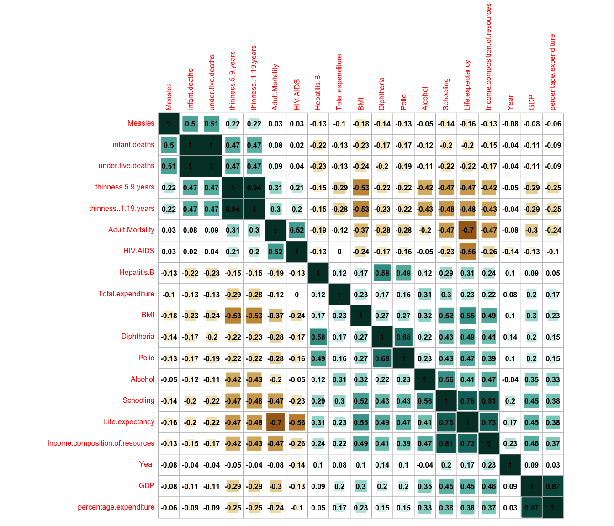

``` r
plot_correlate(LifeExp)
```

    ## Warning: 'plot_correlate' is deprecated.
    ## Use 'plot.correlate' instead.
    ## See help("Deprecated")

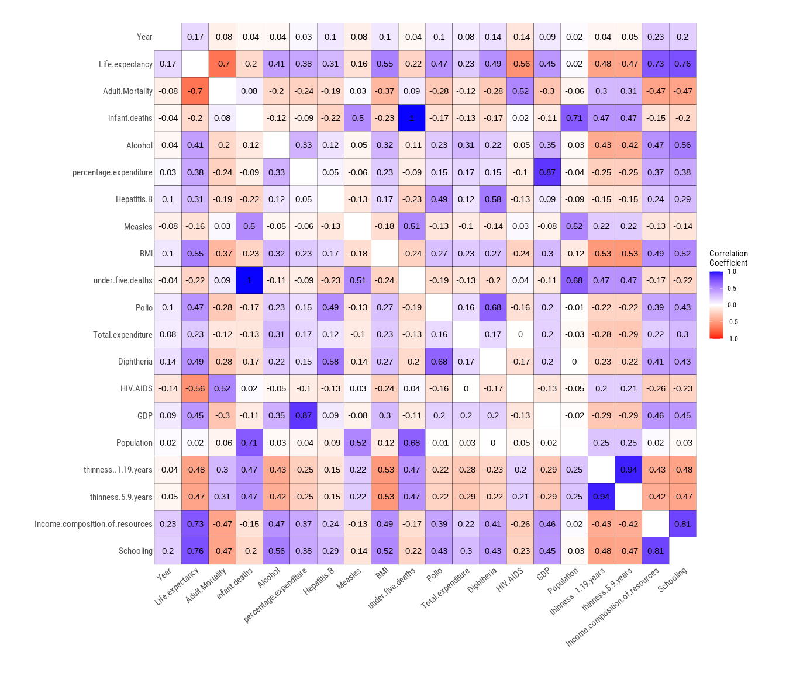

### Observations

-   Under five death and infant death are perfectly correlated. They are
    describing the same thing. One of the variable is redundant.
-   GDP and percentage expenditure are perfectly correlated. They are
    describing the same thing. One of the variable is redundant.
-   Schooling and Income Composition of Resources have a strong positive
    correlation
-   Life Expectancy and Adult Mortality are highly negatively correlated
-   Life Expectancy and HIV.AIDS are moderately correlated
-   Life Expectancy and BMI are moderately correlated
-   Life Expectancy and Schooling are highly correlated
-   Life Expectancy and Income Composition of Resources are highly
    correlated

## Uni-variate analysis

``` r
#####################################################################################
#                               Uni-variate analysis                                #
#####################################################################################
# Let's plot the summary statistics
# Univariate analysis
num_cols = LifeExp %>% dplyr::select(where(is.numeric)) %>% colnames()
num_cols_exclude = c('Year')
num_cols_plots = noquote(unlist(num_cols[!( num_cols %in% num_cols_exclude)]))
nrows = length(num_cols_plots)
for (i in num_cols_plots)
{
box_p = LifeExp %>%
  ggplot(aes(x="", y = .data[[i]])) +
  geom_boxplot(fill = "sandybrown", color = "black") + 
  coord_flip() + theme_classic() + xlab("") +
  theme(axis.text.y=element_blank(),
        axis.ticks.y=element_blank()) +
  ylab(i)
hist_p = LifeExp %>%
  ggplot() +
  geom_histogram(aes(x = .data[[i]], y = (..count..)/sum(..count..)),
                 position = "identity", bins = 30, 
                 fill = "sandybrown", color = "black") +
  ylab("Relative Frequency") +
  theme_classic() + xlab(i) + ggtitle(paste(i, "- Univariate Analysis")) + 
  theme(plot.title = element_text(hjust = 0.5))
egg::ggarrange(hist_p, box_p, heights = 2:1) 
}
```

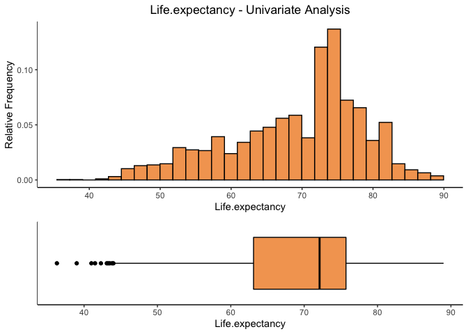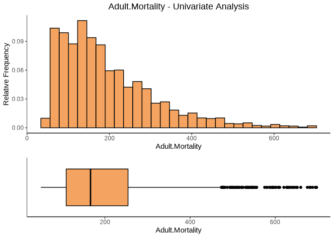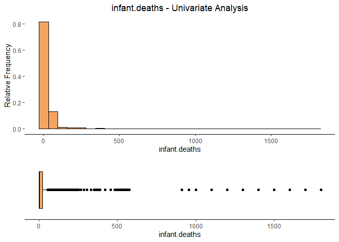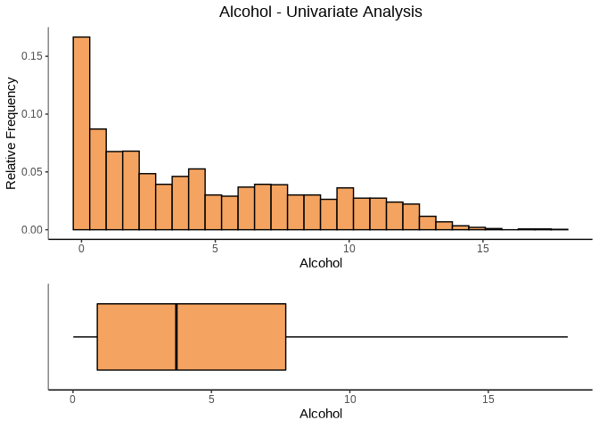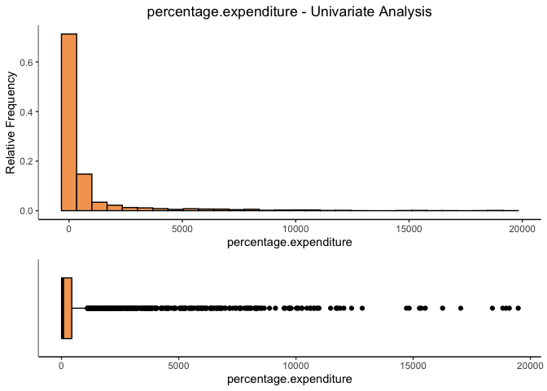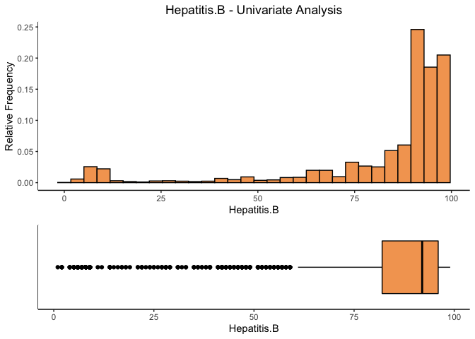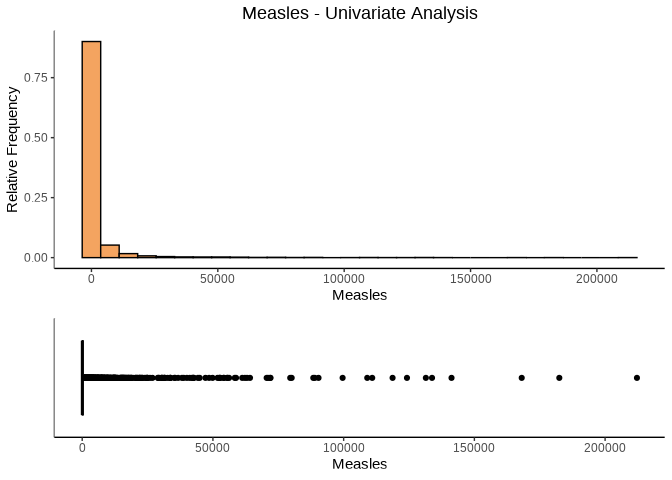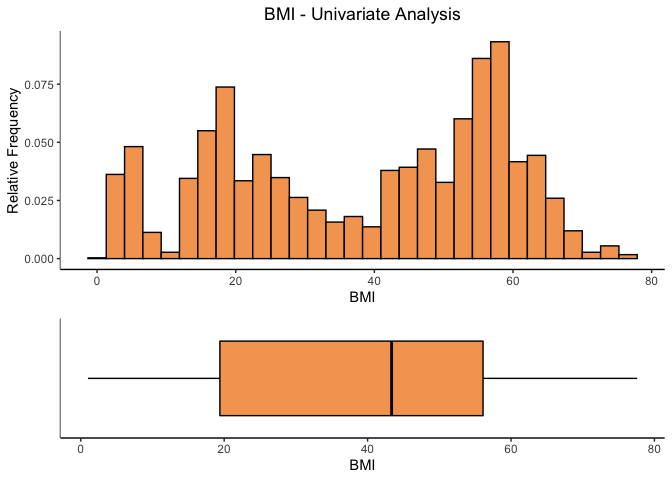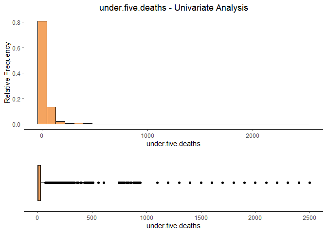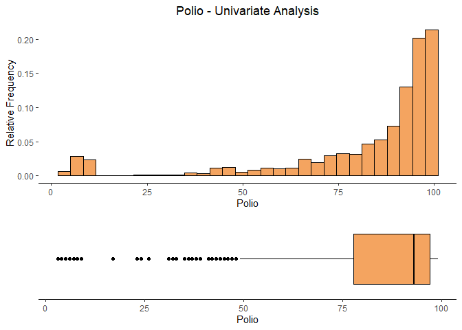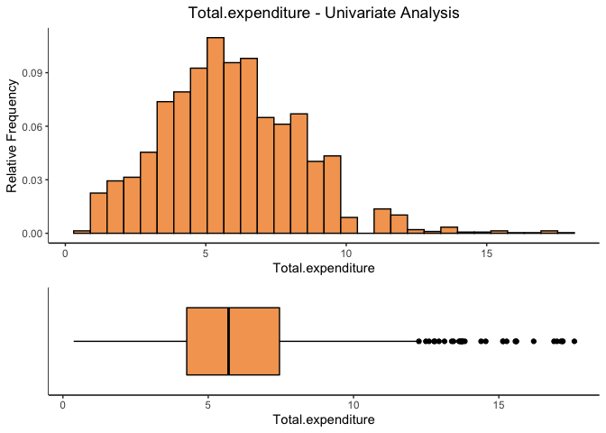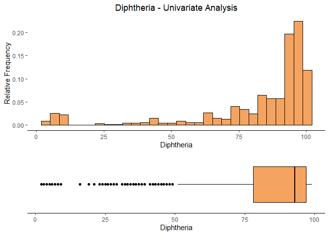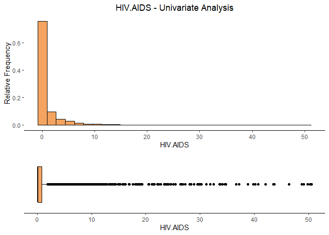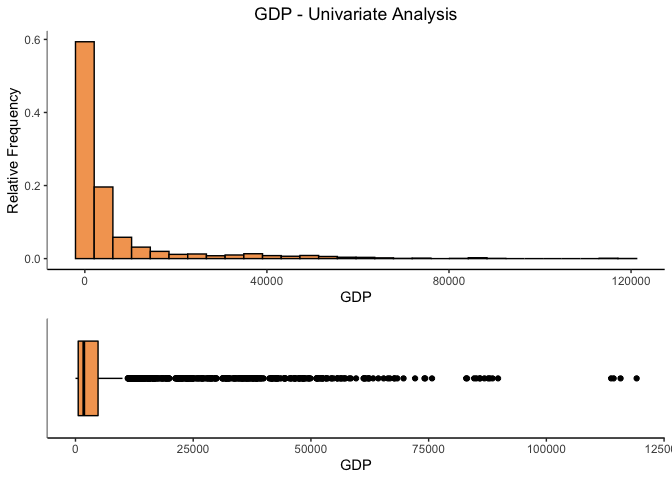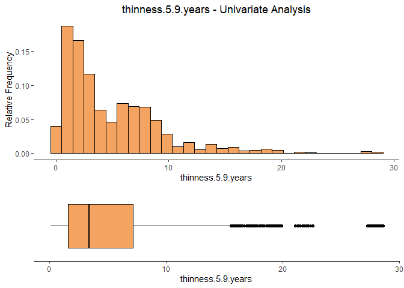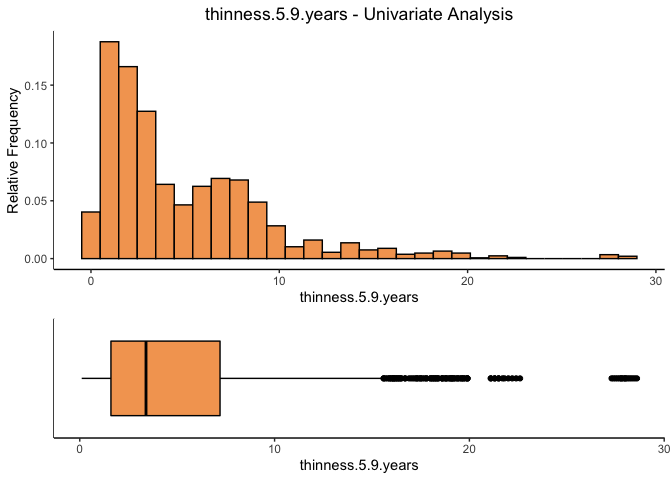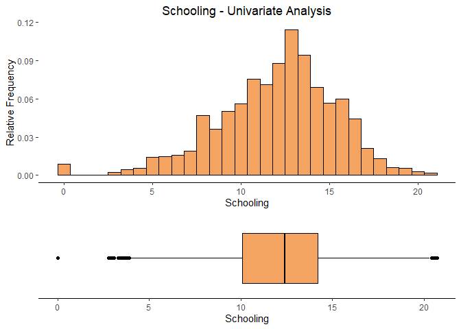

``` r
#####################################################################################
#                                     Data Preparation                              #
#####################################################################################

### Transform variables
LifeExp = mutate(LifeExp, log.HIV.AIDS = ifelse(HIV.AIDS==0, log(HIV.AIDS+1), log(HIV.AIDS)))
LifeExp = mutate(LifeExp, log.GDP = ifelse(GDP==0, log(GDP+1), log(GDP)))
LifeExp = mutate(LifeExp, log.percentage.expenditure = ifelse(percentage.expenditure==0, log(percentage.expenditure+1), log(percentage.expenditure)))


### Transform countries to continents
library(countrycode)
LifeExp$Continent = countrycode(sourcevar = LifeExp[, "Country"], origin = "country.name", destination = "continent")
LifeExp$Continent = as.factor(LifeExp$Continent)
LifeExp$Status = as.factor(LifeExp$Status)

drop = c('Country')#,'HIV.AIDS', 'percentage.expenditure')
LifeExp = LifeExp[, !(colnames(LifeExp) %in% drop)]
```

``` r
#####################################################################################
#                    Split the Data to Train and Test sets (85%-15%)               #
#####################################################################################
index<-sample(1:dim(LifeExp)[1],round(dim(LifeExp)[1]*0.85),replace=F)
train = LifeExp[index,]
test = LifeExp[-index,]
```

``` r
#####################################################################################
#                             EDA on Train sets                                    #
#####################################################################################

describe(train)
```

    ## # A tibble: 22 × 26
    ##    described_variabl…     n    na   mean     sd se_mean    IQR skewness kurtosis
    ##    <chr>              <int> <int>  <dbl>  <dbl>   <dbl>  <dbl>    <dbl>    <dbl>
    ##  1 Year                2489     0 2.01e3 4.59e0 9.20e-2   7    -0.00819   -1.20 
    ##  2 Life.expectancy     2489     0 6.91e1 9.61e0 1.93e-1  12.7  -0.629     -0.253
    ##  3 Adult.Mortality     2489     0 1.65e2 1.25e2 2.51e+0 155     1.16       1.66 
    ##  4 infant.deaths       2489     0 3.18e1 1.22e2 2.44e+0  23     9.33     105.   
    ##  5 Alcohol             2489     0 4.56e0 4.04e0 8.09e-2   6.71  0.621     -0.748
    ##  6 percentage.expend…  2489     0 7.16e2 1.96e3 3.92e+1 419.    4.80      28.7  
    ##  7 Hepatitis.B         2489     0 8.02e1 2.45e1 4.91e-1  21    -1.82       2.44 
    ##  8 Measles             2489     0 2.54e3 1.18e4 2.37e+2 410     9.27     111.   
    ##  9 BMI                 2489     0 3.80e1 2.00e1 4.01e-1  36.7  -0.227     -1.32 
    ## 10 under.five.deaths   2489     0 4.41e1 1.66e2 3.33e+0  30     9.09     101.   
    ## # … with 12 more rows, and 17 more variables: p00 <dbl>, p01 <dbl>, p05 <dbl>,
    ## #   p10 <dbl>, p20 <dbl>, p25 <dbl>, p30 <dbl>, p40 <dbl>, p50 <dbl>,
    ## #   p60 <dbl>, p70 <dbl>, p75 <dbl>, p80 <dbl>, p90 <dbl>, p95 <dbl>,
    ## #   p99 <dbl>, p100 <dbl>

## Observations

\*\* A High degree of skewness can be identified in Infant Deaths \*\* A
High degree of skewness can be identified in Measles \*\* A High degree
of skewness can be identified in under.five.deaths \*\* A High degree of
skewness can be identified in Population

``` r
normality(train) 
```

    ## # A tibble: 22 × 4
    ##    vars                   statistic  p_value sample
    ##    <chr>                      <dbl>    <dbl>  <dbl>
    ##  1 Year                       0.948 7.20e-29   2489
    ##  2 Life.expectancy            0.956 9.84e-27   2489
    ##  3 Adult.Mortality            0.916 4.81e-35   2489
    ##  4 infant.deaths              0.239 2.12e-72   2489
    ##  5 Alcohol                    0.908 2.33e-36   2489
    ##  6 percentage.expenditure     0.399 9.65e-68   2489
    ##  7 Hepatitis.B                0.723 1.44e-53   2489
    ##  8 Measles                    0.212 4.17e-73   2489
    ##  9 BMI                        0.926 2.73e-33   2489
    ## 10 under.five.deaths          0.247 3.40e-72   2489
    ## # … with 12 more rows

``` r
#Runs a Shapario-Wilk Tests, if the p-value is >= .05 then the data is normally distrusted, if <0.05 the data is not normally distrusted.

#Find Features that are not normally distributed 

train %>%
  normality() %>%
  filter(p_value < 0.05) %>%
  arrange(abs(p_value))
```

    ## # A tibble: 22 × 4
    ##    vars                   statistic  p_value sample
    ##    <chr>                      <dbl>    <dbl>  <dbl>
    ##  1 Measles                    0.212 4.17e-73   2489
    ##  2 infant.deaths              0.239 2.12e-72   2489
    ##  3 under.five.deaths          0.247 3.40e-72   2489
    ##  4 HIV.AIDS                   0.359 5.46e-69   2489
    ##  5 percentage.expenditure     0.399 9.65e-68   2489
    ##  6 GDP                        0.543 1.47e-62   2489
    ##  7 Diphtheria                 0.690 1.58e-55   2489
    ##  8 Polio                      0.692 2.12e-55   2489
    ##  9 log.HIV.AIDS               0.712 3.11e-54   2489
    ## 10 Hepatitis.B                0.723 1.44e-53   2489
    ## # … with 12 more rows

``` r
# Verify non normality and transformation options of the variability 
plot_normality(train)
```

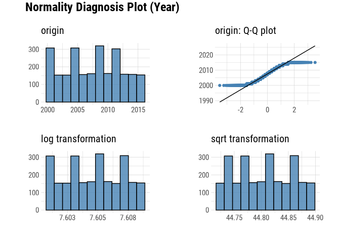<!-- -->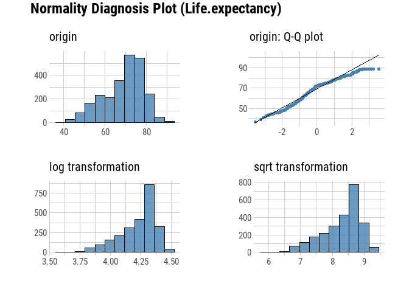<!-- -->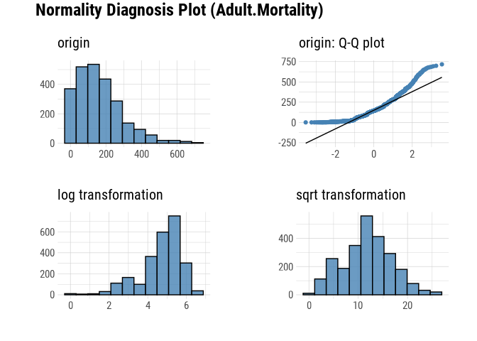<!-- -->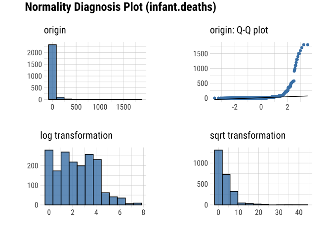<!-- --><!-- -->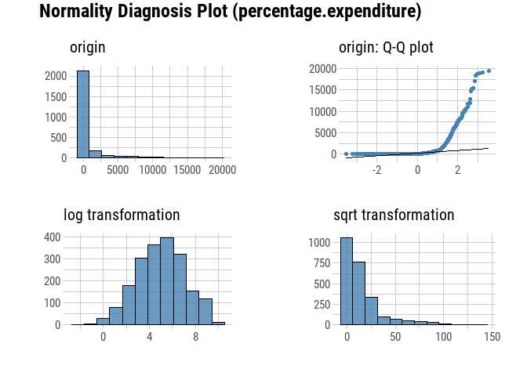<!-- -->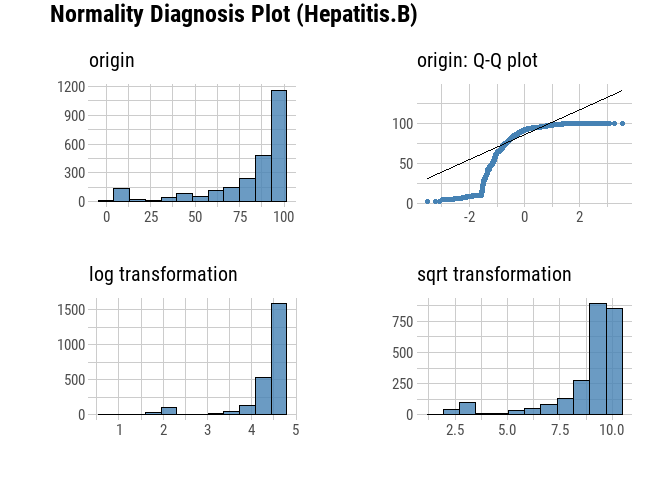<!-- -->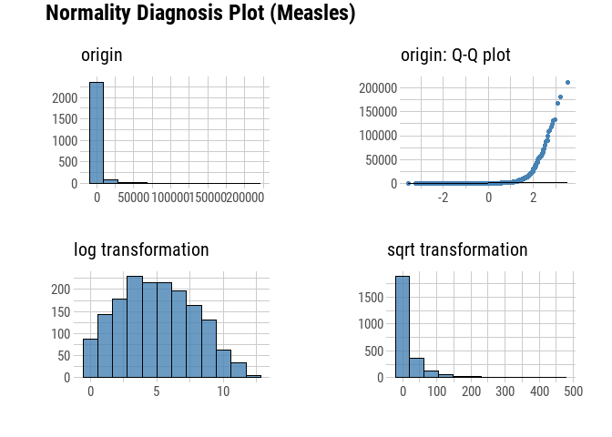<!-- --><!-- -->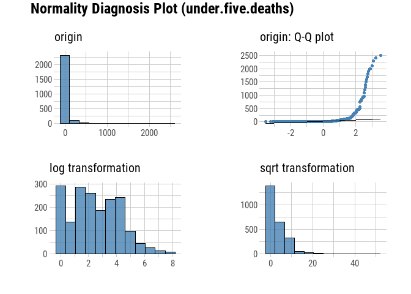<!-- -->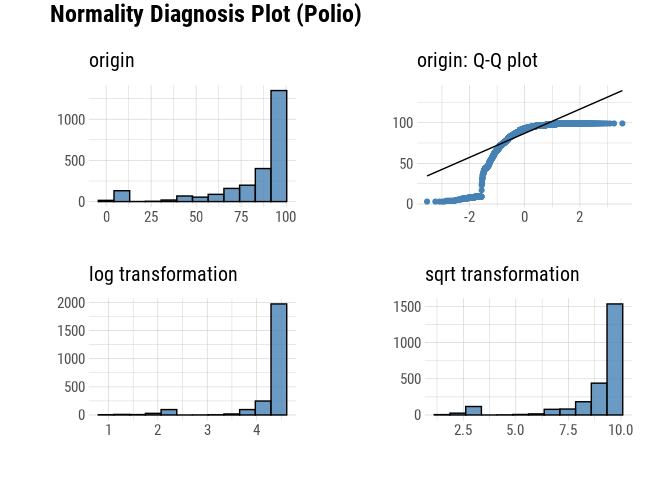<!-- -->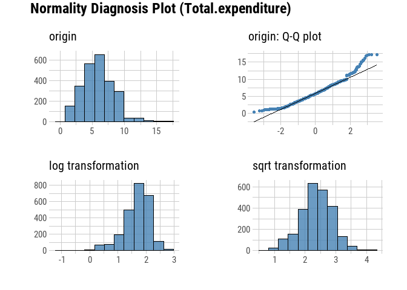<!-- -->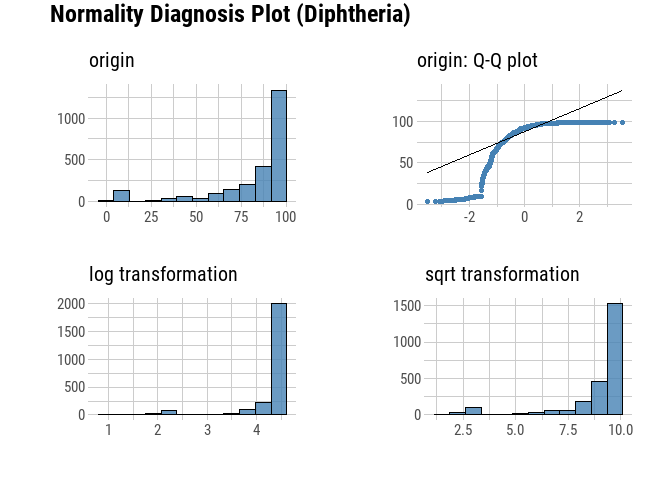<!-- -->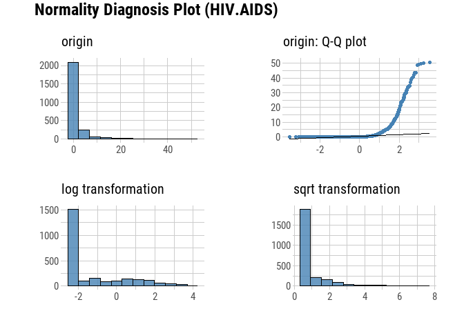<!-- -->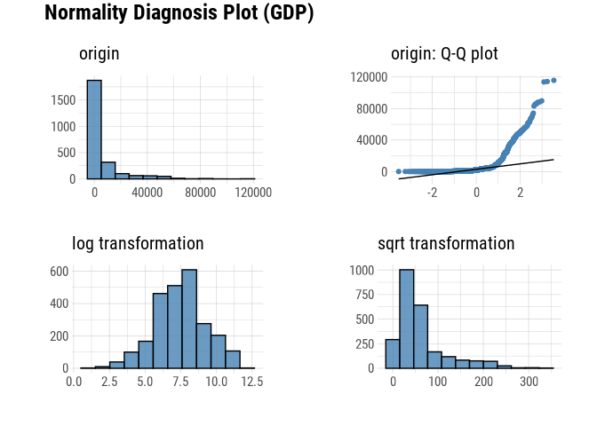<!-- -->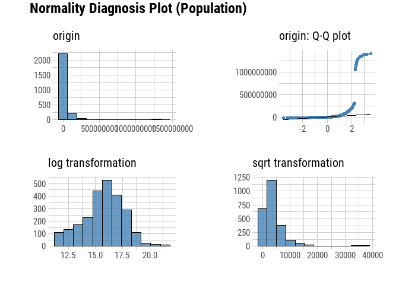<!-- -->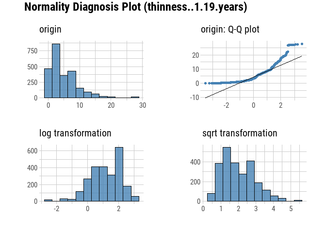<!-- -->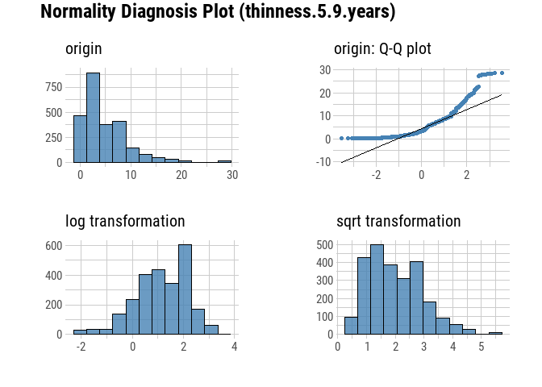<!-- --><!-- -->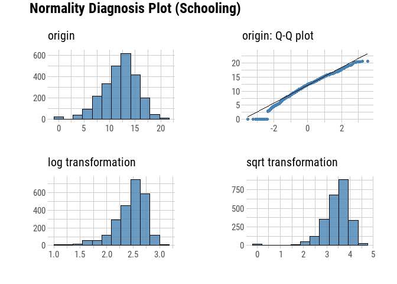<!-- -->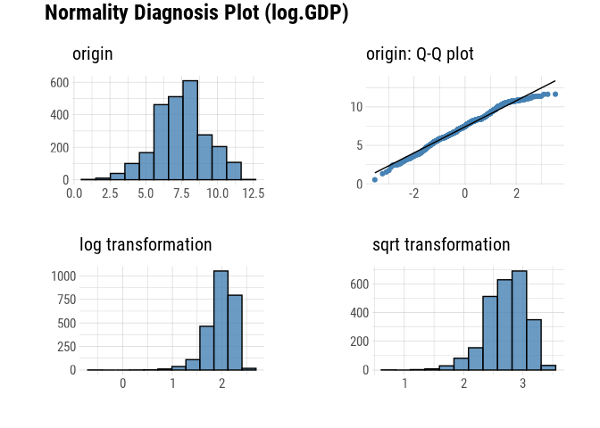<!-- -->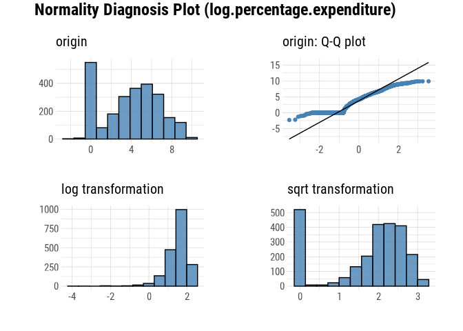<!-- -->

## Observations

\*\* The p-value of the Population is less than 0.0001 signifying it is
non normally and should be transformed if utilized in the following
models.  
\*\* The p-value of the Measles is less than 0.0001 signifying it is non
normally and should be transformed if utilized in the following models.
\*\* The p-value of the infant.deaths is less than 0.0001 signifying it
is non normally and should be transformed if utilized in the following
models. \*\* The p-value of the under.five.deaths is less than 0.0001
signifying it is non normally and should be transformed if utilized in
the following models. \*\* The p-value of the Hepatitis.B is less than
0.0001 signifying it is non normally and should be transformed if
utilized in the following models. \*\* The p-value of the Diphtheria is
less than 0.0001 signifying it is non normally and should be transformed
if utilized in the following models. \*\* The p-value of the Polio is
less than 0.0001 signifying it is non normally and should be transformed
if utilized in the following models. \*\* The p-value of the
log.HIV.AIDS is less than 0.0001 signifying it is non normally and
should be transformed if utilized in the following models. \*\* The
p-value of the thinness.5.9.years is less than 0.0001 signifying it is
non normally and should be transformed if utilized in the following
models. \*\* The p-value of the thinness..1.19.years is less than 0.0001
signifying it is non normally and should be transformed if utilized in
the following models.

##################################################################################### 

# Modeling

##################################################################################### 

``` r
#Prediction function
predict.regsubsets =function (object , newdata ,id ,...){
  form=as.formula (object$call [[2]])
  mat=model.matrix(form ,newdata )
  coefi=coef(object ,id=id)
  xvars=names(coefi)
  mat[,xvars]%*%coefi
}

#####################################################################################
#                                       Lasso                                       #
#####################################################################################
library(glmnet)
x=model.matrix(Life.expectancy~.,train)[,-1]
y=train$Life.expectancy
xtest = model.matrix(Life.expectancy~.,test)[,-1]
ytest = test$Life.expectancy

grid=10^seq(10,-2, length =100)
lasso.mod=glmnet(x,y,alpha=1, lambda =grid)
cv.out=cv.glmnet(x,y,alpha=1)
plot(cv.out)
```

<!-- -->

``` r
bestlambda = cv.out$lambda.min  #Optimal penalty parameter.  You can make this call visually.
lasso.pred=predict(lasso.mod ,s=bestlambda ,newx=xtest)

testMSE_LASSO<-mean((ytest-lasso.pred)^2)
testMSE_LASSO
```

    ## [1] 9.56

``` r
coef(lasso.mod,s=bestlambda)
```

    ## 48 x 1 sparse Matrix of class "dgCMatrix"
    ##                                             s1
    ## (Intercept)                     -130.681803403
    ## Year                               0.092671721
    ## StatusDeveloping                  -0.918150949
    ## Adult.Mortality                   -0.011254070
    ## infant.deaths                      .          
    ## Alcohol                           -0.027440284
    ## percentage.expenditure             0.000022150
    ## Hepatitis.B                        .          
    ## Measles                           -0.000008764
    ## BMI                                0.006043653
    ## under.five.deaths                 -0.001439040
    ## Polio                              0.021601927
    ## Total.expenditure                 -0.013616481
    ## Diphtheria                         0.023179633
    ## HIV.AIDS                          -0.143044587
    ## GDP                                0.000001651
    ## thinness..1.19.years               .          
    ## thinness.5.9.years                -0.038911002
    ## Income.composition.of.resources    4.461773689
    ## Schooling                          0.486773138
    ## RegionAustralia and New Zealand    4.216713636
    ## RegionCanada                       3.456209772
    ## RegionCaribbean                    1.249773727
    ## RegionCentral Africa              -1.014557501
    ## RegionCentral Asia                -3.360908286
    ## RegionCentral Europe               1.763767162
    ## RegionEastern Africa               .          
    ## RegionEastern Europe               .          
    ## RegionMashriq                      0.171912087
    ## RegionMeso-America                 1.766367649
    ## RegionNorth Africa                 0.856697648
    ## RegionNW Pacific and East Asia     0.907931205
    ## RegionSouth America                .          
    ## RegionSouth Asia                  -0.335227120
    ## RegionSouth Pacific                .          
    ## RegionSoutheast Asia               0.038523364
    ## RegionSouthern Africa             -1.914286934
    ## RegionUS                           0.006416786
    ## RegionWestern Africa              -2.862602854
    ## RegionWestern Europe               5.082035845
    ## RegionWestern Indian Ocean        -0.258232846
    ## log.HIV.AIDS                      -1.633137413
    ## log.GDP                            0.102354552
    ## log.percentage.expenditure         0.128893259
    ## ContinentAmericas                  2.574306571
    ## ContinentAsia                      1.425398345
    ## ContinentEurope                    .          
    ## ContinentOceania                   .

``` r
lasso_residuals = (ytest - lasso.pred)
hist(lasso_residuals, main = "Histogram of Residuals")
```

<!-- -->

``` r
plot(lasso_residuals, main = "Residuals plot") 
abline(h=0, col="blue")
```

<!-- -->

``` r
# Metrics RMSE; R-squared; MAE
postResample(pred = lasso.pred, obs = ytest)
```

    ##     RMSE Rsquared      MAE 
    ##   3.0919   0.8833   2.3356

``` r
##### Fit Linear Model based on LASSO regularization without factors to measure VIF####
fit.lasso.lm = lm(Life.expectancy ~ Year + Adult.Mortality + infant.deaths + Alcohol + Hepatitis.B + Measles + BMI + under.five.deaths + Polio + Total.expenditure + Diphtheria + thinness.5.9.years + Income.composition.of.resources + Schooling + log.HIV.AIDS + log.GDP + log.percentage.expenditure, data = train)
summary(fit.lasso.lm)
```

    ## 
    ## Call:
    ## lm(formula = Life.expectancy ~ Year + Adult.Mortality + infant.deaths + 
    ##     Alcohol + Hepatitis.B + Measles + BMI + under.five.deaths + 
    ##     Polio + Total.expenditure + Diphtheria + thinness.5.9.years + 
    ##     Income.composition.of.resources + Schooling + log.HIV.AIDS + 
    ##     log.GDP + log.percentage.expenditure, data = train)
    ## 
    ## Residuals:
    ##     Min      1Q  Median      3Q     Max 
    ## -18.922  -1.999  -0.048   1.983  16.182 
    ## 
    ## Coefficients:
    ##                                     Estimate   Std. Error t value
    ## (Intercept)                     -72.84662267  34.47820374   -2.11
    ## Year                              0.06286390   0.01724224    3.65
    ## Adult.Mortality                  -0.01510695   0.00078449  -19.26
    ## infant.deaths                     0.04945701   0.00806933    6.13
    ## Alcohol                           0.13065718   0.02440115    5.35
    ## Hepatitis.B                      -0.00409920   0.00375702   -1.09
    ## Measles                          -0.00001453   0.00000721   -2.02
    ## BMI                               0.00879275   0.00480580    1.83
    ## under.five.deaths                -0.03702410   0.00593310   -6.24
    ## Polio                             0.01634813   0.00438005    3.73
    ## Total.expenditure                 0.03868571   0.03226278    1.20
    ## Diphtheria                        0.02187874   0.00473501    4.62
    ## thinness.5.9.years               -0.10854302   0.02285959   -4.75
    ## Income.composition.of.resources   5.92110182   0.63021061    9.40
    ## Schooling                         0.46046697   0.04385247   10.50
    ## log.HIV.AIDS                     -2.36205237   0.06923422  -34.12
    ## log.GDP                           0.27673098   0.06011828    4.60
    ## log.percentage.expenditure        0.20030991   0.03308232    6.05
    ##                                             Pr(>|t|)    
    ## (Intercept)                                  0.03472 *  
    ## Year                                         0.00027 ***
    ## Adult.Mortality                 < 0.0000000000000002 ***
    ## infant.deaths                          0.00000000103 ***
    ## Alcohol                                0.00000009368 ***
    ## Hepatitis.B                                  0.27535    
    ## Measles                                      0.04388 *  
    ## BMI                                          0.06743 .  
    ## under.five.deaths                      0.00000000051 ***
    ## Polio                                        0.00019 ***
    ## Total.expenditure                            0.23061    
    ## Diphtheria                             0.00000402227 ***
    ## thinness.5.9.years                     0.00000216913 ***
    ## Income.composition.of.resources < 0.0000000000000002 ***
    ## Schooling                       < 0.0000000000000002 ***
    ## log.HIV.AIDS                    < 0.0000000000000002 ***
    ## log.GDP                                0.00000437292 ***
    ## log.percentage.expenditure             0.00000000162 ***
    ## ---
    ## Signif. codes:  0 '***' 0.001 '**' 0.01 '*' 0.05 '.' 0.1 ' ' 1
    ## 
    ## Residual standard error: 3.64 on 2471 degrees of freedom
    ## Multiple R-squared:  0.857,  Adjusted R-squared:  0.856 
    ## F-statistic:  872 on 17 and 2471 DF,  p-value: <0.0000000000000002

``` r
### Visualize VIF
fit.lasso.lm_VIF = vif(fit.lasso.lm)
barplot(fit.lasso.lm_VIF, main = 'VIF Values', horiz = TRUE, col="blue", xlim = c(0,12))
abline(v=10, col="red")
```

<!-- -->

``` r
# We can see that LASSO did not remove infant.deaths or under.five.deaths as those are perfectly correlated. Let's remove the one with the smallest coefficient (infant.death).

##### Fit Linear Model based on LASSO regularization without factors to measure VIF####
fit.lasso.lm2 = lm(Life.expectancy ~ Year + Adult.Mortality + Alcohol + Hepatitis.B + Measles + BMI + under.five.deaths + Polio + Total.expenditure + Diphtheria + thinness.5.9.years + Income.composition.of.resources + Schooling + log.HIV.AIDS + log.GDP + log.percentage.expenditure, data = train)
summary(fit.lasso.lm2)
```

    ## 
    ## Call:
    ## lm(formula = Life.expectancy ~ Year + Adult.Mortality + Alcohol + 
    ##     Hepatitis.B + Measles + BMI + under.five.deaths + Polio + 
    ##     Total.expenditure + Diphtheria + thinness.5.9.years + Income.composition.of.resources + 
    ##     Schooling + log.HIV.AIDS + log.GDP + log.percentage.expenditure, 
    ##     data = train)
    ## 
    ## Residuals:
    ##     Min      1Q  Median      3Q     Max 
    ## -18.874  -2.043  -0.023   1.973  16.389 
    ## 
    ## Coefficients:
    ##                                     Estimate   Std. Error t value
    ## (Intercept)                     -70.85633377  34.73072041   -2.04
    ## Year                              0.06157424   0.01736800    3.55
    ## Adult.Mortality                  -0.01497611   0.00078998  -18.96
    ## Alcohol                           0.11048194   0.02435626    4.54
    ## Hepatitis.B                      -0.00544586   0.00377823   -1.44
    ## Measles                          -0.00001473   0.00000726   -2.03
    ## BMI                               0.00834564   0.00484065    1.72
    ## under.five.deaths                -0.00083548   0.00058630   -1.42
    ## Polio                             0.01755367   0.00440787    3.98
    ## Total.expenditure                 0.04189082   0.03249624    1.29
    ## Diphtheria                        0.02505805   0.00474119    5.29
    ## thinness.5.9.years               -0.09624228   0.02293911   -4.20
    ## Income.composition.of.resources   6.22476459   0.63288947    9.84
    ## Schooling                         0.46649384   0.04416449   10.56
    ## log.HIV.AIDS                     -2.44676788   0.06834035  -35.80
    ## log.GDP                           0.27577744   0.06056107    4.55
    ## log.percentage.expenditure        0.19328041   0.03330606    5.80
    ##                                             Pr(>|t|)    
    ## (Intercept)                                   0.0414 *  
    ## Year                                          0.0004 ***
    ## Adult.Mortality                 < 0.0000000000000002 ***
    ## Alcohol                                 0.0000060046 ***
    ## Hepatitis.B                                   0.1496    
    ## Measles                                       0.0425 *  
    ## BMI                                           0.0848 .  
    ## under.five.deaths                             0.1543    
    ## Polio                                   0.0000702084 ***
    ## Total.expenditure                             0.1975    
    ## Diphtheria                              0.0000001366 ***
    ## thinness.5.9.years                      0.0000281806 ***
    ## Income.composition.of.resources < 0.0000000000000002 ***
    ## Schooling                       < 0.0000000000000002 ***
    ## log.HIV.AIDS                    < 0.0000000000000002 ***
    ## log.GDP                                 0.0000055264 ***
    ## log.percentage.expenditure              0.0000000073 ***
    ## ---
    ## Signif. codes:  0 '***' 0.001 '**' 0.01 '*' 0.05 '.' 0.1 ' ' 1
    ## 
    ## Residual standard error: 3.67 on 2472 degrees of freedom
    ## Multiple R-squared:  0.855,  Adjusted R-squared:  0.854 
    ## F-statistic:  911 on 16 and 2472 DF,  p-value: <0.0000000000000002

``` r
### re-run Visualize VIF
fit.lasso.lm_VIF2 = vif(fit.lasso.lm2)
barplot(fit.lasso.lm_VIF2, main = 'VIF Values', horiz = TRUE, col="blue", xlim = c(0,12))
abline(v=10, col="red")
```

<!-- -->

``` r
##### Fit Linear Model based on LASSO regularization and removed multicollinearity####
fit.lasso.lm3 = lm(Life.expectancy ~ Year + Adult.Mortality + Alcohol + Hepatitis.B + Measles + BMI + under.five.deaths + Polio + Total.expenditure + Diphtheria + thinness.5.9.years + Income.composition.of.resources + Schooling + log.HIV.AIDS + log.GDP + log.percentage.expenditure + Status + Continent, data = train)

#### Hypothesis testing ####
summary(fit.lasso.lm3)
```

    ## 
    ## Call:
    ## lm(formula = Life.expectancy ~ Year + Adult.Mortality + Alcohol + 
    ##     Hepatitis.B + Measles + BMI + under.five.deaths + Polio + 
    ##     Total.expenditure + Diphtheria + thinness.5.9.years + Income.composition.of.resources + 
    ##     Schooling + log.HIV.AIDS + log.GDP + log.percentage.expenditure + 
    ##     Status + Continent, data = train)
    ## 
    ## Residuals:
    ##    Min     1Q Median     3Q    Max 
    ## -20.65  -2.05  -0.01   1.79  13.94 
    ## 
    ## Coefficients:
    ##                                      Estimate    Std. Error t value
    ## (Intercept)                     -123.72633350   33.74050262   -3.67
    ## Year                               0.08930557    0.01688388    5.29
    ## Adult.Mortality                   -0.01359206    0.00076280  -17.82
    ## Alcohol                           -0.07418233    0.02927015   -2.53
    ## Hepatitis.B                       -0.00549576    0.00363940   -1.51
    ## Measles                           -0.00000598    0.00000699   -0.86
    ## BMI                                0.00591399    0.00477235    1.24
    ## under.five.deaths                 -0.00139386    0.00056445   -2.47
    ## Polio                              0.02005324    0.00422888    4.74
    ## Total.expenditure                 -0.03255967    0.03203590   -1.02
    ## Diphtheria                         0.02198214    0.00456580    4.81
    ## thinness.5.9.years                -0.04960993    0.02369547   -2.09
    ## Income.composition.of.resources    5.33415870    0.62095129    8.59
    ## Schooling                          0.45918850    0.04267197   10.76
    ## log.HIV.AIDS                      -2.18660817    0.07964517  -27.45
    ## log.GDP                            0.21335303    0.05874364    3.63
    ## log.percentage.expenditure         0.19910280    0.03205963    6.21
    ## StatusDeveloping                  -2.38572016    0.29315748   -8.14
    ## ContinentAmericas                  3.90175290    0.29929323   13.04
    ## ContinentAsia                      1.30157229    0.27615619    4.71
    ## ContinentEurope                    2.27857213    0.37270708    6.11
    ## ContinentOceania                   0.46538212    0.40595854    1.15
    ##                                             Pr(>|t|)    
    ## (Intercept)                                  0.00025 ***
    ## Year                             0.00000013351168870 ***
    ## Adult.Mortality                 < 0.0000000000000002 ***
    ## Alcohol                                      0.01133 *  
    ## Hepatitis.B                                  0.13115    
    ## Measles                                      0.39233    
    ## BMI                                          0.21538    
    ## under.five.deaths                            0.01360 *  
    ## Polio                            0.00000223696297166 ***
    ## Total.expenditure                            0.30956    
    ## Diphtheria                       0.00000156474917922 ***
    ## thinness.5.9.years                           0.03639 *  
    ## Income.composition.of.resources < 0.0000000000000002 ***
    ## Schooling                       < 0.0000000000000002 ***
    ## log.HIV.AIDS                    < 0.0000000000000002 ***
    ## log.GDP                                      0.00029 ***
    ## log.percentage.expenditure       0.00000000061830034 ***
    ## StatusDeveloping                 0.00000000000000063 ***
    ## ContinentAmericas               < 0.0000000000000002 ***
    ## ContinentAsia                    0.00000257449114797 ***
    ## ContinentEurope                  0.00000000112917977 ***
    ## ContinentOceania                             0.25175    
    ## ---
    ## Signif. codes:  0 '***' 0.001 '**' 0.01 '*' 0.05 '.' 0.1 ' ' 1
    ## 
    ## Residual standard error: 3.52 on 2467 degrees of freedom
    ## Multiple R-squared:  0.867,  Adjusted R-squared:  0.866 
    ## F-statistic:  768 on 21 and 2467 DF,  p-value: <0.0000000000000002

``` r
# At alpha = 0.05 the following variables are not significant therefore don't contribute to the model performance:
# Alcohol, Measles, BMI, Total.expenditure.

# Predicting
train_pred = predict(fit.lasso.lm3, train)
test_pred = predict(fit.lasso.lm3, test)

# Scoring the final model on Training and Test set
residuals = resid(fit.lasso.lm3)
postResample(pred = train_pred, obs = train$Life.expectancy)
```

    ##     RMSE Rsquared      MAE 
    ##   3.4997   0.8673   2.5942

``` r
postResample(pred = test_pred, obs = test$Life.expectancy)
```

    ##     RMSE Rsquared      MAE 
    ##   3.2673   0.8693   2.4816

``` r
sm = summary(fit.lasso.lm3)
mse = mean(sm$residuals^2)

### Checking Multiple Liner Regression model assumptions
confint(fit.lasso.lm3)
```

    ##                                         2.5 %        97.5 %
    ## (Intercept)                     -189.88896403 -57.563702972
    ## Year                               0.05619753   0.122413616
    ## Adult.Mortality                   -0.01508785  -0.012096266
    ## Alcohol                           -0.13157893  -0.016785722
    ## Hepatitis.B                       -0.01263236   0.001640842
    ## Measles                           -0.00001969   0.000007729
    ## BMI                               -0.00344424   0.015272226
    ## under.five.deaths                 -0.00250069  -0.000287019
    ## Polio                              0.01176072   0.028345750
    ## Total.expenditure                 -0.09537970   0.030260367
    ## Diphtheria                         0.01302895   0.030935337
    ## thinness.5.9.years                -0.09607500  -0.003144869
    ## Income.composition.of.resources    4.11651914   6.551798267
    ## Schooling                          0.37551192   0.542865085
    ## log.HIV.AIDS                      -2.34278645  -2.030429885
    ## log.GDP                            0.09816109   0.328544973
    ## log.percentage.expenditure         0.13623623   0.261969369
    ## StatusDeveloping                  -2.96058030  -1.810860010
    ## ContinentAmericas                  3.31486102   4.488644782
    ## ContinentAsia                      0.76005042   1.843094147
    ## ContinentEurope                    1.54772111   3.009423140
    ## ContinentOceania                  -0.33067256   1.261436794

``` r
hist(residuals, main = "Histogram of Residuals")
```

<!-- -->

``` r
plot(residuals, main = "Residuals plot") 
abline(h=0, col="blue")
```

<!-- -->

``` r
plot(fit.lasso.lm3, which = 2)
```

<!-- -->

``` r
plot(fit.lasso.lm3, which = 4)
```

<!-- -->

``` r
#####################################################################################
#                                  Forward Selection                                #
#####################################################################################
library(leaps)
mlr.fwd=regsubsets(Life.expectancy~.,data=train,method="forward",nvmax=43)
```

    ## Warning in leaps.setup(x, y, wt = wt, nbest = nbest, nvmax = nvmax, force.in =
    ## force.in, : 3 linear dependencies found

    ## Reordering variables and trying again:

``` r
testASE<-c()
for (i in 1:43){
  predictions = predict.regsubsets(object=mlr.fwd,newdata=test,id=i) 
  testASE[i] = mean((test$Life.expectancy-predictions)^2)
}
par(mfrow=c(1,1))
plot(1:43,testASE,type="l",xlab="# of predictors",ylab="test vs train ASE")
index<-which(testASE==min(testASE))
points(index,testASE[index],col="red",pch=10)
rss<-summary(mlr.fwd)$rss
lines(1:44,rss/dim(train)[1],lty=3,col="blue")  
```

<!-- -->

``` r
mlr.fwd.final=regsubsets(Life.expectancy~.,data=LifeExp,method="forward",nvmax=43)
```

    ## Warning in leaps.setup(x, y, wt = wt, nbest = nbest, nvmax = nvmax, force.in =
    ## force.in, : 3 linear dependencies found

    ## Reordering variables and trying again:

``` r
coef(mlr.fwd.final,35)
```

    ##                     (Intercept)                            Year 
    ##                  -139.988949080                     0.097409819 
    ##                StatusDeveloping                 Adult.Mortality 
    ##                    -0.843229351                    -0.010667873 
    ##                   infant.deaths                         Alcohol 
    ##                     0.032897287                    -0.034420962 
    ##                         Measles                             BMI 
    ##                    -0.000008990                     0.006225001 
    ##               under.five.deaths                           Polio 
    ##                    -0.025699185                     0.021121145 
    ##               Total.expenditure                      Diphtheria 
    ##                    -0.030970887                     0.020385451 
    ##                        HIV.AIDS                             GDP 
    ##                    -0.136204728                     0.000006465 
    ##              thinness.5.9.years Income.composition.of.resources 
    ##                    -0.058343981                     4.199510652 
    ##                       Schooling RegionAustralia and New Zealand 
    ##                     0.488677777                     4.434436666 
    ##                    RegionCanada            RegionCentral Africa 
    ##                     2.600944467                    -1.013230250 
    ##              RegionCentral Asia            RegionCentral Europe 
    ##                    -3.352161841                     2.136841343 
    ##              RegionMeso-America              RegionNorth Africa 
    ##                     0.358015052                     1.010414530 
    ##  RegionNW Pacific and East Asia             RegionSouth America 
    ##                     1.067521983                    -1.458144235 
    ##                RegionSouth Asia           RegionSouthern Africa 
    ##                    -0.319803540                    -2.092356648 
    ##                        RegionUS            RegionWestern Africa 
    ##                    -1.219986857                    -2.429269293 
    ##            RegionWestern Europe                    log.HIV.AIDS 
    ##                     5.423710548                    -1.578915043 
    ##                         log.GDP      log.percentage.expenditure 
    ##                     0.119873335                     0.127554306 
    ##                   ContinentAsia               ContinentAmericas 
    ##                     1.717595733                     4.102566971

``` r
summary(mlr.fwd.final)
```

    ## Subset selection object
    ## Call: regsubsets.formula(Life.expectancy ~ ., data = LifeExp, method = "forward", 
    ##     nvmax = 43)
    ## 47 Variables  (and intercept)
    ##                                 Forced in Forced out
    ## Year                                FALSE      FALSE
    ## StatusDeveloping                    FALSE      FALSE
    ## Adult.Mortality                     FALSE      FALSE
    ## infant.deaths                       FALSE      FALSE
    ## Alcohol                             FALSE      FALSE
    ## percentage.expenditure              FALSE      FALSE
    ## Hepatitis.B                         FALSE      FALSE
    ## Measles                             FALSE      FALSE
    ## BMI                                 FALSE      FALSE
    ## under.five.deaths                   FALSE      FALSE
    ## Polio                               FALSE      FALSE
    ## Total.expenditure                   FALSE      FALSE
    ## Diphtheria                          FALSE      FALSE
    ## HIV.AIDS                            FALSE      FALSE
    ## GDP                                 FALSE      FALSE
    ## thinness..1.19.years                FALSE      FALSE
    ## thinness.5.9.years                  FALSE      FALSE
    ## Income.composition.of.resources     FALSE      FALSE
    ## Schooling                           FALSE      FALSE
    ## RegionAustralia and New Zealand     FALSE      FALSE
    ## RegionCanada                        FALSE      FALSE
    ## RegionCaribbean                     FALSE      FALSE
    ## RegionCentral Africa                FALSE      FALSE
    ## RegionCentral Asia                  FALSE      FALSE
    ## RegionCentral Europe                FALSE      FALSE
    ## RegionEastern Africa                FALSE      FALSE
    ## RegionEastern Europe                FALSE      FALSE
    ## RegionMashriq                       FALSE      FALSE
    ## RegionMeso-America                  FALSE      FALSE
    ## RegionNorth Africa                  FALSE      FALSE
    ## RegionNW Pacific and East Asia      FALSE      FALSE
    ## RegionSouth America                 FALSE      FALSE
    ## RegionSouth Asia                    FALSE      FALSE
    ## RegionSouth Pacific                 FALSE      FALSE
    ## RegionSoutheast Asia                FALSE      FALSE
    ## RegionSouthern Africa               FALSE      FALSE
    ## RegionUS                            FALSE      FALSE
    ## RegionWestern Africa                FALSE      FALSE
    ## RegionWestern Europe                FALSE      FALSE
    ## RegionWestern Indian Ocean          FALSE      FALSE
    ## log.HIV.AIDS                        FALSE      FALSE
    ## log.GDP                             FALSE      FALSE
    ## log.percentage.expenditure          FALSE      FALSE
    ## ContinentAsia                       FALSE      FALSE
    ## ContinentAmericas                   FALSE      FALSE
    ## ContinentEurope                     FALSE      FALSE
    ## ContinentOceania                    FALSE      FALSE
    ## 1 subsets of each size up to 44
    ## Selection Algorithm: forward
    ##           Year StatusDeveloping Adult.Mortality infant.deaths Alcohol
    ## 1  ( 1 )  " "  " "              " "             " "           " "    
    ## 2  ( 1 )  " "  " "              " "             " "           " "    
    ## 3  ( 1 )  " "  " "              "*"             " "           " "    
    ## 4  ( 1 )  " "  " "              "*"             " "           " "    
    ## 5  ( 1 )  " "  " "              "*"             " "           " "    
    ## 6  ( 1 )  " "  " "              "*"             " "           " "    
    ## 7  ( 1 )  " "  " "              "*"             " "           " "    
    ## 8  ( 1 )  " "  " "              "*"             " "           " "    
    ## 9  ( 1 )  " "  " "              "*"             " "           " "    
    ## 10  ( 1 ) " "  " "              "*"             " "           " "    
    ## 11  ( 1 ) " "  " "              "*"             " "           " "    
    ## 12  ( 1 ) " "  " "              "*"             " "           " "    
    ## 13  ( 1 ) " "  "*"              "*"             " "           " "    
    ## 14  ( 1 ) " "  "*"              "*"             " "           " "    
    ## 15  ( 1 ) " "  "*"              "*"             " "           " "    
    ## 16  ( 1 ) " "  "*"              "*"             " "           " "    
    ## 17  ( 1 ) "*"  "*"              "*"             " "           " "    
    ## 18  ( 1 ) "*"  "*"              "*"             " "           " "    
    ## 19  ( 1 ) "*"  "*"              "*"             " "           " "    
    ## 20  ( 1 ) "*"  "*"              "*"             " "           " "    
    ## 21  ( 1 ) "*"  "*"              "*"             "*"           " "    
    ## 22  ( 1 ) "*"  "*"              "*"             "*"           " "    
    ## 23  ( 1 ) "*"  "*"              "*"             "*"           " "    
    ## 24  ( 1 ) "*"  "*"              "*"             "*"           " "    
    ## 25  ( 1 ) "*"  "*"              "*"             "*"           " "    
    ## 26  ( 1 ) "*"  "*"              "*"             "*"           " "    
    ## 27  ( 1 ) "*"  "*"              "*"             "*"           " "    
    ## 28  ( 1 ) "*"  "*"              "*"             "*"           "*"    
    ## 29  ( 1 ) "*"  "*"              "*"             "*"           "*"    
    ## 30  ( 1 ) "*"  "*"              "*"             "*"           "*"    
    ## 31  ( 1 ) "*"  "*"              "*"             "*"           "*"    
    ## 32  ( 1 ) "*"  "*"              "*"             "*"           "*"    
    ## 33  ( 1 ) "*"  "*"              "*"             "*"           "*"    
    ## 34  ( 1 ) "*"  "*"              "*"             "*"           "*"    
    ## 35  ( 1 ) "*"  "*"              "*"             "*"           "*"    
    ## 36  ( 1 ) "*"  "*"              "*"             "*"           "*"    
    ## 37  ( 1 ) "*"  "*"              "*"             "*"           "*"    
    ## 38  ( 1 ) "*"  "*"              "*"             "*"           "*"    
    ## 39  ( 1 ) "*"  "*"              "*"             "*"           "*"    
    ## 40  ( 1 ) "*"  "*"              "*"             "*"           "*"    
    ## 41  ( 1 ) "*"  "*"              "*"             "*"           "*"    
    ## 42  ( 1 ) "*"  "*"              "*"             "*"           "*"    
    ## 43  ( 1 ) "*"  "*"              "*"             "*"           "*"    
    ## 44  ( 1 ) "*"  "*"              "*"             "*"           "*"    
    ##           percentage.expenditure Hepatitis.B Measles BMI under.five.deaths
    ## 1  ( 1 )  " "                    " "         " "     " " " "              
    ## 2  ( 1 )  " "                    " "         " "     " " " "              
    ## 3  ( 1 )  " "                    " "         " "     " " " "              
    ## 4  ( 1 )  " "                    " "         " "     " " " "              
    ## 5  ( 1 )  " "                    " "         " "     " " " "              
    ## 6  ( 1 )  " "                    " "         " "     " " " "              
    ## 7  ( 1 )  " "                    " "         " "     " " " "              
    ## 8  ( 1 )  " "                    " "         " "     " " " "              
    ## 9  ( 1 )  " "                    " "         " "     " " " "              
    ## 10  ( 1 ) " "                    " "         " "     " " " "              
    ## 11  ( 1 ) " "                    " "         " "     " " " "              
    ## 12  ( 1 ) " "                    " "         " "     " " " "              
    ## 13  ( 1 ) " "                    " "         " "     " " " "              
    ## 14  ( 1 ) " "                    " "         " "     " " " "              
    ## 15  ( 1 ) " "                    " "         " "     " " "*"              
    ## 16  ( 1 ) " "                    " "         " "     " " "*"              
    ## 17  ( 1 ) " "                    " "         " "     " " "*"              
    ## 18  ( 1 ) " "                    " "         " "     " " "*"              
    ## 19  ( 1 ) " "                    " "         " "     " " "*"              
    ## 20  ( 1 ) " "                    " "         " "     " " "*"              
    ## 21  ( 1 ) " "                    " "         " "     " " "*"              
    ## 22  ( 1 ) " "                    " "         " "     " " "*"              
    ## 23  ( 1 ) " "                    " "         " "     " " "*"              
    ## 24  ( 1 ) " "                    " "         " "     " " "*"              
    ## 25  ( 1 ) " "                    " "         " "     " " "*"              
    ## 26  ( 1 ) " "                    " "         " "     " " "*"              
    ## 27  ( 1 ) " "                    " "         " "     " " "*"              
    ## 28  ( 1 ) " "                    " "         " "     " " "*"              
    ## 29  ( 1 ) " "                    " "         " "     " " "*"              
    ## 30  ( 1 ) " "                    " "         " "     "*" "*"              
    ## 31  ( 1 ) " "                    " "         "*"     "*" "*"              
    ## 32  ( 1 ) " "                    " "         "*"     "*" "*"              
    ## 33  ( 1 ) " "                    " "         "*"     "*" "*"              
    ## 34  ( 1 ) " "                    " "         "*"     "*" "*"              
    ## 35  ( 1 ) " "                    " "         "*"     "*" "*"              
    ## 36  ( 1 ) " "                    " "         "*"     "*" "*"              
    ## 37  ( 1 ) " "                    " "         "*"     "*" "*"              
    ## 38  ( 1 ) " "                    " "         "*"     "*" "*"              
    ## 39  ( 1 ) " "                    " "         "*"     "*" "*"              
    ## 40  ( 1 ) "*"                    " "         "*"     "*" "*"              
    ## 41  ( 1 ) "*"                    " "         "*"     "*" "*"              
    ## 42  ( 1 ) "*"                    "*"         "*"     "*" "*"              
    ## 43  ( 1 ) "*"                    "*"         "*"     "*" "*"              
    ## 44  ( 1 ) "*"                    "*"         "*"     "*" "*"              
    ##           Polio Total.expenditure Diphtheria HIV.AIDS GDP thinness..1.19.years
    ## 1  ( 1 )  " "   " "               " "        " "      " " " "                 
    ## 2  ( 1 )  " "   " "               " "        " "      " " " "                 
    ## 3  ( 1 )  " "   " "               " "        " "      " " " "                 
    ## 4  ( 1 )  " "   " "               " "        " "      " " " "                 
    ## 5  ( 1 )  " "   " "               " "        " "      " " " "                 
    ## 6  ( 1 )  " "   " "               " "        " "      " " " "                 
    ## 7  ( 1 )  " "   " "               "*"        " "      " " " "                 
    ## 8  ( 1 )  " "   " "               "*"        " "      " " " "                 
    ## 9  ( 1 )  " "   " "               "*"        " "      " " " "                 
    ## 10  ( 1 ) " "   " "               "*"        "*"      " " " "                 
    ## 11  ( 1 ) " "   " "               "*"        "*"      " " " "                 
    ## 12  ( 1 ) "*"   " "               "*"        "*"      " " " "                 
    ## 13  ( 1 ) "*"   " "               "*"        "*"      " " " "                 
    ## 14  ( 1 ) "*"   " "               "*"        "*"      " " " "                 
    ## 15  ( 1 ) "*"   " "               "*"        "*"      " " " "                 
    ## 16  ( 1 ) "*"   " "               "*"        "*"      " " " "                 
    ## 17  ( 1 ) "*"   " "               "*"        "*"      " " " "                 
    ## 18  ( 1 ) "*"   " "               "*"        "*"      " " " "                 
    ## 19  ( 1 ) "*"   " "               "*"        "*"      " " " "                 
    ## 20  ( 1 ) "*"   " "               "*"        "*"      " " " "                 
    ## 21  ( 1 ) "*"   " "               "*"        "*"      " " " "                 
    ## 22  ( 1 ) "*"   " "               "*"        "*"      " " " "                 
    ## 23  ( 1 ) "*"   " "               "*"        "*"      " " " "                 
    ## 24  ( 1 ) "*"   " "               "*"        "*"      " " " "                 
    ## 25  ( 1 ) "*"   " "               "*"        "*"      " " " "                 
    ## 26  ( 1 ) "*"   " "               "*"        "*"      " " " "                 
    ## 27  ( 1 ) "*"   " "               "*"        "*"      " " " "                 
    ## 28  ( 1 ) "*"   " "               "*"        "*"      " " " "                 
    ## 29  ( 1 ) "*"   " "               "*"        "*"      " " " "                 
    ## 30  ( 1 ) "*"   " "               "*"        "*"      " " " "                 
    ## 31  ( 1 ) "*"   " "               "*"        "*"      " " " "                 
    ## 32  ( 1 ) "*"   "*"               "*"        "*"      " " " "                 
    ## 33  ( 1 ) "*"   "*"               "*"        "*"      " " " "                 
    ## 34  ( 1 ) "*"   "*"               "*"        "*"      "*" " "                 
    ## 35  ( 1 ) "*"   "*"               "*"        "*"      "*" " "                 
    ## 36  ( 1 ) "*"   "*"               "*"        "*"      "*" " "                 
    ## 37  ( 1 ) "*"   "*"               "*"        "*"      "*" " "                 
    ## 38  ( 1 ) "*"   "*"               "*"        "*"      "*" " "                 
    ## 39  ( 1 ) "*"   "*"               "*"        "*"      "*" " "                 
    ## 40  ( 1 ) "*"   "*"               "*"        "*"      "*" " "                 
    ## 41  ( 1 ) "*"   "*"               "*"        "*"      "*" " "                 
    ## 42  ( 1 ) "*"   "*"               "*"        "*"      "*" " "                 
    ## 43  ( 1 ) "*"   "*"               "*"        "*"      "*" "*"                 
    ## 44  ( 1 ) "*"   "*"               "*"        "*"      "*" "*"                 
    ##           thinness.5.9.years Income.composition.of.resources Schooling
    ## 1  ( 1 )  " "                " "                             " "      
    ## 2  ( 1 )  " "                " "                             "*"      
    ## 3  ( 1 )  " "                " "                             "*"      
    ## 4  ( 1 )  " "                " "                             "*"      
    ## 5  ( 1 )  " "                " "                             "*"      
    ## 6  ( 1 )  " "                "*"                             "*"      
    ## 7  ( 1 )  " "                "*"                             "*"      
    ## 8  ( 1 )  " "                "*"                             "*"      
    ## 9  ( 1 )  " "                "*"                             "*"      
    ## 10  ( 1 ) " "                "*"                             "*"      
    ## 11  ( 1 ) " "                "*"                             "*"      
    ## 12  ( 1 ) " "                "*"                             "*"      
    ## 13  ( 1 ) " "                "*"                             "*"      
    ## 14  ( 1 ) " "                "*"                             "*"      
    ## 15  ( 1 ) " "                "*"                             "*"      
    ## 16  ( 1 ) " "                "*"                             "*"      
    ## 17  ( 1 ) " "                "*"                             "*"      
    ## 18  ( 1 ) " "                "*"                             "*"      
    ## 19  ( 1 ) " "                "*"                             "*"      
    ## 20  ( 1 ) " "                "*"                             "*"      
    ## 21  ( 1 ) " "                "*"                             "*"      
    ## 22  ( 1 ) "*"                "*"                             "*"      
    ## 23  ( 1 ) "*"                "*"                             "*"      
    ## 24  ( 1 ) "*"                "*"                             "*"      
    ## 25  ( 1 ) "*"                "*"                             "*"      
    ## 26  ( 1 ) "*"                "*"                             "*"      
    ## 27  ( 1 ) "*"                "*"                             "*"      
    ## 28  ( 1 ) "*"                "*"                             "*"      
    ## 29  ( 1 ) "*"                "*"                             "*"      
    ## 30  ( 1 ) "*"                "*"                             "*"      
    ## 31  ( 1 ) "*"                "*"                             "*"      
    ## 32  ( 1 ) "*"                "*"                             "*"      
    ## 33  ( 1 ) "*"                "*"                             "*"      
    ## 34  ( 1 ) "*"                "*"                             "*"      
    ## 35  ( 1 ) "*"                "*"                             "*"      
    ## 36  ( 1 ) "*"                "*"                             "*"      
    ## 37  ( 1 ) "*"                "*"                             "*"      
    ## 38  ( 1 ) "*"                "*"                             "*"      
    ## 39  ( 1 ) "*"                "*"                             "*"      
    ## 40  ( 1 ) "*"                "*"                             "*"      
    ## 41  ( 1 ) "*"                "*"                             "*"      
    ## 42  ( 1 ) "*"                "*"                             "*"      
    ## 43  ( 1 ) "*"                "*"                             "*"      
    ## 44  ( 1 ) "*"                "*"                             "*"      
    ##           RegionAustralia and New Zealand RegionCanada RegionCaribbean
    ## 1  ( 1 )  " "                             " "          " "            
    ## 2  ( 1 )  " "                             " "          " "            
    ## 3  ( 1 )  " "                             " "          " "            
    ## 4  ( 1 )  " "                             " "          " "            
    ## 5  ( 1 )  " "                             " "          " "            
    ## 6  ( 1 )  " "                             " "          " "            
    ## 7  ( 1 )  " "                             " "          " "            
    ## 8  ( 1 )  " "                             " "          " "            
    ## 9  ( 1 )  " "                             " "          " "            
    ## 10  ( 1 ) " "                             " "          " "            
    ## 11  ( 1 ) " "                             " "          " "            
    ## 12  ( 1 ) " "                             " "          " "            
    ## 13  ( 1 ) " "                             " "          " "            
    ## 14  ( 1 ) " "                             " "          " "            
    ## 15  ( 1 ) " "                             " "          " "            
    ## 16  ( 1 ) " "                             " "          " "            
    ## 17  ( 1 ) " "                             " "          " "            
    ## 18  ( 1 ) " "                             " "          " "            
    ## 19  ( 1 ) " "                             " "          " "            
    ## 20  ( 1 ) "*"                             " "          " "            
    ## 21  ( 1 ) "*"                             " "          " "            
    ## 22  ( 1 ) "*"                             " "          " "            
    ## 23  ( 1 ) "*"                             " "          " "            
    ## 24  ( 1 ) "*"                             " "          " "            
    ## 25  ( 1 ) "*"                             "*"          " "            
    ## 26  ( 1 ) "*"                             "*"          " "            
    ## 27  ( 1 ) "*"                             "*"          " "            
    ## 28  ( 1 ) "*"                             "*"          " "            
    ## 29  ( 1 ) "*"                             "*"          " "            
    ## 30  ( 1 ) "*"                             "*"          " "            
    ## 31  ( 1 ) "*"                             "*"          " "            
    ## 32  ( 1 ) "*"                             "*"          " "            
    ## 33  ( 1 ) "*"                             "*"          " "            
    ## 34  ( 1 ) "*"                             "*"          " "            
    ## 35  ( 1 ) "*"                             "*"          " "            
    ## 36  ( 1 ) "*"                             "*"          " "            
    ## 37  ( 1 ) "*"                             "*"          " "            
    ## 38  ( 1 ) "*"                             "*"          " "            
    ## 39  ( 1 ) "*"                             "*"          " "            
    ## 40  ( 1 ) "*"                             "*"          " "            
    ## 41  ( 1 ) "*"                             "*"          " "            
    ## 42  ( 1 ) "*"                             "*"          " "            
    ## 43  ( 1 ) "*"                             "*"          " "            
    ## 44  ( 1 ) "*"                             "*"          " "            
    ##           RegionCentral Africa RegionCentral Asia RegionCentral Europe
    ## 1  ( 1 )  " "                  " "                " "                 
    ## 2  ( 1 )  " "                  " "                " "                 
    ## 3  ( 1 )  " "                  " "                " "                 
    ## 4  ( 1 )  " "                  " "                " "                 
    ## 5  ( 1 )  " "                  " "                " "                 
    ## 6  ( 1 )  " "                  " "                " "                 
    ## 7  ( 1 )  " "                  " "                " "                 
    ## 8  ( 1 )  " "                  " "                " "                 
    ## 9  ( 1 )  " "                  " "                " "                 
    ## 10  ( 1 ) " "                  " "                " "                 
    ## 11  ( 1 ) " "                  "*"                " "                 
    ## 12  ( 1 ) " "                  "*"                " "                 
    ## 13  ( 1 ) " "                  "*"                " "                 
    ## 14  ( 1 ) " "                  "*"                " "                 
    ## 15  ( 1 ) " "                  "*"                " "                 
    ## 16  ( 1 ) " "                  "*"                " "                 
    ## 17  ( 1 ) " "                  "*"                " "                 
    ## 18  ( 1 ) " "                  "*"                " "                 
    ## 19  ( 1 ) " "                  "*"                "*"                 
    ## 20  ( 1 ) " "                  "*"                "*"                 
    ## 21  ( 1 ) " "                  "*"                "*"                 
    ## 22  ( 1 ) " "                  "*"                "*"                 
    ## 23  ( 1 ) " "                  "*"                "*"                 
    ## 24  ( 1 ) " "                  "*"                "*"                 
    ## 25  ( 1 ) " "                  "*"                "*"                 
    ## 26  ( 1 ) "*"                  "*"                "*"                 
    ## 27  ( 1 ) "*"                  "*"                "*"                 
    ## 28  ( 1 ) "*"                  "*"                "*"                 
    ## 29  ( 1 ) "*"                  "*"                "*"                 
    ## 30  ( 1 ) "*"                  "*"                "*"                 
    ## 31  ( 1 ) "*"                  "*"                "*"                 
    ## 32  ( 1 ) "*"                  "*"                "*"                 
    ## 33  ( 1 ) "*"                  "*"                "*"                 
    ## 34  ( 1 ) "*"                  "*"                "*"                 
    ## 35  ( 1 ) "*"                  "*"                "*"                 
    ## 36  ( 1 ) "*"                  "*"                "*"                 
    ## 37  ( 1 ) "*"                  "*"                "*"                 
    ## 38  ( 1 ) "*"                  "*"                "*"                 
    ## 39  ( 1 ) "*"                  "*"                "*"                 
    ## 40  ( 1 ) "*"                  "*"                "*"                 
    ## 41  ( 1 ) "*"                  "*"                "*"                 
    ## 42  ( 1 ) "*"                  "*"                "*"                 
    ## 43  ( 1 ) "*"                  "*"                "*"                 
    ## 44  ( 1 ) "*"                  "*"                "*"                 
    ##           RegionEastern Africa RegionEastern Europe RegionMashriq
    ## 1  ( 1 )  " "                  " "                  " "          
    ## 2  ( 1 )  " "                  " "                  " "          
    ## 3  ( 1 )  " "                  " "                  " "          
    ## 4  ( 1 )  " "                  " "                  " "          
    ## 5  ( 1 )  " "                  " "                  " "          
    ## 6  ( 1 )  " "                  " "                  " "          
    ## 7  ( 1 )  " "                  " "                  " "          
    ## 8  ( 1 )  " "                  " "                  " "          
    ## 9  ( 1 )  " "                  " "                  " "          
    ## 10  ( 1 ) " "                  " "                  " "          
    ## 11  ( 1 ) " "                  " "                  " "          
    ## 12  ( 1 ) " "                  " "                  " "          
    ## 13  ( 1 ) " "                  " "                  " "          
    ## 14  ( 1 ) " "                  " "                  " "          
    ## 15  ( 1 ) " "                  " "                  " "          
    ## 16  ( 1 ) " "                  " "                  " "          
    ## 17  ( 1 ) " "                  " "                  " "          
    ## 18  ( 1 ) " "                  " "                  " "          
    ## 19  ( 1 ) " "                  " "                  " "          
    ## 20  ( 1 ) " "                  " "                  " "          
    ## 21  ( 1 ) " "                  " "                  " "          
    ## 22  ( 1 ) " "                  " "                  " "          
    ## 23  ( 1 ) " "                  " "                  " "          
    ## 24  ( 1 ) " "                  " "                  " "          
    ## 25  ( 1 ) " "                  " "                  " "          
    ## 26  ( 1 ) " "                  " "                  " "          
    ## 27  ( 1 ) " "                  " "                  " "          
    ## 28  ( 1 ) " "                  " "                  " "          
    ## 29  ( 1 ) " "                  " "                  " "          
    ## 30  ( 1 ) " "                  " "                  " "          
    ## 31  ( 1 ) " "                  " "                  " "          
    ## 32  ( 1 ) " "                  " "                  " "          
    ## 33  ( 1 ) " "                  " "                  " "          
    ## 34  ( 1 ) " "                  " "                  " "          
    ## 35  ( 1 ) " "                  " "                  " "          
    ## 36  ( 1 ) " "                  " "                  " "          
    ## 37  ( 1 ) " "                  " "                  "*"          
    ## 38  ( 1 ) " "                  "*"                  "*"          
    ## 39  ( 1 ) " "                  "*"                  "*"          
    ## 40  ( 1 ) " "                  "*"                  "*"          
    ## 41  ( 1 ) " "                  "*"                  "*"          
    ## 42  ( 1 ) " "                  "*"                  "*"          
    ## 43  ( 1 ) " "                  "*"                  "*"          
    ## 44  ( 1 ) "*"                  "*"                  "*"          
    ##           RegionMeso-America RegionNorth Africa RegionNW Pacific and East Asia
    ## 1  ( 1 )  " "                " "                " "                           
    ## 2  ( 1 )  " "                " "                " "                           
    ## 3  ( 1 )  " "                " "                " "                           
    ## 4  ( 1 )  " "                " "                " "                           
    ## 5  ( 1 )  " "                " "                " "                           
    ## 6  ( 1 )  " "                " "                " "                           
    ## 7  ( 1 )  " "                " "                " "                           
    ## 8  ( 1 )  " "                " "                " "                           
    ## 9  ( 1 )  " "                " "                " "                           
    ## 10  ( 1 ) " "                " "                " "                           
    ## 11  ( 1 ) " "                " "                " "                           
    ## 12  ( 1 ) " "                " "                " "                           
    ## 13  ( 1 ) " "                " "                " "                           
    ## 14  ( 1 ) " "                " "                " "                           
    ## 15  ( 1 ) " "                " "                " "                           
    ## 16  ( 1 ) " "                " "                " "                           
    ## 17  ( 1 ) " "                " "                " "                           
    ## 18  ( 1 ) " "                " "                " "                           
    ## 19  ( 1 ) " "                " "                " "                           
    ## 20  ( 1 ) " "                " "                " "                           
    ## 21  ( 1 ) " "                " "                " "                           
    ## 22  ( 1 ) " "                " "                " "                           
    ## 23  ( 1 ) " "                " "                " "                           
    ## 24  ( 1 ) " "                "*"                " "                           
    ## 25  ( 1 ) " "                "*"                " "                           
    ## 26  ( 1 ) " "                "*"                " "                           
    ## 27  ( 1 ) " "                "*"                "*"                           
    ## 28  ( 1 ) " "                "*"                "*"                           
    ## 29  ( 1 ) " "                "*"                "*"                           
    ## 30  ( 1 ) " "                "*"                "*"                           
    ## 31  ( 1 ) " "                "*"                "*"                           
    ## 32  ( 1 ) " "                "*"                "*"                           
    ## 33  ( 1 ) "*"                "*"                "*"                           
    ## 34  ( 1 ) "*"                "*"                "*"                           
    ## 35  ( 1 ) "*"                "*"                "*"                           
    ## 36  ( 1 ) "*"                "*"                "*"                           
    ## 37  ( 1 ) "*"                "*"                "*"                           
    ## 38  ( 1 ) "*"                "*"                "*"                           
    ## 39  ( 1 ) "*"                "*"                "*"                           
    ## 40  ( 1 ) "*"                "*"                "*"                           
    ## 41  ( 1 ) "*"                "*"                "*"                           
    ## 42  ( 1 ) "*"                "*"                "*"                           
    ## 43  ( 1 ) "*"                "*"                "*"                           
    ## 44  ( 1 ) "*"                "*"                "*"                           
    ##           RegionSouth America RegionSouth Asia RegionSouth Pacific
    ## 1  ( 1 )  " "                 " "              " "                
    ## 2  ( 1 )  " "                 " "              " "                
    ## 3  ( 1 )  " "                 " "              " "                
    ## 4  ( 1 )  " "                 " "              " "                
    ## 5  ( 1 )  " "                 " "              " "                
    ## 6  ( 1 )  " "                 " "              " "                
    ## 7  ( 1 )  " "                 " "              " "                
    ## 8  ( 1 )  " "                 " "              " "                
    ## 9  ( 1 )  " "                 " "              " "                
    ## 10  ( 1 ) " "                 " "              " "                
    ## 11  ( 1 ) " "                 " "              " "                
    ## 12  ( 1 ) " "                 " "              " "                
    ## 13  ( 1 ) " "                 " "              " "                
    ## 14  ( 1 ) "*"                 " "              " "                
    ## 15  ( 1 ) "*"                 " "              " "                
    ## 16  ( 1 ) "*"                 " "              " "                
    ## 17  ( 1 ) "*"                 " "              " "                
    ## 18  ( 1 ) "*"                 " "              " "                
    ## 19  ( 1 ) "*"                 " "              " "                
    ## 20  ( 1 ) "*"                 " "              " "                
    ## 21  ( 1 ) "*"                 " "              " "                
    ## 22  ( 1 ) "*"                 " "              " "                
    ## 23  ( 1 ) "*"                 " "              " "                
    ## 24  ( 1 ) "*"                 " "              " "                
    ## 25  ( 1 ) "*"                 " "              " "                
    ## 26  ( 1 ) "*"                 " "              " "                
    ## 27  ( 1 ) "*"                 " "              " "                
    ## 28  ( 1 ) "*"                 " "              " "                
    ## 29  ( 1 ) "*"                 " "              " "                
    ## 30  ( 1 ) "*"                 " "              " "                
    ## 31  ( 1 ) "*"                 " "              " "                
    ## 32  ( 1 ) "*"                 " "              " "                
    ## 33  ( 1 ) "*"                 " "              " "                
    ## 34  ( 1 ) "*"                 " "              " "                
    ## 35  ( 1 ) "*"                 "*"              " "                
    ## 36  ( 1 ) "*"                 "*"              "*"                
    ## 37  ( 1 ) "*"                 "*"              "*"                
    ## 38  ( 1 ) "*"                 "*"              "*"                
    ## 39  ( 1 ) "*"                 "*"              "*"                
    ## 40  ( 1 ) "*"                 "*"              "*"                
    ## 41  ( 1 ) "*"                 "*"              "*"                
    ## 42  ( 1 ) "*"                 "*"              "*"                
    ## 43  ( 1 ) "*"                 "*"              "*"                
    ## 44  ( 1 ) "*"                 "*"              "*"                
    ##           RegionSoutheast Asia RegionSouthern Africa RegionUS
    ## 1  ( 1 )  " "                  " "                   " "     
    ## 2  ( 1 )  " "                  " "                   " "     
    ## 3  ( 1 )  " "                  " "                   " "     
    ## 4  ( 1 )  " "                  " "                   " "     
    ## 5  ( 1 )  " "                  " "                   " "     
    ## 6  ( 1 )  " "                  " "                   " "     
    ## 7  ( 1 )  " "                  " "                   " "     
    ## 8  ( 1 )  " "                  " "                   " "     
    ## 9  ( 1 )  " "                  " "                   " "     
    ## 10  ( 1 ) " "                  " "                   " "     
    ## 11  ( 1 ) " "                  " "                   " "     
    ## 12  ( 1 ) " "                  " "                   " "     
    ## 13  ( 1 ) " "                  " "                   " "     
    ## 14  ( 1 ) " "                  " "                   " "     
    ## 15  ( 1 ) " "                  " "                   " "     
    ## 16  ( 1 ) " "                  " "                   " "     
    ## 17  ( 1 ) " "                  " "                   " "     
    ## 18  ( 1 ) " "                  " "                   " "     
    ## 19  ( 1 ) " "                  " "                   " "     
    ## 20  ( 1 ) " "                  " "                   " "     
    ## 21  ( 1 ) " "                  " "                   " "     
    ## 22  ( 1 ) " "                  " "                   " "     
    ## 23  ( 1 ) " "                  "*"                   " "     
    ## 24  ( 1 ) " "                  "*"                   " "     
    ## 25  ( 1 ) " "                  "*"                   " "     
    ## 26  ( 1 ) " "                  "*"                   " "     
    ## 27  ( 1 ) " "                  "*"                   " "     
    ## 28  ( 1 ) " "                  "*"                   " "     
    ## 29  ( 1 ) " "                  "*"                   "*"     
    ## 30  ( 1 ) " "                  "*"                   "*"     
    ## 31  ( 1 ) " "                  "*"                   "*"     
    ## 32  ( 1 ) " "                  "*"                   "*"     
    ## 33  ( 1 ) " "                  "*"                   "*"     
    ## 34  ( 1 ) " "                  "*"                   "*"     
    ## 35  ( 1 ) " "                  "*"                   "*"     
    ## 36  ( 1 ) " "                  "*"                   "*"     
    ## 37  ( 1 ) " "                  "*"                   "*"     
    ## 38  ( 1 ) " "                  "*"                   "*"     
    ## 39  ( 1 ) " "                  "*"                   "*"     
    ## 40  ( 1 ) " "                  "*"                   "*"     
    ## 41  ( 1 ) "*"                  "*"                   "*"     
    ## 42  ( 1 ) "*"                  "*"                   "*"     
    ## 43  ( 1 ) "*"                  "*"                   "*"     
    ## 44  ( 1 ) "*"                  "*"                   "*"     
    ##           RegionWestern Africa RegionWestern Europe RegionWestern Indian Ocean
    ## 1  ( 1 )  " "                  " "                  " "                       
    ## 2  ( 1 )  " "                  " "                  " "                       
    ## 3  ( 1 )  " "                  " "                  " "                       
    ## 4  ( 1 )  " "                  "*"                  " "                       
    ## 5  ( 1 )  " "                  "*"                  " "                       
    ## 6  ( 1 )  " "                  "*"                  " "                       
    ## 7  ( 1 )  " "                  "*"                  " "                       
    ## 8  ( 1 )  " "                  "*"                  " "                       
    ## 9  ( 1 )  "*"                  "*"                  " "                       
    ## 10  ( 1 ) "*"                  "*"                  " "                       
    ## 11  ( 1 ) "*"                  "*"                  " "                       
    ## 12  ( 1 ) "*"                  "*"                  " "                       
    ## 13  ( 1 ) "*"                  "*"                  " "                       
    ## 14  ( 1 ) "*"                  "*"                  " "                       
    ## 15  ( 1 ) "*"                  "*"                  " "                       
    ## 16  ( 1 ) "*"                  "*"                  " "                       
    ## 17  ( 1 ) "*"                  "*"                  " "                       
    ## 18  ( 1 ) "*"                  "*"                  " "                       
    ## 19  ( 1 ) "*"                  "*"                  " "                       
    ## 20  ( 1 ) "*"                  "*"                  " "                       
    ## 21  ( 1 ) "*"                  "*"                  " "                       
    ## 22  ( 1 ) "*"                  "*"                  " "                       
    ## 23  ( 1 ) "*"                  "*"                  " "                       
    ## 24  ( 1 ) "*"                  "*"                  " "                       
    ## 25  ( 1 ) "*"                  "*"                  " "                       
    ## 26  ( 1 ) "*"                  "*"                  " "                       
    ## 27  ( 1 ) "*"                  "*"                  " "                       
    ## 28  ( 1 ) "*"                  "*"                  " "                       
    ## 29  ( 1 ) "*"                  "*"                  " "                       
    ## 30  ( 1 ) "*"                  "*"                  " "                       
    ## 31  ( 1 ) "*"                  "*"                  " "                       
    ## 32  ( 1 ) "*"                  "*"                  " "                       
    ## 33  ( 1 ) "*"                  "*"                  " "                       
    ## 34  ( 1 ) "*"                  "*"                  " "                       
    ## 35  ( 1 ) "*"                  "*"                  " "                       
    ## 36  ( 1 ) "*"                  "*"                  " "                       
    ## 37  ( 1 ) "*"                  "*"                  " "                       
    ## 38  ( 1 ) "*"                  "*"                  " "                       
    ## 39  ( 1 ) "*"                  "*"                  " "                       
    ## 40  ( 1 ) "*"                  "*"                  " "                       
    ## 41  ( 1 ) "*"                  "*"                  " "                       
    ## 42  ( 1 ) "*"                  "*"                  " "                       
    ## 43  ( 1 ) "*"                  "*"                  " "                       
    ## 44  ( 1 ) "*"                  "*"                  " "                       
    ##           log.HIV.AIDS log.GDP log.percentage.expenditure ContinentAmericas
    ## 1  ( 1 )  "*"          " "     " "                        " "              
    ## 2  ( 1 )  "*"          " "     " "                        " "              
    ## 3  ( 1 )  "*"          " "     " "                        " "              
    ## 4  ( 1 )  "*"          " "     " "                        " "              
    ## 5  ( 1 )  "*"          " "     " "                        "*"              
    ## 6  ( 1 )  "*"          " "     " "                        "*"              
    ## 7  ( 1 )  "*"          " "     " "                        "*"              
    ## 8  ( 1 )  "*"          "*"     " "                        "*"              
    ## 9  ( 1 )  "*"          "*"     " "                        "*"              
    ## 10  ( 1 ) "*"          "*"     " "                        "*"              
    ## 11  ( 1 ) "*"          "*"     " "                        "*"              
    ## 12  ( 1 ) "*"          "*"     " "                        "*"              
    ## 13  ( 1 ) "*"          "*"     " "                        "*"              
    ## 14  ( 1 ) "*"          "*"     " "                        "*"              
    ## 15  ( 1 ) "*"          "*"     " "                        "*"              
    ## 16  ( 1 ) "*"          "*"     " "                        "*"              
    ## 17  ( 1 ) "*"          "*"     " "                        "*"              
    ## 18  ( 1 ) "*"          "*"     "*"                        "*"              
    ## 19  ( 1 ) "*"          "*"     "*"                        "*"              
    ## 20  ( 1 ) "*"          "*"     "*"                        "*"              
    ## 21  ( 1 ) "*"          "*"     "*"                        "*"              
    ## 22  ( 1 ) "*"          "*"     "*"                        "*"              
    ## 23  ( 1 ) "*"          "*"     "*"                        "*"              
    ## 24  ( 1 ) "*"          "*"     "*"                        "*"              
    ## 25  ( 1 ) "*"          "*"     "*"                        "*"              
    ## 26  ( 1 ) "*"          "*"     "*"                        "*"              
    ## 27  ( 1 ) "*"          "*"     "*"                        "*"              
    ## 28  ( 1 ) "*"          "*"     "*"                        "*"              
    ## 29  ( 1 ) "*"          "*"     "*"                        "*"              
    ## 30  ( 1 ) "*"          "*"     "*"                        "*"              
    ## 31  ( 1 ) "*"          "*"     "*"                        "*"              
    ## 32  ( 1 ) "*"          "*"     "*"                        "*"              
    ## 33  ( 1 ) "*"          "*"     "*"                        "*"              
    ## 34  ( 1 ) "*"          "*"     "*"                        "*"              
    ## 35  ( 1 ) "*"          "*"     "*"                        "*"              
    ## 36  ( 1 ) "*"          "*"     "*"                        "*"              
    ## 37  ( 1 ) "*"          "*"     "*"                        "*"              
    ## 38  ( 1 ) "*"          "*"     "*"                        "*"              
    ## 39  ( 1 ) "*"          "*"     "*"                        "*"              
    ## 40  ( 1 ) "*"          "*"     "*"                        "*"              
    ## 41  ( 1 ) "*"          "*"     "*"                        "*"              
    ## 42  ( 1 ) "*"          "*"     "*"                        "*"              
    ## 43  ( 1 ) "*"          "*"     "*"                        "*"              
    ## 44  ( 1 ) "*"          "*"     "*"                        "*"              
    ##           ContinentAsia ContinentEurope ContinentOceania
    ## 1  ( 1 )  " "           " "             " "             
    ## 2  ( 1 )  " "           " "             " "             
    ## 3  ( 1 )  " "           " "             " "             
    ## 4  ( 1 )  " "           " "             " "             
    ## 5  ( 1 )  " "           " "             " "             
    ## 6  ( 1 )  " "           " "             " "             
    ## 7  ( 1 )  " "           " "             " "             
    ## 8  ( 1 )  " "           " "             " "             
    ## 9  ( 1 )  " "           " "             " "             
    ## 10  ( 1 ) " "           " "             " "             
    ## 11  ( 1 ) " "           " "             " "             
    ## 12  ( 1 ) " "           " "             " "             
    ## 13  ( 1 ) " "           " "             " "             
    ## 14  ( 1 ) " "           " "             " "             
    ## 15  ( 1 ) " "           " "             " "             
    ## 16  ( 1 ) "*"           " "             " "             
    ## 17  ( 1 ) "*"           " "             " "             
    ## 18  ( 1 ) "*"           " "             " "             
    ## 19  ( 1 ) "*"           " "             " "             
    ## 20  ( 1 ) "*"           " "             " "             
    ## 21  ( 1 ) "*"           " "             " "             
    ## 22  ( 1 ) "*"           " "             " "             
    ## 23  ( 1 ) "*"           " "             " "             
    ## 24  ( 1 ) "*"           " "             " "             
    ## 25  ( 1 ) "*"           " "             " "             
    ## 26  ( 1 ) "*"           " "             " "             
    ## 27  ( 1 ) "*"           " "             " "             
    ## 28  ( 1 ) "*"           " "             " "             
    ## 29  ( 1 ) "*"           " "             " "             
    ## 30  ( 1 ) "*"           " "             " "             
    ## 31  ( 1 ) "*"           " "             " "             
    ## 32  ( 1 ) "*"           " "             " "             
    ## 33  ( 1 ) "*"           " "             " "             
    ## 34  ( 1 ) "*"           " "             " "             
    ## 35  ( 1 ) "*"           " "             " "             
    ## 36  ( 1 ) "*"           " "             " "             
    ## 37  ( 1 ) "*"           " "             " "             
    ## 38  ( 1 ) "*"           " "             " "             
    ## 39  ( 1 ) "*"           "*"             " "             
    ## 40  ( 1 ) "*"           "*"             " "             
    ## 41  ( 1 ) "*"           "*"             " "             
    ## 42  ( 1 ) "*"           "*"             " "             
    ## 43  ( 1 ) "*"           "*"             " "             
    ## 44  ( 1 ) "*"           "*"             " "

``` r
# Metrics RMSE; R-squared; MAE
postResample(pred = predictions, obs = ytest)
```

    ##     RMSE Rsquared      MAE 
    ##   3.0938   0.8832   2.3395

``` r
##### Fit Linear Model based on FOrward Selection without factors to measure VIF####
fit.fwd.lm = lm(Life.expectancy ~ Year+Adult.Mortality+infant.deaths+Hepatitis.B+under.five.deaths+Polio+Diphtheria+thinness.5.9.years+Income.composition.of.resources +Schooling+log.HIV.AIDS+log.GDP+log.percentage.expenditure, data = train)

### Visualize VIF
fit.fwd.lm_VIF = vif(fit.fwd.lm)
barplot(fit.fwd.lm_VIF, main = 'VIF Values', horiz = TRUE, col="blue", xlim = c(0,12))
abline(v=10, col="red")
```

<!-- -->

``` r
# We can see that Forward Selection did not remove infant.deaths or under.five.deaths as those are perfectly correlated. Let's remove the one with the smallest coefficient (under.five.deaths).

##### Fit Linear Model based on LASSO regularization without factors to measure VIF####
fit.fwd.lm2 = lm(Life.expectancy ~ Year + Adult.Mortality + Alcohol + Hepatitis.B + Measles + BMI + Polio + Total.expenditure + Diphtheria + thinness.5.9.years + Income.composition.of.resources + Schooling + log.HIV.AIDS + log.GDP + log.percentage.expenditure, data = train)
summary(fit.fwd.lm2)
```

    ## 
    ## Call:
    ## lm(formula = Life.expectancy ~ Year + Adult.Mortality + Alcohol + 
    ##     Hepatitis.B + Measles + BMI + Polio + Total.expenditure + 
    ##     Diphtheria + thinness.5.9.years + Income.composition.of.resources + 
    ##     Schooling + log.HIV.AIDS + log.GDP + log.percentage.expenditure, 
    ##     data = train)
    ## 
    ## Residuals:
    ##     Min      1Q  Median      3Q     Max 
    ## -18.827  -2.053  -0.037   1.984  16.322 
    ## 
    ## Coefficients:
    ##                                     Estimate   Std. Error t value
    ## (Intercept)                     -68.40799479  34.69542305   -1.97
    ## Year                              0.06033760   0.01734992    3.48
    ## Adult.Mortality                  -0.01494962   0.00078992  -18.93
    ## Alcohol                           0.10646755   0.02419783    4.40
    ## Hepatitis.B                      -0.00461855   0.00373413   -1.24
    ## Measles                          -0.00001940   0.00000648   -2.99
    ## BMI                               0.00800548   0.00483577    1.66
    ## Polio                             0.01767859   0.00440792    4.01
    ## Total.expenditure                 0.04113193   0.03249865    1.27
    ## Diphtheria                        0.02503983   0.00474216    5.28
    ## thinness.5.9.years               -0.10999775   0.02081352   -5.28
    ## Income.composition.of.resources   6.18892015   0.63252116    9.78
    ## Schooling                         0.46951115   0.04412289   10.64
    ## log.HIV.AIDS                     -2.44195578   0.06827109  -35.77
    ## log.GDP                           0.28000049   0.06050112    4.63
    ## log.percentage.expenditure        0.19170006   0.03329452    5.76
    ##                                             Pr(>|t|)    
    ## (Intercept)                                  0.04876 *  
    ## Year                                         0.00051 ***
    ## Adult.Mortality                 < 0.0000000000000002 ***
    ## Alcohol                                 0.0000112902 ***
    ## Hepatitis.B                                  0.21626    
    ## Measles                                      0.00279 ** 
    ## BMI                                          0.09796 .  
    ## Polio                                   0.0000623489 ***
    ## Total.expenditure                            0.20576    
    ## Diphtheria                              0.0000001402 ***
    ## thinness.5.9.years                      0.0000001368 ***
    ## Income.composition.of.resources < 0.0000000000000002 ***
    ## Schooling                       < 0.0000000000000002 ***
    ## log.HIV.AIDS                    < 0.0000000000000002 ***
    ## log.GDP                                 0.0000038824 ***
    ## log.percentage.expenditure              0.0000000096 ***
    ## ---
    ## Signif. codes:  0 '***' 0.001 '**' 0.01 '*' 0.05 '.' 0.1 ' ' 1
    ## 
    ## Residual standard error: 3.67 on 2473 degrees of freedom
    ## Multiple R-squared:  0.855,  Adjusted R-squared:  0.854 
    ## F-statistic:  971 on 15 and 2473 DF,  p-value: <0.0000000000000002

``` r
### re-run Visualize VIF
fit.fwd.lm2_VIF = vif(fit.fwd.lm2)
barplot(fit.fwd.lm2_VIF, main = 'Re-test of VIF Values', horiz = TRUE, col="blue", xlim = c(0,12))
abline(v=10, col="red")
```

<!-- -->

``` r
##### Fit Linear Model based on Forward Selection regularization and removed multicollinearity####
fit.fwd.lm3 = lm(Life.expectancy ~ Year + Adult.Mortality + Alcohol + Hepatitis.B + Measles + BMI + Polio + Total.expenditure + Diphtheria + thinness.5.9.years + Income.composition.of.resources + Schooling + log.HIV.AIDS + log.GDP + log.percentage.expenditure + Status + Continent, data = train)

#### Hypothesis testing ####
summary(fit.fwd.lm3)
```

    ## 
    ## Call:
    ## lm(formula = Life.expectancy ~ Year + Adult.Mortality + Alcohol + 
    ##     Hepatitis.B + Measles + BMI + Polio + Total.expenditure + 
    ##     Diphtheria + thinness.5.9.years + Income.composition.of.resources + 
    ##     Schooling + log.HIV.AIDS + log.GDP + log.percentage.expenditure + 
    ##     Status + Continent, data = train)
    ## 
    ## Residuals:
    ##     Min      1Q  Median      3Q     Max 
    ## -20.637  -2.044  -0.035   1.788  13.856 
    ## 
    ## Coefficients:
    ##                                      Estimate    Std. Error t value
    ## (Intercept)                     -118.97376830   33.72034261   -3.53
    ## Year                               0.08689878    0.01687313    5.15
    ## Adult.Mortality                   -0.01356241    0.00076349  -17.76
    ## Alcohol                           -0.07871394    0.02924273   -2.69
    ## Hepatitis.B                       -0.00416779    0.00360317   -1.16
    ## Measles                           -0.00001384    0.00000623   -2.22
    ## BMI                                0.00552920    0.00477473    1.16
    ## Polio                              0.02022429    0.00423267    4.78
    ## Total.expenditure                 -0.03235652    0.03206887   -1.01
    ## Diphtheria                         0.02191699    0.00457044    4.80
    ## thinness.5.9.years                -0.07405744    0.02155043   -3.44
    ## Income.composition.of.resources    5.27334416    0.62110325    8.49
    ## Schooling                          0.46518885    0.04264671   10.91
    ## log.HIV.AIDS                      -2.18341145    0.07971685  -27.39
    ## log.GDP                            0.22012611    0.05874015    3.75
    ## log.percentage.expenditure         0.19679200    0.03207905    6.13
    ## StatusDeveloping                  -2.35302973    0.29316075   -8.03
    ## ContinentAmericas                  3.84452160    0.29870258   12.87
    ## ContinentAsia                      1.28661730    0.27637478    4.66
    ## ContinentEurope                    2.23960025    0.37275720    6.01
    ## ContinentOceania                   0.38997288    0.40522625    0.96
    ##                                             Pr(>|t|)    
    ## (Intercept)                                  0.00043 ***
    ## Year                              0.0000002808692258 ***
    ## Adult.Mortality                 < 0.0000000000000002 ***
    ## Alcohol                                      0.00716 ** 
    ## Hepatitis.B                                  0.24751    
    ## Measles                                      0.02641 *  
    ## BMI                                          0.24697    
    ## Polio                             0.0000018730673635 ***
    ## Total.expenditure                            0.31309    
    ## Diphtheria                        0.0000017202653699 ***
    ## thinness.5.9.years                           0.00060 ***
    ## Income.composition.of.resources < 0.0000000000000002 ***
    ## Schooling                       < 0.0000000000000002 ***
    ## log.HIV.AIDS                    < 0.0000000000000002 ***
    ## log.GDP                                      0.00018 ***
    ## log.percentage.expenditure        0.0000000009914412 ***
    ## StatusDeveloping                  0.0000000000000015 ***
    ## ContinentAmericas               < 0.0000000000000002 ***
    ## ContinentAsia                     0.0000034058151147 ***
    ## ContinentEurope                   0.0000000021533137 ***
    ## ContinentOceania                             0.33596    
    ## ---
    ## Signif. codes:  0 '***' 0.001 '**' 0.01 '*' 0.05 '.' 0.1 ' ' 1
    ## 
    ## Residual standard error: 3.52 on 2468 degrees of freedom
    ## Multiple R-squared:  0.867,  Adjusted R-squared:  0.866 
    ## F-statistic:  804 on 20 and 2468 DF,  p-value: <0.0000000000000002

``` r
# At alpha = 0.05 the following variables are not significant therefore don't contribute to the model performance:
# Alcohol, Measles, BMI, Total.expenditure.

# Predicting
train_pred = predict(fit.fwd.lm3, train)
test_pred = predict(fit.fwd.lm3, test)

# Scoring the final model on Training and Test set
residuals = resid(fit.fwd.lm3)
postResample(pred = train_pred, obs = train$Life.expectancy)
```

    ##     RMSE Rsquared      MAE 
    ##   3.5040   0.8669   2.5996

``` r
postResample(pred = test_pred, obs = test$Life.expectancy)
```

    ##     RMSE Rsquared      MAE 
    ##   3.2726   0.8689   2.4938

``` r
sm = summary(fit.fwd.lm3)
mse = mean(sm$residuals^2)

### Checking Multiple Liner Regression model assumptions
confint(fit.fwd.lm3)
```

    ##                                         2.5 %        97.5 %
    ## (Intercept)                     -185.09685339 -52.850683215
    ## Year                               0.05381183   0.119985726
    ## Adult.Mortality                   -0.01505956  -0.012065260
    ## Alcohol                           -0.13605675  -0.021371127
    ## Hepatitis.B                       -0.01123333   0.002897759
    ## Measles                           -0.00002607  -0.000001624
    ## BMI                               -0.00383369   0.014892100
    ## Polio                              0.01192433   0.028524249
    ## Total.expenditure                 -0.09524119   0.030528144
    ## Diphtheria                         0.01295470   0.030879271
    ## thinness.5.9.years                -0.11631622  -0.031798651
    ## Income.composition.of.resources    4.05540687   6.491281449
    ## Schooling                          0.38156182   0.548815889
    ## log.HIV.AIDS                      -2.33973027  -2.027092627
    ## log.GDP                            0.10494104   0.335311177
    ## log.percentage.expenditure         0.13388736   0.259696638
    ## StatusDeveloping                  -2.92789618  -1.778163292
    ## ContinentAmericas                  3.25878804   4.430255162
    ## ContinentAsia                      0.74466690   1.828567704
    ## ContinentEurope                    1.50865110   2.970549404
    ## ContinentOceania                  -0.40464568   1.184591438

``` r
hist(residuals, main = "Histogram of Residuals")
```

<!-- -->

``` r
plot(residuals, main = "Residuals plot") 
abline(h=0, col="blue")
```

<!-- -->

``` r
plot(fit.fwd.lm3, which = 2)
```

<!-- -->

``` r
plot(fit.fwd.lm3, which = 4)
```

<!-- -->

``` r
#####################################################################################
#                               Backward Elimination                                #
#####################################################################################

mlr.bck=regsubsets(Life.expectancy~.,data=train,method="backward",nvmax=43)
```

    ## Warning in leaps.setup(x, y, wt = wt, nbest = nbest, nvmax = nvmax, force.in =
    ## force.in, : 3 linear dependencies found

    ## Reordering variables and trying again:

``` r
testASE<-c()
for (i in 1:43){

  predictions = predict.regsubsets(object=mlr.bck,newdata=test,id=i) 
  testASE[i] = mean((test$Life.expectancy-predictions)^2)
}
par(mfrow=c(1,1))

plot(1:43,testASE,type="l",xlab="# of predictors",ylab="test vs train ASE")
index<-which(testASE==min(testASE))
points(index,testASE[index],col="red",pch=10)
rss<-summary(mlr.bck)$rss
lines(1:44,rss/dim(train)[1],lty=3,col="blue")  
```

<!-- -->

``` r
mlr.bck.final=regsubsets(Life.expectancy~.,data=LifeExp,method="backward",nvmax=43)
```

    ## Warning in leaps.setup(x, y, wt = wt, nbest = nbest, nvmax = nvmax, force.in =
    ## force.in, : 3 linear dependencies found

    ## Reordering variables and trying again:

``` r
coef(mlr.bck.final,39)
```

    ##                     (Intercept)                            Year 
    ##                  -131.239736684                     0.093562430 
    ##                StatusDeveloping                 Adult.Mortality 
    ##                    -0.800031015                    -0.011068913 
    ##                   infant.deaths                         Alcohol 
    ##                     0.031830930                    -0.072093350 
    ##                         Measles                             BMI 
    ##                    -0.000008923                     0.005744281 
    ##               under.five.deaths                           Polio 
    ##                    -0.024968586                     0.020757720 
    ##               Total.expenditure                      Diphtheria 
    ##                    -0.044577173                     0.021111278 
    ##                        HIV.AIDS                             GDP 
    ##                    -0.130126312                     0.000007676 
    ##              thinness.5.9.years Income.composition.of.resources 
    ##                    -0.037317746                     4.673355590 
    ##                       Schooling RegionAustralia and New Zealand 
    ##                     0.465821167                     3.687010067 
    ##                    RegionCanada                 RegionCaribbean 
    ##                     5.730289556                     3.145784142 
    ##            RegionCentral Africa              RegionCentral Asia 
    ##                    -2.104051868                    -2.702563682 
    ##            RegionCentral Europe            RegionEastern Africa 
    ##                     1.445229768                    -1.059612995 
    ##            RegionEastern Europe                   RegionMashriq 
    ##                    -0.188549704                     0.623238978 
    ##              RegionMeso-America              RegionNorth Africa 
    ##                     3.425407702                    -0.241520323 
    ##  RegionNW Pacific and East Asia             RegionSouth America 
    ##                     1.715611209                     1.680966426 
    ##                RegionSouth Asia             RegionSouth Pacific 
    ##                    -0.028624333                    -0.960129827 
    ##           RegionSouthern Africa                        RegionUS 
    ##                    -3.118514805                     1.977657249 
    ##            RegionWestern Africa            RegionWestern Europe 
    ##                    -3.537304999                     4.648209117 
    ##                    log.HIV.AIDS                         log.GDP 
    ##                    -1.601265688                     0.140887604 
    ##      log.percentage.expenditure               ContinentAmericas 
    ##                     0.122331243                     0.000000000

``` r
# Metrics RMSE; R-squared; MAE
postResample(pred = predictions, obs = ytest)
```

    ##     RMSE Rsquared      MAE 
    ##   3.1150   0.8817   2.3777

``` r
##### Result is the same as the forward model therefore does not need to fit another linear model ###### 

#####################################################################################
#                                  Ridge regression                                 #
#####################################################################################
x=model.matrix(Life.expectancy~.,train)[,-1]
y=train$Life.expectancy
xtest = model.matrix(Life.expectancy~.,test)[,-1]
ytest = test$Life.expectancy

grid=10^seq(10,-2, length =100)
ridge.mod=glmnet(x,y,alpha=0, lambda =grid, family = 'gaussian') # alpha is 0 for Ridge
cv.out=cv.glmnet(x,y,alpha=0)
plot(cv.out)
```

<!-- -->

``` r
bestlambda = cv.out$lambda.min  #Optimal penalty parameter.  You can make this call visually.
ridge.pred=predict(ridge.mod ,s=bestlambda ,newx=xtest)

testMSE_RIDGE<-mean((ytest-ridge.pred)^2)
testMSE_RIDGE
```

    ## [1] 9.557

``` r
coef(ridge.mod,s=bestlambda)
```

    ## 48 x 1 sparse Matrix of class "dgCMatrix"
    ##                                             s1
    ## (Intercept)                     -124.231031702
    ## Year                               0.089764190
    ## StatusDeveloping                  -1.011504204
    ## Adult.Mortality                   -0.011179998
    ## infant.deaths                      0.000376113
    ## Alcohol                           -0.020270749
    ## percentage.expenditure             0.000034856
    ## Hepatitis.B                        0.001897002
    ## Measles                           -0.000010154
    ## BMI                                0.010930550
    ## under.five.deaths                 -0.001579187
    ## Polio                              0.022617948
    ## Total.expenditure                 -0.003625395
    ## Diphtheria                         0.023432679
    ## HIV.AIDS                          -0.173780593
    ## GDP                                0.000003482
    ## thinness..1.19.years              -0.024306514
    ## thinness.5.9.years                -0.051023149
    ## Income.composition.of.resources    4.742344899
    ## Schooling                          0.445491152
    ## RegionAustralia and New Zealand    3.492912278
    ## RegionCanada                       3.937052058
    ## RegionCaribbean                    1.615529757
    ## RegionCentral Africa              -1.953855082
    ## RegionCentral Asia                -3.269326642
    ## RegionCentral Europe               0.959042019
    ## RegionEastern Africa              -1.002626078
    ## RegionEastern Europe              -0.529922814
    ## RegionMashriq                      0.234817794
    ## RegionMeso-America                 2.095585640
    ## RegionNorth Africa                 0.484471767
    ## RegionNW Pacific and East Asia     0.896095972
    ## RegionSouth America                0.476821437
    ## RegionSouth Asia                   0.073734513
    ## RegionSouth Pacific               -0.535077375
    ## RegionSoutheast Asia               0.142614699
    ## RegionSouthern Africa             -2.978189862
    ## RegionUS                           0.336391543
    ## RegionWestern Africa              -3.567493779
    ## RegionWestern Europe               3.857464276
    ## RegionWestern Indian Ocean        -0.448700623
    ## log.HIV.AIDS                      -1.263741177
    ## log.GDP                            0.161899274
    ## log.percentage.expenditure         0.121878278
    ## ContinentAmericas                  1.554340676
    ## ContinentAsia                      1.236108597
    ## ContinentEurope                    0.449052794
    ## ContinentOceania                   0.127164303

``` r
# Metrics RMSE; R-squared; MAE
postResample(pred = ridge.pred, obs = ytest)
```

    ##     RMSE Rsquared      MAE 
    ##   3.0914   0.8828   2.3296

``` r
#####################################################################################
#                            Elastic Net Regression                                 #
#####################################################################################

library(glmnetUtils)
```

    ## 
    ## Attaching package: 'glmnetUtils'

    ## The following objects are masked from 'package:glmnet':
    ## 
    ##     cv.glmnet, glmnet

``` r
cva.out = cva.glmnet(x,y)
plot(cva.out)
```

<!-- -->

``` r
alpha = cva.out$alpha
mse = sapply(cva.out$modlist, function(mod) {min(mod$cvm)})
lambdaMin <- sapply(cva.out$modlist, `[[`, "lambda.min")
min_mse <- which.min(mse)
cva.min = data.frame(alpha = alpha[min_mse], lambdaMin = lambdaMin[min_mse], mse = mse[min_mse])
cva.min
```

    ##   alpha lambdaMin   mse
    ## 1 0.216  0.004773 10.69

``` r
elastic.mod = glmnet(x,y, alpha = cva.min$alpha, lambda = cva.min$lambdaMin)
elastic.pred=predict(elastic.mod ,s=cva.min$lambdaMin ,newx=xtest)
elastic.pred_coef=predict(elastic.mod ,s=cva.min$lambdaMin ,newx=xtest, type = "coef")

testMSE_ELASTIC<-mean((ytest-elastic.pred)^2)
testMSE_ELASTIC
```

    ## [1] 9.56

``` r
# Metrics RMSE; R-squared; MAE
postResample(pred = elastic.pred, obs = ytest)
```

    ##     RMSE Rsquared      MAE 
    ##   3.0919   0.8834   2.3388

``` r
#####################################################################################
#                                      Manual MLR                                   #
#####################################################################################
# 5-fold cross validation
cv <- trainControl(
  method = "cv", 
  number = 5,
  savePredictions = TRUE
)

MLRT = train(
  Life.expectancy ~ Status + Continent + Income.composition.of.resources + Schooling + log.HIV.AIDS + log.GDP + log.percentage.expenditure + BMI + Year + Adult.Mortality,
  data = train,
  method = "lm",
  trControl = cv)

### Visualize VIF
MLR_VIF = vif(MLRT$finalModel)
barplot(MLR_VIF, main = 'VIF Values', horiz = TRUE, col="blue", xlim = c(0,12))
abline(v=10, col="red")
```

<!-- -->

``` r
### Hypothesis testing
summary(MLRT$finalModel)
```

    ## 
    ## Call:
    ## lm(formula = .outcome ~ ., data = dat)
    ## 
    ## Residuals:
    ##     Min      1Q  Median      3Q     Max 
    ## -20.877  -2.038   0.013   1.823  15.364 
    ## 
    ## Coefficients:
    ##                                    Estimate  Std. Error t value
    ## (Intercept)                     -146.456805   34.140537   -4.29
    ## StatusDeveloping                  -2.135260    0.287632   -7.42
    ## ContinentAmericas                  3.764104    0.284927   13.21
    ## ContinentAsia                      1.187955    0.277995    4.27
    ## ContinentEurope                    1.992013    0.352913    5.64
    ## ContinentOceania                   0.221231    0.405818    0.55
    ## Income.composition.of.resources    5.833500    0.631967    9.23
    ## Schooling                          0.509646    0.041794   12.19
    ## log.HIV.AIDS                      -2.350421    0.079783  -29.46
    ## log.GDP                            0.186962    0.059559    3.14
    ## log.percentage.expenditure         0.222219    0.032729    6.79
    ## BMI                                0.012915    0.004738    2.73
    ## Year                               0.101032    0.017073    5.92
    ## Adult.Mortality                   -0.013590    0.000778  -17.47
    ##                                             Pr(>|t|)    
    ## (Intercept)                         0.00001856819056 ***
    ## StatusDeveloping                    0.00000000000016 ***
    ## ContinentAmericas               < 0.0000000000000002 ***
    ## ContinentAsia                       0.00001998876310 ***
    ## ContinentEurope                     0.00000001845670 ***
    ## ContinentOceania                              0.5857    
    ## Income.composition.of.resources < 0.0000000000000002 ***
    ## Schooling                       < 0.0000000000000002 ***
    ## log.HIV.AIDS                    < 0.0000000000000002 ***
    ## log.GDP                                       0.0017 ** 
    ## log.percentage.expenditure          0.00000000001402 ***
    ## BMI                                           0.0065 ** 
    ## Year                                0.00000000371605 ***
    ## Adult.Mortality                 < 0.0000000000000002 ***
    ## ---
    ## Signif. codes:  0 '***' 0.001 '**' 0.01 '*' 0.05 '.' 0.1 ' ' 1
    ## 
    ## Residual standard error: 3.61 on 2475 degrees of freedom
    ## Multiple R-squared:  0.859,  Adjusted R-squared:  0.859 
    ## F-statistic: 1.16e+03 on 13 and 2475 DF,  p-value: <0.0000000000000002

``` r
# Predicting
train_pred = predict(MLRT, train)
test_pred = predict(MLRT, test)

# Scoring the final model on Training and Validation set
summary(MLRT$finalModel)
```

    ## 
    ## Call:
    ## lm(formula = .outcome ~ ., data = dat)
    ## 
    ## Residuals:
    ##     Min      1Q  Median      3Q     Max 
    ## -20.877  -2.038   0.013   1.823  15.364 
    ## 
    ## Coefficients:
    ##                                    Estimate  Std. Error t value
    ## (Intercept)                     -146.456805   34.140537   -4.29
    ## StatusDeveloping                  -2.135260    0.287632   -7.42
    ## ContinentAmericas                  3.764104    0.284927   13.21
    ## ContinentAsia                      1.187955    0.277995    4.27
    ## ContinentEurope                    1.992013    0.352913    5.64
    ## ContinentOceania                   0.221231    0.405818    0.55
    ## Income.composition.of.resources    5.833500    0.631967    9.23
    ## Schooling                          0.509646    0.041794   12.19
    ## log.HIV.AIDS                      -2.350421    0.079783  -29.46
    ## log.GDP                            0.186962    0.059559    3.14
    ## log.percentage.expenditure         0.222219    0.032729    6.79
    ## BMI                                0.012915    0.004738    2.73
    ## Year                               0.101032    0.017073    5.92
    ## Adult.Mortality                   -0.013590    0.000778  -17.47
    ##                                             Pr(>|t|)    
    ## (Intercept)                         0.00001856819056 ***
    ## StatusDeveloping                    0.00000000000016 ***
    ## ContinentAmericas               < 0.0000000000000002 ***
    ## ContinentAsia                       0.00001998876310 ***
    ## ContinentEurope                     0.00000001845670 ***
    ## ContinentOceania                              0.5857    
    ## Income.composition.of.resources < 0.0000000000000002 ***
    ## Schooling                       < 0.0000000000000002 ***
    ## log.HIV.AIDS                    < 0.0000000000000002 ***
    ## log.GDP                                       0.0017 ** 
    ## log.percentage.expenditure          0.00000000001402 ***
    ## BMI                                           0.0065 ** 
    ## Year                                0.00000000371605 ***
    ## Adult.Mortality                 < 0.0000000000000002 ***
    ## ---
    ## Signif. codes:  0 '***' 0.001 '**' 0.01 '*' 0.05 '.' 0.1 ' ' 1
    ## 
    ## Residual standard error: 3.61 on 2475 degrees of freedom
    ## Multiple R-squared:  0.859,  Adjusted R-squared:  0.859 
    ## F-statistic: 1.16e+03 on 13 and 2475 DF,  p-value: <0.0000000000000002

``` r
residuals = resid(MLRT$finalModel)
postResample(pred = train_pred, obs = train$Life.expectancy)
```

    ##     RMSE Rsquared      MAE 
    ##   3.6024   0.8594   2.6576

``` r
postResample(pred = test_pred, obs = test$Life.expectancy)
```

    ##     RMSE Rsquared      MAE 
    ##   3.3403   0.8633   2.5128

``` r
### Checking Multiple Liner Regression model assumptions
fit = lm(Life.expectancy ~ Status + Continent + Income.composition.of.resources + Schooling + log.HIV.AIDS + log.GDP + log.percentage.expenditure + BMI + Year + Adult.Mortality, train)
confint(fit)
```

    ##                                       2.5 %    97.5 %
    ## (Intercept)                     -213.403767 -79.50984
    ## StatusDeveloping                  -2.699284  -1.57124
    ## ContinentAmericas                  3.205385   4.32282
    ## ContinentAsia                      0.642828   1.73308
    ## ContinentEurope                    1.299978   2.68405
    ## ContinentOceania                  -0.574546   1.01701
    ## Income.composition.of.resources    4.594261   7.07274
    ## Schooling                          0.427691   0.59160
    ## log.HIV.AIDS                      -2.506869  -2.19397
    ## log.GDP                            0.070171   0.30375
    ## log.percentage.expenditure         0.158040   0.28640
    ## BMI                                0.003624   0.02221
    ## Year                               0.067553   0.13451
    ## Adult.Mortality                   -0.015116  -0.01206

``` r
hist(residuals, main = "Histogram of Residuals")
```

<!-- -->

``` r
plot(residuals, main = "Residuals plot") 
abline(h=0, col="blue")
```

<!-- -->

``` r
plot(fit, which = 2)
```

<!-- -->

``` r
plot(fit, which = 4)
```

<!-- -->

``` r
#####################################################################################
#                                      Objective 2                                  #
#                   Model with complexity (adding interaction terms)                #
#####################################################################################
```

``` r
#####################################################################################
#                                      Objective 2                                  #
#                                     KNN - regression                              #
#####################################################################################
# Check for zero variance
caret::nearZeroVar(LifeExpKNN %>% dplyr::select(where(is.numeric)), saveMetrics = TRUE) %>% 
  tibble::rownames_to_column() %>% 
  filter(nzv)
```

    ## [1] rowname       freqRatio     percentUnique zeroVar       nzv          
    ## <0 rows> (or 0-length row.names)

``` r
cat("No variable with zero variance in the selected list of variables.") 
```

    ## No variable with zero variance in the selected list of variables.

``` r
# Scale the numerical variables as KNN is sensitive to that
LifeExpKNN_scale = LifeExpKNN %>% mutate_if(is.numeric, scale)

### KNN Data Preparation
index<-sample(1:dim(LifeExpKNN)[1],round(dim(LifeExpKNN)[1]*0.85),replace=F)
KNNtrain = LifeExpKNN[index,]
KNNtest = LifeExpKNN[-index,]
x=KNNtrain[,-4]
y=KNNtrain$Life.expectancy
xtest = KNNtest[,-4]
ytest = KNNtest$Life.expectancy

# Search for optimal k
k_grid = expand.grid(k = seq(2, 25, by = 1))

# Model Training
KNNRegressor = train(
  Life.expectancy~.,
  data = KNNtrain,
  method = "knn",
  preProcess = c("center", "scale"), 
  tuneGrid = k_grid,
  trControl = cv
  )

KNNRegressor$finalModel
```

    ## 2-nearest neighbor regression model

``` r
prediction_train = predict(KNNRegressor, KNNtrain)
prediction_test = predict(KNNRegressor, KNNtest)


x = 1:length(KNNtest$Life.expectancy)
plot(x, KNNtest$Life.expectancy, col = "red", type = "l", lwd=2,
     main = "Life Expectancy prediction")
lines(x, prediction_test, col = "blue", lwd=2)
legend("topright",  legend = c("original observation", "predicted life expectancy"), 
       fill = c("red", "blue"), col = 2:3,  adj = c(0, 0.6))
grid()
```

<!-- -->

### Visualize ‘k’ and the most important features

``` r
# Visualize 'k' and the most important features
ggplot(KNNRegressor) + ggtitle("Optimal k value for the highest accuracy") +
  theme(plot.title = element_text(hjust = 0.5))
```

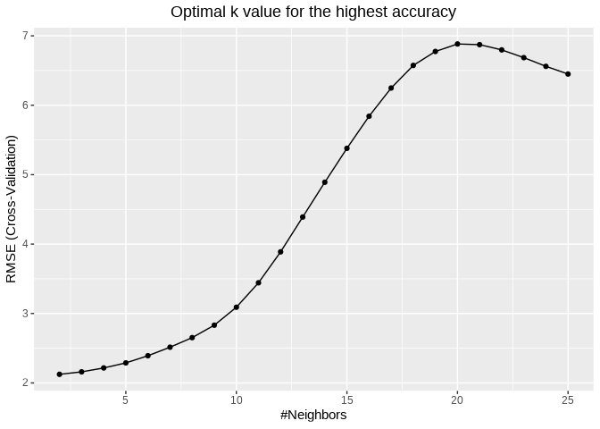

``` r
KNNvarImp = varImp(KNNRegressor)
plot(KNNvarImp, top = 5, main='Top 5 Variable predicting life expectancy (KNN)')
```

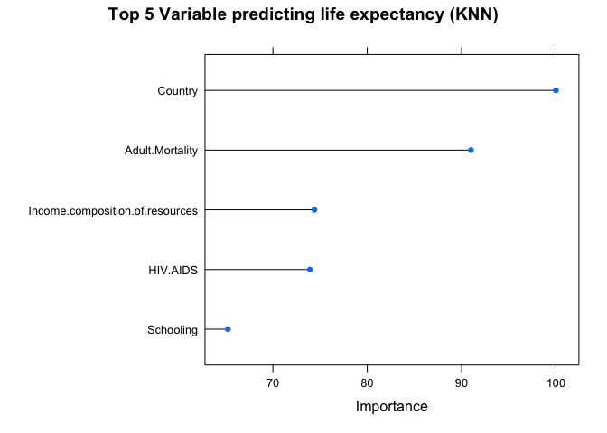
